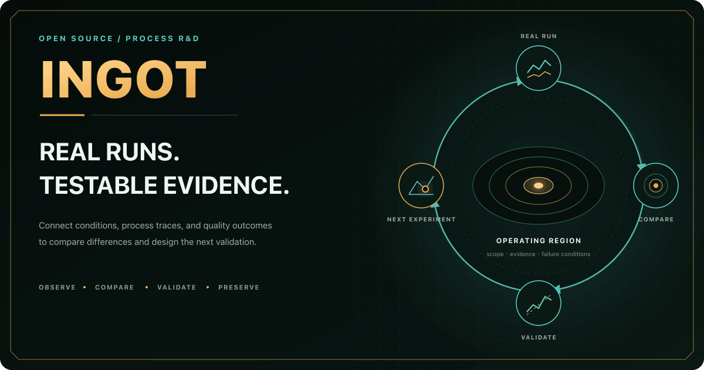
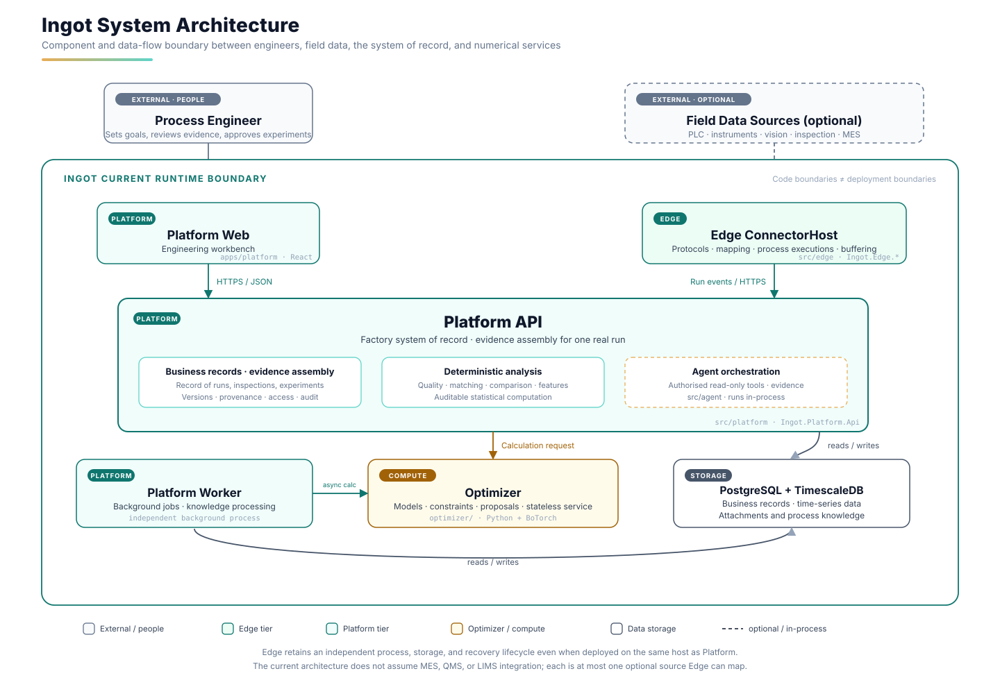

<a id="readme-top"></a>

<div align="center">
  <a href="https://ingotstack.com/en/">
    
  </a>

  <p><strong>Open-source Process Diagnosis &amp; Optimization</strong></p>
  <p>From run evidence to the next recipe.</p>

  [](https://github.com/liuweichaox/Ingot/actions/workflows/ci.yml)
  [](LICENSE)
  [](https://dotnet.microsoft.com/)
  [](https://react.dev/)
  [](https://www.postgresql.org/)
  [](https://www.python.org/)

  [Website](https://ingotstack.com/en/) · [Documentation](https://docs.ingotstack.com/en) · [Local demo](#local-demo) · [Report an issue](https://github.com/liuweichaox/Ingot/issues) · [Discuss](https://github.com/liuweichaox/Ingot/discussions)

  [简体中文](README.md) · English
</div>

<a href="https://ingotstack.com/en/">
  
</a>

<details>
  <summary>Table of contents</summary>

- [Project overview](#project-overview)
- [Capability scope](#capability-scope)
- [Local demo](#local-demo)
- [Domain workflow](#domain-workflow)
- [Current status](#current-status)
- [System boundaries](#system-boundaries)
- [Runtime architecture](#runtime-architecture)
- [Repository structure](#repository-structure)
- [Full deployment](#full-deployment)
- [Development verification](#development-verification)
- [Documentation](#documentation)
- [Roadmap](#roadmap)
- [Contributing](#contributing)
- [License](#license)

</details>

## Project overview

Ingot is an open-source process diagnosis and optimization system. The system links equipment records, production runs, process trajectories, inspection results, and R&D context into comparable, traceable run evidence.

For real recipe runs, Ingot provides three engineering capabilities:

- **Run reconstruction**: establish actual conditions, process changes, material, tooling, and quality outcomes;
- **Optimization observations**: automatically link actual recipes, process context, and quality outcomes while excluding untrustworthy runs;
- **Next recipe**: propose a candidate process setting with uncertainty inside objectives, safety boundaries, and observed coverage.

The fixed design objective is:

> **Turn every real recipe run into optimization evidence and continuously recommend the next recipe within safety boundaries and observed coverage.**

Ingot applies where recipe runs are expensive, samples are limited, and quality objectives and safety boundaries are explicit. The normal workflow is real recipe run → automatic optimization observation → next-recipe recommendation → engineer confirmation in the existing production flow → continued learning from the new run. Daily optimization does not require a separately created experiment and does not provide a separate controlled-validation workflow. Engineers define objectives and boundaries, review recommendations, and decide whether a recipe may enter production.

Methods are selected by question type, data coverage, and constraints. Available methods include traditional design of experiments (DOE), response surfaces, and constrained Bayesian optimization. Every recommendation retains its input data, applicability conditions, computational rationale, uncertainty, and review status.

## Capability scope

Ingot does not replace production-execution, real-time-control, quality-compliance, or laboratory-management systems. The current domain model covers the following engineering tasks:

| Typical task | System output |
|---|---|
| Nonconforming-run analysis | Eligible comparison runs, key differences, candidate causes, and evidence gaps |
| Daily recipe optimization | The next recipe based on real runs, with prediction intervals, risk, and evidence scope |
| New material, machine, or extrapolated setting | Collect additional real runs through existing production and compliance processes; Ingot only records and explains their evidence |

## Local demo

The synthetic demo uses a lens run that exceeds its surface-form error limit. The workflow covers opening the nonconforming run, reviewing its quality result, comparing it with a conforming run, inspecting candidate causes, and entering the recipe-optimization workspace.

The demo requires Node.js 22.22+ but no database, equipment, or Docker:

```bash
npm --prefix apps/platform ci
```

Run these commands in two terminals:

```bash
node scripts/platform-demo.mjs
```

```bash
npm --prefix apps/platform run demo
```

Open `http://127.0.0.1:3001` and sign in with `demo / demo`. All demo data are synthetic. The tour verifies the interface and workflow, not real process benefit.

## Domain workflow

```text
Process configuration → Field integration → Production runs → Quality management → Process diagnosis → Recipe optimization
           ↑                                                                                         ↓
           └──────── Validated specifications, operating regions, and knowledge return to production ────────┘
```

| Stage | Primary responsibility |
|---|---|
| Process configuration | Define variables, units, quality rules, and safety boundaries |
| Field integration | Map equipment points and business data to consistent process fields |
| Production runs | Record actual conditions, process trajectories, and production context |
| Quality management | Link inspection results and perform independent review |
| Process diagnosis | Compare run differences and form candidate causes, counterevidence, and evidence gaps |
| Recipe optimization | Learn from real recipe runs and recommend the next recipe within safety boundaries and observed coverage |

Trustworthy run facts are a prerequisite for analysis and recommendations. Data acquisition and optimization methods serve the same evidence chain.

## Current status

The main software workflow is implemented: the system can link real recipe runs to quality outcomes, decide whether they are usable for optimization, and generate an engineer-reviewed next-recipe recommendation that is never dispatched automatically.

The repository claims only implemented code, automated tests, and reproducible software behavior. It bundles no scenario-specific validation data or results. Deployers are responsible for evaluating applicability, safety, and realized benefit with their own data.

When data or methods fail admission, the system stops the recommendation, records the reason, and falls back to a response-surface or traditional experiment-design path.

See [Current status](docs/status.en.md) for capability and production boundaries.

## System boundaries

| Adjacent system or method | Relationship to Ingot | System boundary |
|---|---|---|
| MES, SCADA, historian | Receive run, equipment, and process facts | Does not replace execution, monitoring, or real-time control |
| LIMS, QMS, ELN | Link inspection results, review, and R&D context | Does not replace complete sample, compliance, or document management |
| Response surfaces, Bayesian optimization, DOE | Recommend the next recipe from real runs | Does not treat one algorithm as the answer to every process problem |
| AI agent | Query, organize, and explain authorized facts | Does not generate numeric settings directly, approve experiments, or control equipment |

## Runtime architecture



Platform API is the system of record for factory business records and evidence assembly. Optimizer is a stateless numerical service. Agent runs in the Platform API process and accesses structured facts only through authorized read-only analysis tools. Edge ConnectorHost has an independent identity, local store, and failure-recovery lifecycle. Code-project boundaries are not deployment boundaries; see [Production architecture](docs/production-architecture.en.md) for production topology and availability requirements.

## Repository structure

| Path | Responsibility |
|---|---|
| `src/edge` | Field protocols, acquisition lifecycle, semantic mapping, offline buffering, and replay |
| `src/platform` | Business API, systems of record, evidence assembly, authorization, and background work |
| `src/agent` | Model-assisted question parsing, read-only tool calls, and evidence explanation |
| `src/shared` | Domain models, cross-module contracts, and stable identifiers |
| `optimizer` | Experiment design, surrogate models, constraint evaluation, and sequential optimization service |
| `apps/platform` | React/Vite engineering workbench |
| `apps/website`, `apps/docs-site` | Public website and documentation site |
| `tests/Ingot.Core.Tests` | xUnit coverage for backend behavior, module boundaries, and protocols |
| `deploy`, `scripts`, `tools` | Deployment manifests, architecture gates, validation utilities, and benchmarks |

## Full deployment

The complete Compose stack requires Git, Docker Engine or Docker Desktop, and Docker Compose v2:

```bash
git clone https://github.com/liuweichaox/Ingot.git
cd Ingot
cp .env.example .env
docker compose -f docker-compose.app.yml up -d --build
```

Before startup, change the database passwords, Edge ingestion token, and administrator settings in `.env`. Open `http://localhost:3000` after startup. See [Getting started](docs/getting-started.en.md) for health checks, authentication, and troubleshooting; follow the [Recipe-optimization pilot guide](docs/pilot.en.md) for a real pilot; and read [Production architecture](docs/production-architecture.en.md) and [Deployment](docs/deployment.en.md) before production use.

## Development verification

Source development requires .NET SDK 10, Node.js 22.22+, and uv 0.12.5. Run the complete CI gate with:

```bash
./scripts/verify.sh
```

See [Contributing](CONTRIBUTING.en.md) for common commands and engineering contracts.

## Documentation

- [Documentation home](docs/index.en.md): choose a path by objective
- [Getting started](docs/getting-started.en.md): tour the demo or run the complete local stack
- [Current status](docs/status.en.md): implemented capabilities, validation evidence, and production boundaries
- [Recipe-optimization pilot guide](docs/pilot.en.md): move from real runs to the first next-recipe recommendation
- [System design](docs/design.en.md): stable business boundaries and component responsibilities
- [Analysis and optimization](docs/optimization.en.md): method selection, admission, and numerical strategy
- [Data integration](docs/data-connection.en.md): identity, mapping, and data quality
- [Scenario validation](docs/rollout.en.md): historical replay, shadow validation, and online validation
- [Roadmap](docs/project-plan.en.md): long-term direction and promotion gates

## Roadmap

The near-term objective is tighter admission of natural-run data, clearer recipe-recommendation explanations, and stronger deployment reliability. Model-independent agent protocols and a manufacturing-evidence specification come later. See the [Roadmap](docs/project-plan.en.md) for the detailed boundaries.

## Contributing

The project accepts contributions to equipment adapters, statistical methods, experiment design, optimization, tests, and documentation. Participation options include [opening an issue](https://github.com/liuweichaox/Ingot/issues), [joining a discussion](https://github.com/liuweichaox/Ingot/discussions), or following the [contributing guide](CONTRIBUTING.en.md) to submit a pull request. Review the [Code of Conduct](CODE_OF_CONDUCT.md) and [Security Policy](SECURITY.md) before submitting changes.

## License

Ingot is licensed under the [Apache License 2.0](LICENSE).
