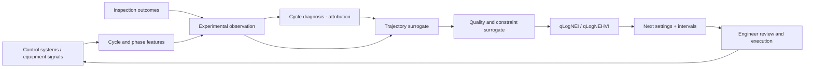

<div align="center">
  <a href="https://ingotstack.com/en/">
    
  </a>

  <p><strong>Open-source process diagnosis and optimization for expensive, small-data manufacturing experiments</strong></p>
  <p>Link real cycles, realized trajectories, and inspection outcomes into traceable evidence: explain this run, optimize the next.</p>

  [](https://github.com/liuweichaox/Ingot/actions/workflows/ci.yml)
  [](LICENSE)
  [](https://dotnet.microsoft.com/)
  [](https://www.python.org/)
  [](https://botorch.org/)

  [Website](https://ingotstack.com/en/) · [Documentation](https://docs.ingotstack.com/en) · [Quickstart](docs/getting-started.en.md) · [Issues](https://github.com/liuweichaox/Ingot/issues)

  [简体中文](README.md) · English
</div>

## About Ingot

Ingot is built around the two questions that matter after data collection:

> **Diagnose** — why did this run miss specification, and which variable or trajectory segment caused it?
>
> **Optimize** — when experiments are expensive, noisy, constrained, and scarce, what settings should the next run use to reach specification in as few experiments as possible?

Both questions read the same evidence: real cycles, actual recipes, versioned process features, and inspection outcomes. One explains a result that already happened; the other chooses an experiment that has not run yet.

The system is not bound to a specific process, equipment vendor, or controller model. Edge captures actual recipes and production trajectories. Platform turns runs and inspections into traceable experimental observations. Cycle diagnosis locates deviation sources and candidate variables. A Python service uses Gaussian processes and constrained Bayesian optimization to recommend the next settings. A new process changes the variables, outcomes, constraints, mappings, and domain features—not the closed-loop architecture.

## Why Ingot

- **Diagnosis and optimization in one loop** — the same evidence explains past deviations and drives the next experiment.
- **Small-data native** — calibrated GP uncertainty instead of data-hungry deep networks.
- **Trajectory aware** — model setpoint-to-trajectory and trajectory-to-quality separately; that two-stage structure is also what makes attribution possible down to a specific variable and trajectory segment.
- **Safety in the optimizer** — hard parameter bounds, outcome constraints, and minimum feasibility probabilities.
- **Human reviewed** — software proposes experiments with intervals; engineers approve execution.
- **Traceable** — observations retain cycle, inspection, feature, model, and content-hash provenance.

## Working closed loop

The product follows six business stages:

```text
define process → connect equipment → collect production data → close the data loop → diagnose → process optimization
```

The diagram below shows the data and model relationships inside that product loop:



Implemented today:

- MELSEC A1E, Modbus TCP, OPC UA, MQTT, and HTTP acquisition boundaries;
- offline buffering, idempotent shipping, cycle materialization, and versioned phase features;
- automatic joining of runs, actual recipes, trajectories, and inspections;
- cycle diagnosis, deviation attribution, R&D hypotheses, hypothesis-validation experiments, and process-window review;
- single/multi-objective optimization, weights, parameter constraints, and safety outcomes;
- qLogNEI/qLogNEHVI, batch suggestions, pending-point avoidance, and safe cold starts;
- idempotent recommendations and atomic experiment-result persistence;
- embedded Agent investigation, chat, and data tools in Platform, with numerical decisions kept in the separate Optimizer;
- bilingual website, documentation, and a React process-R&D workbench.

The project does not present unvalidated algorithm performance as a product result. Historical replay and prospective experiments must establish real impact.

## Architecture

| Component | Responsibility | Stack |
|---|---|---|
| Edge | Equipment connection, acquisition, offline buffer, forwarding | .NET 10, SQLite |
| Platform API | Modular monolith for industrial objects, experiments, cycles, inspections, evidence, Agent, and transactions | ASP.NET Core, PostgreSQL/TimescaleDB |
| Agent | Embedded investigation, chat, and data tools | .NET, deterministic/OpenAI providers |
| Optimizer | Stateless surrogate fitting and experiment recommendation | Python, PyTorch, GPyTorch, BoTorch |
| Platform Web | Standalone object, diagnosis, R&D, and execution workflow | React, Vite |
| Website / Docs | Open-source project and product documentation | Next.js |

The central platform is a modular monolith with Agent embedded in Platform API. Numerical optimization is a separate stateless service. Edge deploys as ConnectorHost, Platform deploys as Platform API, and Platform remains the only system of record. Website and Docs use a separate public-site topology.

## Quick start

### Prerequisites

- Docker and Docker Compose
- Git

### Run the complete stack

```bash
git clone https://github.com/liuweichaox/Ingot.git
cd Ingot
cp .env.example .env
docker compose -f docker-compose.app.yml up -d --build
```

Then open:

- R&D workbench: <http://localhost:3000>
- Platform health: <http://localhost:8000/health>
- Optimizer readiness: <http://localhost:8100/ready>

The field connector is opt-in. Read [Equipment and data wiring](docs/data-connection.en.md) before connecting real equipment or business systems.

### Local development

```bash
dotnet restore Ingot.sln
dotnet build Ingot.sln
dotnet test tests/Ingot.Core.Tests/Ingot.Core.Tests.csproj

npm --prefix apps/platform ci
npm --prefix apps/platform run dev

uv sync --project optimizer --extra service --group dev --locked
uv run --project optimizer --locked uvicorn service:app --app-dir optimizer --port 8110
```

Run the complete gate with `./scripts/verify.sh`.

## First real campaign

1. Define controls, objectives, units, ranges, weights, and safety outcomes.
2. Map each control to an actual source such as `recipe:holding-temperature`.
3. Use the same value for experiment `RunKey`, PLC cycle correlation, and inspection `OperationRunId`.
4. Run and inspect a verified safe baseline.
5. Add a hypothesis and start the R&D project.
6. Generate, review, and execute the next recommended experiment.
7. Repeat after each completed cycle and inspection until the stop rule is met.

Explicit mappings never silently fall back to planned values. Missing actual data excludes the run with a visible reason.

See [Quickstart](docs/getting-started.en.md) and [Real-world validation](docs/rollout.en.md).

## Repository layout

```text
src/edge/          field acquisition and reliable shipping
src/platform/      central API and business modules
src/agent/         AI investigation and explanation
src/shared/        domain models and contracts
optimizer/         GP and Bayesian optimization service
tests/             .NET core tests
apps/platform/     React process-R&D workbench
apps/website/      official website
apps/docs-site/    documentation site
docs/              bilingual project documentation
deploy/            deployment assets
scripts/           verification and operations
```

## Documentation

- [Start here](docs/index.en.md)
- [Install and run a first experiment](docs/getting-started.en.md)
- [Architecture](docs/design.en.md)
- [Optimizer design and limits](docs/optimization.en.md)
- [Equipment and data wiring](docs/data-connection.en.md)
- [Historical replay and online validation](docs/rollout.en.md)
- [Deployment and operations](docs/deployment.en.md)
- [FAQ](docs/faq.en.md)

## Roadmap

- [x] Assemble real cycles, recipes, features, and inspections into observations
- [x] Two-stage trajectory/quality GP with constrained qLogNEI/qLogNEHVI
- [x] Idempotent experiments, pending-point avoidance, and safe cold starts
- [ ] Publish run-by-run replay benchmarks on real manufacturing history
- [ ] Add calibrated domain priors and cross-product transfer
- [ ] Add online uncertainty calibration, drift detection, and automatic stopping
- [ ] Publish reusable scenario packages and anonymized sample data

Track proposals and known issues in [GitHub Issues](https://github.com/liuweichaox/Ingot/issues).

## Contributing

Contributions are welcome across device adapters, optimization methods, replay data, tests, documentation, and process-domain knowledge:

- [Contributing guide](CONTRIBUTING.en.md)
- [Code of Conduct](CODE_OF_CONDUCT.md)
- [Security policy](SECURITY.md)

## License

Ingot is available under the [MIT License](LICENSE).

## Acknowledgments

The optimization core builds on [PyTorch](https://pytorch.org/), [GPyTorch](https://gpytorch.ai/), and [BoTorch](https://botorch.org/). README organization is inspired by [Best-README-Template](https://github.com/othneildrew/Best-README-Template).
