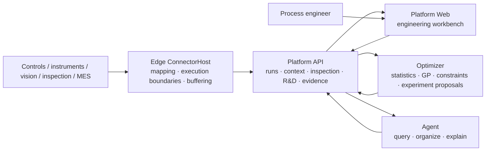

<div align="center">
  <a href="https://ingotstack.com/en/">
    
  </a>

  <p><strong>Open-source Process Diagnosis & Optimization</strong></p>
  <p>Help process engineers make decisions with real data.</p>

  [](https://github.com/liuweichaox/Ingot/actions/workflows/ci.yml)
  [](LICENSE)
  [](https://dotnet.microsoft.com/)
  [](https://www.python.org/)
  [](https://botorch.org/)

  [Website](https://ingotstack.com/en/) · [Documentation](https://docs.ingotstack.com/en) · [Quickstart](docs/getting-started.en.md) · [Report an issue](https://github.com/liuweichaox/Ingot/issues)

  [简体中文](README.md) · English
</div>

## Why Ingot exists

Ingot's core value remains stable:

> **Move process R&D from decisions without data support to decisions supported by real data, so computers can genuinely help process engineers choose what to do next using the most effective computational methods for the problem.**

Much process development still depends on personal memory, disconnected spreadsheets, and experiment sequences that cannot be reproduced. Even when equipment already produces data, production conditions, process curves, and quality outcomes often cannot be tied to the same real run, leaving computers unable to participate reliably in engineering decisions.

Ingot first establishes a trustworthy data loop, then helps engineers:

- identify the equipment, product, process specification, material, and tooling actually used for a run;
- connect actual settings, process trajectories, and inspection outcomes to that run;
- compare like-for-like runs and locate differences by variable, stage, or context;
- distinguish candidate causes, confounding factors, and insufficient evidence;
- turn engineering judgment into falsifiable, reviewable experiments;
- choose more valuable next experiments within safety boundaries;
- preserve validated conclusions, applicability, and failure conditions.

The computer organizes evidence, computes, and proposes. Process engineers frame the problem, review constraints, approve experiments, and make the final judgment.

## One complete loop

```text
Define process → Connect equipment → Collect production data → Close the data loop → Diagnose → Optimize
      ↑                                                                                       ↓
      └──────────── validated process specifications, operating regions, and knowledge return to production ───┘
```

| Stage | Question answered |
|---|---|
| Define the process | Which variables, units, objectives, and safety boundaries must the platform understand? |
| Connect equipment | How do raw registers, nodes, messages, and inspections map to stable business semantics? |
| Collect production data | What actually happened in this run? |
| Close the data loop | Are conditions, trajectories, and outcomes complete, traceable, and comparable? |
| Diagnose the process | Which differences deserve validation, and which remain confounded or unsupported? |
| Process R&D | Which next experiment is most valuable without crossing declared safety boundaries? |

Acquisition is not the destination, and an optimization algorithm is not the starting point. Trustworthy run facts are the common foundation for every analysis and recommendation.

## Select computation by the problem

Ingot does not force one “advanced algorithm” onto every question:

- data quality statistics measure coverage, missingness, and drift;
- robust statistics, matching, and stage analysis compare normal and abnormal runs;
- hierarchical summaries, variance components, or mixed-effects models assess equipment, material, and tooling context;
- controls, repetition, blocking, randomization, and interventions support causal decisions;
- Gaussian processes and constrained Bayesian optimization search expensive small-data parameter spaces;
- physical features or priors help when mechanisms are known and data are scarce;
- an LLM interprets questions, calls read-only tools, and explains evidence, but never generates numerical process settings directly.

See [Analysis and optimization](docs/optimization.en.md) for the detailed boundaries.

## Product components

- **Edge** connects control systems, instruments, gateways, and business sources, handling semantic mapping, execution-boundary detection, offline buffering, and replay.
- **Process Executions** organize continuous signals into traceable real runs and stage trajectories.
- **Manufacturing** records product, process specification, equipment, material, component, and tooling context.
- **Inspections** preserve quality objectives, safety outcomes, attachments, and human review.
- **Research** organizes problems, candidate causes, hypotheses, experiments, results, and operating regions.
- **Optimizer** performs reproducible numerical modeling, constraint checks, and sequential experiment recommendations.
- **Agent** helps engineers query, organize, and explain verified system facts.

These components share one evidence chain rather than creating conflicting parallel records.

## Current status and evidence boundary

The repository implements the main code path across acquisition, process executions, context, inspections, R&D experiments, diagnostic candidates, and numerical recommendations, with automated tests. Capability and product benefit remain different claims:

- **Implemented** means code, contracts, and tests exist.
- **Historical replay passed** means future data were hidden and results reproduce within a declared candidate set.
- **Shadow validation passed** means recommendations survived field-constraint review on new projects.
- **Online validation passed** is required before claiming fewer experiments or shorter development time on real work.

The project has completed internal end-to-end validation of import, run reconstruction, inspection linkage, and R&D observations using controlled, non-public production history. Formal leakage-free replay and prospective validation remain incomplete, so the project does not claim a measured reduction in experiments or development time. Real production data, project identities, process parameters, and derived results do not enter the public repository; public materials provide only protocols, schemas, synthetic examples, acceptance methods, and conclusion boundaries.

Historical replay, shadow validation, and controlled online validation are three independent scientific-validation work lines. Each preregisters its own data, baselines, measures, threshold version, acceptance, and falsification criteria and produces its own evidence artifact inside the controlled environment. Passing one does not pass the others, and the results are not compressed into a global API "maturity" field. Existing endpoints show that experimental infrastructure is implemented; engineering decisions must use the corresponding reviewed, hashed, and versioned report rather than infer validity from feature presence.

## Architecture



Platform is the factory system of record. Optimizer is a stateless numerical service. Agent can access structured facts only through authorized tools. Edge and Platform keep independent processes, storage, and recovery even when deployed on one physical host.

## Quickstart

Requirements: .NET SDK 10, Node.js 22.22+, uv 0.11.32, Docker, and Docker Compose.

```bash
git clone https://github.com/liuweichaox/Ingot.git
cd Ingot
cp .env.example .env
docker compose -f docker-compose.app.yml up -d --build
```

Then open:

```text
http://localhost:3000       Process R&D workbench
http://localhost:8000/health
http://localhost:8100/ready
```

Complete one real or representative data loop before diagnosis or optimization: define variables and outcomes → connect data → complete a run → link inspections → review data quality → compare runs → design a validation experiment.

See [Getting started](docs/getting-started.en.md).

## Development verification

```bash
dotnet restore Ingot.sln
dotnet build Ingot.sln
dotnet test tests/Ingot.Core.Tests/Ingot.Core.Tests.csproj
npm --prefix apps/platform ci
npm --prefix apps/platform test
uv sync --project optimizer --extra service --group dev --locked
```

Run the full CI gate with:

```bash
./scripts/verify.sh
```

## Repository layout

```text
src/edge/          field acquisition and reliable upload
src/platform/      central API and business modules
src/agent/         AI query and explanation capabilities
src/shared/        domain models and shared contracts
optimizer/         numerical analysis and Bayesian optimization service
tests/             .NET core tests
apps/platform/     React process R&D workbench
apps/website/      official website
apps/docs-site/    documentation site
docs/              Chinese and English project documentation
deploy/            deployment assets
scripts/           verification and operations scripts
```

## Documentation

- [Documentation home](docs/index.en.md)
- [Getting started](docs/getting-started.en.md)
- [System design](docs/design.en.md)
- [Analysis and optimization](docs/optimization.en.md)
- [Data integration](docs/data-connection.en.md)
- [Scenario validation](docs/rollout.en.md)
- [Roadmap](docs/project-plan.en.md)
- [Deployment](docs/deployment.en.md)
- [FAQ](docs/faq.en.md)
- [Brand guide](docs/brand.en.md)
- [Open-source dependencies](docs/open-source-dependencies.en.md)

## Roadmap

- [x] Real runs, actual conditions, process features, and inspections form traceable observations.
- [x] Candidate causes, hypotheses, experiments, and operating regions share one R&D record.
- [x] Constrained GP/BO recommendations, pending-point avoidance, and safe cold start.
- [ ] Publish leakage-free sequential replay on a real manufacturing history.
- [ ] Complete shadow recommendations and analyze engineer rejection reasons on a new project.
- [ ] Complete a controlled online experiment and publish preregistered results.
- [ ] Validate the core contracts on a second, materially different process.
- [ ] Expose read and propose capabilities through a model-independent agent protocol.
- [ ] Publish candidate schemas, validators, and reference implementations for the manufacturing evidence and experiment protocol.

The near term proves the historical evidence apparatus, the medium term opens agent protocols, and only the long term pursues an open specification. The roadmap follows real evidence and acceptance gates. See the [Roadmap](docs/project-plan.en.md) for sequencing.

## Contributing

Contributions are welcome across device adapters, statistics, experimental design, optimization algorithms, real replay, tests, documentation, and process knowledge. Start with the [Contributing guide](CONTRIBUTING.en.md), [Code of Conduct](CODE_OF_CONDUCT.md), and [Security policy](SECURITY.md).

Ingot is available under the [MIT License](LICENSE).
