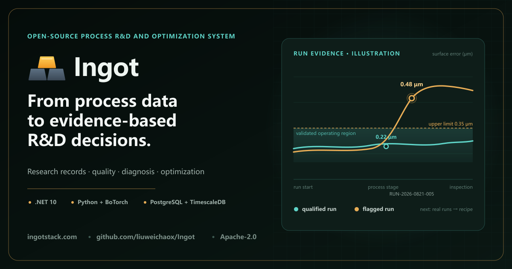
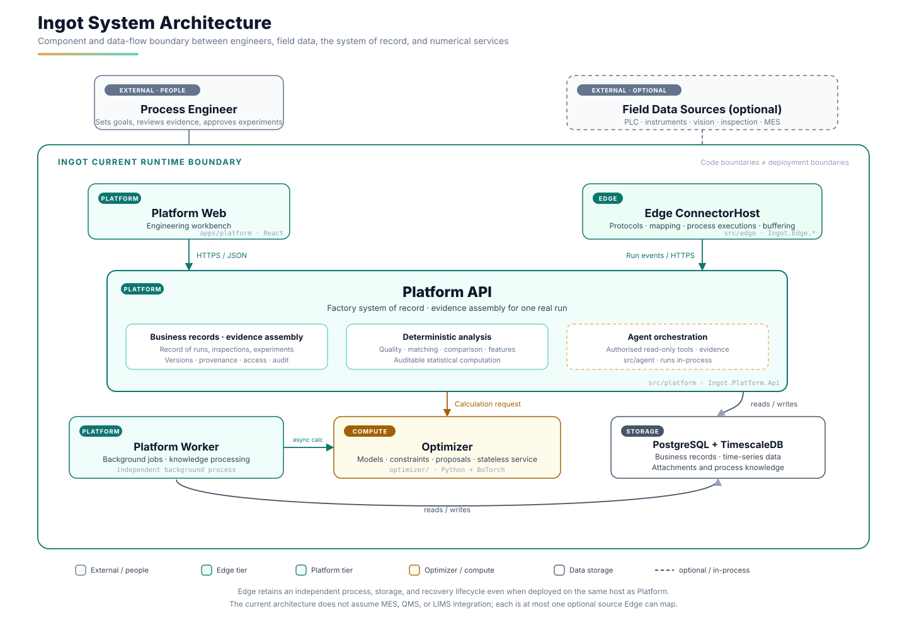

<a id="readme-top"></a>

<div align="center">
  <a href="https://ingotstack.com/en/">
    
  </a>

  <p><strong>Open-source Process R&amp;D and Optimization System</strong></p>
  <p>From process data to evidence-based R&amp;D decisions.</p>

  [](https://github.com/liuweichaox/Ingot/actions/workflows/ci.yml)
  [](LICENSE)
  [](https://dotnet.microsoft.com/)
  [](https://react.dev/)
  [](https://www.postgresql.org/)
  [](https://www.python.org/)

  [Website](https://ingotstack.com/en/) · [Documentation](https://docs.ingotstack.com/en) · [Report an issue](https://github.com/liuweichaox/Ingot/issues) · [Discuss](https://github.com/liuweichaox/Ingot/discussions)

  [简体中文](README.md) · English
</div>

<a href="https://ingotstack.com/en/">
  
</a>

<details>
  <summary>Table of contents</summary>

- [About the project](#about-the-project)
- [Getting started](#getting-started)
- [Usage](#usage)
- [Roadmap](#roadmap)
- [Contributing](#contributing)
- [License](#license)
- [Contact](#contact)
- [Acknowledgments](#acknowledgments)

</details>

## About the project

Ingot is an Open-source Process R&D and Optimization System. Organize recipe versions, experiment records, and run evidence to support quality analysis, process diagnosis, and recipe optimization.

It serves R&D work with costly recipes, limited samples, and explicit quality objectives and safety boundaries. Engineers review actual conditions, process change, and quality outcomes in one place, compare eligible runs, and decide the next recipe inside those constraints. Recommendations are never dispatched to equipment.

The repository claims only code, automated tests, and reproducible software behavior. Deployers evaluate applicability, safety, and realized benefit with their own data. See [Current status](docs/status.en.md) for what is implemented.

### Technology

| Part | Technology |
|---|---|
| Business services | .NET 10 |
| Engineering workbench | React 19, Vite |
| Data | PostgreSQL 17, TimescaleDB |
| Numerical optimization | Python 3.12 |
| Deployment | Docker Compose |

### Repository layout

| Path | Responsibility |
|---|---|
| `src/platform` | Business API, system of record, evidence assembly, and background work |
| `src/edge` | Field acquisition, semantic mapping, offline buffering, and replay |
| `src/agent` | Read-only analysis, knowledge retrieval, and evidence explanation |
| `src/shared` | Domain models and cross-module contracts |
| `optimizer` | Response surfaces, constraint checks, and sequential optimization |
| `apps/platform` | Engineering workbench |
| `apps/website`, `apps/docs-site` | Public website and documentation site |
| `tests`, `deploy`, `scripts` | Tests, deployment manifests, and architecture gates |

<p align="right"><a href="#readme-top">Back to top</a></p>

## Getting started

### Prerequisites

Trying the full stack requires Git, Docker Engine or Docker Desktop, and Docker Compose v2. That path does not require a local .NET, Node.js, or Python install.

Source development also requires .NET SDK 10, Node.js 22.22+, and uv 0.12.5. See [Contributing](CONTRIBUTING.en.md) for commands and engineering contracts.

### Installation

```bash
git clone https://github.com/liuweichaox/Ingot.git
cd Ingot
cp .env.example .env
```

Before startup, replace every `change-this-` placeholder in `.env`. Database passwords and the administrator password must be distinct random values.

```bash
docker compose -f docker-compose.app.yml up -d --build
```

Open `http://localhost:3000` after startup. Health checks, sign-in, and troubleshooting are in [Getting started](docs/getting-started.en.md).

<p align="right"><a href="#readme-top">Back to top</a></p>

## Usage

After sign-in, publish a recipe version from process configuration. Each run records actual settings, the process trajectory, and quality outcomes. Admitted runs become optimization observations. The system proposes the next recipe inside safety boundaries and observed coverage. The engineer adopts it as the next-run correction, or turns a significant change into a revision draft.

```text
Process configuration → Field integration → Production runs → Quality management → Process diagnosis → Recipe optimization
```

Field-equipment and enterprise-system connectors are optional. Recipe settings alone, without trustworthy run facts, do not produce a recommendation.

| Adjacent system | Boundary |
|---|---|
| MES, ERP, SCADA, historian | May supply run facts; does not replace execution, monitoring, or real-time control |
| LIMS, QMS, ELN | May supply inspection and R&D context; does not replace sample, compliance, or document management |
| Statistical and optimization methods | Selected by data conditions; no single algorithm is the answer to every problem |
| AI agent | Queries and explains authorized facts; does not generate numeric settings directly or control equipment |



Platform API is the system of record. Optimizer holds no business state. Agent reads facts only through authorized read-only tools. See [Production architecture](docs/production-architecture.en.md) for topology and the [Recipe-optimization pilot guide](docs/pilot.en.md) for the first recommendation.

<p align="right"><a href="#readme-top">Back to top</a></p>

## Roadmap

- [x] Record adoption, modification, rejection, and outcome freeze on the published recipe version
- [ ] Present run evidence completely: actual values, provenance, gaps, and quality review
- [ ] Explain recommendation admission and trace rejection reasons to run and quality records
- [ ] Constrain later recommendations with sourced, scoped, conflict-checked knowledge
- [ ] Make backup and restore, capacity, and alerting independently acceptable

Acceptance criteria are in the [Roadmap](docs/project-plan.en.md). Open work is tracked in [Issues](https://github.com/liuweichaox/Ingot/issues).

<p align="right"><a href="#readme-top">Back to top</a></p>

## Contributing

Contributions are welcome for equipment adapters, statistical methods, optimization, tests, and documentation.

1. Read [Contributing](CONTRIBUTING.en.md), the [Code of Conduct](CODE_OF_CONDUCT.md), and the [Security Policy](SECURITY.md).
2. Check [Issues](https://github.com/liuweichaox/Ingot/issues) or [Discussions](https://github.com/liuweichaox/Ingot/discussions) for duplicates. Describe the scenario and verification for a larger change first.
3. Open a pull request. Report vulnerabilities through [private reporting](https://github.com/liuweichaox/Ingot/security/advisories/new), not a public issue.

Run `./scripts/verify.sh` before submitting.

<p align="right"><a href="#readme-top">Back to top</a></p>

## License

Ingot is licensed under the [Apache License 2.0](LICENSE).

<p align="right"><a href="#readme-top">Back to top</a></p>

## Contact

- Website: <https://ingotstack.com/en/>
- Documentation: <https://docs.ingotstack.com/en>
- Issues: <https://github.com/liuweichaox/Ingot/issues>
- Discussions: <https://github.com/liuweichaox/Ingot/discussions>
- Security: <https://github.com/liuweichaox/Ingot/security/advisories/new>

<p align="right"><a href="#readme-top">Back to top</a></p>

## Acknowledgments

Runtime dependencies, licenses, and introduction rules are in [Open-source dependencies](docs/open-source-dependencies.en.md). Exact versions come from lockfiles and container manifests.

<p align="right"><a href="#readme-top">Back to top</a></p>
