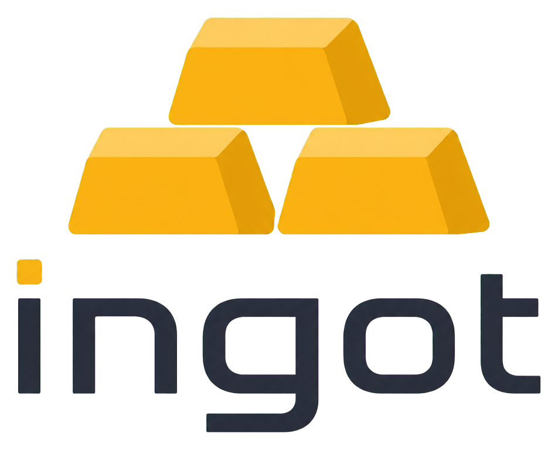

<a id="top"></a>

<div align="center">
  <picture>
    <source media="(prefers-color-scheme: dark)" srcset="./docs/assets/ingot-logo-dark.png">
    
  </picture>
  <p align="center">
    <strong>把生产数据炼成事实。</strong>
    <br />
    面向工业边缘的开源生产数据基础设施，从稳定采集起步，逐步将原始遥测标准化、事件化为可追溯的生产事实。
    <br />
    <a href="./docs/index.md"><strong>阅读项目文档 »</strong></a>
    <br />
    <br />
    <a href="https://github.com/liuweichaox/Ingot">项目主页</a>
    ·
    <a href="https://github.com/liuweichaox/Ingot/issues">反馈问题</a>
    ·
    <a href="https://github.com/liuweichaox/Ingot/pulls">参与贡献</a>
  </p>
</div>

<div align="center">

[![.NET][dotnet-shield]][dotnet-url]
[![Vue][vue-shield]][vue-url]
[![InfluxDB][influxdb-shield]][influxdb-url]
[![Stars][stars-shield]][stars-url]
[![Issues][issues-shield]][issues-url]
[![License][license-shield]][license-url]

</div>

中文 | [English](README.en.md)

## 目录

- [关于项目](#关于项目)
- [技术栈](#技术栈)
- [快速开始](#快速开始)
- [运行与验证](#运行与验证)
- [架构概览](#架构概览)
- [仓库结构](#仓库结构)
- [文档导航](#文档导航)
- [路线图](#路线图)
- [贡献](#贡献)
- [许可证](#许可证)
- [致谢](#致谢)

## 关于项目

**Ingot** 是一个面向工业边缘的开源生产事件基础设施。它在靠近设备侧的位置读取原始信号，将高频数据作为遥测写入 TSDB，同时把周期、参数下发和诊断等高价值变化铸造成不可变、可查询、可追溯的生产事实。

项目主产品是 `Edge Agent`。PLC 是当前首个源适配器；v2 配置、生产事件、上下文和查询 API 使用源中立的 `SourceCode` 与资产模型。`Central API / Central Web` 提供可选控制面，但不是边缘采集与事件产生的前置依赖。

架构方向和阶段边界见 [生产事件 RFC](docs/rfc-production-events.md)。当前已经落地统一事件信封、SQLite 事件日志、边沿事件规则、上下文状态、本地查询/SSE、InfluxDB 事件投影、Profile 校验，以及 Edge 到 Central 的批量上行、PostgreSQL 幂等事件库、中心查询/SSE 和事件流页面。

### 为什么叫 Ingot

**Ingot** 意为“锭”。原始遥测数据像矿砂——量大、分散、单位价值低；Ingot 将它熔炼为标准化、事件化的生产事实。

- **标准化**：锭由统一模具铸成，对应统一的生产事件模型
- **不可变**：锭一旦铸成便具有确定形态，对应不可变生产事件的设计方向
- **可堆叠**：事件可以持续积累、存储和汇聚，形成完整的生产记录
- **制造业语境**：锭是铸造、冶金和钢铁生产中的原生词汇，与工业现场天然相连

### 核心能力

- 从 PLC 稳定读取数据并生成统一的采集消息
- 通过 v1/v2 JSON 配置管理数据源、资产、遥测通道和事件规则
- 支持 `Always` 与 `Conditional` 两类采集模式
- 遥测按批次直接写入 `TSDB`
- 生产事件先写入 SQLite 不可变日志，再执行可重建的 TSDB 投影
- 支持 `cycle.started/completed`、诊断事件和 `parameter.applied`
- 提供上下文状态、事件查询、周期查询与 SSE 订阅
- 使用 `core` / `optical` Profile 校验对象类型、事件类型和必需上下文
- 提供配置校验、热更新与运行诊断能力
- 将待上行事件按序批量发送到 Central，失败指数退避，取得确认后才推进本地 outbox
- 使用 PostgreSQL 分区表、JSONB/GIN 和双幂等键汇聚多个 Edge 的生产事件
- 提供中心事件查询、SSE、周期聚合，以及节点、指标、日志和事件流界面
- 提供 PostgreSQL 持久化 Webhook 订阅，以 CloudEvents 1.0 structured JSON 投递并支持 HMAC 签名

### 系统边界

- `Edge Agent` 是核心运行组件，采集链路优先
- `Central API / Central Web` 是可选控制面，不是采集前提
- 遥测平面保持 at-most-once：TSDB 写入失败时记录错误并丢弃当前批次
- 事件平面采用 at-least-once 基础：事件先写入 `events.db`，落盘即视为事实成立
- 中心不可达时事件保留在本地 outbox；恢复后按 `Seq` 续传，中心按 `EventId` 和 `(EdgeId, Seq)` 去重
- Central 事件库依赖 PostgreSQL；这不会改变 Edge 本地事件成立与采集继续运行的语义
- 驱动通过稳定的 `Driver` 名称选择，并保留不同 PLC 协议的真实差异

### 控制面预览

| Edges | Metrics | Logs |
| --- | --- | --- |
|  |  |  |

### 主要使用场景

- 车间或产线侧 PLC 实时数据采集
- 多 PLC 的配置化接入与统一运维
- 直接写入 TSDB 的现场遥测链路
- 需要 Prometheus 指标、日志和中心化状态查看的边缘系统
- 需要在靠近设备侧部署轻量采集运行时的工业场景

<p align="right">(<a href="#top">回到顶部</a>)</p>

## 技术栈

- `.NET 10` / `ASP.NET Core`：Edge Agent 与 Central API 宿主
- `Vue 3` + `Vue Router` + `Element Plus`：Central Web
- `InfluxDB 2.x`：默认时序存储实现
- `SQLite`：生产事件日志、业务上下文、条件采集状态与运行日志
- `PostgreSQL 18`：中心生产事件库
- `HslCommunication`：默认 PLC 驱动实现基础
- `prometheus-net`：运行指标暴露
- `Serilog`：日志记录

<p align="right">(<a href="#top">回到顶部</a>)</p>

## 快速开始

### 前置要求

- `.NET 10 SDK`
- `InfluxDB 2.x`
- `Docker`，如果你想直接使用仓库中的 compose 文件启动 InfluxDB
- `Node.js 20` 与 `npm`，如果你要运行中心侧 Web

### 本地启动

1. 克隆仓库

```bash
git clone https://github.com/liuweichaox/Ingot.git
cd Ingot
```

2. 构建解决方案

```bash
dotnet build Ingot.sln
```

3. 启动 InfluxDB

```bash
docker compose -f docker-compose.tsdb.yml up -d
```

说明：

- Edge Agent 默认连接配置位于 [src/Ingot.Edge.Agent/appsettings.json](src/Ingot.Edge.Agent/appsettings.json)
- 如果你使用自己的 InfluxDB，请确保 `InfluxDB:Url`、`Token`、`Bucket`、`Org` 与实际实例一致

4. 检查设备配置

- 示例配置：[src/Ingot.Edge.Agent/Configs/TEST_PLC.json](src/Ingot.Edge.Agent/Configs/TEST_PLC.json)
- 更多样例：[examples/device-configs](examples/device-configs)
- 配置 Schema：[schemas/device-config.schema.json](schemas/device-config.schema.json)
- v2 源配置 Schema：[schemas/device-config.v2.schema.json](schemas/device-config.v2.schema.json)
- 行业 Profile：[profiles](profiles)

5. 离线校验配置

```bash
dotnet run --project src/Ingot.Edge.Agent -- --validate-configs
```

如果你要校验其他目录：

```bash
dotnet run --project src/Ingot.Edge.Agent -- --validate-configs --config-dir ./examples/device-configs
```

6. 启动 Edge Agent

```bash
dotnet run --project src/Ingot.Edge.Agent
```

7. 可选：启动本地 PLC 模拟器

```bash
dotnet run --project src/Ingot.Simulator
```

运行 RFC 光学闭环剧本：

```bash
dotnet run --project src/Ingot.Simulator -- Mode=Scenario
```

8. 可选：启动 PostgreSQL、中心 API 与 Web

```bash
docker compose -f docker-compose.events.yml up -d --build
```

前端本地开发时，在中心 API 已运行的前提下执行 `cd src/Ingot.Central.Web && npm install && npm run dev`。

默认访问地址：

- Edge Agent: `http://localhost:8001`
- Central API: `http://localhost:8000`
- Central Web: `http://localhost:3000`

<p align="right">(<a href="#top">回到顶部</a>)</p>

## 运行与验证

### 典型联调流程

如果你只是想在本地确认整条链路能跑通，推荐按这个顺序：

1. 启动 `InfluxDB`
2. 启动 `Ingot.Simulator`
3. 校验 [TEST_PLC.json](src/Ingot.Edge.Agent/Configs/TEST_PLC.json)
4. 启动 `Ingot.Edge.Agent`
5. 可选启动 `Ingot.Central.Api` 和 `Ingot.Central.Web`
6. 通过健康检查、指标接口、日志和 UI 确认系统状态

仓库级质量门可以一次执行：

```bash
./scripts/verify.sh
```

它会构建和测试 .NET 项目、校验 v1/v2 示例配置、构建并审计 Central Web、检查 Compose 配置和 Git 补丁格式。

Phase 2 光学闭环可通过真实模拟器和本地 API 单独验收：

```bash
./scripts/verify-optical-trace.sh
```

脚本验证“换批次→换工装→3 个周期→报警并恢复”的完整事实链、三个周期关联 ID、起止快照、周期事件自动携带的批次和工装上下文，以及带上下文过滤的 Edge SSE 断线续读。

Phase 1 的进程崩溃恢复也可重复执行：

```bash
./scripts/verify-edge-restart-recovery.sh
```

它会在周期进行中对 Edge 执行真实 `kill -9`，随后复用原 `events.db` 和状态库重启，验证崩溃前事实原样保留、`diagnostic.cycle_recovered` 出现，并由同一个 CorrelationId 完成周期。

旧版配置兼容性也有独立验收：

```bash
./scripts/verify-v1-compatibility.sh
```

该脚本只使用 SchemaVersion 1 的 `PlcCode`、`Register` 和 `ConditionalAcquisition` 字段，验证无需添加 v2 字段即可产生配对生产事件，并保留旧通道的 Metrics 起始快照。

RFC 性能门可以分别执行：

```bash
./scripts/benchmark-edge-event-log.sh
./scripts/benchmark-central-ingest.sh
```

边缘基准会在 100 万行 SQLite 事件日志上验证事件平面托管/工作集内存增长（平台支持时同时检查私有内存）、事件 append P99 与带动态上下文过滤的查询 P95；中心基准会启动 PostgreSQL 和 Central API，摄入 1 万条事件，并检查吞吐、序号连续性和幂等完整性。两个脚本在不满足 RFC 阈值时都会返回非零退出码。

Phase 3 的断网恢复验收可以自动执行。默认按 RFC 断开中心 2 小时；本地冒烟时可缩短：

```bash
./scripts/verify-disconnect-recovery.sh
INGOT_DISCONNECT_SECONDS=15 ./scripts/verify-disconnect-recovery.sh
```

脚本运行真实模拟器、Edge、Central API 和 PostgreSQL，在中心离线期间持续产生事实，恢复后验证本地 outbox 清空、中心行数一致、`EventId`/`Seq` 唯一、序号无缺口且无孤立预留。

2026-07-17 的默认 7200 秒验收已通过：离线期间本地由 23 条增长到 13,121 条，形成 13,098 条积压；恢复后 Central 达到 13,121 条、pending 归零，序号 1–13,121 连续，0 重复、0 缺口、0 孤立预留。

外部订阅出口也有独立的真实 HTTP 验收：

```bash
./scripts/verify-webhook-delivery.sh
```

它会启动一个仓库自带的最小接收器，创建持久化订阅，摄入隔离的验收事件，并验证 CloudEvents 1.0 structured 内容、事件 ID 请求头、HMAC-SHA256 签名、无重复投递和订阅游标成功推进。

### 常用端点

| 组件 | 地址 | 用途 |
| --- | --- | --- |
| Edge Agent | `http://localhost:8001/health` | 存活与健康检查 |
| Edge Agent | `http://localhost:8001/metrics` | Prometheus 指标 |
| Edge Agent | `http://localhost:8001/api/logs` | 本地日志查询 |
| Edge Agent | `http://localhost:8001/api/acquisition/plc-connections` | PLC 连接状态 |
| Edge Agent | `http://localhost:8001/api/v1/events` | 本地生产事件查询 |
| Edge Agent | `http://localhost:8001/api/v1/events/stream` | 生产事件 SSE |
| Edge Agent | `http://localhost:8001/api/v1/cycles/{correlationId}` | 周期事实链 |
| Edge Agent | `http://localhost:8001/api/v1/context/{type}/{id}` | 资产上下文 |
| Central API | `http://localhost:8000/api/v1/events` | 跨 Edge 生产事件查询 |
| Central API | `http://localhost:8000/api/v1/events/stream` | 中心生产事件 SSE |
| Central API | `http://localhost:8000/api/v1/cycles/{correlationId}` | 中心周期事实链 |
| Central API | `http://localhost:8000/api/v1/subscriptions` | CloudEvents Webhook 订阅 |
| Central API | `http://localhost:8000/metrics` | 中心指标 |
| Central Web | `http://localhost:3000/events` | 节点、指标、日志与事件流界面 |

### 本地数据目录

运行后优先关注这些目录和文件：

- `Data/logs.db`
- `Data/acquisition-state.db`
- `Data/events.db`

观察重点：

- `logs.db` 保存本地日志，适合排查 PLC 连接、配置加载和 TSDB 写入错误
- 默认自动保留 30 天日志，可通过 `Logging:RetentionDays` 调整；设置为 `<= 0` 时关闭清理
- `acquisition-state.db` 保存条件采集的 active cycle 状态，用于进程重启后的上下文恢复
- `events.db` 保存不可变生产事件及其待上行状态；事件不依赖 TSDB 成功才成立
- 如果 TSDB 没有收到遥测，应优先查看 Edge Agent 日志和 `/metrics`；遥测批次不会进入事件日志

<p align="right">(<a href="#top">回到顶部</a>)</p>

## 架构概览

### 主链路

```text
PLC / Source
      |
      v
 Edge Agent
   |-- telemetry --> memory queue --> TSDB
   |
   `-- event rules --> context snapshot --> events.db
                                           |-- query / SSE
                                           |-- optional TSDB projection
                                           `-- EventShipper --> Central API
                                                                |
                                                                `--> PostgreSQL

Edge Agent
  |--> SQLite: acquisition-state.db + context_state
  |--> SQLite: logs.db
  `--> /health + /metrics
```

### 部署关系

```text
Browser
   |
   v
Central Web
   |
   v
Central API
   |-- PostgreSQL event hub
   `-- registration / diagnostics
              ^
              |  (optional for edge operation)
Edge Agent ---+----> PLC / Device
     |
     +------------> TSDB
```

### 怎么理解这张图

- `Edge Agent` 是系统核心，真正负责采集、批量写入和本地诊断
- v1/v2 JSON 配置决定数据源、资产、遥测通道、事件规则与 Profile
- 遥测队列是内存批处理，不是本地持久化缓冲
- `events.db` 是生产事实的本地日志，事件在任何投影之前先落盘
- `acquisition-state.db` 保存 active cycle 与资产上下文，支持重启恢复
- `logs.db`、健康检查与指标用于暴露故障和积压
- `EventShipper` 只发送已经落盘的事件，只有中心确认后才更新本地 shipped 状态
- `Central API` 以 PostgreSQL 为事件事实库并提供跨 Edge 查询、SSE 与周期视图；周期视图会把 started/completed 之间同 Edge、同主体的其他事实一并还原
- `Central API / Central Web` 仍是 Edge 可选控制面，不是采集和本地事件产生的前提

### 失败语义

- TSDB 写入成功：当前批次完成
- 遥测 TSDB 写入失败：记录日志和指标，然后丢弃当前遥测批次
- 事件日志写入成功：生产事实成立；后续投影失败不撤销事实
- 事件日志写入失败：健康检查失败并记录持久化故障指标
- 事件积压触及硬上限：删除最旧待传事实，写入 `diagnostic.backlog_dropped` 并增加显式丢弃指标

### 设计重点

- `Edge First`
  Edge Agent 是采集主链路，不把中心侧当成前置依赖
- `Real-Time First`
  高频遥测直接写 TSDB；低频高价值事件使用本地持久化保障
- `Facts Before Projections`
  事件先成为不可变事实，再分发到 TSDB、SSE 或中心端
- `Configuration Before Runtime`
  设备配置先校验，再运行
- `Explicit Driver Contracts`
  通过稳定的 `Driver` 名称选择协议实现，并保留清晰扩展点
- `Observability First`
  用日志、指标和中心视图暴露运行状态，而不是隐藏失败
- `UTC`
  统一使用 UTC 时间语义，避免跨节点采集与展示歧义

如果你想继续看设计细节，建议直接阅读 [docs/design.md](docs/design.md) 和 [docs/modules.md](docs/modules.md)。

<p align="right">(<a href="#top">回到顶部</a>)</p>

## 仓库结构

- [src/Ingot.Edge.Agent](src/Ingot.Edge.Agent)
  边缘运行时宿主，负责启动采集主链路和本地诊断接口
- [src/Ingot.Infrastructure](src/Ingot.Infrastructure)
  PLC 驱动、采集编排、队列、InfluxDB、SQLite、日志和指标实现
- [src/Ingot.Application](src/Ingot.Application)
  抽象接口、应用服务与运行时契约
- [src/Ingot.Domain](src/Ingot.Domain)
  领域模型、配置模型和消息模型
- [src/Ingot.Central.Api](src/Ingot.Central.Api)
  中心侧注册、心跳、诊断代理，以及 PostgreSQL 事件摄入、查询、SSE 和周期 API
- [src/Ingot.Central.Web](src/Ingot.Central.Web)
  中心侧 Vue/Vite 控制面，包含节点、指标、日志和事件流
- [src/Ingot.Simulator](src/Ingot.Simulator)
  本地 PLC 联调模拟器
- [tests/Ingot.Core.Tests](tests/Ingot.Core.Tests)
  核心测试项目

<p align="right">(<a href="#top">回到顶部</a>)</p>

## 文档导航

推荐阅读顺序：

1. [快速开始](docs/tutorial-getting-started.md)
2. [配置说明](docs/tutorial-configuration.md)
3. [驱动目录](docs/hsl-drivers.md)
4. [部署说明](docs/tutorial-deployment.md)

按主题继续深入：

- [设计说明](docs/design.md)
- [模块说明](docs/modules.md)
- [生产事件 RFC](docs/rfc-production-events.md)
- [品牌与标识](docs/brand.md)
- [开发扩展](docs/tutorial-development.md)
- [常见问题](docs/faq.md)
- [贡献指南](CONTRIBUTING.md)

<p align="right">(<a href="#top">回到顶部</a>)</p>

## 路线图

基于当前文档和实现，后续更值得持续投入的方向包括：

- [x] 确立 Ingot 产品名并将解决方案更名为 `Ingot.sln`
- [x] 全仓迁移为 `Ingot.*` 项目、程序集和命名空间
- [x] 实现生产事件信封、SQLite 事件日志、本地查询与 SSE
- [x] 实现边沿周期规则、上下文状态、Profile 与 v2 配置
- [x] 实现中心事件汇聚、幂等摄入、断点续传和事件流页面
- [x] 增加 CloudEvents 1.0 Webhook 订阅、过滤、游标与 HMAC 投递
- [ ] 增加更多真实 PLC 的示例配置
- [ ] 补充更多端到端测试
- [ ] 继续完善主流驱动的 `ProtocolOptions`
- [ ] 强化故障排查与运维文档
- [ ] 完善中心侧观测与诊断体验

已知问题和功能讨论可在 [Issues](https://github.com/liuweichaox/Ingot/issues) 中跟进。

<p align="right">(<a href="#top">回到顶部</a>)</p>

## 贡献

欢迎贡献驱动增强、采集链路可靠性修复、TSDB 写入改进、文档改进、示例配置和自动化测试。

提交前建议至少确认：

- 代码可以构建
- 相关测试通过
- README / 教程 / 示例配置已同步更新

详细约定见 [CONTRIBUTING.md](CONTRIBUTING.md)。

<p align="right">(<a href="#top">回到顶部</a>)</p>

## 许可证

本项目使用 [MIT License](LICENSE)。

<p align="right">(<a href="#top">回到顶部</a>)</p>

## 致谢

- [Best-README-Template](https://github.com/othneildrew/Best-README-Template)
- [HslCommunication](https://github.com/dathlin/HslCommunication)
- [InfluxDB](https://www.influxdata.com/)

<p align="right">(<a href="#top">回到顶部</a>)</p>

[dotnet-shield]: https://img.shields.io/badge/.NET-10-512BD4?style=for-the-badge&logo=dotnet&logoColor=white
[dotnet-url]: https://dotnet.microsoft.com/
[vue-shield]: https://img.shields.io/badge/Vue-3-42B883?style=for-the-badge&logo=vuedotjs&logoColor=white
[vue-url]: https://vuejs.org/
[influxdb-shield]: https://img.shields.io/badge/InfluxDB-2.x-22ADF6?style=for-the-badge&logo=influxdb&logoColor=white
[influxdb-url]: https://www.influxdata.com/
[stars-shield]: https://img.shields.io/github/stars/liuweichaox/Ingot.svg?style=for-the-badge
[stars-url]: https://github.com/liuweichaox/Ingot/stargazers
[issues-shield]: https://img.shields.io/github/issues/liuweichaox/Ingot.svg?style=for-the-badge
[issues-url]: https://github.com/liuweichaox/Ingot/issues
[license-shield]: https://img.shields.io/github/license/liuweichaox/Ingot.svg?style=for-the-badge
[license-url]: https://github.com/liuweichaox/Ingot/blob/main/LICENSE
