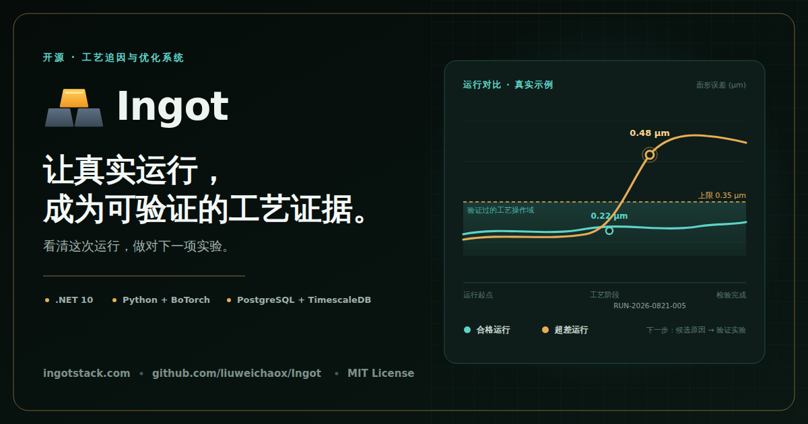
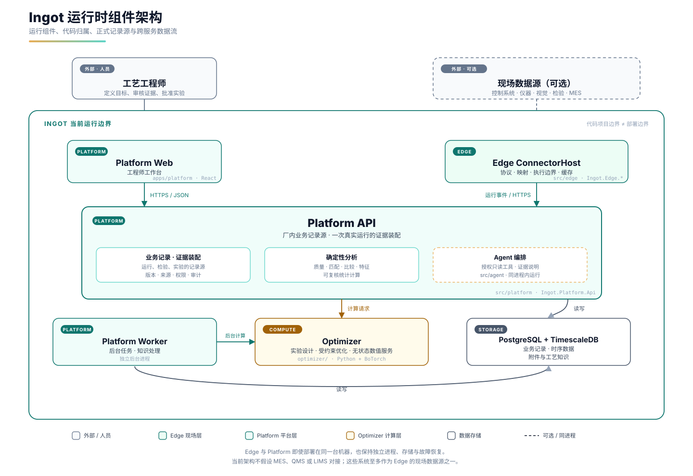

<a id="readme-top"></a>

<div align="center">
  <a href="https://ingotstack.com">
    
  </a>

  <p><strong>开源工艺追因与优化系统</strong></p>
  <p>从运行证据，到下一份配方。</p>

  [](https://github.com/liuweichaox/Ingot/actions/workflows/ci.yml)
  [](LICENSE)
  [](https://dotnet.microsoft.com/)
  [](https://react.dev/)
  [](https://www.postgresql.org/)
  [](https://www.python.org/)

  [官网](https://ingotstack.com) · [在线文档](https://docs.ingotstack.com/zh) · [本地演示](#本地演示) · [报告问题](https://github.com/liuweichaox/Ingot/issues) · [参与讨论](https://github.com/liuweichaox/Ingot/discussions)

  简体中文 · [English](README.en.md)
</div>

<a href="https://ingotstack.com">
  
</a>

<details>
  <summary>目录</summary>

- [项目概览](#项目概览)
- [能力范围](#能力范围)
- [本地演示](#本地演示)
- [领域流程](#领域流程)
- [当前状态](#当前状态)
- [系统边界](#系统边界)
- [运行时架构](#运行时架构)
- [仓库结构](#仓库结构)
- [完整部署](#完整部署)
- [开发验证](#开发验证)
- [文档](#文档)
- [路线图](#路线图)
- [参与贡献](#参与贡献)
- [许可证](#许可证)

</details>

## 项目概览

Ingot 是开源工艺追因与优化系统。系统统一关联设备记录、生产运行、过程轨迹、检验结果和研发上下文，形成可比较、可追溯的运行证据。

围绕真实配方运行，Ingot 提供三类工程能力：

- **运行还原**：确认实际条件、过程变化、材料、工装和质量结果；
- **优化观察**：自动关联实际配方、过程上下文和质量结果，排除不可信运行；
- **下一份配方**：在目标、安全边界和历史覆盖范围内提出候选工艺设置及不确定性。

项目的固定设计目标是：

> **把每次真实配方运行变成优化证据，在安全边界和历史覆盖范围内持续推荐下一份配方。**

Ingot 适用于配方成本较高、样本有限、质量目标和安全边界明确的工艺优化。标准工作流程是“真实配方运行 → 自动形成优化观察 → 推荐下一份配方 → 工程师在正常生产流程中确认 → 新运行继续回流”。日常优化不要求先建立实验。工程师负责确定目标和边界、审核建议，并判断配方能否用于生产；只有需要因果确认、越出历史覆盖或验证连续工艺操作域时，才另行设计受控验证。

分析方法根据问题类型、数据覆盖和约束条件选择，可采用传统实验设计（DOE）、响应面或受约束贝叶斯优化。每项建议均保留输入数据、适用条件、计算理由、不确定性和审核状态。

## 能力范围

Ingot 不替换现有生产执行、实时控制、质量合规或实验室管理系统。当前领域模型覆盖以下工程任务：

| 典型任务 | 系统输出 |
|---|---|
| 超差运行分析 | 满足可比条件的运行、关键差异、候选原因和证据缺口 |
| 日常配方优化 | 基于真实运行的下一份配方、预测区间、风险和证据范围 |
| 新材料、新设备或越界验证 | 具有对照、边界和审核记录的可选受控验证 |

## 本地演示

合成演示使用一条面形误差超限的镜片运行记录。演示流程包括“打开超差运行 → 核对质量结果 → 与合格运行比较 → 查看候选原因 → 进入配方优化工作区”。

运行环境要求 Node.js 22.22+；无需数据库、设备或 Docker：

```bash
npm --prefix apps/platform ci
```

在两个终端分别运行：

```bash
node scripts/platform-demo.mjs
```

```bash
npm --prefix apps/platform run demo
```

打开 `http://127.0.0.1:3001`，使用 `demo / demo` 登录。演示数据全部为合成数据，只验证界面和业务流程，不证明真实工艺收益。

## 领域流程

```text
工艺配置 → 现场接入 → 生产运行 → 质量管理 → 工艺追因 → 配方优化
    ↑                                                      ↓
    └────────── 已验证工艺规范、工艺操作域与知识返回生产 ──────────┘
```

| 阶段 | 主要职责 |
|---|---|
| 工艺配置 | 定义变量、单位、质量规则和安全边界 |
| 现场接入 | 将设备点位和业务数据映射为统一工艺字段 |
| 生产运行 | 记录实际条件、过程轨迹和生产上下文 |
| 质量管理 | 关联检验结果并执行独立复核 |
| 工艺追因 | 比较运行差异，形成候选原因、反证和证据缺口 |
| 配方优化 | 吸收真实配方运行并在安全边界与历史覆盖内推荐下一份配方；必要时发起受控验证 |

可信运行事实是分析和建议的前置条件；数据采集与优化算法均服务于同一条证据链。

## 当前状态

主要软件流程已经实现：系统可以把真实配方运行和质量结果关联起来，检查数据能否用于优化，并生成需要工程师确认、不会自动下发的下一配方建议；可选受控验证及其审核记录继续保留。

仓库只声明代码、自动化测试和可复现的软件行为，不内置任何特定场景的验证数据或结果。部署者负责使用自己的数据评估适用性、安全性和实际收益。

数据或方法未通过准入时，系统停止相应建议、记录原因，并降级至响应面或传统实验设计。

完整的能力和生产边界见[当前状态](docs/status.md)。

## 系统边界

| 相邻系统或方法 | 与 Ingot 的关系 | 系统边界 |
|---|---|---|
| MES、SCADA、Historian | 接收运行、设备和过程事实 | 不替代生产执行、监控或实时控制 |
| LIMS、QMS、ELN | 关联检验结果、审核和研发上下文 | 不替代完整样品、合规或文档管理 |
| 响应面、贝叶斯优化、DOE | 基于真实运行推荐下一份配方；必要时设计受控验证 | 不固定一种算法作为所有问题的答案 |
| AI Agent | 查询、组织和解释已授权事实 | 不直接生成数值设定、批准实验或控制设备 |

## 运行时架构



Platform API 是工厂业务记录和证据装配的正式记录源；Optimizer 是无业务状态的数值服务；Agent 与 Platform API 同进程运行，只能通过授权的只读分析工具访问结构化事实；Edge ConnectorHost 具有独立身份、本地存储和故障恢复生命周期。代码项目边界不等于部署边界，生产拓扑及高可用要求见[生产架构](docs/production-architecture.md)。

## 仓库结构

| 路径 | 职责 |
|---|---|
| `src/edge` | 现场协议、采集生命周期、语义映射、离线缓冲与重放 |
| `src/platform` | 业务 API、正式记录、证据装配、权限与后台任务 |
| `src/agent` | 模型辅助的问题解析、只读工具调用与证据说明 |
| `src/shared` | 领域模型、跨模块契约和稳定标识 |
| `optimizer` | 实验设计、代理模型、约束判断与序贯优化数值服务 |
| `apps/platform` | React/Vite 工程工作台 |
| `apps/website`、`apps/docs-site` | 公开官网与文档站 |
| `tests/Ingot.Core.Tests` | 后端行为、模块边界和协议的 xUnit 测试 |
| `deploy`、`scripts`、`tools` | 部署清单、架构门禁、验证工具与基准程序 |

## 完整部署

完整 Compose 栈需要 Git、Docker Engine 或 Docker Desktop，以及 Docker Compose v2：

```bash
git clone https://github.com/liuweichaox/Ingot.git
cd Ingot
cp .env.example .env
docker compose -f docker-compose.app.yml up -d --build
```

启动前必须修改 `.env` 中的数据库密码、Edge 上送令牌和管理员配置。启动后访问 `http://localhost:3000`。详细状态检查、认证和排障见[快速开始](docs/getting-started.md)；真实试点按[配方优化试点指南](docs/pilot.md)执行；生产环境先阅读[生产架构](docs/production-architecture.md)和[部署运维](docs/deployment.md)。

## 开发验证

源码开发需要 .NET SDK 10、Node.js 22.22+ 和 uv 0.12.5。完整 CI 门禁：

```bash
./scripts/verify.sh
```

常用命令和工程约束见[贡献指南](CONTRIBUTING.md)。

## 文档

- [文档首页](docs/index.md)：按目标选择阅读路径
- [快速开始](docs/getting-started.md)：体验演示或启动本地完整栈
- [当前状态](docs/status.md)：已实现能力、验证证据和生产边界
- [配方优化试点指南](docs/pilot.md)：从真实运行到第一份下一配方建议
- [系统设计](docs/design.md)：稳定业务边界和组件职责
- [分析与优化](docs/optimization.md)：方法选择、准入和数值策略
- [数据接入](docs/data-connection.md)：身份、映射和数据质量
- [场景验证](docs/rollout.md)：历史回放、影子和在线验证
- [发展规划](docs/project-plan.md)：长期方向和晋级闸门

## 路线图

近期目标是继续收紧自然运行数据准入、配方推荐解释和部署可靠性；中长期开放模型无关的 Agent 协议和制造智能证据规范。详细边界见[发展规划](docs/project-plan.md)。

## 参与贡献

项目接受设备适配、统计方法、实验设计、优化算法、测试和文档贡献。参与方式包括[提交问题](https://github.com/liuweichaox/Ingot/issues)、[参与讨论](https://github.com/liuweichaox/Ingot/discussions)，或按[贡献指南](CONTRIBUTING.md)发起 Pull Request。提交前应同时阅读[行为准则](CODE_OF_CONDUCT.md)和[安全策略](SECURITY.md)。

## 许可证

Ingot 使用 [Apache License 2.0](LICENSE)。
