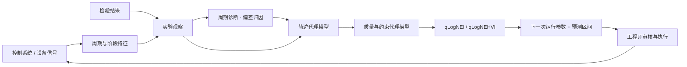

<div align="center">
  <a href="https://ingotstack.com">
    
  </a>

  <p><strong>面向高成本、小样本制造实验的开源工艺追因与优化系统</strong></p>
  <p>把真实周期、过程轨迹和检验结果连成可追溯证据：看清这次运行，优化下一次运行。</p>

  [](https://github.com/liuweichaox/Ingot/actions/workflows/ci.yml)
  [](LICENSE)
  [](https://dotnet.microsoft.com/)
  [](https://www.python.org/)
  [](https://botorch.org/)

  [官网](https://ingotstack.com) · [文档](https://docs.ingotstack.com/zh) · [快速开始](docs/getting-started.md) · [报告问题](https://github.com/liuweichaox/Ingot/issues)

  简体中文 · [English](README.en.md)
</div>

## 关于 Ingot

Ingot 解决的不是“怎样多采一些数据”，而是采集之后的两个关键问题：

> **工艺追因**：这次运行为什么没达到规格，偏差来自哪个变量、哪段轨迹？
>
> **工艺优化**：在实验昂贵、噪声存在、样本很少且有安全边界的情况下，下一次运行应该怎样设置，才能用尽可能少的试验达到规格？

两个问题共用同一套证据：真实周期、实际配方、版本化过程特征和检验结果。区别只在于一个解释已发生的结果，一个决定还没做的实验。

系统不绑定特定工艺、设备厂商或控制器型号。Edge 采集实际配方与生产轨迹，Platform 将运行周期和检验结果组成可追溯实验样本，周期诊断定位偏差来源与候选变量，Python 优化服务使用高斯过程和受约束贝叶斯优化推荐下一次运行参数。换工艺时，核心闭环不变，只替换变量、结果、安全约束、数据映射和领域特征。

## 为什么是 Ingot

- **工艺追因与优化一体**：同一套证据既解释已发生的偏差，也推荐下一次实验；采集、特征、检验和实验管理都服务于这条闭环。
- **适合小样本**：使用校准不确定性的高斯过程，而不是依赖大量数据的深度网络。
- **使用真实轨迹**：先学习设定参数如何形成过程轨迹，再学习轨迹如何影响质量；这个两阶段结构同时是追因的依据——偏差可以落到具体变量和具体轨迹段。
- **把安全写进优化器**：参数硬约束、质量结果约束和最低可行概率共同限制候选点。
- **人在闭环内**：程序提出带预测区间的实验，工程师批准后执行。
- **可追溯**：每条观察绑定周期、检验记录、特征版本、模型版本和内容哈希。

## 已实现的闭环

产品按六个业务阶段推进：

```text
工艺定义 → 设备接入 → 生产采集 → 数据闭环 → 工艺追因 → 工艺优化
```

下面是这条业务路径在系统内部的数据与模型关系：


```mermaid
flowchart LR
    A["控制系统 / 设备信号"] --> B["周期与阶段特征"]
    C["检验结果"] --> D["实验观察"]
    B --> D
    D --> J["周期诊断 · 偏差归因"]
    J --> E["轨迹代理模型"]
    D --> E
    E --> F["质量与约束代理模型"]
    F --> G["qLogNEI / qLogNEHVI"]
    G --> H["下一次运行参数 + 预测区间"]
    H --> I["工程师审核与执行"]
    I --> A
```

当前可用能力：

- MELSEC A1E、Modbus TCP、OPC UA、MQTT 和 HTTP 采集边界；
- 断网缓存、幂等上送、周期物化和版本化阶段特征；
- 实验运行、实际配方、过程轨迹和检验结果自动关联；
- 周期诊断、偏差归因、研发假设、假设验证实验和工艺窗口复核；
- 单目标与多目标优化、目标权重、参数约束、结果安全约束；
- qLogNEI / qLogNEHVI、批量建议、待执行点避让和安全冷启动；
- 相同数据快照幂等推荐，实验结果原子持久化；
- Platform 内嵌 Agent 调查、聊天和数据工具，数值决策仍由独立 Optimizer 负责；
- 中英文官网、文档站和 React 工艺研发工作台。

项目不会把尚未验证的算法效果写成产品结论。真实价值需要使用历史项目回放和新项目在线实验分别验证。

## 系统架构

| 组件 | 职责 | 技术 |
|---|---|---|
| Edge | PLC/设备连接、采样、断网缓存与补传 | .NET 10、SQLite |
| Platform API | 模块化单体；工业对象、实验、周期、检验、证据、Agent 和业务事务 | ASP.NET Core、PostgreSQL/TimescaleDB |
| Agent | Platform 内嵌的调查、聊天和数据工具 | .NET、Deterministic/OpenAI Provider |
| Optimizer | 无状态代理模型训练与下一实验推荐 | Python、PyTorch、GPyTorch、BoTorch |
| Platform Web | 独立前端；对象、诊断、研发和执行工作流 | React、Vite |
| Website / Docs | 开源项目介绍和产品文档 | Next.js |

中心平台保持模块化单体，Agent 作为平台内嵌能力运行；数值优化作为独立无状态计算服务。现场部署单元是 Edge ConnectorHost，平台部署单元是 Platform API，平台是唯一业务记录源，优化器不私存实验状态。Website 和 Docs 使用独立公开站点拓扑。

## 快速开始

### 前置条件

- Docker 与 Docker Compose
- Git

### 启动完整环境

```bash
git clone https://github.com/liuweichaox/Ingot.git
cd Ingot
cp .env.example .env
docker compose -f docker-compose.app.yml up -d --build
```

启动后：

- 工艺研发界面：<http://localhost:3000>
- Platform API 健康检查：<http://localhost:8000/health>
- 优化器就绪检查：<http://localhost:8100/ready>

默认 Compose 不启动现场连接器。连接真实设备或业务系统前，请先阅读[设备与数据接线](docs/data-connection.md)。

### 本地开发

```bash
dotnet restore Ingot.sln
dotnet build Ingot.sln
dotnet test tests/Ingot.Core.Tests/Ingot.Core.Tests.csproj

npm --prefix apps/platform ci
npm --prefix apps/platform run dev

uv sync --project optimizer --extra service --group dev --locked
uv run --project optimizer --locked uvicorn service:app --app-dir optimizer --port 8110
```

完整验证：

```bash
./scripts/verify.sh
```

## 第一个真实项目

1. 定义可控参数、目标、单位、范围、权重和安全结果约束。
2. 为变量声明实际来源，例如 `recipe:holding-temperature`。
3. 让实验 `RunKey` 与 PLC 周期相关标识、检验 `OperationRunId` 使用同一个值。
4. 执行安全基线实验并完成检验。
5. 在研发项目中提出假设并开始研发；
6. 生成下一次运行方案，审核后执行；
7. 新周期和检验完成后再次优化，直到达到停止规则。

不要用计划值冒充实际值。显式配置的数据源缺失时，该运行会被排除并显示原因。

完整过程见[快速开始](docs/getting-started.md)和[真实场景验证](docs/rollout.md)。

## 仓库结构

```text
src/edge/          现场采集与可靠上送
src/platform/      中心 API 与业务模块
src/agent/         AI 调查与解释能力
src/shared/        领域模型与公共契约
optimizer/         GP / 贝叶斯优化服务
tests/             .NET 核心测试
apps/platform/     React 工艺研发工作台
apps/website/      官方网站
apps/docs-site/    文档站
docs/              中英文项目文档
deploy/            部署资产
scripts/           验证与运维脚本
```

## 文档

- [从这里开始](docs/index.md)
- [安装与第一个实验](docs/getting-started.md)
- [系统架构](docs/design.md)
- [优化器原理与边界](docs/optimization.md)
- [设备与数据接线](docs/data-connection.md)
- [真实场景回放与在线验证](docs/rollout.md)
- [部署与运行](docs/deployment.md)
- [常见问题](docs/faq.md)

## 路线图

- [x] 真实周期、配方、过程特征与检验结果自动组成优化观察
- [x] 两阶段轨迹/质量 GP 与受约束 qLogNEI/qLogNEHVI
- [x] 实验幂等、待执行点避让和安全冷启动
- [ ] 使用真实制造历史项目公布逐次运行回放基准
- [ ] 加入经过标定的领域机理先验和跨产品迁移
- [ ] 在线校准不确定性、漂移检测和自动停止规则
- [ ] 发布可复用的场景配置包与匿名示例数据

路线图以可复现实验为准；功能建议和已知问题在 [Issues](https://github.com/liuweichaox/Ingot/issues) 中跟踪。

## 参与贡献

欢迎贡献设备适配、优化算法、回放数据、测试、文档和工艺领域知识。开始前请阅读：

- [贡献指南](CONTRIBUTING.md)
- [行为准则](CODE_OF_CONDUCT.md)
- [安全策略](SECURITY.md)

## 许可证

Ingot 使用 [MIT License](LICENSE)。

## 致谢

项目的优化内核建立在 [PyTorch](https://pytorch.org/)、[GPyTorch](https://gpytorch.ai/) 和 [BoTorch](https://botorch.org/) 之上；README 信息结构参考 [Best-README-Template](https://github.com/othneildrew/Best-README-Template)。
