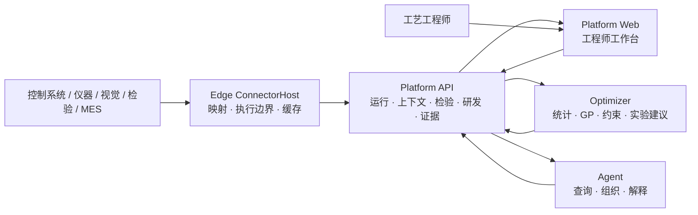

<div align="center">
  <a href="https://ingotstack.com">
    
  </a>

  <p><strong>开源工艺追因与优化系统</strong></p>
  <p>让真实数据帮助工艺工程师抉择。</p>

  [](https://github.com/liuweichaox/Ingot/actions/workflows/ci.yml)
  [](LICENSE)
  [](https://dotnet.microsoft.com/)
  [](https://www.python.org/)
  [](https://botorch.org/)

  [官网](https://ingotstack.com) · [文档](https://docs.ingotstack.com/zh) · [快速开始](docs/getting-started.md) · [报告问题](https://github.com/liuweichaox/Ingot/issues)

  简体中文 · [English](README.en.md)
</div>

## 为什么做 Ingot

Ingot 的核心价值保持不变：

> **让工艺研发从没有数据支撑走向有数据支撑，让计算机基于真实数据帮助工艺工程师抉择，并采用适合问题的有效计算方法分析数据。**

传统工艺研发中，大量判断依赖个人记忆、零散表格和不可复现的试验顺序。即使设备已经产生数据，生产条件、过程曲线和质量结果也常常无法对应到同一次真实运行，计算机因此无法可靠地参与工程判断。

Ingot 先建立可信的数据闭环，再帮助工程师：

- 找到一次运行实际用了什么设备、产品、工艺规范、材料和工装；
- 把实际设定、过程轨迹和检验结果关联到同一次运行；
- 比较可比运行，发现差异发生在哪个变量、阶段或上下文；
- 区分候选原因、混杂因素和证据不足；
- 把工程判断转成可证伪、可审核的实验；
- 在安全边界内选择更有价值的下一步实验；
- 保存经过验证的结论、适用范围和失效条件。

计算机负责整理证据、计算和提出建议；工艺工程师负责定义问题、审核约束、批准实验并作出最终判断。

## 一条完整闭环

```text
工艺定义 → 设备接入 → 生产采集 → 数据闭环 → 工艺追因 → 工艺优化
    ↑                                                        ↓
    └──────────── 已验证工艺规范、工艺操作域与知识返回生产 ────────────┘
```

| 阶段 | 解决的问题 |
|---|---|
| 工艺定义 | 平台应理解哪些变量、单位、目标和安全边界？ |
| 设备接入 | 原始寄存器、节点、报文和检验如何映射成稳定业务语义？ |
| 生产采集 | 这次真实运行发生了什么？ |
| 数据闭环 | 生产条件、过程轨迹和质量结果是否完整、可追溯、可比较？ |
| 工艺追因 | 哪些差异值得工程师验证，哪些结论仍受混杂或数据不足限制？ |
| 工艺优化 | 下一步做什么实验最有价值，并且没有越过已声明的安全边界？ |

采集不是终点，优化算法也不是起点。可信运行事实是所有分析和建议的共同地基。

## 按问题选择计算方法

Ingot 不把某一种“先进算法”固定成所有问题的答案：

- 数据覆盖、缺失和漂移使用数据质量统计；
- 正常/异常差异使用稳健统计、匹配比较和阶段分析；
- 设备、材料、工装等上下文使用分层统计、方差分量或混合效应模型；
- 原因判断使用对照、重复、区组、随机化和干预实验；
- 昂贵的小样本参数搜索使用高斯过程和受约束贝叶斯优化；
- 机理明确而数据较少时融合物理特征或先验；
- LLM 用于理解问题、调用只读工具和解释证据，不直接生成数值工艺设定。

详细方法边界见[分析与优化方法](docs/optimization.md)。

## 产品组成

- **Edge**：连接控制系统、仪器、网关和业务数据源，完成语义映射、执行边界识别、断网缓存与补传。
- **Process Executions**：把连续信号组织成可追溯的真实运行和阶段轨迹。
- **Manufacturing**：记录产品、工艺规范、设备、材料、组件和工装等运行上下文。
- **Inspections**：保存质量目标、安全结果、附件和人工复核。
- **Research**：组织问题、候选原因、假设、实验、结果和工艺操作域。
- **Optimizer**：执行可重复的数值建模、约束判断和序贯实验建议。
- **Agent**：帮助工程师查询、组织和解释经过验证的系统事实。

这些模块围绕同一条证据链工作，不建立互相冲突的平行业务记录。

## 当前状态与证据边界

仓库已经实现采集、过程执行、上下文、检验、研发实验、诊断候选和数值建议的主要代码路径，并有自动化测试。当前事实与产品收益必须分开：

- **已实现**表示代码、契约和测试存在；
- **历史回放通过**表示没有未来数据泄漏，并在已知候选中得到可复现结果；
- **影子验证通过**表示建议能够在新项目中接受现场约束检验；
- **在线验证通过**才表示系统在真实项目中帮助工程师减少实验或时间。

真实光学模压历史回放和前瞻项目的公开结果尚未完成。因此本项目不声称已经减少某个比例的实验或研发周期。

历史回放、影子验证和受控在线验证是三条独立的科学验证工作线。每条工作线分别预注册数据、基线、指标、阈值版本、验收与否证条件，并发布自己的证据工件；某一条通过不代表其他工作线通过，也不会被压缩成 API 中的全局“成熟度”字段。现有端点表示实验基础设施已实现，工程判断应读取对应报告及其审核、哈希和版本，而不是从功能是否存在推断有效性。

## 系统架构


```mermaid
flowchart LR
    Sources["控制系统 / 仪器 / 视觉 / 检验 / MES"] --> Edge["Edge ConnectorHost\n映射 · 执行边界 · 缓存"]
    Edge --> Platform["Platform API\n运行 · 上下文 · 检验 · 研发 · 证据"]
    Platform --> Web["Platform Web\n工程师工作台"]
    Platform --> Optimizer["Optimizer\n统计 · GP · 约束 · 实验建议"]
    Platform --> Agent["Agent\n查询 · 组织 · 解释"]
    Engineer["工艺工程师"] --> Web
    Web --> Platform
    Optimizer --> Platform
    Agent --> Platform
```

Platform 是厂内业务记录源；Optimizer 是无状态数值服务；Agent 只能使用授权工具访问结构化事实。Edge 与 Platform 即使部署在同一台机器，也保持独立进程、存储和故障恢复。

## 快速开始

要求：.NET SDK 10、Node.js 22.13+、uv 0.11.32、Docker 和 Docker Compose。

首次启动前请修改 `.env` 中的数据库密码、Edge 令牌和管理员配置。默认认证模式为 `Local`；
生产环境不要使用 `Disabled`，除非这是明确隔离的演示部署并同时设置了
`INGOT_ALLOW_INSECURE_DEMO=true`。

```bash
git clone https://github.com/liuweichaox/Ingot.git
cd Ingot
cp .env.example .env
docker compose -f docker-compose.app.yml up -d --build
```

启动后访问：

```text
http://localhost:3000       工艺研发界面
http://localhost:8000/health
http://localhost:8100/ready
```

首次使用应先完成一条真实或代表性的数据闭环，再进入诊断和优化：定义变量与结果 → 接入数据 → 完成一次运行 → 关联检验 → 检查数据质量 → 比较运行 → 设计验证实验。

完整步骤见[安装与第一个数据闭环](docs/getting-started.md)。

## 开发验证

```bash
dotnet restore Ingot.sln
dotnet build Ingot.sln
dotnet test tests/Ingot.Core.Tests/Ingot.Core.Tests.csproj
npm --prefix apps/platform ci
npm --prefix apps/platform test
uv sync --project optimizer --extra service --group dev --locked
```

完整 CI 门禁：

```bash
./scripts/verify.sh
```

## 仓库结构

```text
src/edge/          现场采集与可靠上送
src/platform/      中心 API 与业务模块
src/agent/         AI 查询与解释能力
src/shared/        领域模型与公共契约
optimizer/         数值分析与贝叶斯优化服务
tests/             .NET 核心测试
apps/platform/     React 工艺研发工作台
apps/website/      官方网站
apps/docs-site/    文档站
docs/              中英文项目文档
deploy/            部署资产
scripts/           验证与运维脚本
```

## 文档

- [文档首页](docs/index.md)
- [安装与第一个数据闭环](docs/getting-started.md)
- [系统设计](docs/design.md)
- [分析与优化方法](docs/optimization.md)
- [设备与数据接线](docs/data-connection.md)
- [真实场景验证](docs/rollout.md)
- [项目规划](docs/project-plan.md)
- [部署与运行](docs/deployment.md)
- [常见问题](docs/faq.md)
- [品牌与产品表述](docs/brand.md)
- [开源依赖](docs/open-source-dependencies.md)

## 路线图

- [x] 真实运行、实际条件、过程特征与检验结果形成可追溯观察
- [x] 候选原因、假设、实验和工艺操作域使用同一研发记录主线
- [x] 受约束 GP/BO 建议、待执行点避让和安全冷启动
- [ ] 公布真实制造历史项目的无泄漏逐次回放
- [ ] 完成新项目影子建议和工程师拒绝原因分析
- [ ] 完成受控在线实验并公布预注册结果
- [ ] 用第二个明显不同的工艺验证核心契约的通用性

路线图以真实证据和验收闸门为准，详细顺序见[项目规划](docs/project-plan.md)。

## 参与贡献

欢迎贡献设备适配、统计方法、实验设计、优化算法、真实回放、测试、文档和工艺知识。开始前请阅读[贡献指南](CONTRIBUTING.md)、[行为准则](CODE_OF_CONDUCT.md)和[安全策略](SECURITY.md)。

Ingot 使用 [MIT License](LICENSE)。
