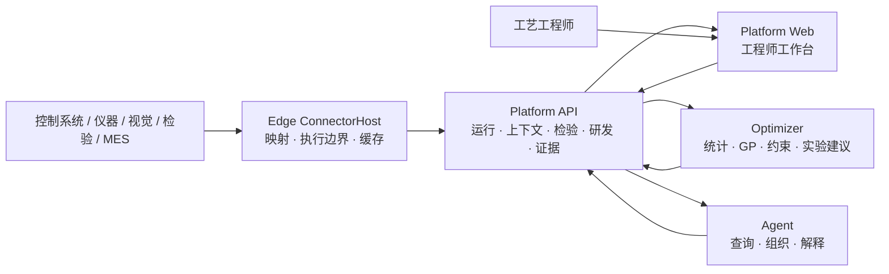

<div align="center">
  <a href="https://ingotstack.com">
    
  </a>

  <p><strong>开源工艺追因与优化系统</strong></p>
  <p>少做无效实验，更快找到达标工艺。</p>

  [](https://github.com/liuweichaox/Ingot/actions/workflows/ci.yml)
  [](LICENSE)
  [](https://dotnet.microsoft.com/)
  [](https://www.python.org/)
  [](https://botorch.org/)

  [官网](https://ingotstack.com) · [文档](https://docs.ingotstack.com/zh) · [快速开始](docs/getting-started.md) · [报告问题](https://github.com/liuweichaox/Ingot/issues)

  简体中文 · [English](README.en.md)
</div>

## 三分钟看懂 Ingot

模拟数据讲的是一个具体问题：`RUN-2026-0821-005` 的镜片面形误差达到 **0.48 μm**，超过 **0.35 μm** 上限；相邻合格运行是 **0.22 μm**。不需要数据库或 Docker，在两个终端运行：

```bash
node scripts/platform-demo.mjs
```

```bash
npm --prefix apps/platform ci
npm --prefix apps/platform run demo
```

打开 `http://127.0.0.1:3001`，使用 `demo / demo` 登录。工作台会给出四步入口：打开超差运行 → 核对已复核质量结果 → 与合格运行比较 → 查看候选原因、混杂因素和下一项验证实验。用户可以在三分钟内走完“看清这次运行——找到关键差异——决定下一步”的主线。

## 为什么做 Ingot

Ingot 只围绕一个结果建设：

> **把每次真实运行变成可比较、可验证的工程证据，帮助工艺工程师减少无效实验，更快找到达到目标的工艺条件。**

传统工艺研发中，大量判断依赖个人记忆、零散表格和不可复现的试验顺序。即使设备已经产生数据，生产条件、过程曲线和质量结果也常常无法对应到同一次真实运行，计算机因此无法可靠地参与工程判断。

Ingot 先建立可信的数据闭环，再帮助工程师：

- 找到一次运行实际用了什么设备、产品、工艺规范、材料和工装；
- 把实际设定、过程轨迹和检验结果关联到同一次运行；
- 比较可比运行，发现差异发生在哪个变量、阶段或上下文；
- 区分候选原因、混杂因素和证据不足；
- 把工程判断转成可证伪、可审核的实验；
- 在安全边界内选择更有价值的下一步实验；
- 保存经过验证的结论、适用范围和失效条件。

计算机负责整理证据、计算和提出建议；工艺工程师负责定义问题、审核约束、批准实验并作出最终判断。

## 一条完整闭环

```text
工艺配置 → 现场接入 → 生产运行 → 质量管理 → 工艺追因 → 工艺研发
    ↑                                                      ↓
    └────────── 已验证工艺规范、工艺操作域与知识返回生产 ──────────┘
```

| 阶段 | 解决的问题 |
|---|---|
| 工艺配置 | 平台应记录哪些变量、单位、目标、质量规则和安全边界？ |
| 现场接入 | 控制系统、仪器、视觉、检验和业务数据如何映射成稳定业务语义？ |
| 生产运行 | 这次真实运行用了什么条件，过程实际发生了什么？ |
| 质量管理 | 检验结果能否准确关联到同一次运行并完成独立复核？ |
| 工艺追因 | 数据是否可信，哪些差异值得验证，哪些仍受混杂或证据不足限制？ |
| 工艺研发 | 下一步做什么实验最有价值，并且没有越过已声明的安全边界？ |

采集不是终点，优化算法也不是起点。可信运行事实是所有分析和建议的共同地基。

## 按问题选择计算方法

Ingot 不把某一种“先进算法”固定成所有问题的答案：

- 数据覆盖、缺失和漂移使用数据质量统计；
- 正常/异常差异使用稳健统计、匹配比较和阶段分析；
- 设备、材料、工装等上下文使用分层统计、方差分量或混合效应模型；
- 原因判断使用对照、重复、区组、随机化和干预实验；
- 昂贵的小样本参数搜索使用高斯过程和受约束贝叶斯优化；
- 机理明确而数据较少时融合物理特征或先验；
- LLM 用于解析工程问题、调用只读工具和组织证据说明，不直接生成数值工艺设定。

详细方法边界见[分析与优化](docs/optimization.md)。

## 产品组成

- **Edge**：连接控制系统、仪器、网关和业务数据源，完成语义映射、执行边界识别、断网缓存与补传。
- **Process Executions**：把连续信号组织成可追溯的真实运行和阶段轨迹。
- **Manufacturing**：记录产品、工艺规范、设备、材料、组件和工装等运行上下文。
- **Inspections**：保存质量目标、安全结果、附件和人工复核。
- **Research**：组织问题、候选原因、假设、实验、结果和工艺操作域。
- **Optimizer**：执行可重复的数值建模、约束判断和序贯实验建议。
- **Agent**：帮助工程师查询、组织和解释经过验证的系统事实。

这些模块围绕同一条证据链工作，不建立互相冲突的平行业务记录。

## 现在能做什么

仓库已实现从现场数据到下一项实验建议的主要路径：

- 按真实运行关联设备、产品、工艺规范、材料、工装、过程轨迹和检验结果；
- 在一屏内比较超差与合格运行，显示关键差异、缺失和数据来源；
- 把候选原因转成带对照、重复、区组和安全边界的可执行实验；
- 根据已观察数据在线性响应面、二次响应面和贝叶斯优化之间选择，推荐下一项最有价值的实验；
- 保留输入、版本、来源、约束和实验结果，使建议可以复核和重放。

公开回放已经确认序贯方法在部分物理实验数据上相对随机搜索和 maximin 减少追加查询；对线性和二次响应面的稳定优势仍在验证。完整数据、失败分项、置信区间和通过规则集中放在[公开数据实验效率验证](tools/public-validation/README.md)；真实试点验收见[场景验证](docs/rollout.md)。

## 系统架构


```mermaid
flowchart LR
    Sources["控制系统 / 仪器 / 视觉 / 检验 / MES"] --> Edge["Edge ConnectorHost\n映射 · 执行边界 · 缓存"]
    Edge --> Platform["Platform API\n运行 · 上下文 · 检验 · 研发 · 证据"]
    Platform --> Web["Platform Web\n工程师工作台"]
    Platform --> Optimizer["Optimizer\n统计 · GP · 约束 · 实验建议"]
    Platform --> Agent["Agent\n查询 · 组织 · 解释"]
    Engineer["工艺工程师"] --> Web
    Web --> Platform
    Optimizer --> Platform
    Agent --> Platform
```

Platform 是厂内业务记录源；Optimizer 是无状态数值服务；Agent 只能使用授权工具访问结构化事实。Edge 与 Platform 即使部署在同一台机器，也保持独立进程、存储和故障恢复。

## 快速开始

使用完整 Docker Compose 栈只需要 Git、Docker Engine 或 Docker Desktop，以及 Docker Compose v2。只有从源码开发时才需要 .NET SDK 10、Node.js 22.22+ 和 uv 0.11.32。

如果只想先查看界面和完整模拟业务数据，可以直接使用[模拟数据快速预览](docs/getting-started.md#模拟数据快速预览)；准备真实试点或生产部署时再使用下面的完整 Compose 栈。

首次启动前请修改 `.env` 中的数据库密码、Edge 令牌和管理员配置。默认认证模式为 `Local`；
生产环境不要使用 `Disabled`，除非这是明确隔离的演示部署并同时设置了
`INGOT_ALLOW_INSECURE_DEMO=true`。

```bash
git clone https://github.com/liuweichaox/Ingot.git
cd Ingot
cp .env.example .env
docker compose -f docker-compose.app.yml up -d --build
```

首次构建会下载 .NET、Node、Python、PyTorch 和 TimescaleDB 镜像，耗时取决于网络。命令结束后用
`docker compose -f docker-compose.app.yml ps -a` 确认 `platform-migrate` 成功退出、四个 HTTP/数据库核心服务均为 `healthy`，且 `platform-worker` 持续为 `running`；不要把“仍在下载镜像”误认为应用已经启动。

启动后访问：

```text
http://localhost:3000       工程工作台
http://localhost:8000/health
http://localhost:8000/openapi/v1.json
http://localhost:8100/ready
```

本地认证使用 `.env` 中的 `INGOT_ADMIN_USERNAME` 和 `INGOT_ADMIN_PASSWORD`。若管理员密码留空，Migrator 只在空用户表首次创建管理员时把随机口令输出到 `platform-migrate` 日志。启动与排障细节见[快速开始](docs/getting-started.md)和[部署运维](docs/deployment.md)。

首次使用应先完成一条真实或代表性的数据闭环，再进入追因和研发：建立工艺配置 → 接入现场数据 → 完成一次运行 → 关联检验 → 检查数据可信度 → 比较运行 → 设计验证实验。

完整步骤见[快速开始](docs/getting-started.md)。

## 开发验证

```bash
dotnet restore Ingot.sln
dotnet build Ingot.sln
dotnet test tests/Ingot.Core.Tests/Ingot.Core.Tests.csproj
npm --prefix apps/platform ci
npm --prefix apps/platform test
uv sync --project optimizer --extra service --group dev --locked
```

完整 CI 门禁：

```bash
./scripts/verify.sh
```

使用固定公开制造数据运行完整离线基准：

```bash
./scripts/benchmark-public-validation.sh
```

该基准验证可复现的软件和方法链路，不替代真实项目的影子验证或受控在线验证。当前结果与判定规则见[公开数据实验效率验证](tools/public-validation/README.md)。

校验已冻结的 v3 外部数据评估协议：

```bash
./scripts/verify-public-validation-v3.sh
```

冻结协议和保留结果见 [`protocol-v3.json`](tools/public-validation/protocol-v3.json) 与 [`latest-results-v3.json`](tools/public-validation/latest-results-v3.json)。评估器会拒绝任何与冻结指纹不一致的算法、数据、依赖或协议。

## 仓库结构

```text
src/edge/          现场采集与可靠上送
src/platform/      中心 API 与业务模块
src/agent/         模型辅助查询与证据说明
src/shared/        领域模型与公共契约
optimizer/         数值分析与贝叶斯优化服务
tests/             .NET 核心测试
apps/platform/     React 工艺研发工作台
apps/website/      官方网站
apps/docs-site/    文档站
docs/              中英文项目文档
deploy/            部署资产
scripts/           验证与运维脚本
```

## 文档

- [文档首页](docs/index.md)
- [快速开始](docs/getting-started.md)
- [系统设计](docs/design.md)
- [分析与优化](docs/optimization.md)
- [公开数据实验效率验证](tools/public-validation/README.md)
- [机理知识设计](docs/mechanism-knowledge.md)
- [数据接入](docs/data-connection.md)
- [场景验证](docs/rollout.md)
- [发展规划](docs/project-plan.md)
- [部署运维](docs/deployment.md)
- [常见问题](docs/faq.md)
- [品牌规范](docs/brand.md)
- [开源依赖](docs/open-source-dependencies.md)

## 路线图

- [x] 真实运行、实际条件、过程特征与检验结果形成可追溯观察
- [x] 候选原因、假设、实验和工艺操作域使用同一研发记录主线
- [x] 受约束 GP/BO 建议、待执行点避让和安全冷启动
- [x] 用明确许可的公开制造数据固化可复现基准和声明边界
- [ ] 冻结并运行未参与开发的公开物理实验评估、强基线比较和机理特征消融
- [ ] 公布真实制造历史项目的无泄漏逐次回放
- [ ] 完成新项目影子建议和工程师拒绝原因分析
- [ ] 完成受控在线实验并公布预注册结果
- [ ] 用第二个明显不同的工艺验证核心契约的通用性
- [ ] 将只读与提议能力开放为模型无关的 Agent 协议
- [ ] 发布制造智能证据与实验协议的 Schema、验证器和参考实现候选版

近期先证明历史证据装置可信，中期再开放 Agent 协议，长期才争取形成开放规范。路线图以真实证据和验收闸门为准，详细顺序见[发展规划](docs/project-plan.md)。

## 参与贡献

欢迎贡献设备适配、统计方法、实验设计、优化算法、真实回放、测试、文档和工艺知识。开始前请阅读[贡献指南](CONTRIBUTING.md)、[行为准则](CODE_OF_CONDUCT.md)和[安全策略](SECURITY.md)。

Ingot 使用 [MIT License](LICENSE)。
