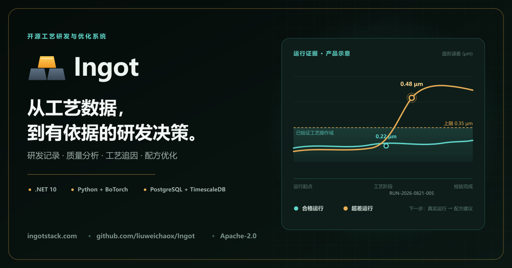
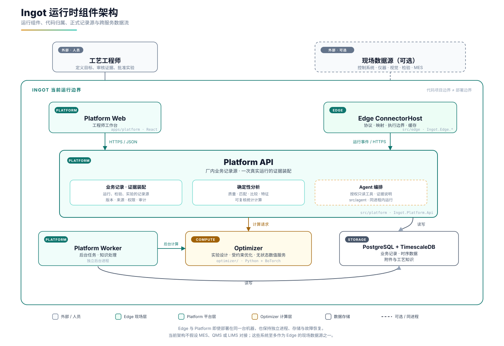

<a id="readme-top"></a>

<div align="center">
  <a href="https://ingotstack.com">
    
  </a>

  <p><strong>开源工艺研发与优化系统</strong></p>
  <p>从工艺数据，到有依据的研发决策。</p>

  [](https://github.com/liuweichaox/Ingot/actions/workflows/ci.yml)
  [](LICENSE)
  [](https://dotnet.microsoft.com/)
  [](https://react.dev/)
  [](https://www.postgresql.org/)
  [](https://www.python.org/)

  [官网](https://ingotstack.com) · [在线文档](https://docs.ingotstack.com/zh) · [报告问题](https://github.com/liuweichaox/Ingot/issues) · [参与讨论](https://github.com/liuweichaox/Ingot/discussions)

  简体中文 · [English](README.en.md)
</div>

<a href="https://ingotstack.com">
  
</a>

<details>
  <summary>目录</summary>

- [关于项目](#关于项目)
- [快速开始](#快速开始)
- [使用](#使用)
- [文档](#文档)
- [路线图](#路线图)
- [参与贡献](#参与贡献)
- [许可证](#许可证)
- [联系方式](#联系方式)
- [致谢](#致谢)

</details>

## 关于项目

Ingot 组织配方版本、实验记录与运行证据，支持质量分析、工艺追因和配方优化。

它服务配方成本较高、样本有限、质量目标和安全边界明确的研发工作。工程师在同一处核对实际条件、过程变化和质量结果，比较可比运行，并在约束内决定下一份配方。建议不会自动下发到设备。

仓库只声明代码、自动化测试和可复现的软件行为。适用性、安全性和收益由部署者用自己的数据评估。已实现范围见[当前状态](docs/status.md)。

### 技术栈

核心工作流包括管理配方与实验上下文、核对运行和质量证据，以及记录工程师对下一份配方建议的采用、修改或拒绝。计划值、实际值与结果分别保留，避免把意图当作已发生的事实。

| 部分 | 技术 |
|---|---|
| 业务服务 | .NET 10 |
| 工程工作台 | React 19、Vite |
| 数据 | PostgreSQL 17、TimescaleDB |
| 数值优化 | Python 3.12 |
| 部署 | Docker Compose |

### 仓库结构

| 路径 | 职责 |
|---|---|
| `src/platform` | 业务 API、正式记录、证据装配与后台任务 |
| `src/edge` | 现场采集、语义映射、离线缓冲与重放 |
| `src/agent` | 只读分析、知识检索与证据说明 |
| `src/shared` | 领域模型与跨模块契约 |
| `optimizer` | 响应面、约束判断与序贯优化 |
| `apps/platform` | 工程工作台 |
| `apps/website`、`apps/docs-site` | 官网与文档站 |
| `tests`、`deploy`、`scripts` | 测试、部署清单与架构门禁 |

<p align="right"><a href="#readme-top">返回顶部</a></p>

## 快速开始

### 环境要求

试用完整栈需要 Git、Docker Engine 或 Docker Desktop，以及 Docker Compose v2。这条路径不要求本机预装 .NET、Node.js 或 Python。

参与开发另需 .NET SDK 10、Node.js 22.22+ 和 uv 0.12.5。命令与约束见[贡献指南](CONTRIBUTING.md)。

### 安装

```bash
git clone https://github.com/liuweichaox/Ingot.git
cd Ingot
cp .env.example .env
```

启动前替换 `.env` 中所有 `change-this-` 占位值。数据库密码使用随机值。管理员口令可设置为另一随机值，也可保持空值，由首次迁移生成。PowerShell 用户将复制命令替换为 `Copy-Item .env.example .env`。

```bash
docker compose -f docker-compose.app.yml config --quiet
docker compose -f docker-compose.app.yml up -d --build
docker compose -f docker-compose.app.yml ps -a
```

确认 `platform-migrate` 成功退出，数据库、API、Worker、Optimizer 和 Web 健康后，打开 `http://localhost:3000`。使用 `.env` 中的管理员账户登录；口令留空时，在 `docker compose -f docker-compose.app.yml logs platform-migrate` 中读取首次生成的口令。修改 `.env` 不会重置已有账户。完整步骤见[快速开始](docs/getting-started.md)。

<p align="right"><a href="#readme-top">返回顶部</a></p>

## 使用

登录后从工艺配置发布配方版本。每次运行记录实际参数、过程轨迹和质量结果；符合准入条件的运行形成优化观察。系统在安全边界和已观察范围内给出下一份配方，工程师采用为下一轮校正，或把显著变更做成修订草稿。

```text
工艺配置 → 现场接入 → 生产运行 → 质量管理 → 工艺追因 → 配方优化
```

现场设备和企业系统连接器是可选扩展。只有配方参数、没有可信运行事实时，系统不生成建议。

| 相邻系统 | Ingot 的边界 |
|---|---|
| MES、ERP、SCADA、Historian | 可导入运行事实；不替代执行、监控或实时控制 |
| LIMS、QMS、ELN | 可导入检验与研发上下文；不替代样品、合规或文档管理 |
| 统计与优化方法 | 按数据条件选择；不把一种算法当作所有问题的答案 |
| AI Agent | 查询并解释已授权事实；不直接生成数值设定或控制设备 |



业务记录以 Platform API 为准。Optimizer 无业务状态。Agent 只能通过授权的只读工具查询事实。生产拓扑见[生产架构](docs/production-architecture.md)，第一份建议的操作顺序见[配方优化试点指南](docs/pilot.md)。

<p align="right"><a href="#readme-top">返回顶部</a></p>

## 文档

从[文档首页](docs/index.md)或[在线文档](https://docs.ingotstack.com/zh)选择阅读路径：

- **首次使用**：[快速开始](docs/getting-started.md) → [配方优化试点指南](docs/pilot.md)。
- **理解系统**：[系统设计](docs/design.md)、[数据模型](docs/data-model.md)与[分析与优化](docs/optimization.md)。
- **接入与运维**：[数据接入](docs/data-connection.md)、[生产架构](docs/production-architecture.md)与[部署运维](docs/deployment.md)。
- **判断适用范围**：[当前状态](docs/status.md)、[场景评估边界](docs/rollout.md)与[常见问题](docs/faq.md)。
- **参与建设**：[贡献指南](CONTRIBUTING.md)与[开源依赖](docs/open-source-dependencies.md)。

仓库 Markdown 是文档源文件，文档站发布同一份内容。英文入口见 [English documentation](docs/index.en.md)。

<p align="right"><a href="#readme-top">返回顶部</a></p>

## 路线图

- [x] 在已发布配方版本上记录建议的采用、修改、拒绝和结果冻结
- [ ] 完整呈现运行证据：实际值、来源、缺失项和质量复核
- [ ] 说明推荐准入，并把拒绝原因追溯到运行和质量记录
- [ ] 用来源、范围和冲突检查约束后续建议
- [ ] 使备份恢复、容量和告警可以独立验收

验收条件见[发展规划](docs/project-plan.md)。未关闭的问题见 [Issues](https://github.com/liuweichaox/Ingot/issues)。

<p align="right"><a href="#readme-top">返回顶部</a></p>

## 参与贡献

欢迎设备适配、统计方法、优化算法、测试和文档贡献。

1. 先阅读[贡献指南](CONTRIBUTING.md)、[行为准则](CODE_OF_CONDUCT.md)和[安全策略](SECURITY.md)。
2. 在 [Issues](https://github.com/liuweichaox/Ingot/issues) 或 [Discussions](https://github.com/liuweichaox/Ingot/discussions) 中确认没有重复问题；较大变更先说明场景和验证方式。
3. 提交 Pull Request。漏洞通过[私密报告](https://github.com/liuweichaox/Ingot/security/advisories/new)提交，不要开公开 Issue。

提交前运行 `./scripts/verify.sh`。

<p align="right"><a href="#readme-top">返回顶部</a></p>

## 许可证

本项目使用 [Apache License 2.0](LICENSE)。

<p align="right"><a href="#readme-top">返回顶部</a></p>

## 联系方式

- 官网：<https://ingotstack.com>
- 文档：<https://docs.ingotstack.com/zh>
- 问题：<https://github.com/liuweichaox/Ingot/issues>
- 讨论：<https://github.com/liuweichaox/Ingot/discussions>
- 安全：<https://github.com/liuweichaox/Ingot/security/advisories/new>

<p align="right"><a href="#readme-top">返回顶部</a></p>

## 致谢

README 结构参考 [Best-README-Template](https://github.com/othneildrew/Best-README-Template)。

运行时依赖、许可证和引入要求见[开源依赖](docs/open-source-dependencies.md)。精确版本以 lockfile 和容器清单为准。

<p align="right"><a href="#readme-top">返回顶部</a></p>
