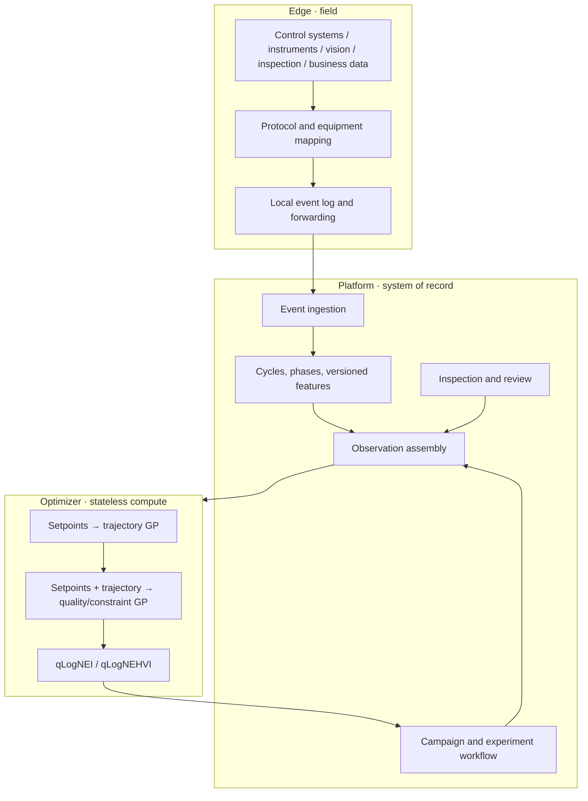

# Architecture

## Design objective

The system exists to **reach process specification with as few safe, real experiments as possible and preserve the validated process window as reusable evidence.**

That leads to three choices:

1. acquisition must be reliable, but it is not the product center;
2. experiments, cycles, and inspections have one formal system of record;
3. numerical optimization uses Python scientific computing while .NET owns business transactions.

## Product shape: industrial data and process decision platform

Ingot is an industrial data and process-decision platform—not another PLC configuration tool, generic dashboard, MES, or data warehouse. It turns field data into contextualized industrial facts, then turns those facts into explainable, verifiable, and executable process decisions.

The product surface has five domains only:

1. **Decision workbench** — the highest-value actions across runs, quality, data trust, and optimization projects;
2. **Insight and optimization** — root-cause analysis produces candidate hypotheses, while optimization projects turn hypotheses or specifications into the next safe experiments;
3. **Industrial context** — equipment, workpieces, recipes, phases, inspections, and analysis semantics give raw signals business meaning;
4. **Connection and implementation** — field nodes, data connections, and production context are configured by implementers to support, rather than distract from, daily decisions;
5. **System** — health, logs, and integration operations.

Mechanisms, knowledge, datasets, and models are reusable context for optimization projects, not a separate daily workbench. A PLC, instrument, database, or file is only a connector; the platform contract remains centered on runs, process, quality, and experiments.

## System map



## Responsibilities

### Edge

- Ingest control-system, instrument, vision, inspection, and business-system data through protocol, API, or file adapters.
- Produce or map a stable correlation identifier for every run.
- Persist before shipping, then reconnect and forward idempotently.
- Never fit a model or choose the next recipe.

### Platform

- Own projects, experiments, cycles, inspections, model inputs, and conclusions.
- Join each real run to its process record and inspection with `RunKey`; map it to `Cycle CorrelationId` where a control cycle exists.
- Materialize versioned process features.
- Assemble immutable optimizer snapshots.
- Review, execute, and complete experiments.
- Save result, evidence, experiment linkage, and audit in one transaction.

### Optimizer

- Receive the complete campaign and observation snapshot on every request.
- Rebuild models per request and retain no business state.
- Generate safe exploration points during cold start.
- Fit two-stage GPs once enough evidence exists.
- Return parameters, objective and constraint predictions, intervals, feasibility, and acquisition value.

### Web

The UI organizes goals, observations, suggestions, execution, and results inside one R&D project. It does not create a parallel optimization workflow.

## Root-cause and optimization loop

Root-cause work is not a separate dashboard. It is the entry point for the next falsifiable experiment:

```text
cycle/batch comparison → candidate association → testable hypothesis → next experiment → source-derived result
                                                                  ↓
                         validated process window ← supported / rejected / inconclusive hypothesis
```

- A cycle comparison creates only **candidate hypotheses**. It preserves features, effect sizes, confounders, and the comparison snapshot; it never turns an association into a causal claim.
- Once an engineer defines an outcome, expected direction, and minimum meaningful effect, the optimizer can use the `validate-hypothesis` intent. Among safe candidates, it favors combinations that are uncertain for the outcome and sufficiently separated from prior observations on the hypothesis variables.
- The `reach-specification` intent continues to use qLogNEI/qLogNEHVI to approach specification under safety constraints.
- Results must be derived from source snapshots. Their confidence intervals automatically mark a hypothesis inconclusive when they cross the threshold, supported when they fully exceed it in the expected direction, or rejected when they fully exceed it in the opposite direction; traceable evidence is written with the decision.
- Research assets remain reusable project context for mechanisms, knowledge, and data quality, rather than a separate daily-workbench module.

The default scenario profile is `generic`. A particular PLC or process profile is only an adapter or example and cannot change this business contract.

## Observation contract

```json
{
  "runKey": "bo-7d2f6a3e1c2d-01",
  "actualFactors": { "holding-temperature": 512.0 },
  "processFeatures": {
    "mold-temperature.hold.mean": 510.8,
    "mold-temperature.cycle.overshoot": 2.4
  },
  "outcomes": { "form-error": 0.38 },
  "constraintOutcomes": { "crack-rate": 0.01 },
  "sourceContentHash": "sha256..."
}
```

When a `recipe:` or `signal:` source is explicit, missing actual data excludes the observation. Planned-value fallback exists only for legacy projects without a mapping.

## Consistency and idempotency

- The same input snapshot produces the same hash and deterministic experiment ID.
- A repeated request returns the unfinished optimized experiment.
- Running settings are passed as pending points.
- Concurrent creators converge on the same experiment.
- Platform and Edge still start and collect when the optimizer is unavailable.

## Adapting another process

Provide:

- controls and bounds;
- objectives, directions, weights, and units;
- hard parameter and safety outcome constraints;
- mappings for actual values, trajectories, and inspections;
- cycle/phase feature definitions;
- a verified safe baseline;
- optional physical features or prior means.

The experiment workflow, data spine, and optimizer protocol remain unchanged.

## Advanced work not yet complete

- Calibrated physical priors for real production scenarios;
- multi-task transfer across products, materials, tooling, and machines;
- online uncertainty calibration and drift detection;
- repeatability-driven automatic stopping;
- a public end-to-end benchmark across PostgreSQL/TimescaleDB, Docker, and field data sources.

These are verifiable next steps, not shipped claims.
