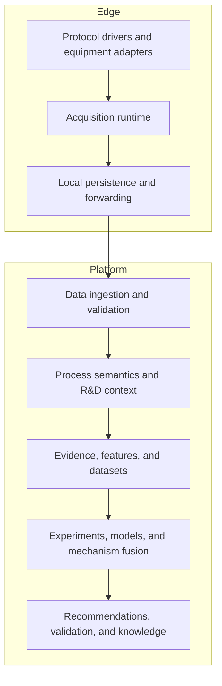
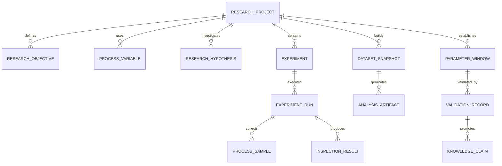

# Ingot Product and System Design

> Status: overall product and system design
>
> Audience: product owners, process engineers, algorithm engineers, software engineers, and delivery teams
>
> Design theme: use advanced technology to help process engineers develop manufacturing processes with fewer ineffective experiments and shorter development cycles

## 1. Product Positioning

Ingot is an AI process R&D system for manufacturing. By combining experimental data, real-time process data, physical mechanisms, and expert knowledge, it helps process engineers design experiments, discover relationships, optimize parameters, and validate process windows to shorten process-development cycles. The system organizes objectives, experiments, process data, quality outcomes, mechanism models, expert judgment, and validation conclusions around real process-development projects.

Ingot helps process engineers:

- define objectives, evaluation metrics, controllable variables, and safety constraints;
- collect data from experimental equipment, production equipment, inspection instruments, and manual records;
- identify critical phases, variables, interactions, and candidate mechanisms;
- design the next experiments with higher information value;
- establish candidate process windows within explicit boundaries;
- validate conclusions and preserve traceable, reusable process knowledge.

Ingot measures value through process-development outcomes: experiment count, calendar time, material and equipment cost, and process-knowledge reuse.

## 2. Design Principles

### 2.1 The process-development project is the primary object

Equipment, points, cycles, inspections, models, and documents serve specific development objectives and enter the R&D loop through experiments, datasets, and evidence.

### 2.2 Data acquisition is a native capability

Ingot has an independent acquisition system. It implements mainstream industrial protocols behind stable acquisition contracts and supports adaptations for specific equipment models, firmware, and site point maps.

### 2.3 Data, mechanisms, and expert knowledge work together

Data models identify statistical patterns, mechanism models express physical constraints and domain laws, and expert knowledge supplies applicability and field boundaries. The source and version of every evidence type remain explicit.

### 2.4 Conclusions are traceable, reproducible, and verifiable

Results bind input datasets, filtering rules, feature definitions, algorithm and model versions, and computation hashes. Recommendations bind their rationale, applicability, safety constraints, expected outcome, and validation plan.

### 2.5 Engineers retain development authority

The system organizes evidence, runs computations, proposes hypotheses, and drafts experiments. Process engineers confirm objectives, review experiments, assess field conditions, approve conclusions, and decide process application.

### 2.6 Real process loops validate system capabilities

Acquisition, computation, analysis, models, and recommendations are validated with real equipment, experiments, and quality outcomes.

## 3. Users

| Role | Primary responsibility | System support |
|---|---|---|
| Process R&D engineer | Define objectives, run experiments, judge conclusions | R&D workspace, experiment design, analysis, modeling, process windows |
| Process expert | Supply mechanisms, experience, boundaries, and review | Mechanism models, knowledge claims, applicability, evidence review |
| Quality engineer | Define evaluation metrics and review outcomes | Inspection plans, quality linkage, validation metrics |
| Equipment and automation engineer | Connect equipment and maintain acquisition quality | Drivers, equipment profiles, point mapping, health and diagnostics |
| R&D lead | Manage objectives, schedule, cost, and output | Portfolio, stage progress, experiment cost, value, review records |
| Delivery and operations team | Deploy and operate the system | Identity, permissions, audit, backup, monitoring, upgrades |

## 4. Process R&D Loop

```mermaid
flowchart LR
    A["Define R&D objectives"] --> B["Establish variables and constraints"]
    B --> C["Collect historical data and knowledge"]
    C --> D["Form hypotheses and analysis plans"]
    D --> E["Design and review experiments"]
    E --> F["Execute experiments and acquire data"]
    F --> G["Link inspection and quality outcomes"]
    G --> H["Analyze, model, and fuse mechanisms"]
    H --> I["Update process windows and next-step recommendations"]
    I --> J["Validate conclusions and preserve knowledge"]
    J --> D
```

### 4.1 Objectives and variables

A project records its product, material, equipment, and process scope, together with baseline, target, allowed variation, completion criteria, variables, safety limits, experiment cost, planned duration, and ownership.

Variables have stable codes, data types, units, precision, valid ranges, control methods, and sources. They are classified as controllable, process, environmental, material, or outcome variables. Process phases define their meaning within a cycle.

### 4.2 Hypotheses

A hypothesis records applicability, mechanism rationale, historical evidence, expert evidence, supporting and opposing evidence, limitations, proposed validation, safety metrics, review state, and confidence.

### 4.3 Experiments

An experiment records planned parameters, held-constant conditions, expected effects, primary metrics, allocation, sample size, exclusions, safety constraints, stop rules, and rollback plans.

Execution separately preserves planned settings, actual settings, actual process values, material and equipment context, inspection outcomes, data completeness, deviations, and validity.

### 4.4 Analysis and recommendation

The system builds versioned datasets, checks quality, aligns phases, computes features, compares groups, trains models, executes mechanisms, and fuses evidence. Results identify critical variables and phases, update hypotheses, describe the process space, establish candidate windows, and propose high-information experiments with uncertainty and risk boundaries.

### 4.5 Validation and knowledge

Evidence matures from a historical candidate relationship through repeated observation, exploratory experiments, preregistered confirmation, independent validation, and engineering approval. Reviewed conclusions become versioned knowledge claims with applicability, evidence, limitations, reviewers, and invalidation conditions.

## 5. Product Information Architecture

### 5.1 R&D workspace

The primary landing page shows projects, objectives, current best results, experiment progress, hypothesis evidence, data completeness, recommended next actions, development duration, experiment count, and cost.

### 5.2 Development projects

Project pages organize objectives, variables, constraints, products, materials, equipment, tooling, recipes, datasets, experiments, hypotheses, analyses, models, mechanisms, process windows, validations, and knowledge.

### 5.3 Experiment center

The experiment center supports design, review, scheduling, execution monitoring, quality linkage, validity assessment, and conclusion registration. Planned conditions, actual conditions, process traces, and outcomes remain distinct.

### 5.4 Analysis and modeling

Analysis pages present data quality, sensitivity, interactions, phase features, group comparisons, model performance, uncertainty, mechanism output, fusion output, and evidence for each hypothesis.

### 5.5 Process space

The process-space view presents explored regions, safe regions, candidate regions meeting objectives, sparse and high-uncertainty regions, current windows, and recommended next experiment points.

### 5.6 Process knowledge

The knowledge area organizes reviewed sources, claims, applicability, evidence levels, related projects, and version history for reuse across future projects.

### 5.7 Data foundation

The data-foundation area manages equipment, sources, drivers, equipment profiles, point mappings, deployment versions, acquisition health, inspection definitions, quality plans, imports, and R&D context.

## 6. Overall Architecture

The central system uses a modular-monolith structure with explicit business boundaries. Edge runs independently in the plant network and forwards persisted records after connectivity returns.

## 7. Data Acquisition

### 7.1 Layers

Acquisition has four layers:

1. protocol drivers for connection, reading, subscription, parsing, and diagnostics;
2. equipment profiles for series, model, firmware, addressing, data types, and capabilities;
3. project point configurations for site addresses, scaling, units, sampling, and business names;
4. process-variable mappings that connect equipment signals to R&D semantics.

### 7.2 Equipment adaptation

Every verified adaptation records its protocol and driver version, equipment and firmware range, supported areas and types, verified sample rate, batch-read limits, default mapping, known limitations, diagnostics, and validation date.

### 7.3 Stable sample contract

All protocols produce a unified sample containing:

- Edge, equipment, connection, and point identity;
- device occurrence, Edge receipt, and central receipt times;
- acquisition sequence, raw and normalized values, data type, and unit;
- quality, communication state, and diagnostics;
- driver, equipment-profile, and point-configuration versions;
- linked process variable, experiment, cycle, and project context.

The relationship between raw and normalized values remains reviewable.

### 7.4 Runtime

The acquisition runtime manages sessions, reconnection, polling, subscription, batch reading, scheduling, timeout, backoff, fault isolation, local persistence, deduplication, ordering, offline forwarding, timestamp correction, quality marking, configuration rollout, rollback, and health monitoring.

### 7.5 Validation

Each driver and equipment adaptation has frame tests, simulator fault tests, specified real-device tests, long-running stability tests, offline-forwarding tests, and end-to-end regression from real samples to process features and experiment results.

## 8. Core Data Model

Projects define scope and lifecycle. Experiments describe research design; runs describe real execution. Dataset snapshots are immutable and preserve scope, variables, targets, exclusions, quality gates, feature definitions, and hashes. Analysis artifacts and model versions preserve computation and evaluation context. Process windows preserve bounds, objectives, constraints, applicability, evidence, and uncertainty. Knowledge claims preserve reviewed laws and their evidence.

### 8.1 Integrity constraints for formal research records

The platform keeps one formal research aggregate rooted at the research project. An experiment must have a versioned run plan with at least two distinct conditions; it cannot complete without a source snapshot, computed objective results, and safety checks. A candidate process window must reference completed experiment results and a traceable analysis run with a SHA-256 digest, and a person other than its creator must validate it. A knowledge claim can only be promoted from a validated process window and verifiable evidence.

Project membership, experiment runs, experiment results, window-to-result links, evidence references, and audit events are represented by relational tables with foreign-key constraints. JSON payloads retain immutable object snapshots but are not the sole source for critical identities, authorization, or evidence relationships. Project lists and research assets are member-scoped and bounded.

## 9. Intelligent R&D Engine

### 9.1 Data quality and features

The system checks timestamps, sampling, missing and duplicate values, units, cycle and phase completeness, plan-to-actual deviation, confounders, and inspection quality. Whole-cycle and phase features have stable definitions, units, algorithm versions, and computation hashes.

### 9.2 Statistical and causal evidence

The system supports group comparisons, effect sizes, confidence intervals, sensitivity, interactions, confounder checks, and candidate causal structures. Outputs distinguish observation, experimental evidence, and engineer-confirmed conclusions.

### 9.3 Experiment design

The experiment engine supports factorial design, response surfaces, space-filling designs, Bayesian optimization, active learning, and constrained multi-objective optimization. Recommendations consider objective improvement, information gain, explored regions, constraints, cost, feasibility, uncertainty, and validation needs.

### 9.4 Model and mechanism fusion

Data models, mechanism models, and expert rules can run independently and contribute to fused results. Variables, units, applicability, and boundaries are validated before execution, and every component remains traceable.

### 9.5 Process windows

Each process window and recommendation records applicability, parameter values or ranges, expected outcomes, evidence, uncertainty, safety constraints, stop and rollback rules, proposed validation, and review state.

## 10. AI Collaboration

Ingot Chat and intelligent agents work inside development projects. They structure objectives, retrieve evidence, invoke deterministic tools, summarize support and opposition, draft hypotheses and experiments, and prepare knowledge claims for review.

Numerical computation, permissions, data scope, model execution, and state transitions remain deterministic. AI outputs cite specific datasets, experiments, computations, and knowledge sources.

## 11. Security and Audit

Permissions follow project scope and separation of duties. Equipment configuration, experiment creation, review, result confirmation, model activation, independent process-window validation, and knowledge publication have explicit roles. Credentials use controlled secret storage. Critical changes, approvals, execution, rollback, and exports enter the audit log. Edge and Platform use separate, least-privilege, rotatable identities.

## 12. Reliability and Performance

Edge continues acquisition and persistence through network outages and forwards records in order after recovery. Event identity and sequence prevent duplication.

Analysis uses versioned inputs and deterministic feature definitions. Late data invalidates and recomputes affected results. Production queries use server-side pagination and indexes; long-running analysis uses background tasks with progress, cancellation, recovery, and result reuse.

Raw time-series data, structured R&D data, analysis artifacts, model files, inspection attachments, and knowledge sources have explicit retention, archive, backup, and recovery policies.

## 13. Validation System

Validation provides five forms of evidence:

1. protocol and equipment validation;
2. complete data-path validation;
3. reproducible computation validation;
4. real process and physical-law validation;
5. measurable R&D value validation.

Each priority process maintains a golden dataset and a golden development case covering real input, expected features, experiment outcomes, conclusions, and computation hashes.

## 14. Delivery Roadmap

### Stage 1: Real data and project context

- deliver protocol and equipment adaptations for the target process;
- establish variables, phases, experiments, and inspection linkage;
- acquire stable data and compute reproducible features;
- show objectives, experiment progress, and quality in the R&D workspace.

### Stage 2: Analysis and experiment loop

- establish versioned datasets and hypotheses;
- analyze variables, phases, and interactions;
- support exploratory and confirmatory experiments;
- update analyses and process windows with new results.

### Stage 3: Intelligent experiments and mechanism fusion

- introduce sequential design, Bayesian optimization, and active learning;
- fuse data models, mechanisms, and expert rules;
- generate recommendations with uncertainty, constraints, and validation plans;
- establish explainable and reviewable process windows.

### Stage 4: Knowledge reuse

- preserve validated conclusions as versioned process knowledge;
- reuse knowledge across products, materials, equipment, and projects;
- build enterprise process-development case and model assets;
- measure development efficiency and economic value across the portfolio.

## 15. Success Metrics

Core metrics include time and experiment count to reach a target window, project cost, valid-experiment ratio, recommendation adoption, process-window validation, knowledge reuse, and transfer time for new products, materials, and equipment.

System metrics include connection reliability, acquisition completeness, forwarding success, latency, linkage accuracy, computation reproducibility, evidence coverage, and audit completeness.

## 16. Acceptance Criteria

A completed development loop demonstrates:

1. explicit objectives, variables, constraints, and success criteria;
2. real equipment, experiment, and inspection data in one project;
3. clear data-quality and execution-deviation findings;
4. conclusions traceable to data, features, models, and mechanisms;
5. recommendations with rationale, constraints, expected outcomes, and uncertainty;
6. experiment results updating hypotheses, models, and process windows;
7. reviewed conclusions preserved as versioned process knowledge;
8. quantified improvement in experiments, development time, or resource cost.

This design places acquisition, process semantics, experiment management, intelligent analysis, mechanism fusion, and knowledge preservation on one R&D path serving shorter process-development cycles.
