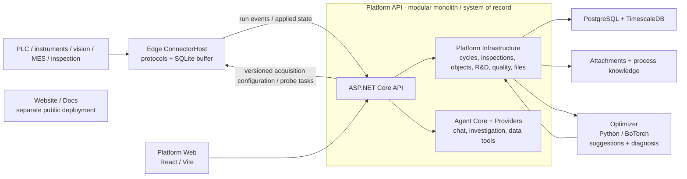

# Architecture

## Design objective

The system exists to **reach process specification with as few safe, real experiments as possible and preserve the validated process window as reusable evidence.**

That leads to three choices:

1. acquisition must be reliable, but it is not the product center;
2. experiments, cycles, and inspections have one formal system of record;
3. numerical optimization uses Python scientific computing while .NET owns business transactions.

The system is designed for one-company, on-premises deployment on the factory network and is shared by that company's process, quality, equipment, and R&D teams. Edge is deployed by OT network and failure domain, while Platform is the factory system of record.

## Product shape: process diagnosis and optimization system

Ingot is an open-source process diagnosis and optimization system carried on an industrial data platform. It turns field data into contextualized industrial facts, uses those facts to explain quality deviations that already happened, and turns the explanation into a verifiable, executable next experiment.

Diagnosis and optimization are not two modules but two ends of one evidence chain: without traceable run facts, attribution is guesswork; without attribution, optimization searches the full parameter space blind.

The current Web UI is organized into five product domains:

1. **Operations and quality** — current runs, quality tasks, production events, and context help frontline roles act on what is happening now;
2. **Diagnosis and optimization** — quality attribution and cycle comparison produce candidate causes, while optimization projects turn evidence into the next safe experiments;
3. **Objects and data** — industrial objects connect recipes, process data models, analysis models, and data health into consistent business semantics;
4. **Engineering configuration** — implementers maintain field nodes, data connections, inspection and quality definitions, components, and tooling;
5. **Platform operations** — health, logs, integration status, backups, and service configuration.

Product domains organize task entry points without breaking the evidence chain; a selected object, project, or cycle should persist as cross-page context. Mechanisms, knowledge, datasets, and models are reusable context for optimization projects, not a separate daily workbench. A PLC, instrument, database, or file is only a connector; the platform contract remains centered on runs, process, quality, and experiments.

## System map



Repository project boundaries are not deployment boundaries: `Edge.Application`, `Edge.Infrastructure`, `Platform.Infrastructure`, and `Agent` are libraries. The actual central deployment unit is `Platform API`, and the actual field deployment unit is an independent `Edge ConnectorHost` instance. A small installation may place ConnectorHost and Platform on the same physical server while retaining separate processes, containers, data volumes, `EdgeId`, and start/stop lifecycles. Optimizer runs as a separate stateless HTTP service. Website and Docs are deployed separately from the factory application stack through `deploy/compose.yml`.

## Responsibilities

### Edge

- Ingest control-system, instrument, vision, inspection, and business-system data through protocol, API, or file adapters.
- Independently execute versioned Platform-published acquisition configurations for multiple devices so one task failure preserves continuity for the others.
- Produce or map a stable correlation identifier for every run.
- Persist before shipping, then reconnect and forward idempotently.
- Never fit a model or choose the next recipe.

### Platform

- Own projects, experiments, cycles, inspections, model inputs, and conclusions.
- Centrally manage and publish process data models, device-connection mappings, and acquisition-configuration versions.
- Join each real run to its process record and inspection with `RunKey`; map it to `Cycle CorrelationId` where a control cycle exists.
- Materialize versioned process features.
- Assemble immutable optimizer snapshots.
- Review, execute, and complete experiments.
- Save result, evidence, experiment linkage, and audit in one transaction.

Platform API is a modular monolith that composes Platform Infrastructure, Agent Core, and Agent Providers. Agent has no separate business database and never bypasses Platform to write field or business records.

### Acquisition-configuration control flow

The target control flow uses Edge-initiated network connections. ConnectorHost bootstraps with its local `EdgeId`, Platform address, communication tokens, certificates, and device-credential references, then pulls desired acquisition configurations and probe tasks and performs device-access and mapping validation locally. Configuration progresses through draft, target-Edge probe, publication, local validation, cycle-boundary application, and state confirmation. Edge continuously reports desired version, applied version, configuration hash, applied time, task state, and errors and retains the last successful version for continued acquisition during Platform outages. A healthy new version replaces the previous version; a failed application retains the previous version.

### Agent

- Read structured business context through read-only data tools exposed by Platform;
- provide chat, investigation, cycle comparison, data-quality explanations, and research assistance;
- use a deterministic local/test fallback or a configured OpenAI Provider;
- never make the final numerical recipe decision; Optimizer computes numerical suggestions and an engineer reviews them.

### Optimizer

- Receive the complete campaign and observation snapshot on every request.
- Rebuild models per request and retain no business state.
- Generate safe exploration points during cold start.
- Fit two-stage GPs once enough evidence exists.
- Expose `/v1/suggestions` for specification or hypothesis-validation suggestions and `/v1/diagnosis` for diagnostic candidates;
- Return parameters, objective and constraint predictions, intervals, feasibility, and acquisition value.

### Web

Web is a standalone React/Vite frontend that accesses business data through Platform API. It organizes industrial objects, R&D projects, goals, experiments, observation readiness, suggestions, execution, and results without creating a parallel optimization workflow.

### Website / Docs

Website and Docs are public Next.js static sites. They are not part of the factory runtime loop and do not own Platform business state.

## Root-cause and optimization loop

The complete user-facing path has six stages:

```text
define process → connect equipment → collect production data → close the data loop → diagnose → process optimization
```

The first four stages turn field facts into trustworthy evidence. The final two form testable conclusions and return validated settings to production. The flow below describes the internal loop after diagnosis enters experimental validation.

Root-cause work is not a separate dashboard. It is the entry point for the next falsifiable experiment:

```text
cycle/batch comparison → candidate association → testable hypothesis → next experiment → source-derived result
                                                                  ↓
                         validated process window ← supported / rejected / inconclusive hypothesis
```

- Cycle diagnosis evaluates actual recipe parameters and stage-level process features in one candidate space. The first layer retains pass/fail medians, MAD robust effects, and effective sample weights. Once sample size permits, the second layer selects Elastic Net, a regularized additive model, or a continuous-outcome GP and reports out-of-fold cross-validation, bootstrap selection stability, and candidate interactions.
- Product, equipment, tooling, and material lot begin as provenance fields and candidate blocking factors. The system checks missingness, sample coverage, and factor overlap, then uses matched comparisons, variance components, mixed-effects models, or time trends as the data permits. Observational results are labeled stable association, confounded association, or insufficient evidence; controlled blocked experiments test causal hypotheses.
- The system creates an experimentally testable hypothesis only when the candidate data source matches a project control through its `recipe:` or `signal:` mapping. It never creates an empty hypothesis without a controllable variable.
- A candidate that maps to a control is bound to the project's highest-weight objective; the objective direction, baseline, and specification produce an editable minimum-effect default. The optimizer then uses the `validate-hypothesis` intent and favors safe combinations that are uncertain for the outcome and sufficiently separated from prior observations.
- The `reach-specification` intent continues to use qLogNEI/qLogNEHVI to approach specification under safety constraints.
- The product workbench schedules two distinct candidates twice by default, splits them across two execution blocks, and rotates their order. This separates treatment differences from single-run noise; API callers may explicitly change the replicate count.
- A single point or block can at most mark a hypothesis as intervention-supported. The system promotes it to a verified cause only when at least two intervention conditions repeat across two blocks, the confidence interval clears the minimum meaningful effect, and safety constraints pass.
- Results must be derived from source snapshots. Hypothesis decisions use a Welch interval for the effect (experiment mean minus the mean of same-condition repeated runs explicitly named by the plan's `BaselineRunKeys`). Controls may be in the current experiment, imported history, or a completed experiment, but the project history is never pooled automatically. With fewer than two independent control or experiment observations, no interval is fabricated and the decision stays inconclusive.
- Approval creates an ordered, equipment-neutral execution package. A PLC gateway, MES, recipe system, or operator station applies the parameters and preserves the `RunKey`; once actual recipes, trajectories, and inspections are complete, the background workflow materializes the result and closes the experiment.
- An optimization batch may create a candidate setting only from repeats of the same condition. It must not join the minima and maxima of scattered successful points into an untested hyper-rectangle.
- A separate validation experiment must run the candidate at least three times across two execution blocks. Only when actual settings, quality objectives, and safety constraints all pass may a different engineer approve laboratory validation. A continuous process window additionally requires boundary and interaction experiments; repeats at one point cannot validate an entire range.
- Research assets remain reusable project context for mechanisms, knowledge, and data quality, rather than a separate daily-workbench module.

By default, the optimizer uses only the controls declared by the project.
Optional derived features are a versioned `OptimizationFeatures` configuration
on the research project. They may use only bounded numeric operators, declared
controls, and earlier derived features. The optimizer core must not select
hidden behavior from an industry, equipment model, or variable name. The
optical-lens molding configuration exists only as the
`tools/optical-molding-demo/optimizer-feature-set.json` demo asset. PLC models
belong to acquisition adapters and must not enter process-physics features or
change this business contract.

## Observation contract

```json
{
  "runKey": "bo-7d2f6a3e1c2d-01",
  "context": {
    "machine_id": "PRESS-01",
    "product_code": "LENS-01",
    "recipe_version": "12",
    "tooling_id": "MOLD-A",
    "assembly_revision": "3",
    "material_lot_ref": "GLASS-LOT-07",
    "context_capture_status": "resolved"
  },
  "actualFactors": { "holding-temperature": 512.0 },
  "processFeatures": {
    "mold-temperature.hold.mean": 510.8,
    "mold-temperature.cycle.overshoot": 2.4
  },
  "outcomes": { "form-error": 0.38 },
  "constraintOutcomes": { "crack-rate": 0.01 },
  "sourceContentHash": "sha256..."
}
```

`OperationRunId`, `EquipmentId`, the product or process object, recipe version, and run times form the minimum run identity. Scenario configuration marks tooling, material, accumulated use, calibration, and maintenance fields as required for analysis or record when available and freezes them in an immutable run-context snapshot. Actual settings, process trajectories, and quality outcomes retain independent source and version metadata. Repeated evidence or blocked experiments promote a context field into a diagnosis feature, optimization feature, or applicability scope.

When a `recipe:` or `signal:` source is explicit, missing actual data excludes the observation. Planned-value fallback exists only for legacy projects without a mapping.

## Consistency and idempotency

- The same input snapshot produces the same hash and deterministic experiment ID.
- A repeated request returns the unfinished optimized experiment.
- The database allows at most one formal result per experiment, including under multi-instance concurrency.
- Running settings are passed as pending points.
- Concurrent creators converge on the same experiment.
- Platform and Edge still start and collect when the optimizer is unavailable.

## Adapting another process

Provide:

- controls and bounds;
- objectives, directions, weights, and units;
- hard parameter and safety outcome constraints;
- mappings for actual values, trajectories, and inspections;
- cycle/phase feature definitions;
- a verified safe baseline;
- optional physical features or prior means.

The experiment workflow, data spine, and optimizer protocol remain unchanged.

## Subsequent design work

- Context-effect assessment with variance components, mixed effects, serial autocorrelation, and missingness mechanisms;
- Calibrated physical priors for real production scenarios;
- multi-task transfer across products, materials, tooling, and machines;
- online uncertainty calibration and drift detection;
- repeatability-driven automatic stopping;
- a public end-to-end benchmark across PostgreSQL/TimescaleDB, Docker, and field data sources.

These capabilities are implemented and validated in the order established by field evidence and phase gates in the project plan.
