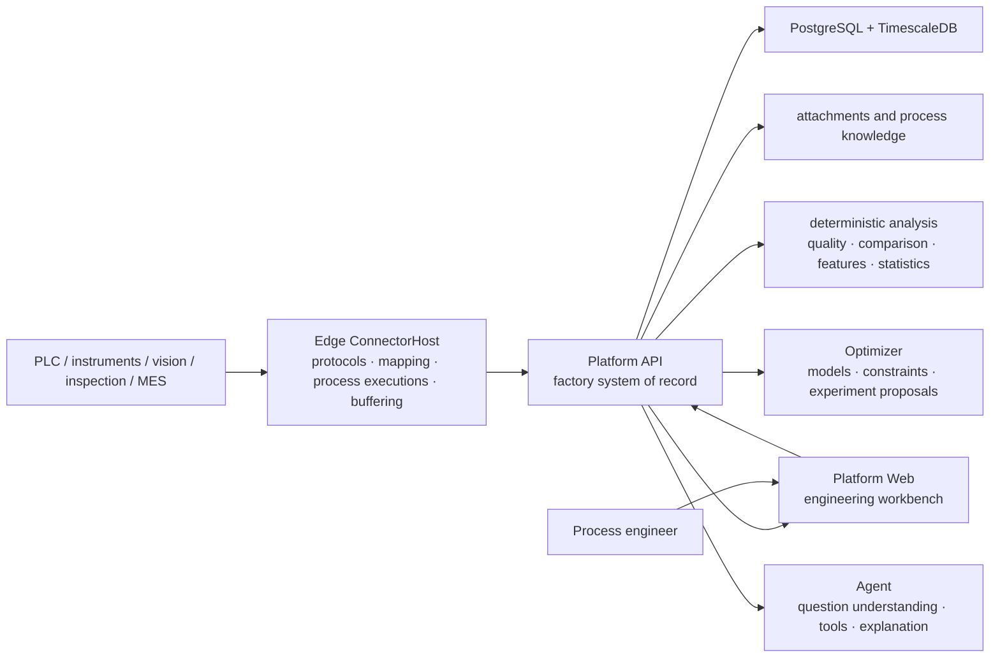

# System design

> Status: **v1 architecture baseline**. This document fixes product principles, business-record boundaries, and stable component responsibilities. Algorithms, default experiment parameters, page layouts, and implementation sequence remain evolvable strategies.

## Design objective

Ingot's core value is fixed by the [Brand guide](brand.en.md): move process R&D from decisions without data support to decisions supported by real data, so computers can genuinely help process engineers choose what to do next using the most effective computational methods for the problem.

The architecture must therefore:

1. **Establish trustworthy facts first**: every analysis traces to a real run, actual conditions, process data, and quality outcomes.
2. **Support engineering judgment next**: show differences, evidence, counterevidence, confounding, and uncertainty rather than only a score.
3. **Make conclusions testable**: observational analysis forms candidates; controlled experiments determine support, rejection, or uncertainty.
4. **Select methods by the problem**: statistics, experimental design, machine learning, Bayesian optimization, physical models, and LLMs are replaceable tools.
5. **Keep engineers in control**: engineers define objectives and safety boundaries, review recommendations, and approve real experiments.

The system is designed for one company on its factory network, shared by process, quality, equipment, and R&D teams.

## Product model

```text
Integrate field sources → Configure process semantics → Collect production data → Close the data loop → Process diagnosis → Process R&D
```

The first four steps organize field activity into trustworthy run facts. The last two use those facts to support engineering decisions. Process diagnosis and Process R&D are not parallel products: diagnosis explains an observed result, while R&D validates candidates through falsifiable experiments and selects the next experiment. Safe optimization is a method within Process R&D, not a standalone business entry. Both must read the same evidence.

The current Web information architecture balances the decision chain with frequent role-based tasks through seven business entries:

1. **Workbench**: prioritized quality tasks, run status, field status, and R&D progress;
2. **Field integration**: configuration overview, edge nodes, communication drivers, and mappings from multiple source fields to process variables;
3. **Process configuration**: process data dictionaries, process specifications, analysis rules, quality, tooling, and configuration publishing;
4. **Production runs**: production preparation, tooling installation, run records, the object catalog, and run events;
5. **Quality management**: inspection entry, independent review, quality records, and quality-deviation analysis, with direct access for daily quality work;
6. **Process diagnosis**: the diagnosis workbench, data trust, run comparison, and the analysis assistant; AI is an analysis method rather than a standalone business domain;
7. **Process R&D**: R&D projects, experimental validation, and R&D outcomes.

After the workbench, the primary business entries follow “Field integration → Process configuration → Production runs → Quality management → Process diagnosis → Process R&D.” Field integration starts with a configuration overview of sources and dependencies; process configuration then establishes stable semantics, rules, and published versions before production, quality, diagnosis, and R&D. It summarizes the full loop rather than mapping one-to-one to the six stages above: Production runs also covers production preparation, collection, and traceability; Quality management covers inspection and quality-deviation work; and the complete data loop additionally depends on cross-entry evidence such as data trust and run context.

System administration has a separate entry for users, role permissions, platform status, runtime logs, and assistant evaluation, so it does not compete with business tasks. Secondary navigation places frequent daily tasks before setup and maintenance actions. Existing URLs and data contracts remain stable; only the way engineers discover capabilities changes.

Menus may change, but these business facts must not be hidden, duplicated into parallel records, or buried inside algorithm state.

## System map



Code-project boundaries are not deployment boundaries. Factory runtime units are Platform API, independent Edge ConnectorHost instances, the database, Optimizer, and Web. A small site may share a physical server, while Edge and Platform retain independent processes, storage, identity, and recovery lifecycles.

This document fixes stable business boundaries. [Production architecture](production-architecture.en.md) defines the target topology for replicas, failure domains, data lifecycle, disaster recovery, and controlled action; [Deployment](deployment.en.md) defines current operating procedures. The target design must not be presented as a capability already delivered by the current Compose topology.

## Stable component responsibilities

### Edge

- Actively connect to controls, instruments, gateways, and approved business sources.
- Map vendor addresses, protocol types, and raw units to stable business codes.
- Detect run boundaries and report actual settings, process samples, events, and context provenance.
- Use a durable local queue for outages, platform restarts, and short backpressure.
- Pull versioned acquisition configuration, validate it locally, and report applied state.

Edge does not decide process causes, run product-level optimization, or become the formal record for experiments and quality outcomes.

Discrete run identity must remain traceable across ConnectorHost restarts. If the connector starts while equipment is already active and no recoverable shop-floor run identity exists, Edge marks the segment as incomplete instead of presenting it as a complete run from a normal start. A single event deterministically rejected by Platform is quarantined with a local audit record and must not block later valid events.

### Platform

- Store industrial objects, equipment, manufacturing context, runs, process executions, inspections, R&D projects, experiments, evidence, and knowledge.
- Maintain versioned configuration, provenance, units, permissions, audit, and business state machines.
- Assemble the conditions, trajectory, and result of a real run into an immutable analytical observation.
- Execute data-quality, matching, comparison, feature, and reviewable statistical calculations.
- Admit inspection evidence to formal comparison and optimization only when it matches a published quality plan, has trusted identity, and satisfies independent-review requirements; versioned definitions determine non-numeric outcomes on the server.
- Preserve inputs sent to numerical services and their returned results.

Platform is the formal business system of record. Experiment state or conclusions must not exist only in Optimizer, Agent, or a browser.

The production host stores Agent run snapshots and event streams in Platform PostgreSQL. Agent core still depends only on `IAgentRunStore` and does not reference Npgsql. A run admitted to golden-question evaluation freezes its complete snapshot and SHA-256 inside the same recovery boundary and can no longer be deleted as an ordinary conversation.

Platform separates policy from implementation by use case: `Platform.Application` owns database-independent ports plus multi-step rules and use cases for process research, acquisition configuration, manufacturing context, events, identity, insight, analytics, and inspection. `Platform.Infrastructure` implements PostgreSQL transactions, external services, background hosts, and cross-context adapters through module-specific composition entry points. New business controllers handle transport and authorization, then delegate business operations through Application use cases. A small set of operational adapters for Edge registration/diagnostics, identity, and runtime metrics still injects Infrastructure services directly into API; this is a known boundary-convergence item and must not expand into new business-write paths. Migrator bootstraps the first local user under a transactional lock, and Worker owns periodic maintenance. Concurrency idempotency and atomic writes remain enforced by database transactions and constraints rather than being lifted into in-memory rules. Process-research rules cannot read the inspection module directly; inspection, process-run, and configuration evidence enters research only through explicitly registered assembly adapters (currently `ResearchObservationAssembler`).

### Optimizer

- Receive the complete problem definition, valid observations, pending points, and random seed.
- Execute reproducible numerical modeling, constraint checks, and candidate selection.
- Return predictions, uncertainty, feasibility, parameters, rationale, and model version.
- Remain free of business state, never access equipment directly, and never approve experiments.

### Agent

- Understand the engineer's question and current business context.
- Call authorized read-only or controlled business tools.
- Organize facts, cite sources, explain limits, and suggest next steps.
- Never compute or invent numerical process settings itself and never turn language probability into an engineering conclusion.

### Web

- Organize engineering work around business objects, runs, inspections, and R&D projects.
- Present facts, data quality, evidence, and actionable steps together.
- Avoid browser-local business state that conflicts with Platform.

## Evidence spine

An analyzable run must answer:

```text
who / which equipment / which product
        + actual process specification and controlled conditions
        + process trajectory and stages
        + material, tooling, lot, and other context
        + quality and safety outcomes
        + provenance, time, units, and versions
```

Stable identifiers connect these facts:

- `ExecutionId`: the real run identity in Platform;
- `ExecutionId`: the correlation identity for field events or process executions;
- `ExecutionKey`: the association between an R&D experiment plan and real execution;
- `EquipmentId`, product/process object, and process specification version: minimum run identity;
- planned and actually applied process specifications remain separate, and comparable cohorts use the actual specification dimension declared by the analysis plan;
- content hash: the fixed analytical input and its provenance.

Identifiers may be mapped but never inferred after the fact. Unlinked runs remain visible with a reason rather than disappearing silently.

## Manufacturing context

Equipment, material, tooling, lot, calibration, and maintenance state may be important causes or may only be useful for traceability. The system does not assume their effect in advance.

Every run preserves an immutable context snapshot. Versioned scenario configuration classifies fields as:

- **required for analysis**: absence excludes the run from a specified analysis;
- **record when available**: retain for traceability, stratification, and later coverage assessment;
- **validated for modeling**: repeated data or experiments support use in diagnosis, optimization, or applicability scope.

The system must expose coverage, missingness, sample counts per level, and factor overlap. Data without overlap cannot pretend to separate equipment, mold, or material effects.

## From observation to cause

```text
comparable runs → differences and first deviation → candidate cause
                                                     ↓
                                  counterevidence / confounding / missing data
                                                     ↓
                                  falsifiable experiment → support / reject / inconclusive
```

- Observational analysis may report differences, associations, and candidate causes.
- Every candidate cites source runs, comparison baseline, analysis version, and limitations.
- Only controllable or blockable candidates can automatically become experiment drafts.
- Causal promotion requires appropriate controls, repetition, blocking, randomization, or intervention evidence.
- When identification conditions are absent, “insufficient evidence” is the correct result.

Specific statistics and models are described in [Analysis and optimization](optimization.en.md) and are not immutable architecture.

## From candidate to next experiment

The system supports two distinct decisions:

1. **Validate a hypothesis** by selecting conditions that best distinguish candidate causes.
2. **Reach specification** by searching promising settings inside declared objectives and safety boundaries.

Both must:

- use only actually controllable variables;
- declare hard bounds and outcome constraints;
- account for experiments in progress but not yet observed;
- show uncertainty and rationale;
- require engineer approval before execution;
- update evidence from actual run results.

One successful point is only a candidate setting. A operating region requires independent confirmation, repeatability, boundary or interaction validation, and an explicit applicability scope.

## Consistency and replay

- The same analytical input produces a stable content hash.
- Data, features, analysis methods, models, and scenario configuration carry versions.
- Experiment results are calculated from source data rather than accepted as trustworthy self-assertions.
- Each experiment has at most one formal result.
- Concurrent requests and retries do not create duplicate business experiments.
- Historical data remain interpretable under their original versions and recomputable under new versions.
- Optimizer or Agent failure does not stop acquisition, run records, or inspections.

## Scenario replacement boundary

A new process scenario provides:

- industrial objects, equipment, and run boundaries;
- controlled variables, actual-value sources, units, and allowed ranges;
- process signals, stages, and versioned features;
- quality objectives, inspection mappings, and safety constraints;
- required and optional context fields;
- a safe baseline, default experiment policy, and optional mechanism knowledge.

It should not rewrite run identity, evidence relationships, experiment state machines, audit principles, or the stateless Optimizer protocol. Generality is supported only after a second, materially different real scenario works without changing those contracts.

## Agent capability and interoperability boundary

Agents do not depend directly on internal Platform CRUD and do not gain business permission merely because MCP, OpenAPI, or an SDK is used. The interoperability adapter handles discovery, schemas, and invocation. Platform continues to enforce project isolation, evidence citations, state transitions, approval, idempotency, audit, and rollback.

HTTP errors use `application/problem+json` with a stable `code`, request `traceId`, and standard `detail` field. Monotonically growing research histories use opaque cursors and bounded `limit` values. The project workspace returns only the newest page plus `nextCursors`; external implementations must not depend on unbounded arrays.

Capabilities open progressively by risk:

- **Read**: query authorized runs, evidence, quality, context, and applicability.
- **Propose**: create investigation, hypothesis, or experiment drafts without changing formal state.
- **Commit**: freeze a version and submit independent approval; creators cannot self-approve.
- **Execute**: invoke only allow-listed, time-bounded, scoped, stoppable, reversible actions.

Agents do not connect directly to devices or hold arbitrary write access. Platform records approved structured actions, a controlled integration or Edge gateway executes them, and actual confirmation and outcomes return to the formal record. See the [Roadmap](project-plan.en.md) for protocol objects, versions, and safety invariants.

## Evolvable strategies

The following record current choices but do not define the product core:

- Web navigation and page layout;
- protocol drivers and equipment templates;
- feature algorithms, statistical tests, and surrogate models;
- default repetitions, blocks, and stopping rules;
- GP variants, acquisition functions, physical priors, and transfer methods;
- LLM providers, model roles, and prompts;
- agent-protocol adapters such as MCP, OpenAPI, and SDKs;
- implementation sequence and priorities.

These strategies follow real data, engineer feedback, and field validation. Stable-boundary changes are recorded through ADRs.
