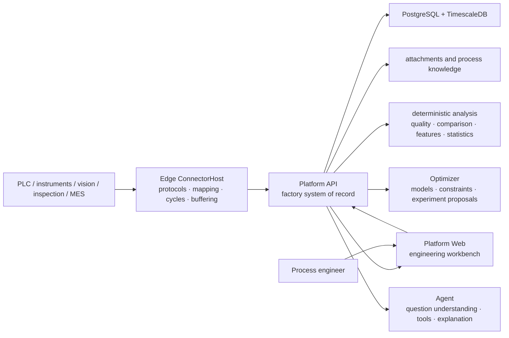

# System design

> Status: **v1 architecture baseline**. This document fixes product principles, business-record boundaries, and stable component responsibilities. Algorithms, default experiment parameters, page layouts, and implementation sequence remain evolvable strategies.

## Design objective

Ingot's core value is fixed by [Brand and product language](brand.en.md): move process R&D from decisions without data support to decisions supported by real data, so computers can genuinely help process engineers choose what to do next using the most effective computational methods for the problem.

The architecture must therefore:

1. **Establish trustworthy facts first**: every analysis traces to a real run, actual conditions, process data, and quality outcomes.
2. **Support engineering judgment next**: show differences, evidence, counterevidence, confounding, and uncertainty rather than only a score.
3. **Make conclusions testable**: observational analysis forms candidates; controlled experiments determine support, rejection, or uncertainty.
4. **Select methods by the problem**: statistics, experimental design, machine learning, Bayesian optimization, physical models, and LLMs are replaceable tools.
5. **Keep engineers in control**: engineers define objectives and safety boundaries, review recommendations, and approve real experiments.

The system is designed for one company on its factory network, shared by process, quality, equipment, and R&D teams.

## Product model

```text
Define process → Connect equipment → Collect production data → Close the data loop → Diagnose → Optimize
```

The first four steps organize field activity into trustworthy run facts. The last two use those facts to support engineering decisions. Diagnosis and optimization are not parallel products: one explains an observed result and the other selects an unexecuted experiment, so both must read the same evidence.

The current Web information architecture exposes seven product domains:

1. **Global overview**: operations, quality, data trust, and next actions;
2. **Cycles**: real runs, production events, and cycle comparison;
3. **Manufacturing context**: changeover, recipes, materials, components, and tooling state;
4. **Inspections**: tasks, results, definitions, quality plans, and review;
5. **Process R&D**: problems, candidate causes, hypotheses, experiments, results, and process windows;
6. **Data and connectivity**: industrial objects, variable models, scenario configuration, edge nodes, and data quality;
7. **Identity and system**: users, role permissions, platform status, and runtime logs.

Menus may change, but these business facts must not be hidden, duplicated into parallel records, or buried inside algorithm state.

## System map



Code-project boundaries are not deployment boundaries. Factory runtime units are Platform API, independent Edge ConnectorHost instances, the database, Optimizer, and Web. A small site may share a physical server, while Edge and Platform retain independent processes, storage, identity, and recovery lifecycles.

## Stable component responsibilities

### Edge

- Actively connect to controls, instruments, gateways, and approved business sources.
- Map vendor addresses, protocol types, and raw units to stable business codes.
- Detect run boundaries and report actual settings, process samples, events, and context provenance.
- Use a durable local queue for outages, platform restarts, and short backpressure.
- Pull versioned acquisition configuration, validate it locally, and report applied state.

Edge does not decide process causes, run product-level optimization, or become the formal record for experiments and quality outcomes.

### Platform

- Store industrial objects, equipment, manufacturing context, runs, cycles, inspections, R&D projects, experiments, evidence, and knowledge.
- Maintain versioned configuration, provenance, units, permissions, audit, and business state machines.
- Assemble the conditions, trajectory, and result of a real run into an immutable analytical observation.
- Execute data-quality, matching, comparison, feature, and reviewable statistical calculations.
- Preserve inputs sent to numerical services and their returned results.

Platform is the formal business system of record. Experiment state or conclusions must not exist only in Optimizer, Agent, or a browser.

### Optimizer

- Receive the complete problem definition, valid observations, pending points, and random seed.
- Execute reproducible numerical modeling, constraint checks, and candidate selection.
- Return predictions, uncertainty, feasibility, parameters, rationale, and model version.
- Remain free of business state, never access equipment directly, and never approve experiments.

### Agent

- Understand the engineer's question and current business context.
- Call authorized read-only or controlled business tools.
- Organize facts, cite sources, explain limits, and suggest next steps.
- Never compute or invent numerical recipes itself and never turn language probability into an engineering conclusion.

### Web

- Organize engineering work around business objects, runs, inspections, and R&D projects.
- Present facts, data quality, evidence, and actionable steps together.
- Avoid browser-local business state that conflicts with Platform.

## Evidence spine

An analyzable run must answer:

```text
who / which equipment / which product
        + actual recipe and controlled conditions
        + process trajectory and stages
        + material, tooling, lot, and other context
        + quality and safety outcomes
        + provenance, time, units, and versions
```

Stable identifiers connect these facts:

- `OperationRunId`: the real run identity in Platform;
- `CorrelationId`: the correlation identity for field events or cycles;
- `RunKey`: the association between an R&D experiment plan and real execution;
- `EquipmentId`, product/process object, and recipe version: minimum run identity;
- content hash: the fixed analytical input and its provenance.

Identifiers may be mapped but never inferred after the fact. Unlinked runs remain visible with a reason rather than disappearing silently.

## Manufacturing context

Equipment, material, tooling, lot, calibration, and maintenance state may be important causes or may only be useful for traceability. The system does not assume their effect in advance.

Every run preserves an immutable context snapshot. Versioned scenario configuration classifies fields as:

- **required for analysis**: absence excludes the run from a specified analysis;
- **record when available**: retain for traceability, stratification, and later coverage assessment;
- **validated for modeling**: repeated data or experiments support use in diagnosis, optimization, or applicability scope.

The system must expose coverage, missingness, sample counts per level, and factor overlap. Data without overlap cannot pretend to separate equipment, mold, or material effects.

## From observation to cause

```text
comparable runs → differences and first deviation → candidate cause
                                                     ↓
                                  counterevidence / confounding / missing data
                                                     ↓
                                  falsifiable experiment → support / reject / inconclusive
```

- Observational analysis may report differences, associations, and candidate causes.
- Every candidate cites source runs, comparison baseline, analysis version, and limitations.
- Only controllable or blockable candidates can automatically become experiment drafts.
- Causal promotion requires appropriate controls, repetition, blocking, randomization, or intervention evidence.
- When identification conditions are absent, “insufficient evidence” is the correct result.

Specific statistics and models are described in [Analysis and optimization methods](optimization.en.md) and are not immutable architecture.

## From candidate to next experiment

The system supports two distinct decisions:

1. **Validate a hypothesis** by selecting conditions that best distinguish candidate causes.
2. **Reach specification** by searching promising settings inside declared objectives and safety boundaries.

Both must:

- use only actually controllable variables;
- declare hard bounds and outcome constraints;
- account for experiments in progress but not yet observed;
- show uncertainty and rationale;
- require engineer approval before execution;
- update evidence from actual run results.

One successful point is only a candidate setting. A process window requires independent confirmation, repeatability, boundary or interaction validation, and an explicit applicability scope.

## Consistency and replay

- The same analytical input produces a stable content hash.
- Data, features, analysis methods, models, and scenario configuration carry versions.
- Experiment results are calculated from source data rather than accepted as trustworthy self-assertions.
- Each experiment has at most one formal result.
- Concurrent requests and retries do not create duplicate business experiments.
- Historical data remain interpretable under their original versions and recomputable under new versions.
- Optimizer or Agent failure does not stop acquisition, run records, or inspections.

## Scenario replacement boundary

A new process scenario provides:

- industrial objects, equipment, and run boundaries;
- controlled variables, actual-value sources, units, and allowed ranges;
- process signals, stages, and versioned features;
- quality objectives, inspection mappings, and safety constraints;
- required and optional context fields;
- a safe baseline, default experiment policy, and optional mechanism knowledge.

It should not rewrite run identity, evidence relationships, experiment state machines, audit principles, or the stateless Optimizer protocol. Generality is supported only after a second, materially different real scenario works without changing those contracts.

## Evolvable strategies

The following record current choices but do not define the product core:

- Web navigation and page layout;
- protocol drivers and equipment templates;
- feature algorithms, statistical tests, and surrogate models;
- default repetitions, blocks, and stopping rules;
- GP variants, acquisition functions, physical priors, and transfer methods;
- LLM providers, model roles, and prompts;
- phase dates and implementation priorities.

These strategies follow real data, engineer feedback, and field validation. Stable-boundary changes are recorded through ADRs.
