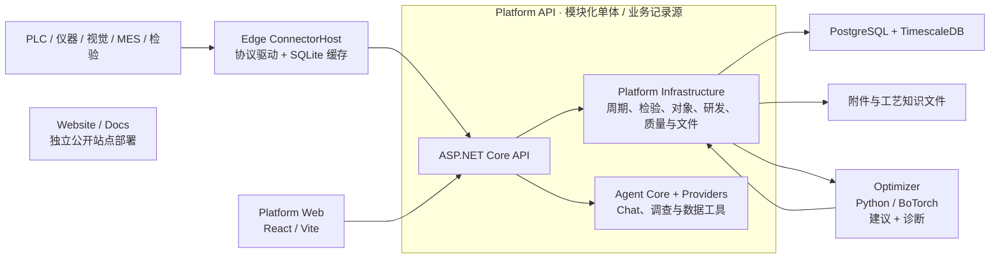

# 系统架构

## 设计目标

系统的唯一核心结果是：**在安全约束内，用尽可能少的真实实验达到目标规格，并把有效工艺窗口沉淀为可复用证据。**

这决定了三个架构选择：

1. 现场采集必须可靠，但不单独成为产品中心；
2. 实验、周期和检验只能有一套正式业务记录；
3. 数值优化使用专门的 Python 科学计算生态，业务事务仍由 .NET 平台负责。

## 产品形态：工艺追因与优化系统

Ingot 是开源工艺追因与优化系统，以工业数据平台为载体，不是另一个 PLC 组态工具、通用数据大屏、MES 或数据仓库。它把现场数据转为有工业上下文的运行事实，用事实解释已经发生的质量偏差，再把解释转为可验证、可执行的下一步实验。

追因和优化不是两个模块，而是同一条证据链的两端：没有可追溯的运行事实，归因只是猜测；没有归因，优化只能在全参数空间盲搜。

当前 Web 界面按五个产品域组织：

1. **运营工作台**：跨运行、质量、数据可信度和研发项目汇总当前最有价值的行动；
2. **调查与优化**：周期诊断产生候选假设，研发项目把假设或规格转成下一组安全实验；
3. **对象与模型**：设备、生产上下文、配方、阶段、检测和分析模型定义原始信号的业务含义；
4. **接入与配置**：现场节点、数据连接、工艺数据模型和质量配置由实施人员维护；
5. **平台管理**：健康、日志、用户、订阅和集成运维。

机理、知识、数据集和模型是优化项目的可复用上下文，不是普通用户的独立日常工作台。具体 PLC、仪器、数据库或文件只是连接器；平台契约始终围绕运行、过程、质量和实验。

## 总体结构



仓库中的项目边界不等于部署边界：`Edge.Application`、`Edge.Infrastructure`、`Platform.Infrastructure` 和 `Agent` 是类库，实际中心部署单元是 `Platform API`，实际现场部署单元是 `Edge ConnectorHost`。Optimizer 单独作为无状态 HTTP 服务部署；Website 和 Docs 通过 `deploy/compose.yml` 与工厂应用栈分开部署。

## 组件职责

### Edge

- 通过协议、API 或文件适配器接入控制系统、仪器、视觉、检验和业务系统数据；
- 为每次运行产生或映射稳定相关标识；
- 本地持久化后再上送，支持断网重连和幂等补传；
- 不训练模型，不决定下一组工艺参数。

### Platform

- 是项目、实验、周期、检验、模型输入和结论的唯一记录源；
- 使用 `RunKey` 接通一次真实运行、其过程记录与检验记录；存在控制周期时，可映射为 `Cycle CorrelationId`；
- 物化版本化过程特征；
- 自动组成不可变优化快照；
- 审核、执行和结束实验；
- 以单事务保存结果、证据关系、实验关联和审计。

Platform API 是模块化单体，内部组合 Platform Infrastructure、Agent Core 和 Agent Providers。Agent 不拥有独立业务数据库，也不绕过 Platform 直接写入现场或业务记录。

### Agent

- 读取 Platform 授权的数据工具和结构化业务上下文；
- 提供聊天、调查、周期比较、数据质量解释和研究辅助；
- 可使用确定性模型作为本地/测试回退，也可配置 OpenAI Provider；
- 不负责最终数值配方决策，数值建议仍由 Optimizer 计算并由工程师审核。

### Optimizer

- 每次请求接收完整 campaign 和观察快照；
- 请求内重建模型，不保存业务状态；
- 冷启动时生成安全探索点；
- 数据足够后训练两阶段 GP；
- 通过 `/v1/suggestions` 生成规格逼近或假设验证建议，通过 `/v1/diagnosis` 生成诊断候选；
- 返回参数、目标预测、约束预测、置信区间、可行概率和采集值。

### Web

Web 是独立的 React/Vite 静态前端，通过 Platform API 访问业务数据。界面围绕工业对象、研发项目、目标、实验、观察可用性、建议、执行和结果组织，不再建立平行的“优化任务”或“优化观察”模块。

### Website / Docs

Website 和 Docs 是面向公众的 Next.js 静态站点，不参与工厂运行时闭环，也不承载 Platform 的业务状态。

## 追因与优化闭环

追因不是另一个数据看板，而是生成下一次可证伪实验的入口。闭环只有一条：

```text
周期/批次比较 → 候选关联 → 待验证假设 → 下一次实验 → 源数据计算结果
                                              ↓
                      已验证工艺窗口 ← 假设支持 / 否决 / 不确定
```

- 周期诊断以实际配方参数和阶段过程特征为同一候选空间。第一层保留合格/不合格组间中位数、MAD 稳健效应和有效样本权重；样本足够后，第二层按样本规模自动选择 Elastic Net、正则化加性模型或连续结果 GP，并报告样本外交叉验证、bootstrap 稳定入选率和变量交互；
- 多变量模型把产品、材料、设备、模具、批次等离散上下文作为固定效应，把运行时间作为趋势项校正。它只能校正已经记录且具有重叠样本的混杂因素，不能把观察性条件效应宣称为因果；
- 只有候选的数据来源与项目可控变量的 `recipe:` 或 `signal:` 映射一致时，系统才自动生成可实验验证的假设，禁止生成没有可控变量的空假设；
- 系统将与可控变量匹配的候选自动绑定到项目最高权重目标，并从目标方向、基线和规格计算可编辑的最小有效效应；优化器随后进入 `validate-hypothesis` 意图，在安全候选中优先选择对目标结果不确定且与已有观察有足够区分度的变量组合；
- `reach-specification` 意图仍使用 qLogNEI/qLogNEHVI，在安全约束下逼近规格；
- 默认产品工作台把两个不同候选条件各安排两次，并分到两个执行区组且轮换顺序；这样能够区分条件差异与单次运行噪声，调用方也可在 API 中显式调整重复次数；
- 单点或单区组结果最多把假设标为“干预支持”；只有至少两个干预条件在两个区组中重复、置信区间越过最小有效效应且安全约束通过，系统才自动升级为“已验证原因”；
- 实验结果必须来自源数据快照。假设检验使用“实验组均值减独立历史对照均值”的 Welch 效果量区间，而不是实测均值区间；缺少至少两条独立对照或实验重复时不伪造区间，只能保持“不确定”；
- 批准后的实验生成设备无关的有序执行指令。PLC、MES、配方系统或人工操作站只需执行参数并沿用 `RunKey`；全部运行的实际配方、过程和检验齐全后，后台自动固化结果并关闭实验；
- 优化批次只能从同一候选条件的重复运行形成候选设置点，不能把多个分散成功点的最小值和最大值拼成未经验证的超矩形窗口；
- 候选设置必须另建独立验证实验，至少完成三个重复运行并覆盖两个执行区组，全部实际参数、质量目标和安全约束通过后，才允许由另一名工程师复核为实验室验证；连续工艺窗口还必须增加边界和交互作用实验，单点重复不能证明整段范围；
- 研发资产仍被保留为项目背后的可复用机理、知识和数据质量记录，但不作为独立的日常工作台模块。

默认场景配置为 `generic`。光学镜片模压灰盒画像使用 `optical-lens-molding-v1`。PLC 型号只属于采集适配器，不能进入工艺物理画像或改变上述业务契约。

## 核心数据契约

一次有效观察最少包含：

```json
{
  "runKey": "bo-7d2f6a3e1c2d-01",
  "context": {
    "machine_id": "PRESS-01",
    "mold_id": "MOLD-A",
    "material_lot": "GLASS-LOT-07"
  },
  "actualFactors": { "holding-temperature": 512.0 },
  "processFeatures": {
    "mold-temperature.hold.mean": 510.8,
    "mold-temperature.cycle.overshoot": 2.4
  },
  "outcomes": { "form-error": 0.38 },
  "constraintOutcomes": { "crack-rate": 0.01 },
  "sourceContentHash": "sha256..."
}
```

显式配置 `recipe:` 或 `signal:` 数据源后，如果实际值缺失，观察会被排除。只有没有声明数据映射的历史项目允许使用计划值兼容。

## 一致性与幂等

- 同一输入快照生成相同哈希和确定性实验 ID；
- 尚未完成的优化实验存在时，重复请求返回原实验；
- 数据库保证每个实验最多只有一个正式结果，多实例并发不能生成重复结论；
- 正在执行的参数作为 pending points 传给优化器；
- 并发创建同一实验时，后请求返回先请求的结果；
- 优化服务不可用时 Platform 和 Edge 仍可启动与采集。

## 场景替换边界

将系统从一个工艺场景换到另一个工艺场景，需要提供：

- 可控变量及上下界；
- 质量目标、方向、权重和单位；
- 参数硬约束与结果安全约束；
- 实际值、轨迹和检验的数据映射；
- 周期/阶段特征定义；
- 安全基线；
- 可选物理特征或先验均值。

不需要重写实验状态机、数据脊柱或优化服务协议。

## 尚未完成的高级能力

- 随机效应估计、时间序列自相关和缺失非随机机制；当前上下文校正采用固定效应与时间趋势；
- 经真实数据标定的场景物理先验；
- 跨产品、材料、工装和设备的多任务迁移；
- 在线不确定性校准和漂移检测；
- 以重复性证据驱动的自动停止规则；
- 真实 PostgreSQL/TimescaleDB、Docker 与现场数据源的端到端公开基准。

这些是可验证的后续工程，而不是当前已经完成的能力。
