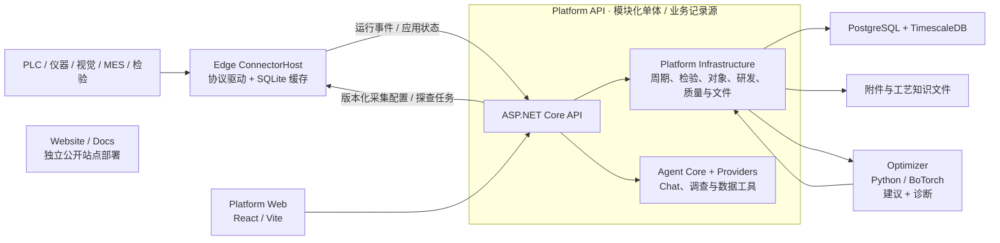

# 系统架构

## 设计目标

系统的唯一核心结果是：**在安全约束内，用尽可能少的真实实验达到目标规格，并把有效工艺窗口沉淀为可复用证据。**

这决定了三个架构选择：

1. 现场采集必须可靠，但不单独成为产品中心；
2. 实验、周期和检验只能有一套正式业务记录；
3. 数值优化使用专门的 Python 科学计算生态，业务事务仍由 .NET 平台负责。

系统按单公司厂内网络本地部署设计，由同一企业内的工艺、质量、设备和研发团队共同使用。Edge 按 OT 网络与故障域部署，Platform 作为厂内业务记录源。

## 产品形态：工艺追因与优化系统

Ingot 是以工业数据平台为载体的开源工艺追因与优化系统。它把现场数据转为有工业上下文的运行事实，用事实解释已经发生的质量偏差，再把解释转为可验证、可执行的下一步实验。

追因和优化不是两个模块，而是同一条证据链的两端：没有可追溯的运行事实，归因只是猜测；没有归因，优化只能在全参数空间盲搜。

当前 Web 界面按五个产品域组织：

1. **运行与质量**：汇总当前运行、质量任务、生产事件和上下文，让一线角色先处理正在发生的事情；
2. **追因与优化**：从质量追因和周期对比形成候选原因，再由优化项目把证据转成下一组安全实验；
3. **对象与数据**：围绕工业对象维护配方、工艺数据模型、分析模型和数据健康，建立一致的业务语义；
4. **工程配置**：由实施人员维护现场节点、数据连接、检测与质量定义、组件和工装配置；
5. **平台运维**：健康、日志、集成状态、备份和服务配置。

产品域只划分任务入口，不切断证据链；用户选中的对象、项目或周期应成为跨页面持续上下文。机理、知识、数据集和模型是优化项目的可复用上下文，不是普通用户的独立日常工作台。具体 PLC、仪器、数据库或文件只是连接器；平台契约始终围绕运行、过程、质量和实验。

## 总体结构



仓库中的项目边界不等于部署边界：`Edge.Application`、`Edge.Infrastructure`、`Platform.Infrastructure` 和 `Agent` 是类库，实际中心部署单元是 `Platform API`，实际现场部署单元是独立 `Edge ConnectorHost` 实例。小型现场可以把 ConnectorHost 与 Platform 放在同一台物理服务器，二者继续使用独立进程、容器、数据卷、`EdgeId` 和启停生命周期。Optimizer 单独作为无状态 HTTP 服务部署；Website 和 Docs 通过 `deploy/compose.yml` 与工厂应用栈分开部署。

## 组件职责

### Edge

- 通过协议、API 或文件适配器接入控制系统、仪器、视觉、检验和业务系统数据；
- 为多台设备独立执行 Platform 发布的版本化采集配置，单个任务故障保持其他任务连续；
- 为每次运行产生或映射稳定相关标识；
- 本地持久化后再上送，支持断网重连和幂等补传；
- 不训练模型，不决定下一组工艺参数。

### Platform

- 是项目、实验、周期、检验、模型输入和结论的唯一记录源；
- 统一管理和发布工艺数据模型、设备连接映射及采集配置版本；
- 使用 `RunKey` 接通一次真实运行、其过程记录与检验记录；存在控制周期时，可映射为 `Cycle CorrelationId`；
- 物化版本化过程特征；
- 自动组成不可变优化快照；
- 审核、执行和结束实验；
- 以单事务保存结果、证据关系、实验关联和审计。

Platform API 是模块化单体，内部组合 Platform Infrastructure、Agent Core 和 Agent Providers。Agent 不拥有独立业务数据库，也不绕过 Platform 直接写入现场或业务记录。

### 采集配置控制流

目标控制流由 Edge 主动发起网络连接：ConnectorHost 使用本地 `EdgeId`、Platform 地址、通信令牌、证书和设备凭据引用完成启动；随后拉取目标采集配置与探查任务，在本地完成设备访问和映射验证。配置通过草稿、目标 Edge 探查、发布、本地验证、周期边界应用和状态确认推进。Edge 持续回报期望版本、实际应用版本、配置哈希、应用时间、任务状态与错误，并保存最后成功版本用于 Platform 中断期间持续采集。新版本健康运行后替换旧版本，应用失败时保留旧版本。

### Agent

- 通过 Platform 提供的只读数据工具获取结构化业务上下文；
- 提供聊天、调查、周期比较、数据质量解释和研究辅助；
- 可使用确定性模型作为本地/测试回退，也可配置 OpenAI Provider；
- 不负责最终数值配方决策，数值建议仍由 Optimizer 计算并由工程师审核。

### Optimizer

- 每次请求接收完整 campaign 和观察快照；
- 请求内重建模型，不保存业务状态；
- 冷启动时生成安全探索点；
- 数据足够后训练两阶段 GP；
- 通过 `/v1/suggestions` 生成规格逼近或假设验证建议，通过 `/v1/diagnosis` 生成诊断候选；
- 返回参数、目标预测、约束预测、置信区间、可行概率和采集值。

### Web

Web 是独立的 React/Vite 静态前端，通过 Platform API 访问业务数据。界面围绕工业对象、研发项目、目标、实验、观察可用性、建议、执行和结果组织，不再建立平行的“优化任务”或“优化观察”模块。

### Website / Docs

Website 和 Docs 是面向公众的 Next.js 静态站点，不参与工厂运行时闭环，也不承载 Platform 的业务状态。

## 工艺追因与优化闭环

面向用户的完整路径分为六步：

```text
工艺定义 → 设备接入 → 生产采集 → 数据闭环 → 工艺追因 → 工艺优化
```

前四步负责把现场事实整理为可信证据，后两步负责从证据形成可验证结论并返回生产。下面的流程描述追因进入实验验证后的内部闭环。

追因不是另一个数据看板，而是生成下一次可证伪实验的入口。闭环只有一条：

```text
周期/批次比较 → 候选关联 → 待验证假设 → 下一次实验 → 源数据计算结果
                                              ↓
                      已验证工艺窗口 ← 假设支持 / 否决 / 不确定
```

- 周期诊断以实际配方参数和阶段过程特征为同一候选空间。第一层保留合格/不合格组间中位数、MAD 稳健效应和有效样本权重；样本足够后，第二层按样本规模自动选择 Elastic Net、正则化加性模型或连续结果 GP，并报告样本外交叉验证、bootstrap 稳定入选率和变量交互；
- 产品、设备、工装和材料批次首先作为追溯字段与候选区组因素。系统检查缺失率、样本覆盖和因素重叠，再按数据条件使用匹配比较、方差分量、混合效应模型或时间趋势估计其贡献；观察性结果标记为稳定关联、混杂关联或证据不足，受控区组实验负责验证因果假设；
- 只有候选的数据来源与项目可控变量的 `recipe:` 或 `signal:` 映射一致时，系统才自动生成可实验验证的假设，禁止生成没有可控变量的空假设；
- 系统将与可控变量匹配的候选自动绑定到项目最高权重目标，并从目标方向、基线和规格计算可编辑的最小有效效应；优化器随后进入 `validate-hypothesis` 意图，在安全候选中优先选择对目标结果不确定且与已有观察有足够区分度的变量组合；
- `reach-specification` 意图仍使用 qLogNEI/qLogNEHVI，在安全约束下逼近规格；
- 默认产品工作台把两个不同候选条件各安排两次，并分到两个执行区组且轮换顺序；这样能够区分条件差异与单次运行噪声，调用方也可在 API 中显式调整重复次数；
- 单点或单区组结果最多把假设标为“干预支持”；只有至少两个干预条件在两个区组中重复、置信区间越过最小有效效应且安全约束通过，系统才自动升级为“已验证原因”；
- 实验结果必须来自源数据快照。假设检验只使用实验计划通过 `BaselineRunKeys` 明确声明的同条件重复运行（可来自本实验对照组、历史观察或已完成实验）计算“实验组均值减对照组均值”的 Welch 效果量区间，绝不自动混合项目历史全集；缺少至少两条独立对照或实验重复时不伪造区间，只能保持“不确定”；
- 批准后的实验生成设备无关的有序执行指令。PLC、MES、配方系统或人工操作站只需执行参数并沿用 `RunKey`；全部运行的实际配方、过程和检验齐全后，后台自动固化结果并关闭实验；
- 优化批次只能从同一候选条件的重复运行形成候选设置点，不能把多个分散成功点的最小值和最大值拼成未经验证的超矩形窗口；
- 候选设置必须另建独立验证实验，至少完成三个重复运行并覆盖两个执行区组，全部实际参数、质量目标和安全约束通过后，才允许由另一名工程师复核为实验室验证；连续工艺窗口还必须增加边界和交互作用实验，单点重复不能证明整段范围；
- 研发资产仍被保留为项目背后的可复用机理、知识和数据质量记录，但不作为独立的日常工作台模块。

优化器默认只使用项目声明的控制变量。可选派生特征由研发项目中的版本化
`OptimizationFeatures` 配置声明，只允许固定数值运算符、已定义控制变量和此前的派生特征；
优化内核不得根据行业、设备型号或变量名称自动启用隐藏画像。光学镜片模压配置仅保存在
`tools/optical-molding-demo/optimizer-feature-set.json` 演示资产中。PLC 型号只属于采集适配器，
不能进入工艺物理特征或改变上述业务契约。

## 核心数据契约

一次有效观察最少包含：

```json
{
  "runKey": "bo-7d2f6a3e1c2d-01",
  "context": {
    "machine_id": "PRESS-01",
    "product_code": "LENS-01",
    "recipe_version": "12",
    "tooling_id": "MOLD-A",
    "assembly_revision": "3",
    "material_lot_ref": "GLASS-LOT-07",
    "context_capture_status": "resolved"
  },
  "actualFactors": { "holding-temperature": 512.0 },
  "processFeatures": {
    "mold-temperature.hold.mean": 510.8,
    "mold-temperature.cycle.overshoot": 2.4
  },
  "outcomes": { "form-error": 0.38 },
  "constraintOutcomes": { "crack-rate": 0.01 },
  "sourceContentHash": "sha256..."
}
```

`OperationRunId`、`EquipmentId`、产品或工艺对象、配方版本和运行时间构成最小运行身份。工装、材料、累计使用次数、校准与维护状态由场景配置声明为分析必需或有则记录，并固化为不可变运行上下文快照。实际设置、过程轨迹和质量结果分别保留来源与版本。上下文字段经过重复数据或区组实验验证后，才升级为诊断模型特征、优化特征或工艺适用范围。

显式配置 `recipe:` 或 `signal:` 数据源后，如果实际值缺失，观察会被排除。只有没有声明数据映射的历史项目允许使用计划值兼容。

## 一致性与幂等

- 同一输入快照生成相同哈希和确定性实验 ID；
- 尚未完成的优化实验存在时，重复请求返回原实验；
- 数据库保证每个实验最多只有一个正式结果，多实例并发不能生成重复结论；
- 正在执行的参数作为 pending points 传给优化器；
- 并发创建同一实验时，后请求返回先请求的结果；
- 优化服务不可用时 Platform 和 Edge 仍可启动与采集。

## 场景替换边界

将系统从一个工艺场景换到另一个工艺场景，需要提供：

- 可控变量及上下界；
- 质量目标、方向、权重和单位；
- 参数硬约束与结果安全约束；
- 实际值、轨迹和检验的数据映射；
- 周期/阶段特征定义；
- 安全基线；
- 可选物理特征或先验均值。

不需要重写实验状态机、数据脊柱或优化服务协议。

## 后续设计工作

- 上下文影响评估：方差分量、混合效应、时间序列自相关和缺失机制；
- 经真实数据标定的场景物理先验；
- 跨产品、材料、工装和设备的多任务迁移；
- 在线不确定性校准和漂移检测；
- 以重复性证据驱动的自动停止规则；
- 真实 PostgreSQL/TimescaleDB、Docker 与现场数据源的端到端公开基准。

这些能力按项目规划的现场证据和阶段闸门依次实现与验证。
