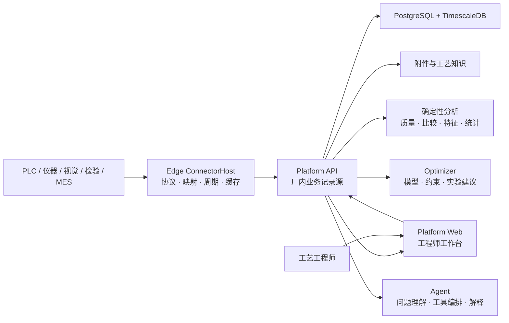

# 系统设计

> 文档状态：**v1 架构基线**。本文件固定产品原则、业务记录边界和稳定组件职责；具体算法、默认实验参数、页面布局和实施顺序属于可演进策略。

## 设计目标

Ingot 的核心价值由[品牌与产品表述](brand.md)固定：让工艺研发从没有数据支撑走向有数据支撑，让计算机基于真实数据帮助工艺工程师抉择，并采用适合问题的有效计算方法分析数据。

架构因此必须做到：

1. **先形成可信事实**：每项分析都能回到真实运行、实际条件、过程数据和质量结果。
2. **再帮助工程判断**：系统展示差异、证据、反证、混杂和不确定性，不只给一个分数。
3. **让结论可以验证**：观察分析形成候选，受控实验决定支持、否决或仍不确定。
4. **按问题选择方法**：统计、实验设计、机器学习、贝叶斯优化、机理模型和 LLM 都是可替换工具。
5. **工程师保持控制**：工程师定义目标与安全边界，审核建议并批准真实实验。

系统按单公司、厂内网络、本地部署设计，由同一企业的工艺、质量、设备和研发团队共同使用。

## 产品模型

```text
工艺定义 → 设备接入 → 生产采集 → 数据闭环 → 工艺追因 → 工艺优化
```

前四步把现场活动整理为可信运行事实；后两步使用这些事实帮助工程师形成和验证决策。追因与优化不是平行产品：一个解释已经发生的结果，一个选择尚未执行的实验，它们必须读取同一份证据。

当前 Web 信息架构按核心决策链组织为五个业务域：

1. **总览**：运行、质量、数据可信度和下一步行动；
2. **运行证据**：工业对象、真实运行、质量任务、运行事件、运行准备与工装装卸；
3. **工艺追因**：数据可信度、运行对比、质量偏差分析、分析助手和评测问题集；
4. **工艺优化**：优化项目及其可复用研发资产；
5. **配置**：工艺、配方、分析、质量、工装、现场节点和设备接入定义。

系统管理通过独立入口承载用户、岗位权限、平台状态和运行日志，不与业务决策链竞争一级导航。各业务域的二级导航按任务分组；所有现有 URL 与数据契约保持稳定，导航只改变工程师发现功能的路径。

菜单可以调整，但这些业务事实不能被隐藏、复制成平行记录或混入算法内部状态。

## 系统结构



代码项目边界不等于部署边界。实际工厂运行单元是 Platform API、独立 Edge ConnectorHost、数据库、Optimizer 和 Web。小型现场可以共用物理服务器，但 Edge 与 Platform 仍保持独立进程、存储、身份和恢复生命周期。

## 稳定组件职责

### Edge

- 主动连接现场控制系统、仪器、网关和允许的业务数据源；
- 把厂商地址、协议数据类型和原始单位映射为稳定业务编码；
- 识别运行边界并上报实际参数、过程样本、事件和上下文来源；
- 使用本地持久化队列承受断网、平台重启和短时背压；
- 拉取版本化采集配置，在本地验证并回报实际应用状态。

Edge 不判断工艺原因，不运行产品级优化，也不成为实验和质量结果的正式记录源。

### Platform

- 保存工业对象、设备、生产上下文、运行、周期、检验、研发项目、实验、证据和知识；
- 维护版本化配置、来源、单位、权限、审计和业务状态机；
- 将一次真实运行的条件、轨迹和结果装配为不可变分析观察；
- 执行数据质量、匹配、比较、特征和可复核统计计算；
- 保存发送给数值服务的输入快照和返回结果。

Platform 是正式业务记录源，不能把实验状态或结论只保存在 Optimizer、Agent 或浏览器中。

### Optimizer

- 接收完整问题定义、有效观察、待执行点和随机种子；
- 执行可重复的数值建模、约束判断和候选选择；
- 返回预测、不确定性、可行概率、推荐参数、理由和模型版本；
- 保持无业务状态，不直接访问设备，也不批准实验。

### Agent

- 理解工程师的问题和当前业务上下文；
- 调用授权的只读或受控业务工具；
- 组织事实、引用来源、说明限制和建议下一步；
- 不自行计算或生成数值配方，不把语言概率写成工程结论。

### Web

- 以业务对象、运行、检验和研发项目组织工程工作；
- 在页面上同时呈现事实、数据质量、证据和可执行动作；
- 不建立与 Platform 不一致的本地业务状态。

## 证据主干

一次可分析运行至少需要回答：

```text
谁 / 什么设备 / 什么产品
        + 实际配方与可控条件
        + 过程轨迹与阶段
        + 材料、工装、批次等上下文
        + 质量和安全结果
        + 来源、时间、单位与版本
```

稳定标识负责把这些事实接在一起：

- `OperationRunId`：平台中的真实运行身份；
- `CorrelationId`：现场事件或周期的关联身份；
- `RunKey`：研发实验计划与真实执行之间的关联键；
- `EquipmentId`、产品/工艺对象和配方版本：最小运行身份；
- 内容哈希：固定分析输入及其来源。

标识可以映射，但不能靠事后猜测关联。无法关联的运行保留并显示原因，不被静默丢弃。

## 生产上下文

设备、材料、工装、批次、校准和维护状态既可能是重要原因，也可能只是追溯信息。系统不预先假定它们一定影响质量。

每次运行保存不可变上下文快照，并由版本化场景配置将字段声明为：

- **分析必需**：缺失时该运行不能进入指定分析；
- **有则记录**：用于追溯、分层和后续覆盖评估；
- **已验证建模**：经过重复数据或实验支持，可进入诊断、优化或适用范围。

系统必须显示覆盖率、缺失率、各水平样本数和因素重叠。没有重叠的数据不能假装能够分离设备、模具或材料效应。

## 从观察到原因

```text
可比运行 → 差异与首次偏离 → 候选原因
                                  ↓
                    反证 / 混杂 / 数据不足
                                  ↓
                    可证伪实验 → 支持 / 否决 / 不确定
```

- 观察分析可以报告差异、关联和候选原因。
- 候选必须引用原始运行、比较基线、分析版本和限制。
- 只有可控或可区组的候选才能自动转成实验草案。
- 因果升级需要合适的对照、重复、区组、随机化或干预证据。
- 缺少识别条件时，正确结果是“证据不足”，而不是强行排序出一个根因。

具体统计或模型由[分析与优化方法](optimization.md)说明，不属于不可变架构。

## 从候选到下一步实验

系统支持两类不同决策：

1. **验证假设**：选择能够最大程度区分原因候选的实验条件；
2. **达到规格**：在已声明的目标和安全边界内搜索更有希望的设置。

两者都必须：

- 只使用实际可控变量；
- 明确硬边界和结果约束；
- 考虑正在执行但尚未得到结果的实验；
- 显示不确定性和推荐理由；
- 由工程师批准后执行；
- 使用实际运行结果更新证据。

一个成功参数点只能成为候选设置。工艺窗口需要独立确认、重复性、边界或交互验证以及明确适用范围。

## 一致性与可重放

- 同一分析输入生成稳定内容哈希；
- 数据、特征、分析方法、模型和场景配置都带版本；
- 实验结果从源数据计算，不接受调用方自我声明为可信；
- 同一实验最多有一个正式结果；
- 并发请求和重试不会生成重复业务实验；
- 历史数据在算法升级后仍能按旧版本解释或按新版本重算；
- Optimizer 或 Agent 故障不阻止采集、运行和检验记录。

## 场景替换边界

更换工艺场景时需要提供：

- 工业对象、设备和运行边界；
- 可控变量、实际值来源、单位与允许范围；
- 过程信号、阶段和版本化特征；
- 质量目标、检验映射和安全约束；
- 必需与可选上下文字段；
- 安全基线、默认实验策略和可选机理知识。

不应重写运行身份、证据关系、实验状态机、审计原则或 Optimizer 的无状态协议。只有在第二个明显不同的真实场景中不修改这些核心契约，通用性才得到支持。

## 可演进策略

以下内容记录当前选择，但不定义产品核心：

- Web 菜单与页面布局；
- 具体协议驱动和设备模板；
- 特征算法、统计检验和代理模型；
- 默认重复次数、区组数和停止规则；
- GP、采集函数、机理先验和迁移方式；
- LLM Provider、模型角色和提示词；
- 实施顺序与优先级。

这些策略由真实数据、工程师反馈和现场验证更新；稳定边界变化通过 ADR 记录。
