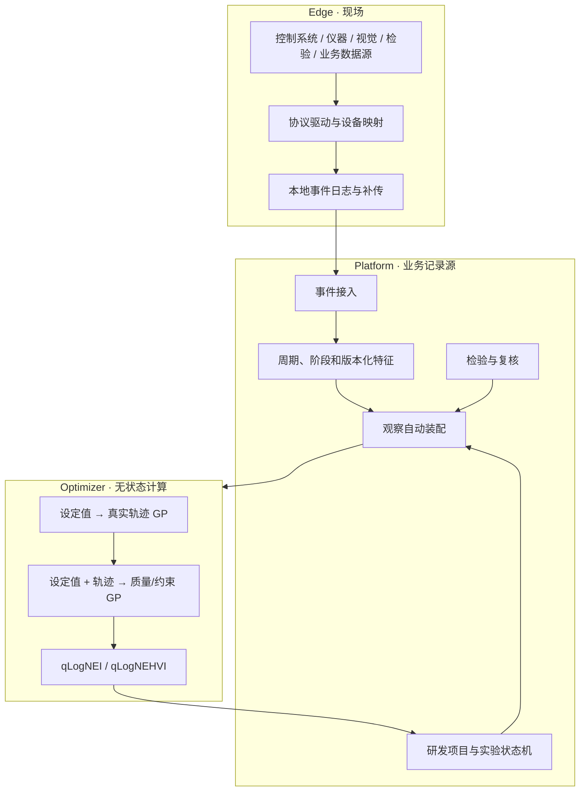

# 系统架构

## 设计目标

系统的唯一核心结果是：**在安全约束内，用尽可能少的真实实验达到目标规格，并把有效工艺窗口沉淀为可复用证据。**

这决定了三个架构选择：

1. 现场采集必须可靠，但不单独成为产品中心；
2. 实验、周期和检验只能有一套正式业务记录；
3. 数值优化使用专门的 Python 科学计算生态，业务事务仍由 .NET 平台负责。

## 产品形态：工业数据与工艺决策平台

Ingot 是工业数据与工艺决策平台，不是另一个 PLC 组态工具、通用数据大屏、MES 或数据仓库。它把现场数据转为有工业上下文的运行事实，再将事实转为可解释、可验证、可执行的工艺决策。

产品界面只有五个产品域：

1. **决策工作台**：跨运行、质量、数据可信度和优化项目汇总当前最有价值的行动；
2. **洞察与优化**：根因分析产生候选假设，优化项目把假设或规格转成下一组安全实验；
3. **工业上下文**：设备、工件、配方、阶段、检测和分析语义定义原始信号的业务含义；
4. **连接与实施**：现场节点、数据连接和生产上下文由实施人员配置，支撑而不干扰日常决策；
5. **系统**：健康、日志和集成运维。

机理、知识、数据集和模型是优化项目的可复用上下文，不是普通用户的独立日常工作台。具体 PLC、仪器、数据库或文件只是连接器；平台契约始终围绕运行、过程、质量和实验。

## 总体结构



## 组件职责

### Edge

- 通过协议、API 或文件适配器接入控制系统、仪器、视觉、检验和业务系统数据；
- 为每次运行产生或映射稳定相关标识；
- 本地持久化后再上送，支持断网重连和幂等补传；
- 不训练模型，不决定下一组工艺参数。

### Platform

- 是项目、实验、周期、检验、模型输入和结论的唯一记录源；
- 使用 `RunKey` 接通一次真实运行、其过程记录与检验记录；存在控制周期时，可映射为 `Cycle CorrelationId`；
- 物化版本化过程特征；
- 自动组成不可变优化快照；
- 审核、执行和结束实验；
- 以单事务保存结果、证据关系、实验关联和审计。

### Optimizer

- 每次请求接收完整 campaign 和观察快照；
- 请求内重建模型，不保存业务状态；
- 冷启动时生成安全探索点；
- 数据足够后训练两阶段 GP；
- 返回参数、目标预测、约束预测、置信区间、可行概率和采集值。

### Web

Web 界面围绕一个研发项目组织目标、实验、观察可用性、建议、执行和结果。系统不会再建立平行的“优化任务”或“优化观察”模块。

## 追因与优化闭环

追因不是另一个数据看板，而是生成下一次可证伪实验的入口。闭环只有一条：

```text
周期/批次比较 → 候选关联 → 待验证假设 → 下一次实验 → 源数据计算结果
                                              ↓
                      已验证工艺窗口 ← 假设支持 / 否决 / 不确定
```

- 周期比较只产生**候选假设**：它保留特征、效应量、混杂因素和比较快照，并明确不把关联宣称为因果；
- 工程师为候选假设定义结果指标、预期方向和最小有效效应后，优化器进入 `validate-hypothesis` 意图；它在安全候选中优先选择对目标结果不确定且与已有观察有足够区分度的变量组合；
- `reach-specification` 意图仍使用 qLogNEI/qLogNEHVI，在安全约束下逼近规格；
- 默认产品工作台把两个不同候选条件各安排两次，并分到两个执行区组且轮换顺序；这样能够区分条件差异与单次运行噪声，调用方也可在 API 中显式调整重复次数；
- 实验结果必须来自源数据快照。其置信区间跨过预设阈值时自动将假设记为“不确定”；完整超过或反向超过阈值时自动记为“支持”或“否决”，并写入可追溯证据；
- 批准后的实验生成设备无关的有序执行指令。PLC、MES、配方系统或人工操作站只需执行参数并沿用 `RunKey`；全部运行的实际配方、过程和检验齐全后，后台自动固化结果并关闭实验；
- 工艺窗口按“候选证据、回放复核、实验室重复验证、生产发布”区分验证等级。人员复核不能把没有跨区组重复证据的回放窗口标成生产窗口；
- 研发资产仍被保留为项目背后的可复用机理、知识和数据质量记录，但不作为独立的日常工作台模块。

默认场景配置为 `generic`。光学镜片模压灰盒画像使用 `optical-lens-molding-v1`。PLC 型号只属于采集适配器，不能进入工艺物理画像或改变上述业务契约。

## 核心数据契约

一次有效观察最少包含：

```json
{
  "runKey": "bo-7d2f6a3e1c2d-01",
  "actualFactors": { "holding-temperature": 512.0 },
  "processFeatures": {
    "mold-temperature.hold.mean": 510.8,
    "mold-temperature.cycle.overshoot": 2.4
  },
  "outcomes": { "form-error": 0.38 },
  "constraintOutcomes": { "crack-rate": 0.01 },
  "sourceContentHash": "sha256..."
}
```

显式配置 `recipe:` 或 `signal:` 数据源后，如果实际值缺失，观察会被排除。只有没有声明数据映射的历史项目允许使用计划值兼容。

## 一致性与幂等

- 同一输入快照生成相同哈希和确定性实验 ID；
- 尚未完成的优化实验存在时，重复请求返回原实验；
- 正在执行的参数作为 pending points 传给优化器；
- 并发创建同一实验时，后请求返回先请求的结果；
- 优化服务不可用时 Platform 和 Edge 仍可启动与采集。

## 场景替换边界

将系统从一个工艺场景换到另一个工艺场景，需要提供：

- 可控变量及上下界；
- 质量目标、方向、权重和单位；
- 参数硬约束与结果安全约束；
- 实际值、轨迹和检验的数据映射；
- 周期/阶段特征定义；
- 安全基线；
- 可选物理特征或先验均值。

不需要重写实验状态机、数据脊柱或优化服务协议。

## 尚未完成的高级能力

- 经真实数据标定的场景物理先验；
- 跨产品、材料、工装和设备的多任务迁移；
- 在线不确定性校准和漂移检测；
- 以重复性证据驱动的自动停止规则；
- 真实 PostgreSQL/TimescaleDB、Docker 与现场数据源的端到端公开基准。

这些是可验证的后续工程，而不是当前已经完成的能力。
