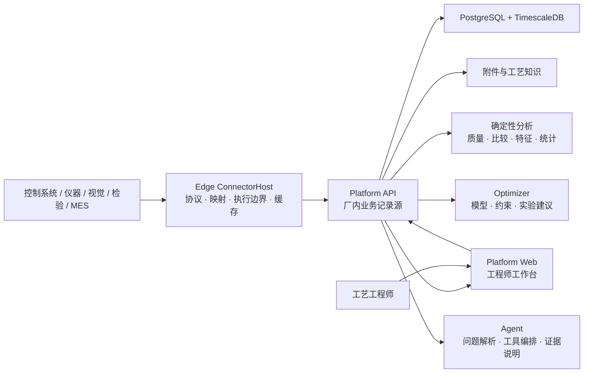

# 系统设计

> 文档状态：**v1 架构基线**。本文件固定产品原则、业务记录边界和稳定组件职责；具体算法、默认实验参数、页面布局和实施顺序属于可演进策略。

## 设计目标

Ingot 的核心价值由[品牌规范](brand.md)固定：让工艺研发从没有数据支撑走向有数据支撑，让计算机基于真实数据帮助工艺工程师抉择，并采用适合问题的有效计算方法分析数据。

架构因此必须做到：

1. **先形成可信事实**：每项分析都能回到真实运行、实际条件、过程数据和质量结果。
2. **再帮助工程判断**：系统展示差异、证据、反证、混杂和不确定性，不只给一个分数。
3. **让结论可以验证**：观察分析形成候选，受控实验决定支持、否决或仍不确定。
4. **按问题选择方法**：统计、实验设计、机器学习、贝叶斯优化、机理模型和 LLM 都是可替换工具。
5. **工程师保持控制**：工程师定义目标与安全边界，审核建议并批准真实实验。

系统按单公司、厂内网络、本地部署设计，由同一企业的工艺、质量、设备和研发团队共同使用。

## 产品模型

```text
现场接入 → 工艺配置 → 生产采集 → 数据闭环 → 工艺追因 → 工艺研发
```

前四步把现场活动整理为可信运行事实；后两步使用这些事实帮助工程师形成和验证决策。工艺追因与工艺研发不是平行产品：追因解释已经发生的结果，研发通过可证伪实验验证候选并选择下一步实验；安全优化是工艺研发中的一种方法，不是独立业务入口。两者必须读取同一份证据。

当前 Web 信息架构同时考虑决策链和岗位高频任务，组织为七个业务入口：

1. **工作台**：按优先级汇总质量待办、运行状态、现场状态和研发进展；
2. **现场接入**：现场节点、通信驱动及多来源字段与工艺变量映射；
3. **工艺配置**：配置总览、工艺数据字典、工艺规范、分析规则、质量、工装及配置发布；
4. **生产运行**：生产准备、工装装卸、运行记录、对象目录与运行事件；
5. **质量管理**：检测录入、独立复核、质量记录和质量偏差分析；质量岗位可直接进入日常任务；
6. **工艺追因**：追因工作台、数据可信度、运行对比和分析助手；AI 是分析手段，不单独成为业务域；
7. **工艺研发**：研发项目、实验验证及其研发成果。

一级业务入口在工作台之后按“现场接入 → 工艺配置 → 生产运行 → 质量管理 → 工艺追因 → 工艺研发”排列。现场接入登记真实来源和通信方式，工艺配置通过配置总览盘点依赖，再建立稳定语义、规则与发布版本；随后才进入生产、质量、追因和研发。这是产品导航对完整闭环的概括，不是与上方六个阶段逐项对应：生产运行同时承载生产准备、采集与追溯，质量管理承载检验及质量偏差工作，完整的数据闭环还需要数据可信度和运行上下文等跨入口证据。

系统管理通过独立入口承载用户、岗位权限、平台状态、运行日志和助手评测，不与业务任务竞争一级导航。各业务域的二级导航优先显示日常高频任务，再显示准备或维护动作；首次生产发布前只保留当前规范 URL，不为开发期页面名称保留重定向别名。生产发布后的 URL 和数据契约按版本迁移纪律保持稳定。

菜单可以调整，但这些业务事实不能被隐藏、复制成平行记录或混入算法内部状态。

## 系统结构



代码项目边界不等于部署边界。实际工厂运行单元是 Platform API、独立 Edge ConnectorHost、数据库、Optimizer 和 Web。小型现场可以共用物理服务器，但 Edge 与 Platform 仍保持独立进程、存储、身份和恢复生命周期。

本文件固定稳定业务边界；多副本、故障域、数据生命周期、灾难恢复和受控行动的目标拓扑由[生产架构](production-architecture.md)定义，当前部署步骤由[部署运维](deployment.md)定义。目标设计不能被当作当前 Compose 已实现能力。

## 稳定组件职责

### Edge

- 主动连接现场控制系统、仪器、网关和允许的业务数据源；
- 把厂商地址、协议数据类型和原始单位映射为稳定业务编码；
- 识别运行边界并上报实际参数、过程样本、事件和上下文来源；
- 使用本地持久化队列承受断网、平台重启和短时背压；
- 拉取版本化采集配置，在本地验证并回报实际应用状态。

Edge 不判断工艺原因，不运行产品级优化，也不成为实验和质量结果的正式记录源。

离散运行身份必须跨 ConnectorHost 重启保持可追溯。如果启动时设备已经处于运行态、又没有可恢复的现场运行标识，Edge 必须把该段标记为不完整采集，不能伪装成从正常起点开始的完整运行。被 Platform 确定性拒绝的单条事件必须隔离并留下本地审计，不能阻塞其后的有效事件。

### Platform

- 保存工业对象、设备、生产上下文、过程执行、检验、研发项目、实验、证据和知识；
- 维护版本化配置、来源、单位、权限、审计和业务状态机；
- 将一次真实运行的条件、轨迹和结果装配为不可变分析观察；
- 执行数据质量、匹配、比较、特征和可复核统计计算；
- 只有匹配已发布质量方案、身份可信且满足独立复核要求的检测记录，才能进入正式比较和优化观察；非数值检测结论由版本化定义在服务端判定；
- 保存发送给数值服务的输入快照和返回结果。

Platform 是正式业务记录源，不能把实验状态或结论只保存在 Optimizer、Agent 或浏览器中。

生产宿主把 Agent 运行快照和事件流保存在 Platform PostgreSQL 中；Agent 核心仍只依赖 `IAgentRunStore`，不引用 Npgsql。进入黄金问题评测的运行会在同一恢复边界内冻结完整快照与 SHA-256，不能再按普通对话删除。

Platform 内部按用例分离策略与实现：`Platform.Application` 保存可脱离数据库测试的应用规则和存储端口，`Platform.Infrastructure` 实现 PostgreSQL 事务、外部服务和跨上下文适配。工艺研发、采集配置、制造上下文、事件、身份、洞察、分析与检验的数据库无关端口，以及其中的多步规则和用例，均归属 Application；PostgreSQL Store、优化器 HTTP 客户端、后台宿主和证据装配器归属 Infrastructure，并通过按模块的组合入口注册。新业务控制器只处理传输、鉴权并通过 Application 用例委托业务操作；当前 Edge 注册/诊断、身份和运行指标等少量运维适配器仍由 API 直接注入 Infrastructure 服务，这是需要继续收口的已知边界，不允许扩展为新的业务写路径。首用户引导由 Migrator 在事务锁内完成，周期维护由 Worker 执行。并发幂等与原子写入继续由数据库事务和约束保证，不上提为内存规则。工艺研究规则不能直接读取检验模块；检验、过程运行和配置证据只能由显式登记的装配适配器（当前为 `ResearchObservationAssembler`）转换为研究观察。

### Optimizer

- 接收完整问题定义、有效观察、待执行点和随机种子；
- 执行可重复的数值建模、约束判断和候选选择；
- 返回预测、不确定性、可行概率、推荐参数、理由和模型版本；
- 保持无业务状态，不直接访问设备，也不批准实验。

### Agent

- 解析工程师的问题和当前业务上下文；
- 调用授权的只读或受控业务工具；
- 组织事实、引用来源、说明限制和建议下一步；
- 不自行计算或生成数值工艺设定，不把语言概率写成工程结论。

### Web

- 以业务对象、运行、检验和研发项目组织工程工作；
- 在页面上同时呈现事实、数据质量、证据和可执行动作；
- 不建立与 Platform 不一致的本地业务状态。

## 证据主干

一次可分析运行至少需要回答：

```text
谁 / 什么设备 / 什么产品
        + 实际工艺规范与可控条件
        + 过程轨迹与阶段
        + 材料、工装、批次等上下文
        + 质量和安全结果
        + 来源、时间、单位与版本
```

稳定标识负责把这些事实接在一起：

- `ExecutionId`：平台中的真实运行身份；
- `ExecutionId`：由 Edge 生成的过程执行及其现场事件统一身份；
- 计划工艺规范与设备实际应用规范分别保留；同类比较按分析方案声明的实际规范 cohort 执行，不得把计划版本当成设备实际版本；
- `ExecutionKey`：研发实验计划与真实执行之间的关联键；
- `EquipmentId`、产品/工艺对象和工艺规范版本：最小运行身份；
- 内容哈希：固定分析输入及其来源。

标识可以映射，但不能靠事后猜测关联。无法关联的运行保留并显示原因，不被静默丢弃。

## 生产上下文

设备、材料、工装、批次、校准和维护状态既可能是重要原因，也可能只是追溯信息。系统不预先假定它们一定影响质量。

每次运行保存不可变上下文快照，并由版本化场景配置将字段声明为：

- **分析必需**：缺失时该运行不能进入指定分析；
- **有则记录**：用于追溯、分层和后续覆盖评估；
- **已验证建模**：经过重复数据或实验支持，可进入诊断、优化或适用范围。

系统必须显示覆盖率、缺失率、各水平样本数和因素重叠。没有重叠的数据不能假装能够分离设备、模具或材料效应。

## 从观察到原因

```text
可比运行 → 差异与首次偏离 → 候选原因
                                  ↓
                    反证 / 混杂 / 数据不足
                                  ↓
                    可证伪实验 → 支持 / 否决 / 不确定
```

- 观察分析可以报告差异、关联和候选原因。
- 候选必须引用原始运行、比较基线、分析版本和限制。
- 只有可控或可区组的候选才能自动转成实验草案。
- 因果升级需要合适的对照、重复、区组、随机化或干预证据。
- 缺少识别条件时，正确结果是“证据不足”，而不是强行排序出一个根因。

具体统计或模型由[分析与优化](optimization.md)说明，不属于不可变架构。

## 从候选到下一步实验

系统支持两类不同决策：

1. **验证假设**：选择能够最大程度区分原因候选的实验条件；
2. **达到规格**：在已声明的目标和安全边界内搜索更有希望的设置。

两者都必须：

- 只使用实际可控变量；
- 明确硬边界和结果约束；
- 考虑正在执行但尚未得到结果的实验；
- 显示不确定性和推荐理由；
- 由工程师批准后执行；
- 使用实际运行结果更新证据。

一个成功参数点只能成为候选设置。工艺操作域需要独立确认、重复性、边界或交互验证以及明确适用范围。

## 一致性与可重放

- 同一分析输入生成稳定内容哈希；
- 数据、特征、分析方法、模型和场景配置都带版本；
- 实验结果从源数据计算，不接受调用方自我声明为可信；
- 同一实验最多有一个正式结果；
- 并发请求和重试不会生成重复业务实验；
- 历史数据在算法升级后仍能按旧版本解释或按新版本重算；
- Optimizer 或 Agent 故障不阻止采集、运行和检验记录。

## 场景替换边界

更换工艺场景时需要提供：

- 工业对象、设备和运行边界；
- 可控变量、实际值来源、单位与允许范围；
- 过程信号、阶段和版本化特征；
- 质量目标、检验映射和安全约束；
- 必需与可选上下文字段；
- 安全基线、默认实验策略和可选机理知识。

不应重写运行身份、证据关系、实验状态机、审计原则或 Optimizer 的无状态协议。只有在第二个明显不同的真实场景中不修改这些核心契约，通用性才得到支持。

## Agent 能力与互操作边界

Agent 不直接依赖 Platform 内部 CRUD，也不因采用 MCP、OpenAPI 或某个 SDK 就获得业务权限。互操作适配层只负责能力发现、Schema 和调用；Platform 仍强制项目隔离、证据引用、状态转换、审批、幂等、审计和回滚。

HTTP 错误统一使用 `application/problem+json`，并提供稳定的 `code`、请求 `traceId` 和标准 `detail` 字段。单调增长的研发历史集合使用不透明游标和有上限的 `limit`；项目工作区只返回最近一页及 `nextCursors`，外部实现不应依赖无界数组。

能力按风险逐步开放：

- **读取**：查询授权的运行、证据、质量、上下文和适用范围；
- **提议**：创建调查、假设或实验草案，不改变正式状态；
- **承诺**：冻结版本并提交独立审批，创建者不能自批；
- **执行**：只调用白名单、限时、限范围、可停止且可回滚的动作。

Agent 不直连设备，不持有任意写权限。批准后的结构化动作由 Platform 记录，由受控集成或 Edge 网关执行，并回采实际确认值和结果。协议对象、版本和安全不变量见[发展规划](project-plan.md)。

## 可演进策略

以下内容记录当前选择，但不定义产品核心：

- Web 菜单与页面布局；
- 具体协议驱动和设备模板；
- 特征算法、统计检验和代理模型；
- 默认重复次数、区组数和停止规则；
- GP、采集函数、机理先验和迁移方式；
- LLM Provider、模型角色和提示词；
- MCP、OpenAPI、SDK 等 Agent 协议适配；
- 实施顺序与优先级。

这些策略由真实数据、工程师反馈和现场验证更新；稳定边界变化通过 ADR 记录。
