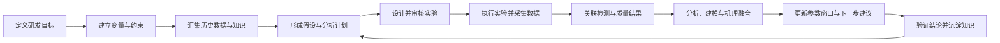
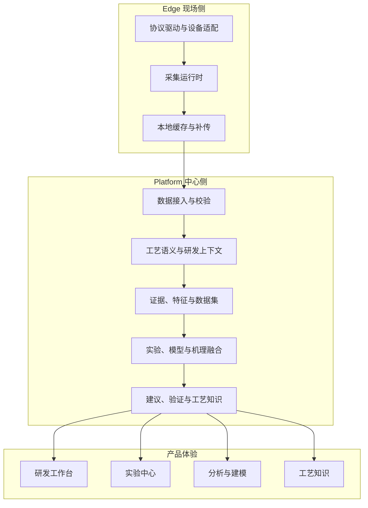
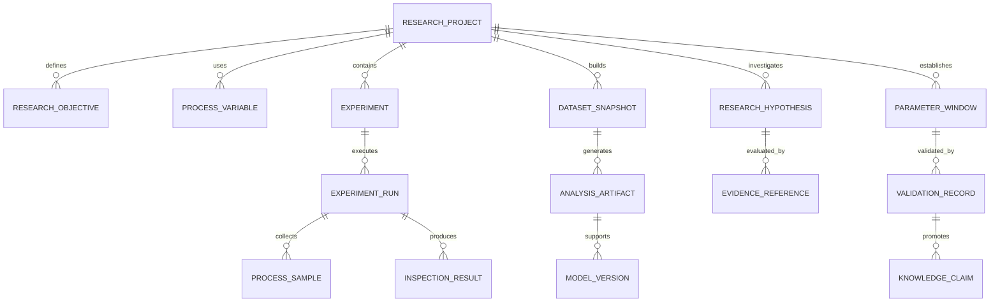

# Ingot 产品与系统设计

> 文档状态：产品与系统总体设计
>
> 适用对象：产品负责人、工艺工程师、算法工程师、软件工程师与实施团队
>
> 设计主线：以先进技术辅助工艺工程师研发工艺，减少无效试验，缩短工艺研发周期

## 1. 产品定位

Ingot 是面向制造业的 AI 工艺研发系统，通过融合实验数据、实时过程数据、物理机理和专家知识，辅助工艺工程师设计实验、发现规律、优化参数并验证工艺窗口，缩短工艺研发周期。系统围绕真实工艺研发项目，统一组织研发目标、实验、过程数据、质量结果、机理模型、专家判断和验证结论。

- 明确定义研发目标、评价指标、可控变量和安全约束；
- 汇集实验设备、生产设备、检测仪器和人工记录产生的数据；
- 识别影响工艺结果的关键阶段、变量、交互关系和候选机理；
- 设计信息价值更高的下一组实验；
- 在明确边界内形成候选参数窗口和工艺建议；
- 通过受控实验验证结论，并沉淀可追溯、可复用的工艺知识。

Ingot 的产品价值以工艺研发结果衡量：达到目标所需的实验次数、日历时间、材料与设备成本，以及形成可复用工艺知识的效率。

## 2. 设计原则

### 2.1 工艺研发项目是系统主对象

系统围绕研发目标推进工作。设备、测点、生产周期、检测记录、模型和文档都服务于具体研发项目，并通过实验、数据集和证据关系进入研发闭环。

### 2.2 数据采集是系统自有基础能力

Ingot 具备独立的数据采集体系。系统实现主流工业协议，使用稳定的采集契约隔离协议差异，并允许针对具体设备型号、固件和现场点位开发设备适配。

### 2.3 数据、机理和专家知识共同参与研发

数据模型用于识别统计规律，机理模型用于表达物理约束和领域规律，专家知识用于补充适用范围、风险边界和现场经验。系统保留三类证据的来源与版本，并在结论中明确各自作用。

### 2.4 每个结论都可追溯、可复算、可验证

分析结果绑定输入数据集、过滤规则、特征定义、算法版本、模型版本和计算哈希。实验建议绑定提出依据、适用范围、安全约束和预期结果。进入工艺知识库的结论必须具有对应验证记录和人员审核。

### 2.5 工程师保持研发决策权

系统负责组织证据、运行计算、提出假设、设计候选实验和整理结论。工艺工程师负责确认研发目标、审核实验、判断现场条件、批准结论并决定工艺应用。

### 2.6 能力通过真实工艺闭环持续验证

采集、计算、分析、模型和建议能力都通过真实设备、真实实验和真实质量结果验证。系统验收覆盖从设备数据进入到研发结论形成的完整链路。

## 3. 用户与职责

| 角色 | 主要职责 | 系统提供的支持 |
|---|---|---|
| 工艺研发工程师 | 定义目标、设计和执行实验、判断工艺结论 | 研发工作台、实验设计、分析建模、参数窗口与知识沉淀 |
| 工艺专家 | 提供机理、经验、边界和审核意见 | 机理模型、知识声明、适用范围、证据复核 |
| 质量工程师 | 定义评价指标、完成检测与结果复核 | 检测方案、质量数据关联、结果分布与验证指标 |
| 设备与自动化工程师 | 接入设备、确认点位、保障采集质量 | 协议驱动、设备模板、点位配置、采集健康与诊断 |
| 研发负责人 | 管理项目目标、进度、成本和成果 | 项目组合、阶段进展、实验成本、研发收益与审核记录 |
| 系统实施与运维人员 | 部署系统、配置身份、维护数据与运行环境 | 部署配置、权限、审计、备份、监控和升级 |

## 4. 工艺研发闭环

### 4.1 定义研发目标

研发项目记录目标产品、材料、设备和工艺范围，并定义：

- 需要改善的质量、效率、能耗、成本或稳定性指标；
- 当前基线、目标值、允许波动和完成条件；
- 可调整变量、观察变量、环境变量和结果变量；
- 设备能力、材料范围、安全限制与现场审批要求；
- 单次实验成本、计划周期和项目负责人。

系统将目标转化为后续实验、分析和验证共同使用的结构化研发任务。

### 4.2 建立变量与工艺结构

工艺变量具有稳定编码、名称、数据类型、单位、精度、有效范围、控制方式和数据来源。变量按研发用途划分为：

- 可控变量：可以在实验中主动设置；
- 过程变量：描述实验执行过程中的真实状态；
- 环境变量：描述环境和设备背景条件；
- 材料变量：描述材料、批次和来料差异；
- 结果变量：描述质量、效率、成本和其他研发结果。

工艺阶段定义每个变量在周期中的业务含义。系统保存阶段边界来源、阶段顺序、重复阶段、有效时长和覆盖率，支持整周期与分阶段分析。

### 4.3 形成研发假设

研发假设描述变量、阶段或机理与目标结果之间的候选关系。每条假设记录：

- 提出人或生成来源；
- 适用产品、材料、设备、配方与工况；
- 机理依据、历史数据依据和专家依据；
- 支持证据、反对证据和数据限制；
- 建议验证方法、主要指标和安全指标；
- 当前状态、审核意见和置信等级。

### 4.4 设计与执行实验

实验以研发假设和目标为依据，保存计划参数、保持不变的条件、预期作用、主要指标、分配方法、样本量、排除规则、安全约束、停止规则和回退方案。

实验执行时，系统分别记录：

- 计划设置值；
- 实际下发或人工设置值；
- 设备运行中的真实过程值；
- 材料、模具、设备、环境和人员上下文；
- 检测结果、原始附件和复核结论；
- 数据完整性、偏离计划情况和实验有效性。

### 4.5 分析、建模与推荐

系统从实验和历史数据中构建版本化数据集，完成数据质量检查、阶段对齐、特征计算、统计比较、模型训练、机理计算和融合分析。分析结果用于：

- 识别关键变量、关键阶段和变量交互；
- 评估当前假设获得的证据；
- 描述已探索、可行、安全和高风险工艺区域；
- 形成候选参数窗口；
- 推荐下一组具有较高信息价值的实验；
- 估计预期结果、不确定性和风险边界。

### 4.6 验证与知识沉淀

工艺结论按证据成熟度持续更新：

1. 从历史数据中发现候选关系；
2. 在多个历史样本中重复观察；
3. 由定向探索实验获得支持；
4. 由预注册验证实验获得支持；
5. 通过独立批次、设备或材料验证；
6. 经工程师审核进入正式工艺知识。

知识声明保存结论、适用范围、证据、限制、审核人、版本和失效条件，并可在后续研发项目中检索和复用。

## 5. 产品信息架构

### 5.1 研发工作台

研发工作台是登录后的主要入口，展示：

- 当前研发项目及阶段；
- 目标值、当前最佳结果和剩余差距；
- 已完成、进行中和待审核实验；
- 当前主要假设及证据变化；
- 数据完整性和实验有效性；
- 下一步实验建议和待处理事项；
- 研发周期、实验次数和成本趋势。

### 5.2 研发项目

研发项目页面统一组织：

- 项目目标与成功标准；
- 工艺变量与约束；
- 产品、材料、设备、模具和配方范围；
- 历史数据集与实验；
- 假设、分析、模型和机理；
- 参数窗口与验证结论；
- 项目成果与工艺知识。

### 5.3 实验中心

实验中心支持实验设计、审核、排程、执行监控、质量结果关联、有效性判断和结论登记。页面清晰区分计划条件、实际条件、过程曲线与结果指标。

### 5.4 分析与建模

分析与建模页面围绕研发问题呈现：

- 数据质量与可用范围；
- 变量分布、敏感性和交互关系；
- 阶段特征与时序曲线；
- 基准组、试验组和对照结果；
- 模型表现、适用范围和不确定性；
- 机理输出、数据模型输出和融合结果；
- 支持与反对各研发假设的证据。

### 5.5 工艺空间

工艺空间以变量范围和研发结果展示：

- 已探索区域；
- 满足约束的安全区域；
- 达到目标的候选区域；
- 数据稀疏和高不确定区域；
- 当前参数窗口；
- 推荐的下一组实验点及推荐原因。

### 5.6 工艺知识

工艺知识页面组织经过复核的知识来源、知识声明、适用范围、证据等级、关联项目和版本历史，支持新项目按产品、材料、设备、阶段、变量和质量指标检索。

### 5.7 数据基础

数据基础页面集中管理：

- 设备与数据源；
- 协议驱动与设备模板；
- 点位和工艺变量映射；
- 采集配置与部署版本；
- 采集健康、延迟、缺失和补传状态；
- 检测定义、质量方案和数据导入；
- 产品、材料、配方、模具和其他研发上下文。

## 6. 系统总体架构

系统采用模块化单体组织中心能力，以清晰的业务模块边界保持一致部署、事务管理和维护效率。Edge 独立部署在现场网络，持续采集并在网络恢复后补传。

## 7. 数据采集体系

### 7.1 采集分层

采集能力分为四个层次：

1. **协议驱动**：实现连接、读取、订阅、解析和通信诊断；
2. **设备模板**：描述设备系列、型号、固件、地址规则、数据类型和能力；
3. **项目点位配置**：描述现场地址、缩放、单位、采样频率和业务名称；
4. **工艺变量映射**：将设备信号映射为研发项目可使用的工艺变量。

协议驱动实现可复用的通信能力，设备模板承载型号差异，项目配置承载现场差异，工艺映射承载研发语义。

### 7.2 主流协议与设备适配

协议能力按真实设备和研发项目持续实现，覆盖制造现场常见的 PLC、控制器、传感器、检测仪器和数据源。每个具体设备适配记录：

- 协议和驱动版本；
- 设备系列、型号和固件范围；
- 支持的地址区域、数据类型和读取方式；
- 已验证的采样频率和批量读取限制；
- 默认点位模板和示例配置；
- 已知限制、诊断信息和验证日期。

### 7.3 稳定采集契约

所有协议最终输出统一采样记录。统一记录至少包含：

- Edge、设备、连接和点位标识；
- 设备发生时间、Edge 接收时间和中心接收时间；
- 采集序号、原始值、标准值、数据类型和单位；
- 数据质量、通信状态和诊断信息；
- 驱动版本、设备模板版本和点位配置版本；
- 关联的工艺变量、实验、周期和研发项目上下文。

系统保留原始值与标准值之间的转换关系，保证单位换算、缩放、字节序和数据类型转换可以复核。

### 7.4 采集运行时

采集运行时负责：

- 连接建立、会话管理和自动重连；
- 轮询、订阅、批量读取和采样调度；
- 超时、退避、熔断和异常点隔离；
- 本地持久化、去重、顺序维护和断网补传；
- 时间戳校正、延迟测量和数据质量标记；
- 配置版本切换、回滚和运行状态报告；
- 采集数量、丢失、积压、延迟和连接健康监控。

### 7.5 采集验证

每个协议和设备适配通过以下证据验证：

- 固定报文与解析测试；
- 协议模拟器中的正常、超时、断线和重连测试；
- 指定型号与固件的真实设备测试；
- 长时间稳定运行和断网补传测试；
- 从真实设备采样到工艺特征和实验结果的端到端回归。

## 8. 核心数据模型

### 8.1 研发项目与目标

研发项目定义业务范围和生命周期。研发目标保存指标、基线、目标值、方向、完成条件、评价方法和经济价值口径。

### 8.2 实验与实验运行

实验描述研究设计；实验运行描述一次真实执行。同一个实验可以包含多次重复运行。计划条件、实际条件、过程观测和结果观测分别保存。

### 8.3 数据集快照

数据集快照保存数据范围、实验和周期标识、输入变量、目标指标、排除规则、质量门槛、特征定义、内容哈希和创建时间。快照创建后保持不可变。

### 8.4 分析产物与模型版本

分析产物保存统计结果、图表数据、候选关系、限制和证据引用。模型版本保存训练数据、算法、超参数、产物哈希、评估结果、适用范围和运行状态。

### 8.5 参数窗口与验证

参数窗口保存变量边界、关联目标、安全约束、材料与设备范围、证据等级和不确定性。验证记录保存验证计划、真实执行、结果指标、安全检查和人员结论。

### 8.6 工艺知识

知识声明保存经过审核的工艺规律、适用范围、证据来源、限制、版本、审核记录和后续复验结果。

### 8.7 正式研发记录的完整性约束

系统只保留一套以研发项目为根的正式研发记录。实验必须具有版本化运行计划和至少两个不同条件；没有源数据快照、指标计算结果和安全检查的实验不能完成。候选工艺窗口必须引用已完成实验的计算结果、分析运行和 SHA-256 摘要，并由非创建人独立验证。知识声明只能从已验证工艺窗口和可验证证据提升。

项目成员、实验运行、实验结果、工艺窗口与结果关系、证据引用和审计记录使用关系表表达并受外键约束。JSON 负载用于保存对象快照，不作为关键身份、权限或证据关系的唯一来源。项目列表和研发资产按成员范围授权并采用有界查询。

## 9. 智能分析与研发引擎

### 9.1 数据质量

系统在分析前检查：

- 时间戳、采样间隔和数据顺序；
- 缺失、重复、异常值和通信质量；
- 单位、缩放和量纲一致性；
- 周期与阶段完整性；
- 实验计划与实际执行偏差；
- 材料、设备、模具和环境等混杂信息；
- 检测方法、精度和复核状态。

数据质量结果直接进入分析限制、不确定性和实验有效性判断。

### 9.2 特征与时序分析

特征引擎支持整周期和分阶段计算，包括统计量、积分、斜率、变化速率、峰值、到达时间、稳定时间、波动、频域特征和领域特征。所有特征具有稳定定义、单位、算法版本和计算哈希。

### 9.3 统计与因果证据

系统支持分组比较、效应量、置信区间、敏感性、变量交互、混杂检查和候选因果结构。输出明确区分观察性关系、实验性证据和工程师确认结论。

### 9.4 实验设计与序贯优化

实验引擎根据项目阶段选择适合的方法，组织因子设计、响应面、空间采样、贝叶斯优化、主动学习和多目标约束优化。推荐结果同时考虑：

- 目标改善潜力；
- 对当前假设的信息增益；
- 已探索区域与数据稀疏程度；
- 设备、材料和安全约束；
- 实验成本、时间和可执行性；
- 模型不确定性和验证需要。

### 9.5 数据模型与机理模型融合

系统支持数据模型、机理模型和专家规则分别运行并形成融合结果。机理变量、单位、适用范围和边界在执行前校验；融合结果保留各分量、最终输出、版本和计算依据。

### 9.6 参数窗口与建议

参数窗口来源于已记录的数据、模型、机理和实验验证。每项建议包含：

- 适用产品、材料、设备、模具和工况；
- 参数值或参数范围；
- 预期质量、效率、成本或能耗结果；
- 证据等级、样本范围和不确定性；
- 安全约束、停止规则和回退方案；
- 建议验证实验和审核状态。

## 10. AI 协作设计

Ingot Chat 和智能代理围绕研发项目工作。AI 负责：

- 将工程师问题整理为研发目标、变量和约束；
- 检索项目数据、实验、模型、机理和知识；
- 调用确定性分析、实验设计和模型工具；
- 汇总支持证据、反对证据、限制和不确定性；
- 生成研发假设、实验草案和结果说明；
- 将工程师确认的结论整理为待审核知识声明。

数值计算、权限检查、数据范围、模型执行和状态转换由确定性服务完成。AI 输出引用具体数据集、实验、计算结果和知识来源，工程师可以从结论继续查看原始证据。

## 11. 安全、权限与审计

系统围绕研发项目和职责分离实施权限：

- 设备与采集配置由授权实施或自动化人员维护；
- 实验创建、审核和结果确认保留独立人员记录；
- 模型启用、工艺窗口独立验证和工艺知识发布具有明确权限；
- 原始数据、附件、模型产物和知识来源按项目范围访问；
- 关键创建、修改、审核、执行、回退和导出动作进入审计记录；
- 设备连接凭据、服务凭据和模型凭据采用受控秘密存储；
- Edge 与 Platform 使用独立身份、最小权限和可轮换凭据。

## 12. 可靠性与性能

### 12.1 现场可靠性

Edge 在现场网络独立运行，网络中断时继续采集并持久化数据，恢复后按顺序补传。系统通过事件标识和采集序号保证记录唯一性。

### 12.2 计算可靠性

分析计算使用版本化输入和确定性特征定义。迟到数据触发相关结果失效和重算。完成结果保存输入范围、算法版本和计算哈希。

### 12.3 查询与分析性能

生产记录采用服务端分页和索引查询。周期特征、数据集统计和研发项目指标优先在数据库或后台任务中计算。耗时分析以任务方式运行，并提供进度、取消、恢复和结果复用。

### 12.4 存储生命周期

系统分别管理原始时序数据、结构化研发数据、分析产物、模型文件、检测附件和知识来源。各类数据配置保留、归档、备份和恢复策略，并保持引用关系完整。

## 13. 验证体系

系统验证由五类证据组成：

1. **协议与设备验证**：证明指定设备能够稳定、正确采集；
2. **数据链路验证**：证明数据能够完整进入实验和研发上下文；
3. **计算验证**：证明特征、统计和模型结果可复算；
4. **工艺验证**：证明分析与实验结果符合真实工艺和物理规律；
5. **价值验证**：证明系统减少实验次数、研发时间或资源成本。

每种重点工艺维护黄金数据集和黄金研发案例，覆盖真实输入、预期特征、实验结果、分析结论与计算哈希。版本变更必须通过相应回归。

## 14. 建设路线

### 阶段一：真实数据与研发项目贯通

- 完成目标工艺的主流协议和具体设备适配；
- 建立工艺变量、阶段、实验和检测结果关联；
- 从真实设备稳定采集并形成可复算周期特征；
- 在研发工作台展示项目目标、实验进度和数据质量。

### 阶段二：分析与实验闭环

- 建立版本化数据集和研发假设；
- 完成关键变量、阶段和交互分析；
- 支持探索性与验证性实验设计；
- 根据新增实验结果持续更新分析和参数窗口。

### 阶段三：智能实验与机理融合

- 引入序贯实验设计、贝叶斯优化和主动学习；
- 融合数据模型、机理模型和专家规则；
- 输出带不确定性、约束和验证计划的下一步实验建议；
- 建立可解释、可审核的参数窗口。

### 阶段四：知识复用与研发规模化

- 将验证结论沉淀为版本化工艺知识；
- 支持跨产品、材料、设备和项目检索与复用；
- 形成企业级工艺研发案例库和模型资产；
- 用项目组合指标持续衡量研发效率和经济收益。

## 15. 产品成功指标

### 15.1 核心指标

- 达到目标工艺窗口所需的日历时间；
- 达到目标所需的实验次数；
- 单个研发项目的实验、材料、设备与人工成本；
- 有效实验比例和一次执行成功率；
- 推荐实验被工程师采用的比例；
- 参数窗口通过验证的比例；
- 工艺知识在后续项目中的复用次数；
- 新产品、新材料和新设备的工艺迁移时间。

### 15.2 系统质量指标

- 设备连接成功率与持续运行时间；
- 采集完整率、补传成功率和端到端延迟；
- 周期、阶段和实验关联准确率；
- 分析结果复算一致率；
- 模型、建议和知识的证据覆盖率；
- 关键操作审计完整率。

## 16. 验收标准

一个工艺研发闭环完成时，系统应能够证明：

1. 研发目标、变量、约束和成功标准已经明确记录；
2. 真实设备、实验和检测数据完整进入同一项目；
3. 数据质量和实验执行偏差得到明确说明；
4. 分析结论可以回到对应数据、特征、模型和机理依据；
5. 下一步实验建议具有理由、约束、预期结果和不确定性；
6. 实验结果能够更新假设、模型和参数窗口；
7. 验证结论经过工程师审核并沉淀为版本化工艺知识；
8. 项目能够量化实验次数、研发周期或资源成本的改善。

这套设计使数据采集、工艺语义、实验管理、智能分析、机理融合和知识沉淀形成同一条研发主线，共同服务于缩短工艺研发周期。
