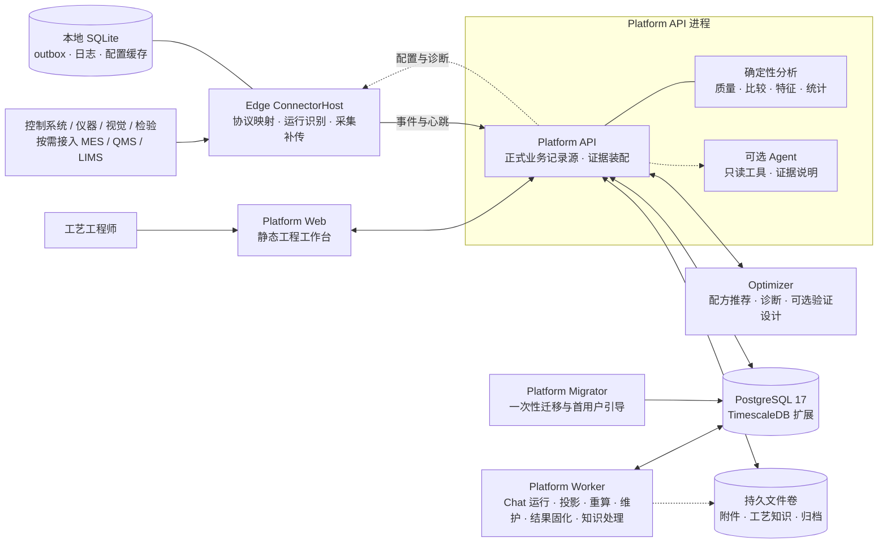

# 系统设计

> 文档状态：**v1 架构基线**。本文件固定产品原则、业务记录边界和稳定组件职责；具体算法、默认验证参数、页面布局和实施顺序属于可演进策略。

本文定义模块职责、依赖方向、正式记录源、运行边界和不可绕过的架构约束。实现变更应以本文及自动化架构门禁为评审依据；操作入口见[快速开始](getting-started.md)。

## 设计目标

Ingot 的核心价值由[品牌规范](brand.md)固定：组织配方版本、实验记录与运行证据，支持质量分析、工艺追因和配方优化。

Ingot 按独立研发系统设计。数据库、Web、API 与优化组件构成自身运行栈；无需外部业务系统即可完成配方、运行与质量记录。现场设备、企业系统与云服务连接器属于可选扩展，连接器不可成为研发核心流程的必需依赖。当前能力与建设边界见[当前状态](status.md)和[发展规划](project-plan.md)。

架构因此必须做到：

1. **先形成可信事实**：每项分析都能回到有来源、单位、时间和版本的实验或运行记录。
2. **再帮助工程判断**：系统展示差异、证据、反证、混杂和不确定性，不只给一个分数。
3. **支持独立研发记录**：研发工作不以生产系统在线或现场连接器可用为前提；生产运行可作为一种可选的证据来源。
4. **按问题选择方法**：统计、响应面、机器学习、贝叶斯优化和机理模型都是可替换工具。
5. **工程师保持控制**：工程师定义目标与安全边界，确认下一份配方；系统不自动下发。

系统按单团队可自托管运行设计，由研发与工艺工程师使用；生产、质量、设备团队可协作。

## 产品模型

```text
工艺配置 → 现场接入 → 生产运行 → 质量管理 → 工艺追因 → 配方优化
```

这是当前已实现的生产证据工作流：把运行数据整理成可信事实，再用于分析和建议。下一配方建议依赖已完成的生产运行、检验结果和有效覆盖。每次运行本身就是实验，实际参数和过程轨迹保存在运行记录中，实验结果由质量记录承载，详见[当前状态](status.md)。

当前 Web 信息架构同时考虑决策链和岗位高频任务，组织为六个业务入口：

1. **工作台**：按优先级汇总质量待办、运行状态、现场状态和研发进展；
2. **工艺配置**：工艺变量、配方版本、过程分析、质量配置与工装配置。每个配方版本带“上线检查”，列出这一版还缺哪些依赖；
3. **现场接入**：现场节点、通信驱动及多来源字段与工艺变量映射；
4. **生产运行**：生产切换、工装装卸和运行记录。运行记录提供“需要处理”筛选，列出质量不合格、结论不确定或过程数据不可用的已完成运行；
5. **质量管理**：检验任务、独立复核和质量记录。偏差分析按产品和配方版本指出哪些结果超出质量范围；质量岗位可直接进入日常任务；
6. **工艺追因**：数据质量、运行对比和分析助手。运行对比解释同类运行为什么不一样。追因只使用已经形成的运行和质量记录。下一轮校正在已发布配方版本上完成。AI 是分析手段，不单独成为业务域。

现场节点上报的原始事件归入系统管理，供平台管理员审计和排查接入。

配方版本的上线检查只看这一版自己的依赖：配方版本和引用的工艺变量已发布；已发布的采集配置引用同一版工艺变量，并映射全部控制参数和过程量；已发布的过程分析引用同一版工艺变量且包含过程曲线；已发布的质量方案覆盖这一版的产品范围，并含带单位和判定范围的数值指标。全部通过后，生产切换选择这一版，新运行按它采集、分析和判定。每次运行的追溯来源固定为四类：设备与运行身份来自现场节点和采集配置，产品、配方与材料批次来自生产切换，实际装机工装来自工装装卸，过程字段覆盖由采集映射决定。

一级业务入口在工作台之后按“工艺配置 → 现场接入 → 生产运行 → 质量管理 → 工艺追因”排列，与业务依赖顺序一致：新场景先定义和发布工艺语义，再把真实来源映射到该语义。下一轮校正、工程师决定与结果固化在已发布配方版本上完成。小校正不产生新版本；显著变更才创建修订草稿。见[当前状态](status.md)。

配方版本是实验参数设定的统一载体。参数编码、名称、数据类型、单位、上下限和步长来自其引用的工艺变量；配方版本保存各参数的设定值、修订理由与证据。不通过另一个表单重新定义参数。所有参数都属于分析变量；是否允许优化调整仍遵守参数类型、可变更标记及安全边界。

系统管理通过独立入口承载用户、岗位权限、平台状态、运行日志和助手评测，不与业务任务竞争一级导航。各业务域的二级导航优先显示日常高频任务，再显示准备或维护动作；首次生产发布前使用当前规范 URL；撤销的错误页面可重定向到现有业务入口，避免已打开链接继续展示错误流程。生产发布后的 URL 和数据契约按版本迁移纪律保持稳定。

菜单可以调整，但这些业务事实不能被隐藏、复制成平行记录或混入算法内部状态。

## 系统结构


```mermaid
flowchart LR
    Sources["控制系统 / 仪器 / 视觉 / 检验\n按需接入 MES / QMS / LIMS"] --> Edge["Edge ConnectorHost\n协议映射 · 运行识别 · 采集补传"]
    EdgeStore[("本地 SQLite\noutbox · 日志 · 配置缓存")] --- Edge
    Engineer["工艺工程师"] --> Web["Platform Web\n静态工程工作台"]
    Web <--> Api
    Edge -->|事件与心跳| Api
    Api -.->|配置与诊断| Edge

    subgraph ApiProcess["Platform API 进程"]
        Api["Platform API\n正式业务记录源 · 证据装配"]
        Analysis["确定性分析\n质量 · 比较 · 特征 · 统计"]
        Agent["可选 Agent\n只读工具 · 证据说明"]
        Api --- Analysis
        Api -.-> Agent
    end

    Api <--> Optimizer["Optimizer\n配方推荐 · 诊断 · 可选验证设计"]
    Api <--> DB[("PostgreSQL 17\nTimescaleDB 扩展")]
    Api <--> Files[("持久文件卷\n附件 · 工艺知识 · 归档")]
    Worker["Platform Worker\nChat 运行 · 投影 · 重算 · 维护 · 结果固化 · 知识处理"] <--> DB
    Worker -.-> Files
    Migrator["Platform Migrator\n一次性迁移与首用户引导"] --> DB
```

代码项目边界不等于部署边界。当前持续运行单元是 Platform API、Platform Worker、独立 Edge ConnectorHost、PostgreSQL/TimescaleDB、Optimizer 和 Web；Migrator 是 API 与 Worker 启动前完成的一次性作业。Chat 接收与查询接口随 Platform API 运行，确定性分析和可选模型 Agent 的持久任务由 Platform Worker 执行；Agent 仍是代码类库，不是独立服务。检验附件与工艺知识使用持久文件卷，元数据与正式状态仍在 PostgreSQL。小型现场可以共用物理服务器，但 Edge 与 Platform 仍保持独立进程、存储、身份和恢复生命周期。

本文件固定稳定业务边界；多副本、故障域、数据生命周期、灾难恢复和受控行动的目标拓扑由[生产架构](production-architecture.md)定义，当前部署步骤由[部署运维](deployment.md)定义。目标设计不能被当作当前 Compose 已实现能力。

## 稳定组件职责

### Edge

- 主动连接现场控制系统、仪器、网关和允许的业务数据源；
- 把厂商地址、协议数据类型和原始单位映射为稳定业务编码；
- 识别运行边界并上报实际参数、过程样本、事件和上下文来源；
- 使用本地持久化队列承受断网、平台重启和短时背压；
- 拉取版本化采集配置，在本地验证并回报实际应用状态。

Edge 不判断工艺原因，不运行产品级优化，也不成为建议决定和质量结果的正式记录源。

离散运行身份必须跨 ConnectorHost 重启保持可追溯。如果启动时设备已经处于运行态、又没有可恢复的现场运行标识，Edge 必须把该段标记为不完整采集，不能伪装成从正常起点开始的完整运行。被 Platform 确定性拒绝的单条事件必须隔离并留下本地审计，不能阻塞其后的有效事件。

### Platform

- 保存工业对象、设备、生产上下文、过程执行、检验、优化任务、配方建议、工程师决定、证据和知识；
- 维护版本化配置、来源、单位、权限、审计和业务状态机；
- 将一次真实运行的条件、轨迹和结果装配为不可变分析观察；
- 执行数据质量、匹配、比较、特征和可复核统计计算；
- 只有匹配已发布质量方案、身份可信且满足独立复核要求的检测记录，才能进入正式比较和优化观察；非数值检测结论由版本化定义在服务端判定；
- 保存发送给数值服务的输入快照和返回结果。

Platform 是正式业务记录源。下一配方建议、工程师决定、实际运行关联和质量结果使用独立追加式记录，不复用运行计划或设备命令状态机，也不能只保存在 Optimizer、Agent 或浏览器中。

Chat 以 `ChatConversation` 和有序 `ChatMessage` 作为面向用户的正式对话模型；URL、历史列表、刷新恢复、幂等发送和删除都以 Conversation 为边界。用户消息与待生成的助手消息在同一事务中建立，`ClientMessageId` 防止网络重试产生重复消息。`AgentRun` 只是助手消息背后的执行明细，保存计划、工具调用、模型用量和流事件，不再承担对话身份。

生产宿主把 Agent 运行快照和事件流保存在 Platform PostgreSQL 中；Agent 核心仍只依赖 `IAgentRunStore`，不引用 Npgsql。API 在消息事务完成后只创建排队运行，独立 Platform Worker 通过数据库租约领取、续租和执行；API 重启不会丢失已接收的回答任务，Worker 中断后过期租约可由后续实例重新领取。连续对话只装配最近已完成回答的摘要、有限发现和限制，不把完整图表、建议或旧记录引用无限回灌给模型；旧回答也不能替代当前问题所需的生产数据查询。

Platform 内部按用例分离策略与实现：`Platform.Application` 保存可脱离数据库测试的应用规则和存储端口，`Platform.Infrastructure` 实现 PostgreSQL 事务、外部服务和跨上下文适配。配方优化、采集配置、制造上下文、事件、身份、洞察、分析与检验的数据库无关端口，以及其中的多步规则和用例，均归属 Application；PostgreSQL Store、优化器 HTTP 客户端、后台宿主和证据装配器归属 Infrastructure，并通过按模块的组合入口注册。新业务控制器只处理传输、鉴权并通过 Application 用例委托业务操作；当前 Edge 注册/诊断、身份和运行指标等少量运维适配器仍由 API 直接注入 Infrastructure 服务，受下方 `ARCH-001` 约束，不允许扩展为新的业务写路径。首用户引导由 Migrator 在事务锁内完成，周期维护由 Worker 执行。并发幂等与原子写入继续由数据库事务和约束保证，不上提为内存规则。配方优化规则不能直接读取检验模块；检验、过程运行和配置证据只能由显式登记的装配适配器（当前为 `ResearchObservationAssembler`）转换为优化观察。

### 架构债务登记

| 编号 | 当前豁口 | 责任边界 | 禁止扩张 | 关闭条件 | 触发时点 |
| --- | --- | --- | --- | --- | --- |
| `ARCH-001` | Edge 注册/诊断、身份和运行指标的少量 API 控制器直接注入 Infrastructure 服务 | Platform 组合根 | 不得新增业务写路径或让领域规则进入控制器 | 为现有运维用例建立 Application 端口；API 不再引用对应 Infrastructure 命名空间；架构检查覆盖该规则 | 首个生产试点前，或引入第二位生产维护者前，以先发生者为准 |

`ARCH-001` 不是永久例外。任何触碰这些控制器的功能改动都必须同时减少该清单范围，或在变更说明中证明没有扩大依赖面。

### Optimizer

- 接收完整优化定义、有效真实运行观察、待确认点和随机种子；
- 执行可重复的数值建模、约束判断和候选选择；
- 返回预测、不确定性、可行概率、推荐参数、理由和模型版本；
- 保持无业务状态，不直接访问设备，也不确认或下发配方。

### Agent

- 解析工程师的问题和当前业务上下文；
- 调用授权的只读或受控业务工具；
- 组织事实、引用来源、说明限制和建议下一步；
- 不自行计算或生成数值工艺设定，不把语言概率写成工程结论。

Agent 使用两条彼此分离的证据路径。运行、检验、配置和优化等结构化生产事实始终由授权业务工具查询；SOP、手册、报告和工程记录等文档知识，只从授权站点内已复核的来源和片段中检索。文档检索在 PostgreSQL 中组合全文/相似词匹配与可选语义向量排序，返回片段级来源、页码或 Sheet、来源 SHA 和内容哈希。语义嵌入未启用、不可用或查询失败时自动退回关键词检索；检索结果只为回答提供只读证据，不能替代当前生产数据查询、证明根因或修改设备。

### Web

- 以业务对象、运行、检验和优化任务组织工程工作；
- 在页面上同时呈现事实、数据质量、证据和可执行动作；
- 不建立与 Platform 不一致的本地业务状态。

## 证据主干

一次可分析运行至少需要回答：

```text
谁 / 什么设备 / 什么产品
        + 实际配方版本与可控条件
        + 过程轨迹与阶段
        + 材料、工装、批次等上下文
        + 质量和安全结果
        + 来源、时间、单位与版本
```

稳定标识负责把这些事实接在一起：

- `ExecutionId`：由 Edge 生成并在平台中关联过程执行与现场事件的统一运行身份；
- 计划配方版本与设备实际应用的配方版本分别保留；同类比较按分析方案声明的实际配方版本 cohort 执行，不得把计划版本当成设备实际版本；
- `ExecutionKey`：下一配方建议记录与真实执行之间的关联键；
- `EquipmentId`、产品/工艺对象和配方版本：最小运行身份；
- 内容哈希：固定分析输入及其来源。

标识可以映射，但不能靠事后猜测关联。无法关联的运行保留并显示原因，不被静默丢弃。

## 生产上下文

设备、材料、工装、批次、校准和维护状态既可能是重要原因，也可能只是追溯信息。系统不预先假定它们一定影响质量。

每次运行保存不可变上下文快照，并由版本化场景配置将字段声明为：

- **分析必需**：缺失时该运行不能进入指定分析；
- **有则记录**：用于追溯、分层和后续覆盖评估；
- **已验证建模**：经过充分、可复核的真实运行证据支持，可进入诊断、优化或适用范围。

系统必须显示覆盖率、缺失率、各水平样本数和因素重叠。没有重叠的数据不能假装能够分离设备、模具或材料效应。

## 从观察到原因

```text
可比运行 → 差异与首次偏离 → 候选原因
                                  ↓
                    反证 / 混杂 / 数据不足
                                  ↓
                    继续收集真实运行证据 → 支持 / 否决 / 不确定
```

- 观察分析可以报告差异、关联和候选原因。
- 候选必须引用原始运行、比较基线、分析版本和限制。
- 只有可控或可区组的候选才能自动转成调查草案。
- 因果升级需要合适的对照、重复、区组、随机化或干预证据。
- 缺少识别条件时，正确结果是“证据不足”，而不是强行排序出一个根因。

具体统计或模型由[分析与优化](optimization.md)说明，不属于不可变架构。

## 从真实运行到下一份配方

日常配方优化直接消费已完成的真实生产运行：

```text
实际配方 + 过程上下文 + 有效质量结果
                    ↓
               优化观察
                    ↓
     安全边界与历史覆盖内的下一配方建议
                    ↓
        工程师通过现有生产流程确认
```

生产运行不要求工程师重新归类。下一版提案从当前已发布配方版本进入：站点、产品、设备、可调参数和数值质量目标取自该版本、其工艺变量、覆盖它的质量方案，以及该版本已经完成的运行。至少三条有效运行和两种不同实际配方通过准入后，系统可以生成一份独立的追加式建议记录。该记录保留输入快照、预测、不确定性、证据范围和理由；写入前，推荐参数按工艺变量的步长对齐，再检查是否落在已观察范围内，写给工程师的理由使用中文。工程师随后追加采用、修改或拒绝及原因。采用为下一轮校正只表示同意按这些参数再跑当前已发布版本，不发布新版本，也不向设备下发参数。决定之后，下一轮使用同一配方版本并完成的运行自动接上；参数回读与检验结果齐了就冻结。工程师认定这是显著变更时，用建议参数打开该版本的修订草稿，草稿发布前已发布版本保持不变。同一配方版本上还有未冻结的校正时，不再另开一份。拒绝、过期或结果冻结之后，才允许按新的运行再生成。

## 配方建议架构约束

本节是下一配方建议、机理知识和工艺知识的强制约束，由 `scripts/verify-architecture.sh`、`scripts/verify-product-scope.sh` 和后端测试守护。

### 归属与记录

系统不设“研发项目”一类的容器。下一配方建议与机理知识的唯一业务范围是“站点 + 配方”，工艺知识来源只归属站点。

| 记录 | 归属键 | 唯一写入路径 | 可变性 |
| --- | --- | --- | --- |
| 下一配方建议 | 站点 + 配方 + 输入哈希 | `ResearchOptimizationService` | 只追加；冻结生成条件及其哈希，24 小时后过期 |
| 工程师决定 | 建议 + 建议项 | `ResearchRecipeRecommendationDecisionService` | 每个建议项最多一次 |
| 实际运行关联 | 决定；实际运行键全局唯一 | `ResearchRecipeRecommendationDecisionService` | 每个决定最多一次，记录关联人 |
| 冻结结果 | 决定 | `ResearchRecipeRecommendationDecisionService` | 每个决定最多一次，从源数据计算，记录冻结人 |
| 机理声明与冲突 | 站点 + 配方 | `MechanismKnowledgeService` | 内容按版本追加，状态转换留痕 |
| 工艺知识来源 | 站点 + 内容 SHA-256 | 知识来源登记 | 内容不可变，复核后才可检索 |

### 不变量

1. **生成条件冻结**：生成条件 `RecipeRecommendationBrief` 只包含站点、配方、质量目标、可调参数及边界、参数与结果约束、派生特征和上下文范围。生成时由 `RecipeRecommendationBriefPolicy` 规范化并对照已发布配方校验，再与 `BriefHash` 一同写入建议；登记决定、关联运行和冻结结果前都重新计算哈希，不一致即拒绝。
2. **参数只来自配方**：可调参数必须是所选配方版本引用的工艺变量中允许调整的数值参数，单位一致，边界不超出工艺变量的范围。
3. **观察范围来自生成条件**：观察装配只接收生成条件所属站点、配方及上下文范围（产品系列、产品、设备、配方版本、产出物料、回看天数）内的已完成运行。
4. **待确认点同条件**：只有同站点、同配方、同 `BriefHash` 且尚未冻结结果的采用或修改决定，才作为待确认点传给 Optimizer。
5. **决定链单向**：建议 → 决定 → 运行关联 → 结果，只追加、不回退。过期建议不再接受新决定；拒绝是终态；关联运行必须属于建议所属站点、在决定之后开始，并落在生成条件范围内。
6. **机理知识同范围**：机理声明的变量必须来自该配方的工艺变量；适用范围只允许站点、配方、产品和设备维度；证据只能来自同站点的知识来源或片段，或同站点同配方的已冻结建议结果；冲突只能在同一范围内登记。
7. **知识检索按站点**：助手检索工艺知识时必须解析出唯一的授权站点，否则返回证据不足；对话不接受页面上下文，站点和对象由问题本身说明。

### 依赖方向

- `Ingot.Contracts`：生成条件、建议、决定与结果的数据契约，不依赖任何实现；
- `Platform.Application`：`RecipeRecommendationBriefPolicy`、`ResearchOptimizationService`、`ResearchRecipeRecommendationDecisionService`、`RecipeRecommendationQueries`、`RecipeKnowledgeScopeReader`、`MechanismKnowledgeService` 及存储端口，不引用 Npgsql、HTTP 客户端或检验模块；
- `Platform.Infrastructure`：PostgreSQL 存储、`ResearchObservationAssembler` 和优化器客户端；装配器是检验、运行和配置证据进入建议的唯一入口；
- `Platform.Api`：`RecipeRecommendationsController` 只做传输、身份解析和站点授权，规则冲突返回 409，优化器不可用返回 503；
- Web：已发布配方版本直接提交生成条件，不在浏览器保存建议状态。小校正的采用不创建新版本；显著变更走该版本的修订草稿。

### 已删除概念

研发项目、项目成员、研究假设、操作域、项目知识声明、项目审计和对话页面上下文均已删除，对应表由迁移 `0026_remove_research_projects` 移除；迁移发现任何按项目归属的建议、机理或知识数据时拒绝执行，不做猜测式归属。`/research-projects` 不作为页面地址或 API 存在，门禁拒绝重新引入这些概念。

## 一致性与可重放

- 同一分析输入生成稳定内容哈希；
- 数据、特征、分析方法、模型和场景配置都带版本；
- 决定结果从源数据计算，不接受调用方自我声明为可信；
- 并发请求和重试不会生成重复的建议、决定、运行关联或结果记录；
- 历史数据在算法升级后仍能按旧版本解释或按新版本重算；
- Optimizer 或 Agent 故障不阻止采集、运行和检验记录。

## 场景替换边界

更换工艺场景时需要提供：

- 工业对象、设备和运行边界；
- 可控变量、实际值来源、单位与允许范围；
- 过程信号、阶段和版本化特征；
- 质量目标、检验映射和安全约束；
- 必需与可选上下文字段；
- 安全基线、默认建议策略和可选机理知识。

不应重写运行身份、证据关系、运行状态机、审计原则或 Optimizer 的无状态协议。只有在第二个明显不同的真实场景中不修改这些核心契约，通用性才得到支持。

## Agent 能力与互操作边界

Agent 不直接依赖 Platform 内部 CRUD，也不因采用 MCP、OpenAPI 或某个 SDK 就获得业务权限。互操作适配层只负责能力发现、Schema 和调用；Platform 仍强制站点隔离、证据引用、状态转换、审批、幂等、审计和回滚。

HTTP 错误统一使用 `application/problem+json`，并提供稳定的 `code`、请求 `traceId` 和标准 `detail` 字段。单调增长的历史集合（如配方建议流程）使用不透明游标和有上限的 `limit`，外部实现不应依赖无界数组。

能力按风险逐步开放：

- **读取**：查询授权的运行、证据、质量、上下文和适用范围；
- **提议**：创建调查草案或机理声明草案，不改变正式状态；
- **承诺**：冻结版本并提交独立审批，创建者不能自批；
- **执行**：只调用白名单、限时、限范围、可停止且可回滚的动作。

当前 Agent 只开放授权的只读分析工具，不直连设备，也不持有业务写权限。上面的提议、承诺和执行是条件性扩展的风险分级，不是现有工具清单。若未来引入设备动作，必须作为独立安全工程项目，由 Platform 保存授权记录、受控集成或 Edge 网关执行，并回采实际确认值和结果。范围与前置条件见[发展规划](project-plan.md)。

## 可演进策略

以下内容记录当前选择，但不定义产品核心：

- Web 菜单与页面布局；
- 具体协议驱动和设备模板；
- 特征算法、统计检验和代理模型；
- 默认重复次数、区组数和停止规则；
- GP、采集函数、机理先验和迁移方式；
- LLM Provider、模型角色和提示词；
- MCP、OpenAPI、SDK 等 Agent 协议适配；
- 实施顺序与优先级。

这些策略由真实数据、工程师反馈和现场验证更新；稳定边界变化通过 ADR 记录。
