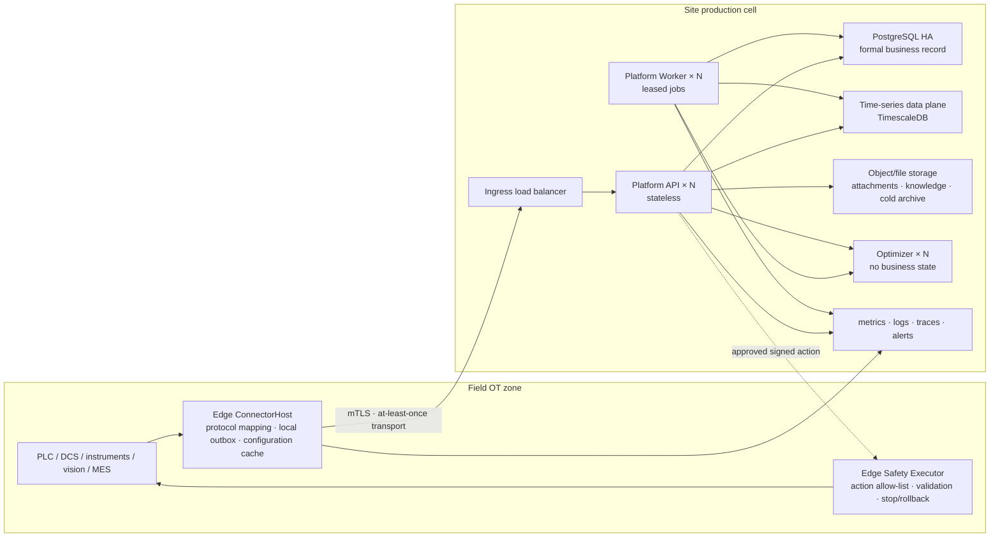

# Production architecture

> Document status: **target design and implementation baseline**. This document defines the failure model, data semantics, safety boundaries, and admission gates required to move Ingot from R&D validation into sustained production operation. It does not claim that the bundled single-host Compose topology is highly available.

## Scope and objective

Production support does not mean connecting a model directly to a PLC, and it does not mean replacing PostgreSQL with another time-series database. Production capability has two independent levels:

1. **Production observation and decision support**: continuously collect real runs, provide traceability, comparison, diagnosis, shadow recommendations, and controlled experiments without directly changing equipment state.
2. **Controlled action**: only after the first level has operated reliably and a specific scenario has passed admission, deliver an approved structured action to Edge for deterministic validation, bounds enforcement, stop, and rollback outside the field interlocks.

The default delivery target is the first level. The second requires separate certification by equipment class and action type; analysis capability never grants it automatically.

The production architecture must ensure that:

- acknowledged data is not lost within the declared failure envelope;
- network outages, service restarts, and task replays do not silently change business outcomes;
- every formal conclusion still resolves to the same run, context, inspection, and versioned evidence;
- overload in one site, device, or tenant cannot become a global failure;
- model, Agent, Platform, or network failures cannot bypass field safety interlocks;
- backups can be restored, upgrades can be stopped, and degraded behavior can be observed and explained.

## Design decisions

### 1. Design production architecture from explicit failure assumptions

The production design assumes from the outset that a machine, network, or process can fail. Explicit failure domains isolate data and load, synchronous replicas and rehearsed failover handle node failure, durable responsibility precedes acknowledgement and derived work, and formal records, time-series storage, and stateless compute remain separate responsibilities.

Ingot applies the following production principles:

| Production principle | Ingot design |
|---|---|
| Failure domains define isolation | A site production cell plus logical shards defined by `SiteId / EdgeId / EquipmentId + time` |
| Critical state is redundant | Synchronous replicas and an explicit failover policy for PostgreSQL and the time-series store |
| Durability precedes acknowledgement | Edge local outbox; Platform acknowledges only after a durable transaction commits |
| Control, data, and compute are separate | Separate formal-record control plane, time-series data plane, and stateless compute plane |
| Consumption is resumable | Replayable durable jobs, consumer cursors, and quarantine queues |
| Data is tiered by value | Hot raw data, warm aggregates, cold archives, and separate evidence pinning |
| Recovery capability is verified | Manifested application backups, PITR, off-host copies, and regular recovery drills |

### 2. PostgreSQL is the only formal business system of record

PostgreSQL stores:

- identities, permissions, sites, and equipment catalogues;
- process configurations, analysis plans, and versions;
- process executions, context, and inspection relationships;
- R&D projects, experiments, approvals, and state machines;
- Agent runs, input snapshots, recommendations, and evidence hashes;
- controlled actions, execution receipts, stop, and rollback outcomes;
- data-retention, evidence-pinning, and audit policies.

A time-series database may hold raw signals, process frames, and aggregates, but it cannot be the only record of approvals, experiment state, or execution receipts. If the time-series store is unavailable, curve queries and new analysis may pause; no parallel formal state may appear in a browser, Agent, or Optimizer.

### 3. TimescaleDB is the only current implementation; capacity evidence triggers storage evolution

PostgreSQL plus TimescaleDB remains the current design. The existing `ITimeSeriesStore` is the storage boundary. Business services depend only on canonical time-series semantics, never on proprietary query objects from a particular storage engine.

Evaluate and implement an independent time-series data plane only when the same production workload, target retention, and two-times capacity headroom demonstrate that the current data plane cannot meet ingestion, query, recovery-time, or total-cost objectives. During such a change:

- the PostgreSQL control plane remains unchanged;
- `SiteId`, `EdgeId`, `EquipmentId`, `ExecutionId`, event time, unit, and quality-code semantics remain unchanged;
- the independent data plane holds only high-frequency raw samples, time-series aggregates, and queries;
- there is no permanent application-level dual write; one durable, replayable ingestion fact projects into the data plane;
- once migration completes, the old path is removed instead of keeping compatibility branches with no field consumer.

Before the first production release, this new project does not maintain legacy compatibility code. After the first production release, database and Edge/Platform protocols must support controlled rolling upgrades. That is version-migration discipline, not preservation of retired product paths.

## Target topology



### Site production cell

A production cell is the smallest independent failure domain, normally one factory or one campus that may share an outage:

- it owns ingress, Platform, databases, file storage, monitoring, and backups;
- Edge instances are further divided by OT security zone, power, switch, maintenance window, and acceptable acquisition outage;
- high-frequency raw data stays in the site by default rather than passing through one global ingestion bottleneck;
- the cross-site control plane synchronizes only permitted configuration packages, versions, health summaries, and de-identified aggregates;
- every cross-site operation carries an explicit `SiteId`; no default site is inferred.

Multi-site scale means replicating an accepted production cell and containing each cell's blast radius, not first building one larger database.

## Data plane

### Edge durability and delivery

Edge uses at-least-once delivery and Platform uses idempotent writes; together they produce deterministic outcomes. The flow is fixed:

1. Device data becomes an event with stable identity, event time, configuration version, and quality flags.
2. Edge commits the event to its local outbox before reporting it as recorded to the acquisition caller.
3. Edge uploads from its lowest unacknowledged sequence; a timeout or lost response resends the same event.
4. Platform commits the deduplication key, canonical event, time-series projection, and derived-job dirty marker in one durable transaction.
5. Platform returns a cumulative `AckSeq` only after that transaction commits.
6. Edge deletes or archives only records at or below `AckSeq`.

Both `EventId` and `(EdgeId, Seq)` are idempotency keys. The same key and payload is a duplicate delivery. The same key with a different payload is a data-integrity fault that must be rejected and alerted, never resolved by last-write-wins.

### Canonical ingestion envelope

The first production version freezes the following fields as a cross-storage contract:

| Field | Meaning |
|---|---|
| `SiteId` | Owning production cell; required after production admission |
| `EdgeId` | Stable identity for the installed field node |
| `Seq` | Durable, monotonically increasing sequence within one Edge |
| `EventId` | Global event identity |
| `OccurredAt` | Source event time, never rewritten by replay |
| `ReceivedAt` | Platform durable-receipt time |
| `SchemaVersion` | Envelope major version; unknown majors fail closed |
| `AppliedConfiguration` | Immutable `Kind / Id / Version` reference actually applied by Edge; nullable for events not driven by configuration |
| `ExecutionId` | Real-run identity when determinable |
| `PayloadHash` | Canonical payload hash for conflict detection |
| `QualityFlags` | Missing, range, clock, communication, and provenance quality flags |

Business time uses `OccurredAt`; ingestion delay and operations use `ReceivedAt`. Platform does not infer event-time order from arrival order.

`PayloadHash` is a SHA-256 over canonical event content, excluding the transport position `Seq` and the hash field itself. Edge seals an event before local persistence. Platform verifies the hash at the ingestion boundary and compares the source hash whenever `(SiteId, EdgeId, Seq)` or `EventId` already exists. After adding formal context, Platform reseals the canonical event, so the hash returned by queries can always be recomputed from persisted content. Missing hashes, unknown `SchemaVersion` values, and unsorted or invalid quality flags fail closed as contract errors.

### Data ownership and isolation matrix

Table ownership is fixed by the following keys and access rules rather than inferred from source folders. Every new table must enter one class; data spanning classes uses the stricter class.

| Ownership class | Authoritative key | Current table families | Access and evolution rule |
|---|---|---|---|
| Deployment global | No `SiteId`; deployment-admin permission | `users`, `user_sessions`, global type catalogues, reusable templates | May contain only cross-site identities or reusable definitions, never a production run, field value, or approval outcome |
| Site production data | `SiteId`, bound to the Edge token | `platform_edges`; `event_ingest_keys`, `production_events`, `process_sample_frames`, `collection_points`, `data_object_summaries`, `data_object_operation_keys` | Ingestion, query, retention, capacity, and export require an explicit site; no default-site inference |
| Versioned configuration | Configuration identity and version; release binding targets site/Edge | `ingestion_tasks`, `ingestion_task_bindings`, `process_data_models`, `process_analysis_plans`, `process_specification_versions`, `signal_definitions` | Definitions may be reusable; applicability is explicit, and production events preserve the configuration actually applied |
| Run-derived data | `ExecutionId`, traceable to a site ingestion fact | `execution_features`, `execution_phases`, analysis materializations and recompute jobs, `operation_context_snapshots` | Not an independent tenant boundary; external reads resolve allowed executions from authorized sites before loading derived rows |
| Research projects and evidence | `ProjectId` plus project membership/role | `process_research_*`, `research_*`, `mechanism_*`, `knowledge_*`, `dataset_quality_validation_reports` | A project may reference authorized scopes from one or more sites; copied evidence retains its source site and run ownership |
| Quality and inspection | `SiteId` plus run/project/inspection-plan relationship | `inspection_*`, `case_level_evaluations`, `model_evaluations`, `model_drift_readings` | Inspection records, scopes, and attachments freeze site ownership; authorization still derives from the related run or project, and attachments and review logs are never accessed without their parent |
| Agent audit | Initiating user plus input-evidence scope | `agent_runs`, `agent_stream_events`, `golden_question_*`, `problem_cases` | Agent records grant no new data permission; replay rechecks user, project, and site scope |

The database gate currently enforces `site_id NOT NULL` on the canonical ingestion/projection tables as well as Edge registration, inspection records, quality scopes, and inspection attachments. Edge registration cannot migrate across sites; inspection attachments are deduplicated by site and content hash, and reads recheck both role and site authorization. Other run-derived tables retain `ExecutionId` ownership to avoid a duplicated site field that can drift; their APIs must first resolve execution IDs from an authorized site scope. If measurement later shows that join to be an audit or performance bottleneck, a redundant `SiteId` may be added only with database-enforced consistency, never as an unconstrained application copy.

### Out-of-order, gaps, and late data

- A sequence gap is recorded immediately but does not permanently block valid later events.
- Each Edge tracks the maximum event time seen and maximum contiguous acknowledged sequence.
- Every derived analysis declares its allowed lateness and watermark.
- Data arriving after the watermark remains a fact and marks affected runs for recomputation.
- Recomputation uses input range, configuration version, and algorithm version as its idempotency key.
- Unparseable, out-of-range, or contract-invalid data enters quarantine; it cannot appear as successful ingestion or block later valid data.

### Cross-store consistency

Today, TimescaleDB and formal records share PostgreSQL, so deduplication keys, canonical events, time-series values, and derived-job markers can commit in one database transaction. If an independent time-series data plane is introduced, two client calls must never be presented as an atomic dual write. Add a durable ingestion journal first:

1. Platform commits the canonical envelope and payload to a PostgreSQL ingestion journal, then acknowledges Edge.
2. An independent projector writes each journal sequence idempotently to the time-series data plane and advances a data-plane checkpoint.
3. A second idempotent projection creates business events and run state inside PostgreSQL.
4. Data becomes "analyzable" only after every required projection crosses that sequence.
5. The ingestion journal cannot be deleted until projection, backup requirements, and the replay window are complete.
6. Query results return, or internal records preserve, the data-plane checkpoint used so still-projecting data is not reported as complete.

Only if a PostgreSQL ingestion journal fails a measured external time-series workload should a durable message log replace that implementation. Acknowledgement semantics, checkpoints, and replay invariants remain unchanged. Edge acknowledgement means Platform has durably accepted responsibility; it does not mean every derived view is already visible.

### Shards, quotas, and backpressure

The logical shard key is `SiteId / EdgeId / EquipmentId + time`. Physical partitioning belongs to the storage implementation, but every implementation exposes:

- write rate, storage, query cost, and backlog age by site, Edge, and equipment;
- connection, concurrent-query, background-recompute, and Optimizer budgets per site;
- hot shards, disk watermarks, and replica lag;
- configurable fair scheduling and hard limits.

At a soft watermark, restrict interactive wide-range queries and background recomputation first. At a hard watermark, stop accepting new non-critical analysis jobs. Production acquisition must not be "protected" through unlogged drops. If Edge exhausts local capacity, it follows a preregistered site policy and emits indelible loss audit and alerts.

## Control plane and asynchronous compute

Platform API remains stateless. Every operation that must survive a restart enters a PostgreSQL durable job. Workers use leases, heartbeats, bounded retry, exponential backoff, and dead-letter state:

- a job may be claimed more than once, but its business effect is idempotent;
- only the current lease holder can commit completion;
- another Worker can take over after a process exits and the lease expires;
- exhausted retry budgets enter dead letter rather than retrying forever;
- manual replay emits a new audit event while preserving the original failure;
- job payloads reference immutable inputs or content hashes, never process-local objects.

Kafka, NATS, or a similar broker is not a prerequisite for production. Introduce one only after PostgreSQL leased jobs fail measured throughput, isolation, or cross-system subscription requirements. A broker still does not replace formal business transactions or audit records.

Optimizer and model services hold no business state. Their failure affects only new numerical recommendations or explanations, not acquisition, inspection, approval, or reading existing facts. Calls have timeouts, circuit breaking, total budgets, and input hashes; automatic retry is limited to operations proven idempotent.

## Controlled-action plane

### Boundaries that never move

- An Agent never connects directly to equipment or holds equipment credentials.
- Optimizer returns candidates; it neither approves, dispatches, nor confirms execution.
- Platform records and authorizes actions but does not replace a PLC, DCS, or safety system.
- Edge Safety Executor is the only Ingot component allowed to invoke allow-listed equipment writes.
- Hardware interlocks, emergency stops, and safety PLCs remain independent of Ingot and take precedence.

### Action state machine

```text
Proposed
  → Approved
  → Dispatched
  → EdgeValidated
  → Applied → Verified
       └→ RollbackRequested → RolledBack / RollbackFailed

Approved / Dispatched / EdgeValidated
  └→ Rejected / Failed / Expired / Cancelled
```

Only commands change state; a generic update operation cannot overwrite it. A creator cannot approve their own action. Parameters, evidence, target, and versions freeze after `Approved`. Repeated dispatch with the same `IdempotencyKey` returns the original action state and never writes the equipment again.

### Action envelope

A controlled action contains at least:

- `ActionId`, `IdempotencyKey`, `SiteId`, `EdgeId`, and target equipment;
- allow-listed action type and version;
- parameters, units, allowed ranges, and expected current values;
- process-configuration version, run identity, and applicable context;
- input-evidence hash, recommendation version, approvers, and approval time;
- `NotBefore`, `ExpiresAt`, maximum duration, and stop conditions;
- rollback action or an explicit declaration that automatic rollback is unavailable;
- Platform signature and certificate identity.

Before execution, Edge revalidates signature, time window, target, current state, configuration version, parameter range, rate limit, and permitted field window. A failed check returns a structured rejection receipt. While disconnected, Edge does not start new actions by default; an action already in progress follows its local stop policy without waiting for a remote decision.

Actual applied values come from equipment readback, never from requested values. The execution receipt contains the action hash, confirmed equipment values, start and end times, operator, outcome, stop reason, and rollback result, and becomes a formal PostgreSQL record.

## Storage lifecycle

| Tier | Content | Default design |
|---|---|---|
| Hot | Recent raw events, process frames, and values | Online time-series storage for run detail and recent analysis |
| Warm | Downsampled data, features, and run aggregates | Compression or continuous aggregation for common comparisons |
| Cold | Expired raw data and large attachments | Immutable object archive with checksums |
| Pinned evidence | Inputs referenced by a report, approval, golden question, or formal conclusion | Separate retention and legal hold, unaffected by ordinary time-series retention |

A retention job resolves references before deleting data. Every deletion records its range, policy version, actor, count, and verification result. If formal evidence depends on raw data approaching expiry, the system first creates a verifiable evidence package containing at least the query range, canonical data, units, quality codes, source versions, and content hash.

TimescaleDB chunks, compression, and retention policies govern physical lifecycle only. They do not replace business evidence pinning.

## High availability and disaster recovery

### Minimum production topology

| Component | Minimum production form | Permitted degradation |
|---|---|---|
| Edge | Independent process and durable volume per failure domain | Continue local acquisition while Platform is unavailable |
| Platform API | At least two stateless replicas with health removal | One replica failure does not stop ingestion |
| Platform Worker | At least two replicas competing for leases | Jobs are delayed, not lost |
| PostgreSQL/TimescaleDB | Drilled HA primary/standby or managed equivalent | Writes may pause briefly during failover |
| File/object storage | Replication or off-host backup with content verification | New attachments pause; existing evidence remains |
| Optimizer | One or more stateless instances | New recommendations pause; core records continue |
| Monitoring and alerting | Independent of monitored processes | A core outage can still emit an alert |

The site's RPO and RTO determine whether the database uses three nodes, how many synchronous replicas it requires, and how failover is automated. A running container alone is not an HA claim.

### Backup and recovery

- Application-consistent logical backups support migration, audit, and full-restore validation.
- PostgreSQL base backups and continuous WAL archiving provide PITR.
- Backups, attachments, and key-recovery instructions are kept off-host with production-grade access control.
- At least one backup cannot be overwritten with ordinary production-administrator credentials.
- Every drill records the target point, actual RPO, actual RTO, missing objects, and hash verification.
- A backup that has never passed a recovery drill does not count as production-admission evidence.

Recovery order is control plane, file evidence, time-series data plane, derived jobs, and finally write ingress. Derived results can be rebuilt from canonical facts and should not be the only copy that blocks recovery.

## Failure behavior

| Failure | Required behavior | Forbidden behavior |
|---|---|---|
| Edge loses Platform connectivity | Edge continues durable writes and resumes from its checkpoint | Silent loss or replay under a new event identity |
| Platform API instance exits | Load balancer removes it; clients retry the same idempotent request | A committed transaction returns a permanent failure or produces duplicate business effects |
| Worker exits during a job | Another Worker takes over after lease expiry | Job remains running forever |
| Optimizer/model unavailable | New recommendations pause with explicit status | Acquisition, inspection, or historical-fact reads are blocked |
| Database primary fails | Drilled failover runs and exposes write-unavailable duration | Edge is acknowledged while persistence is unavailable |
| Disk approaches capacity | Alert, restrict jobs and wide queries, execute capacity plan | Delete formal evidence without audit |
| Clock drift | Mark quality and pause time-sensitive analysis or action | Rewrite source event time to hide the problem |
| Action receipt is lost | Query or resend the original receipt under the same idempotency key | Repeat the equipment write to "confirm" state |
| Storage replica lags | Restrict read consistency or route to primary | Execute an action from stale approval state |

## Security and observability

Edge and Platform use mutual TLS or an equivalent field-device identity mechanism. Every Edge has an independent certificate, token, and revocation state. Sensitive configuration stores secret references only. Equipment networks, databases, Optimizer, metrics, and administration entry points have separate network restrictions.

Production defines at least these SLIs:

- ingestion success, durable acknowledgement latency, and backlog age for each Edge;
- duplicates, sequence gaps, out-of-order, late, and quarantined event counts;
- end-to-end freshness from `OccurredAt` to queryable and analyzable data;
- run completeness plus context and inspection-link coverage;
- database replica lag, WAL archive delay, disk watermarks, and pool wait;
- Worker queue age, lease expiry, retry, and dead letter;
- Optimizer timeout, circuit state, and compute budget;
- action approval wait, dispatch latency, rejection, expiry, stop, rollback, and receipt completeness.

Logs, metrics, and traces carry applicable `SiteId`, `EdgeId`, `ExecutionId`, `ActionId`, configuration version, and request `traceId`. Every alert identifies an actionable object and runbook.

## Capacity and production admission

### Workload model

Every site records and versions before launch:

- counts of Edge instances, equipment, concurrent runs, and signals;
- normal, peak, and outage-replay event and byte rates;
- raw retention, aggregate resolution, and expected compression;
- maximum interactive query range, concurrent users, and background jobs;
- maximum outage duration and available Edge disk;
- RPO, RTO, acceptable freshness, and maintenance windows.

Capacity acceptance runs at no less than two times production peak while ingestion, common queries, aggregation, backup, and one node failure happen together. Average throughput cannot substitute for tail latency, backlog age, and recovery time.

### Hard admission gates

Before production observation, prove that:

1. acknowledged data meets the declared RPO under the declared single-node failure;
2. Edge suffers no silent loss during the target outage and replay creates no duplicate business effect;
3. duplicates, out-of-order data, late data, and replay produce deterministic results;
4. PITR and full application recovery meet RTO with matching evidence hashes;
5. one site's hotspot cannot exhaust another site's or critical-ingestion budget;
6. backup, monitoring, certificate rotation, upgrade, and rollback have runbooks;
7. an agreed soak period completes without unexplained data gaps.

Before controlled action, also prove that:

1. no Agent, API, or database account can bypass Edge Safety Executor;
2. duplicate action delivery never repeats an equipment write;
3. expired, wrong-target, wrong-version, out-of-range, and state-mismatched actions all fail closed;
4. actual readback, stop, rollback, and receipts recover across network loss and restart;
5. field hardware interlocks remain independently effective and pass a real or equivalent rig drill;
6. admission advances from shadow, to human-approved single step, to bounded automation without skipping a level.

## Implementation sequence

### Current implementation calibration

| Scope | Current repository fact | Deployment or later-phase work still required |
|---|---|---|
| P0 production contract | `SiteId`, the canonical event envelope, fail-closed unknown schemas, applied-configuration version, quality flags, content hash, site scope, and database constraints are implemented. `.env.example` declares RPO/RTO, backlog, freshness, capacity headroom, and observation-period targets, and the acceptance script requires measured values plus evidence identifiers. | Site-specific tiered pinning/deletion policy for formal evidence remains; repository tooling cannot substitute for real field acceptance. |
| P1 recoverable cell | Consistent logical backup/restore, checksums, a monitoring Compose profile, base dashboards/alerts, and limited API/Worker/Optimizer failure drills are provided. | Default Compose remains one API, one Worker, and one PostgreSQL. It has no ingress load balancer, PostgreSQL HA, continuous WAL/PITR, off-host immutable backup, or object storage. |
| P2 data plane | Edge outbox, idempotent ingestion, deterministic-rejection quarantine, background leases, and dead-letter foundations exist. | Lateness watermarks, a complete recompute/replay operations surface, hot/warm/cold lifecycle, and fair quotas are not yet a production loop. |
| P3 controlled action | The product remains observation, analysis, and recommendation only. Agent analysis tools are read-only, and Optimizer cannot approve or execute actions. | Action ledger, signed dispatch, Edge Safety Executor, equipment readback, and staged admission are not implemented; no closed-loop equipment-control claim is allowed. |

The P0-P3 sections below are phase definitions of done. “Implemented” in this table means that code, tests, or deployment assets exist in the repository; it does not mean a particular site has passed capacity, recovery, HA, security, or sustained-observation acceptance.

### P0: Freeze the production contract

- Add `SiteId`, the canonical ingestion envelope, and rejection of unknown major versions.
- Make RPO, RTO, backlog, freshness, and workload envelope required deployment configuration and acceptance artifacts.
- Add pinning and deletion protection for formal evidence.
- Add automated tests and field drill scripts for the failure matrix.

### P1: Build a recoverable production cell

- Deploy replicated API and Worker processes, ingress load balancing, and drilled PostgreSQL HA.
- Configure base backup, continuous WAL archiving, off-host immutable retention, and PITR drills.
- Move attachments and cold data into checksummed object storage.
- Build dashboards and alerts for sites, Edge, queues, database, and disk capacity.

### P2: Harden the data plane

- Implement lateness watermarks, quarantine, deterministic recomputation, and dead-letter replay.
- Enable hot/warm/cold lifecycle, evidence packages, and fair quotas.
- Validate TimescaleDB with real workload; evaluate an independent data plane only after a capacity, recovery, or cost gate fails.

### P3: Controlled action

- Add action, approval, signature, dispatch, receipt, and rollback contracts.
- Implement Safety Executor independently in Edge; do not add writes to existing analysis tools.
- Progress through rig, shadow, human-approved single-step, and bounded-automation validation.
- Admit and revoke each action type independently; provide no global "allow automatic control" switch.

Every phase has its own migration, tests, runbook, and rollback point. After P0–P2, Ingot can run long term as a production observation and decision-support system. P3 opens only actions that have passed separate validation.

## Explicit non-goals

- Do not turn Ingot into a general SCADA, MES, equipment interlock, or safety PLC.
- Do not use a message broker to hide unclear transaction boundaries.
- Do not split a single site's data across stores merely to appear distributed.
- Do not let the time-series data plane, Optimizer, Agent, or a browser become a second business system of record.
- Do not promise end-to-end exactly-once transport; use at-least-once transport with idempotent business effects.
- Do not maintain two long-lived production data paths without capacity evidence.
- Do not treat the lack of legacy users as permission to omit migration, recovery, and rollback discipline after the first production release.

See [Deployment](deployment.en.md) for operations, [System design](design.en.md) for stable business boundaries, and [Scenario validation](rollout.en.md) for scientific validation with real scenarios.
