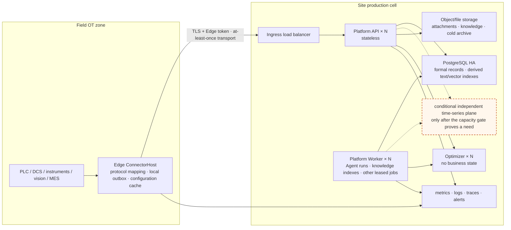

# Production architecture

> Document status: **deployment-reliability baseline and field-extension target**. This page separates current implementation, deployer responsibility, and conditional extensions. The bundled single-host Compose topology is not highly available and does not include equipment-action capability.

This document defines deployment topology, failure models, data semantics, and admission requirements. It is not an installation guide. Ingot is designed as a process R&D and optimization system that one team can host itself. Field connectors are optional. A single-host deployment must state the acceptable outage, data-loss window, and recovery procedure. Sustained production acquisition or high availability also requires verification of the corresponding field failures, site isolation, capacity, and recovery objectives.

## Scope and objective

Reliability requirements stack by scope of use. Not every deployment is an equipment-control system:

1. **Base R&D deployment**: run the Web app, API, Worker, PostgreSQL/TimescaleDB, and Optimizer, and protect configuration, run and quality records, engineer decisions, and knowledge. External business systems do not need to be online. Current recipe recommendations still require admitted real runs and quality evidence. That does not mean a separate hand-maintained record path exists apart from run evidence.
2. **Production-field integration**: deploy Edge when needed, and additionally accept durable acquisition, outage replay, site authorization, data integrity, and the field safety boundary. The platform does not change equipment state directly.
3. **High availability**: when the business cannot accept a single-node outage, or requires a smaller RPO/RTO, deploy and drill multiple replicas, database HA, continuous WAL/PITR, and independent monitoring.

Equipment action is not a default deliverable of these three scopes, and it is not a required next stage for the R&D system. If it is needed later, it must be a separate safety-engineering project. Product priority follows the [Roadmap](project-plan.en.md).

The production architecture must ensure that:

- acknowledged data is not lost inside the declared failure envelope;
- network outages, service restarts, and task replays do not silently change business outcomes;
- every formal conclusion still resolves to the same run, context, inspection, and versioned evidence;
- overload in one site, device, or tenant cannot become a global failure;
- a model, Agent, Platform, or network failure cannot bypass field safety interlocks;
- backups can be restored, upgrades can be stopped, and degraded behavior can be observed and explained.

## Design decisions

### 1. Design production architecture from explicit failure assumptions

The design assumes from the outset that a machine, network, or process can fail. Explicit failure domains isolate data and load. RPO and RTO choose recovery or replica failover. Durable responsibility precedes derived work. Formal records, time-series storage, and stateless compute stay separate.

Ingot applies these production principles:

| Production principle | Ingot design |
|---|---|
| The failure domain is the unit of sharding and isolation | A site production cell, plus logical shards defined by `SiteId / EdgeId / EquipmentId + time` |
| Critical state is recoverable | The base deployment verifies off-host backup and restore; high availability adds database replicas and failover |
| Durability precedes acknowledgement and derivation | Edge local outbox; Platform acknowledges only after a durable transaction commits |
| Control, data, and compute stay separate | Separate formal-record control plane, time-series data plane, and stateless compute plane |
| Consumption resumes from a checkpoint | Replayable durable jobs, consumer cursors, and a quarantine queue |
| Data is tiered by value | Hot raw data, warm aggregates, cold archives, and separate evidence pinning |
| Recovery capability is verified | Manifested application backups, PITR, off-host copies, and regular recovery drills |

### 2. PostgreSQL is the only formal business system of record

PostgreSQL stores:

- identities, permissions, sites, and the equipment catalogue;
- process configuration, analysis plans, and versions;
- process executions, context, and inspection relationships;
- recipe-optimization work, recipe recommendations, engineer decisions, and real-run outcomes;
- Agent runs, input snapshots, recommendations, and evidence hashes;
- reviewed knowledge fragments, retrieval jobs, and rebuildable full-text, similarity, and vector indexes;
- implemented review and audit records.

An equipment-action ledger is not implemented. Complete evidence pinning and tiered deletion protection remain later engineering requirements. They cannot be listed as tables or capabilities that exist today. If those capabilities are built later, PostgreSQL must still store their formal state.

A time-series database may hold raw signals, process frames, and aggregates. It cannot be the only record of approvals, run state, or execution receipts. If time-series storage is unavailable, curve queries and new analysis may pause. No parallel formal state may appear in a browser, Agent, or Optimizer.

### 3. TimescaleDB is the only current implementation; capacity evidence triggers storage evolution

PostgreSQL plus TimescaleDB remains the current implementation. The existing `ITimeSeriesStore` is the storage boundary. Business services depend only on canonical time-series semantics, never on proprietary query objects from a particular engine.

Evaluate and implement an independent time-series data plane only when the same production workload, at the target retention and with two-times capacity headroom, shows that the current data plane cannot meet ingestion, query, recovery-time, or total-cost objectives. During that change:

- the PostgreSQL control plane stays unchanged;
- `SiteId`, `EdgeId`, `EquipmentId`, `ExecutionId`, event time, unit, and quality-code semantics stay unchanged;
- the independent data plane holds only high-frequency raw samples, time-series aggregates, and queries;
- there is no permanent application-level dual write; one durable, replayable ingestion fact projects into the data plane;
- after migration, the old path is removed instead of keeping a compatibility branch with no field consumer.

Before the first production release, this project does not maintain legacy compatibility code. After that release, database and Edge/Platform protocols must support controlled rolling upgrades. That is version-migration discipline, not preservation of a retired product path.

## Target topology

```mermaid
flowchart LR
    subgraph OT["Field OT zone"]
        Sources["PLC / DCS / instruments / vision / MES"]
        Edge["Edge ConnectorHost\nprotocol mapping · local outbox · configuration cache"]
        Sources --> Edge
    end

    subgraph Cell["Site production cell"]
        LB["Ingress load balancer"]
        Api["Platform API × N\nstateless"]
        Worker["Platform Worker × N\nAgent runs · knowledge indexes · other leased jobs"]
        Control["PostgreSQL HA\nformal records · derived text/vector indexes"]
        Series["conditional independent time-series plane\nonly after the capacity gate proves a need"]
        Files["Object/file storage\nattachments · knowledge · cold archive"]
        Optimizer["Optimizer × N\nno business state"]
        Observe["metrics · logs · traces · alerts"]
        LB --> Api
        Api --> Control
        Api -.-> Series
        Api --> Files
        Worker --> Control
        Worker -.-> Series
        Worker --> Optimizer
        Api --> Optimizer
        Api --> Observe
        Worker --> Observe
    end

    Edge -->|"TLS + Edge token · at-least-once transport"| LB
    Edge --> Observe
    classDef future fill:#FFF7ED,stroke:#C2410C,stroke-width:1.5px,stroke-dasharray:5 4
    class Series future
```

This diagram is the high-availability target after field integration. It is not the base-deployment checklist. Default Compose starts one API, one Worker, one database, Optimizer, and the Web app, and Migrator runs a one-time migration. Edge starts from the optional `connector-host` profile. Ingress load balancing, database HA, and TLS termination are provided by the deployer. The dashed orange independent time-series plane is built only after capacity, recovery-time, or cost gates show that the current store is insufficient. Attachments and process knowledge still use persistent file volumes. Object storage is a conditional replacement path, not a base-deployment prerequisite or a second formal business state.

Knowledge sources, review status, and citation metadata are formal records. Full-text, similarity, and vector indexes are rebuildable derived state. When the vector service is unavailable, the analysis assistant keeps the same authorization and review filters and falls back to keyword search. It does not create another knowledge system of record.

### Site production cell

When failures must be isolated across plants, one plant or one campus that can share an outage is an independent production cell. The following is an extension design. It does not mean a cross-site control plane exists today:

- it has its own ingress, Platform, database, file storage, monitoring, and backups;
- Edge is split further by OT security zone, power, network switch, maintenance window, and acceptable acquisition outage;
- raw high-frequency data stays at the site by default and does not create a single ingestion bottleneck through a global center;
- a cross-site control plane synchronizes only permitted configuration packages, versions, health summaries, and de-identified aggregates;
- every cross-site operation carries `SiteId` explicitly and must not depend on a default site.

Multiple sites are not built by making one larger database first. They are built by copying an accepted production cell and bounding each cell's failure radius.

## Data plane

### Edge durability and delivery

Edge uses at-least-once transport. Platform uses idempotent writes. Together they produce a deterministic result. The sequence is fixed:

1. Equipment data is converted into an event with a stable identity, event time, configuration version, and quality flags.
2. Edge commits the event to the local outbox before telling the acquisition caller that it is recorded.
3. Edge uploads batches from the lowest unacknowledged sequence. A timeout or a lost response resends the same event.
4. Platform completes the deduplication key, canonical event, time-series projection, and derived-job dirty mark inside one durable transaction.
5. After commit, Platform returns the batch's maximum sequence `AckSeq` and reports sequence gaps separately with `GapDetected`.
6. Edge advances its local uploaded mark from that acknowledgement and later cleans up by retention policy. Deterministically rejected events are quarantined and keep an audit record.

`EventId` and `(SiteId, EdgeId, Seq)` are both idempotency keys. Replay must keep the event identity and source payload. The same key with a different event identity or payload is an integrity failure and must be rejected. A later value must not overwrite an earlier one. `AckSeq` does not prove that every preceding integer sequence was received. The sender must follow local in-order upload and rejection quarantine. `AckSeq` is not a global watermark for arbitrary out-of-order upload.

### Canonical ingestion envelope

The current contract is the batch request, `ProductionEvent`, and the platform query wrapper together. Not every field below lives on one event object:

| Field | Meaning |
|---|---|
| `SiteId` | Site ownership on the batch request and platform record; required on current ingestion and bound to the Edge token |
| `EdgeId` | Field-node identity, stable after installation |
| `Seq` | Monotonic durable sequence within one Edge |
| `EventId` | Global event identity |
| `OccurredAt` | Source event time; replay does not rewrite it |
| `RecordedAt` | Source-side record time; part of the event content |
| `IngestedAt` | Platform durable receive time; part of the platform query wrapper |
| `SchemaVersion` | Envelope major version; an unknown major version fails closed |
| `AppliedConfiguration` | Immutable `Kind / Id / Version` reference to the configuration Edge actually applied; empty when the event is not configuration-driven |
| `ExecutionId` | Linked real-run identity when it can be determined |
| `PayloadHash` | Canonical payload hash, used for conflict detection |
| `QualityFlags` | Missing, out-of-range, clock, communication, and source quality marks |

Business time uses `OccurredAt`. Platform receive time uses `IngestedAt`. `RecordedAt` cannot replace platform receive time. The platform does not assume event-time order from arrival order.

`PayloadHash` is SHA-256 over the canonical event content. It excludes the transport position `Seq` and the hash field itself. Edge seals the event before local persistence. Platform verifies the hash at the ingestion boundary and, when `(SiteId, EdgeId, Seq)` or `EventId` already exists, also checks the source hash. After Platform adds formal context it reseals the canonical event, so a queried hash can always be recomputed from persisted content. A missing hash, an unknown `SchemaVersion`, or unsorted or illegal quality flags are rejected as contract errors.

### Data ownership and isolation matrix

Table ownership is fixed by the keys and access rules below, not by directory guesswork. Every new table must belong to one class. When a table holds more than one class, the stricter isolation class wins.

| Ownership class | Authoritative key | Current table family | Access and evolution rule |
|---|---|---|---|
| Deployment-global | No `SiteId`; deployment-administrator permission | `users`, `user_sessions`, global type catalogues, shared templates | May store only cross-site identity or reusable definitions; must not store a production run, a field value, or an approval result |
| Site production data | `SiteId`, bound by the Edge token | `platform_edges`; `event_ingest_keys`, `production_events`, `process_sample_frames`, `collection_points`, `data_object_summaries`, `data_object_operation_keys` | Ingestion, query, retention, capacity, and export must name the site; inferring a default site is forbidden |
| Versioned configuration | Configuration identity and version; publication binding points at a site or Edge | `ingestion_tasks`, `ingestion_task_bindings`, `process_data_models`, `process_analysis_plans`, `process_specification_versions`, `signal_definitions` | Definitions may be reused; effective scope is expressed only by an explicit binding; a production event must store the configuration reference actually applied |
| Run-derived data | `ExecutionId`, traceable to a site ingestion fact | `execution_features`, `execution_phases`, analysis materializations and recompute jobs, `operation_context_snapshots` | Not an independent tenant boundary; every external read must resolve the run set from an authorized site scope and must not cross sites by an arbitrary ExecutionId alone |
| Recipe recommendations and knowledge | `SiteId` plus recipe; knowledge sources use `SiteId` only | `research_recipe_recommendation*`, `recipe_recommendation*`, `mechanism_*`, `knowledge_*` | Recommendations, decisions, run links, and mechanism evidence are referenced only inside the same site and recipe; knowledge sources and fragments are retrieved only inside their site |
| Quality and inspection | `SiteId` plus run or inspection-plan relationship | `inspection_*` | Inspection records, scopes, and attachments fix site ownership; authorization is inherited from the linked run; attachments and audit logs cannot be read apart from the parent record |
| Deployment-level R&D assets and evaluation | Dataset, model, or case identity and version; authorized by role | `training_dataset_versions`, `model_evaluations`, `model_drift_readings`, `case_level_evaluations` | There is no separate `SiteId` isolation contract today; do not treat these tables as cross-team or cross-tenant isolation; references to production facts still follow source permissions |
| Agent audit | Initiating user plus input-evidence scope | `agent_runs`, `agent_stream_events`, `problem_cases` | Agent records do not grant new data permissions; replay rechecks the user and site scope |

Current database gates already require `site_id NOT NULL` on canonical ingestion and projection tables, and on Edge registration, inspection records, quality scopes, and inspection attachments. An Edge registration cannot move across sites. Inspection attachments are deduplicated by site and content hash, and reads recheck role and site. Other run-derived tables keep `ExecutionId` ownership so a drift-prone site column is not stored twice. The corresponding API must resolve ExecutionId from site scope first. If that join later becomes an isolation-audit or performance bottleneck, a redundant `SiteId` constrained by a foreign key or trigger may be added. The application must not copy it without a consistency constraint.

### Out-of-order, gaps, and late data

- A sequence gap is recorded immediately, but valid events after it are not blocked forever.
- Current ingestion returns the maximum acknowledged sequence for the batch and records gaps. Gap detection is not proof that a run is complete.
- The current ingestion transaction marks affected runs and queues derived processing. A complete allowed-lateness window and watermark are still to be built.
- A later watermark design must keep late facts and determine the recompute range of affected runs.
- A later complete-replay contract must include the input range, configuration version, and algorithm version in a traceable recompute identity.
- Data that cannot be parsed, is out of bounds, or violates the contract enters quarantine. It cannot be disguised as successful ingestion, and it cannot block later valid data.

### Cross-store consistency

TimescaleDB and formal records currently share PostgreSQL, so the deduplication key, canonical event, time-series values, and derived-job marks can commit in one database transaction. If an independent time-series plane is adopted later, two client calls must not pretend to be an atomic dual write. A durable ingestion log comes first:

1. Platform commits the canonical envelope and payload to the PostgreSQL ingestion log, and acknowledges Edge only after that commit.
2. An independent projector writes the time-series plane idempotently by log sequence and updates the data-plane checkpoint.
3. Another idempotent projector completes business events and run state inside PostgreSQL.
4. Data is marked analyzable only after every required projection has passed that sequence.
5. The ingestion log is not deleted before projection completes, backup requirements are met, and the replay window expires.
6. Query results return, or internal records store, the data-plane checkpoint, so data still being projected is not reported as complete.

If a short-term PostgreSQL ingestion log cannot carry a measured external time-series load, a durable message log may replace that implementation. Acknowledgement semantics, checkpoints, and replay invariants stay the same. An Edge acknowledgement means Platform has taken durable responsibility. It does not mean every derived view is already visible.

### Shards, quotas, and backpressure

The following are capacity targets for sustained production ingestion. Complete fair quotas are not implemented. The logical isolation dimensions are `SiteId / EdgeId / EquipmentId + time`. Physical sharding is chosen by the store. Capacity engineering must expose:

- write rate, storage, query cost, and backlog age for each site, Edge, and piece of equipment;
- per-site connection count, concurrent queries, background recompute, and Optimizer budget;
- hot shards, disk watermarks, and replica lag;
- configurable fair scheduling and hard limits.

At a soft watermark, restrict interactive wide queries and background recompute first. At a hard watermark, stop accepting new non-critical analysis jobs. Production acquisition must not "protect" the platform by dropping data without a log. When local Edge capacity is insufficient, execute the preconfigured field policy and emit an indelible discard audit and alert.

## Control plane and asynchronous compute

Platform API does not keep formal business records in process memory. Chat and Agent work, knowledge processing, and analysis projection currently use durable PostgreSQL jobs. That does not mean every synchronous API request can resume in the background. Work that must continue across restarts should meet the following rules. Retry, dead letter, and replay must be verified per job type:

- a job may be claimed more than once, but its business effect must be idempotent;
- only the holder of the current lease may submit completion;
- after a process exits and the lease expires, another Worker may take over;
- an exhausted retry budget enters dead letter and does not retry forever;
- manual replay emits a new audit event and keeps the original failure;
- job payloads reference immutable inputs or content hashes, never process-local objects.

Kafka, NATS, or a similar broker is not a prerequisite for production. Introduce one only after PostgreSQL leased jobs fail measured throughput, isolation, or cross-system subscription requirements. A broker still does not replace formal business transactions or audit records.

Optimizer and model services hold no business state. Their failure affects only new numerical recommendations or explanations, not acquisition, inspection, approval, or reading existing records. Calls require a timeout, circuit breaking, a total budget, and an input hash. Automatic retry is limited to calls proven idempotent.

## Conditional boundary for equipment action

The current product provides records, analysis, recommendations, and engineer decisions. It has no action ledger, signed dispatch, Safety Executor, or equipment-write loop. Adopting a recommendation is not approval of an equipment action, and it does not send parameters to equipment.

If equipment action is chartered separately later, action identity, independent approval, parameter freeze, time limits, signatures, idempotent receipts, actual-value readback, stop, and recovery must be designed again. Agent does not connect to equipment and does not hold equipment credentials. Optimizer does not approve or execute. Field hardware interlocks stay independently effective. Each equipment class and action needs its own safety validation. Analysis capability, or the deployment acceptance in this document, is not admission for equipment action.

That direction is not a completion condition for the current deployment. Implementation priority is in the [Roadmap](project-plan.en.md).

## Storage lifecycle

The tiers below are a storage target, not a completed capability. Event retention and compression in default Compose are off. Reference protection, recovery, and capacity must be verified before they are enabled. Full hot/warm/cold tiering, evidence pinning, and deletion protection are still unfinished.

| Tier | Content | Default design |
|---|---|---|
| Hot | Recent raw events, process frames, and values | Online time-series storage for run detail and recent analysis |
| Warm | Downsampled data, features, and run-level aggregates | Compression or continuous aggregation for common comparisons |
| Cold | Expired raw data and large attachments | Immutable object archive with checksums |
| Pinned evidence | Inputs referenced by a report, approval, or formal conclusion | Separate retention and legal hold, not deleted by ordinary time-series policy |

A retention job resolves references before deleting data. Every deletion records its range, policy version, actor, count, and verification result. If formal evidence depends on raw data approaching expiry, create a verifiable evidence package first. It contains at least the query range, canonical data, units, quality codes, source versions, and content hash.

TimescaleDB chunks, compression, and retention policies govern physical lifecycle only. They do not replace business evidence pinning.

## High availability and disaster recovery

### Choose topology by availability objective

A base deployment may use one API, one Worker, and one PostgreSQL, but it must record the acceptable outage and RPO/RTO, protect persistent volumes, identity, and keys, and measure recovery. After field integration is enabled, also protect the Edge outbox, identity, configuration cache, and offline capacity. Single-host recovery is not high availability.

Use the high-availability targets below only when the deployment claims continued service during a single-node failure:

| Component | High-availability target | Permitted degradation |
|---|---|---|
| Edge, when enabled | Independent process and persistent volume per field failure domain | Continue local acquisition while Platform is unavailable, within accepted offline capacity |
| Platform API | At least two stateless replicas with health removal | One replica failure does not stop ingestion |
| Platform Worker | At least two replicas that can compete for leases | Jobs are delayed; persisted jobs are not lost |
| PostgreSQL/TimescaleDB | Drilled HA primary/standby or a managed equivalent | Writes may pause briefly during failover |
| File storage and keys | Evidence files and matching keys reachable by every instance, plus off-host backup | New attachments pause; existing evidence is not lost |
| Optimizer | One or more instances with no business state | New numerical recommendations pause; core records continue |
| Monitoring and alerting | Independent of the monitored processes | A core failure can still emit an alert |

Replica count, synchronization, and automatic failover are chosen by RPO, RTO, and failure domain. Object storage is not the only choice. The existing `verify-production-acceptance.sh` targets a sustained production site and still requires database HA, PITR, and related evidence. It is not the general acceptor for a base R&D deployment.

### Backup and recovery

- Application-consistent logical backups support migration, audit, and full-restore validation.
- When point-in-time recovery is required, configure PostgreSQL base backups and continuous WAL archiving. The existing production-site acceptance script requires PITR evidence.
- Backups, attachments, and key-recovery instructions are kept off-host under production-grade access control.
- At least one backup cannot be overwritten with ordinary production-administrator credentials.
- Every drill records the target time, actual RPO, actual RTO, missing objects, and hash verification.
- A backup that has never passed a recovery drill does not count as production-admission evidence.

Recovery order is control plane, file evidence, time-series data plane, derived jobs, and finally write ingress. Derived results may be rebuilt from canonical facts and should not be the only copy that blocks recovery.

## Failure behavior

Accept the behavior below for the components that are enabled and for the declared availability objective. A base single-host deployment may recover inside the recorded RTO. A high-availability deployment must also drill removal from the load balancer and failover.

| Failure | Required behavior | Forbidden behavior |
|---|---|---|
| Edge loses Platform connectivity | Edge keeps writing locally and resumes from its checkpoint | Silent loss, or retransmission under a new event identity |
| A Platform API instance exits | The base deployment restarts it; a high-availability deployment removes the instance; clients retry under the idempotent contract | A committed transaction returns a permanent failure or produces a duplicate business effect |
| A Worker exits during a job | After lease expiry, recovery or another Worker takes over | The job stays running forever |
| Optimizer or the model is unavailable | An Optimizer failure pauses new numerical recommendations; a model failure affects assistant answers and shows an explicit status | Acquisition, inspection, or historical-fact reads are blocked |
| The database primary fails | Recover or fail over by the drilled policy, and expose how long writes were unavailable | Acknowledge Edge while persistence is unavailable |
| Disk approaches capacity | Alert, restrict jobs and wide queries, and execute the capacity plan | Delete formal evidence without an audit record |
| Clock drift | Mark quality and pause analysis that depends on precise time | Rewrite source event time to hide the problem |
| A storage replica lags | Restrict read consistency or route to the primary | Treat a stale record or review status as current |

## Security and observability

Edge currently uses a Bearer token bound to the site and node. Transport across hosts must be terminated with TLS by the deployer. Mutual TLS may be an additional control. The repository does not provide certificate issuance or revocation. Model API keys are currently encrypted with Data Protection and stored in the database; recovery needs the matching keys. Other equipment credentials should be injected under the deployment instructions. Do not claim that every setting stores only a secret reference. Equipment networks, the database, Optimizer, metrics, and administration entry points restrict network access separately.

Define the following SLIs for the components that are enabled. Replica and WAL metrics apply only to the matching topology. This list does not mean the reference monitoring already covers every item:

- ingestion success, durable acknowledgement latency, and backlog age for each Edge;
- duplicate, sequence-gap, out-of-order, late, and quarantined event counts;
- end-to-end freshness from `OccurredAt` to data that can be queried and analyzed;
- run completeness, plus context and inspection-link coverage;
- database replica lag, WAL archive delay, disk watermarks, and pool wait;
- Worker queue age, lease expiry, retry, and dead letter;
- Optimizer timeout, circuit state, and compute budget.

Logs, metrics, and traces carry the applicable `SiteId`, `EdgeId`, `ExecutionId`, configuration version, and request `traceId`. Every alert names an actionable object and a runbook.

## Capacity and production admission

### Workload model

Before launch, every site fills in and versions:

- counts of Edge instances, equipment, concurrent runs, and signals;
- normal, peak, and outage-replay event and byte rates;
- raw-sample retention, aggregate resolution, and expected compression;
- maximum interactive query range, concurrent users, and background jobs;
- maximum outage duration and available Edge disk;
- RPO, RTO, acceptable freshness, and maintenance windows.

Capacity acceptance runs at no less than twice the production peak, and includes ingestion, common queries, aggregation, backup, and one node failure at the same time. Average throughput cannot replace tail latency, backlog age, and recovery time.

### Hard admission gates

A base R&D deployment first verifies identity and permissions, restore of persistent volumes and matching keys, capacity, alerting, and restart recovery of jobs already accepted, and states the acceptable outage window.

When a production site stays connected and uses the existing production-acceptance script, also prove that:

1. acknowledged data meets the declared RPO under the declared single-node failure;
2. Edge has no silent loss during the target outage, and replay creates no duplicate business effect;
3. duplicates, out-of-order data, late data, and replay produce deterministic results;
4. PITR and full application recovery meet RTO, and evidence hashes match;
5. one site's hotspot cannot exhaust another site's budget or the critical-ingestion budget;
6. backup, monitoring, certificate rotation, and upgrade rollback each have a runbook;
7. an agreed observation period completes without an unexplained data gap.

Equipment action is outside this acceptance. If it is chartered later, its safety admission must be defined separately. Production-observation acceptance does not authorize equipment writes.

## Current implementation and later engineering

### Current implementation calibration

| Scope | Current repository fact | Still required from the deployer or a later phase |
|---|---|---|
| Ingestion and evidence contract | Site binding, canonical-event validation, configuration version, quality flags, content hash, and idempotency constraints are implemented | Complete tiered evidence pinning and deletion protection; data-integrity acceptance on a real site |
| Base recovery | Consistent logical backup and restore, checksums, optional monitoring, and limited API, Worker, and Optimizer failure drills are provided | Protect and restore Data Protection keys, Edge data, and field configuration separately; verify the real recovery objective |
| High availability | Formal job state for API and Worker is persisted, which is the base for scaling | Default Compose has no ingress load balancer, database HA, continuous WAL/PITR, off-host immutable backup, or object storage |
| Data plane | Edge outbox, idempotent ingestion, deterministic-rejection quarantine, derived processing, background leases, and part of dead letter exist | Lateness watermarks, a complete recompute and replay operations surface, hot/warm/cold lifecycle, and fair quotas |
| Equipment action | Analysis tools are read-only, Optimizer does not approve or execute, and an engineer decision does not write to equipment | Action ledger, signed dispatch, safety executor, and the equipment-execution loop are not implemented, and they are not on the default roadmap |

"Implemented" means code, tests, or deployment assets exist in the repository. It does not mean a site has passed capacity, recovery, HA, security, or sustained-observation acceptance. This page does not define a second P0–P3 product priority. Build order follows the [Roadmap](project-plan.en.md).

### Triggers for later engineering

- **Base deployment**: finish permissions, keys, backup and restore, capacity, and alerting first. Do not wait for equipment action or an independent time-series store.
- **Sustained field acquisition**: finish offline capacity, replay, deterministic replay, data-gap, and site-isolation drills, and record the evidence with the existing production-acceptance script.
- **Higher availability or a smaller recovery window**: provide shared files and keys, multiple replicas, ingress removal, database HA, and the required PITR, and measure RPO and RTO for each item.
- **Retention and capacity pressure**: finish reference protection, lifecycle, recompute, and fair quotas first, then use a real load to decide whether an independent time-series plane is required.

Every engineering change needs a migration, tests, a runbook, and a rollback point. Do not claim production admission because code or a script exists when there is no field evidence.

## Explicit non-goals

- Do not turn Ingot into a general SCADA, MES, equipment interlock, or safety PLC.
- Do not use a message broker to hide an unclear transaction boundary.
- Do not split one site's data across stores merely to appear distributed.
- Do not let the time-series data plane, Optimizer, Agent, or a browser become a second business system of record.
- Do not promise end-to-end exactly-once transport. Use at-least-once transport with idempotent business effects.
- Do not keep two long-lived production data paths without capacity evidence.
- Do not treat the lack of legacy users as permission to omit migration, recovery, and rollback discipline after the first production release.

See [Deployment](deployment.en.md) for operations, [System design](design.en.md) for stable business boundaries, and [Scenario evaluation](rollout.en.md) for scientific evaluation of a real scenario.
