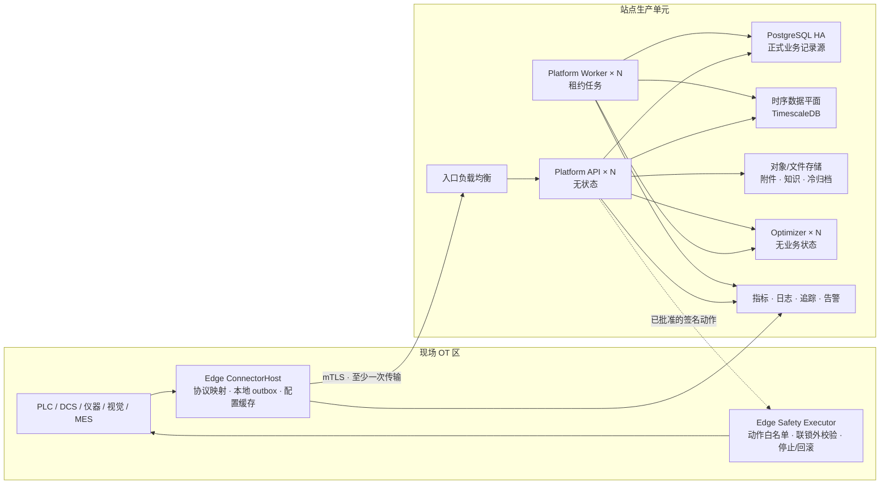

# 生产架构

> 文档状态：**目标设计与实施基线**。本文定义 Ingot 从研发验证环境进入长期生产运行必须满足的故障模型、数据语义、安全边界和验收门槛；它不表示仓库自带的单机 Compose 已经达到高可用。

## 范围与目标

Ingot 支撑生产，不等于把模型直接接到 PLC，也不等于把 PostgreSQL 换成另一种时序数据库。生产能力分为两个独立等级：

1. **生产观测与决策支持**：持续采集真实运行，完成追溯、比较、诊断、影子建议和受控实验；平台不直接改变设备状态。
2. **受控行动**：在前一级长期稳定且相应场景通过准入后，把已批准的结构化动作交给 Edge，在现场联锁之外再次执行确定性校验、限幅、停止和回滚。

默认交付目标是第一级。第二级必须按设备类别和动作类型单独认证，不能因分析能力上线而自动获得。

生产架构必须保证：

- 已确认的数据在声明的故障范围内不丢失；
- 网络中断、服务重启和任务重放不会静默改变业务结果；
- 每项正式结论仍能回到同一份运行、上下文、检验和版本化证据；
- 单个站点、设备或租户的过载不会扩散成全局故障；
- 模型、Agent、Platform 或网络异常不能绕过现场安全联锁；
- 备份可以恢复，升级可以停止，降级行为可以被监控和解释。

## 设计决策

### 1. 从故障假设出发设计生产架构

生产系统从一开始就假设单机、网络和单个进程可能失效：用明确的故障域隔离数据和负载，用同步副本与可演练的故障切换处理节点故障，先取得持久责任再驱动派生处理，并把正式记录、时序存储和无状态计算职责分开。

Ingot 采用以下生产原则：

| 生产原则 | Ingot 设计 |
|---|---|
| 故障域是分片与隔离单位 | 站点生产单元和按 `SiteId / EdgeId / EquipmentId + time` 定义的逻辑分片 |
| 关键状态具备冗余 | PostgreSQL/时序存储的同步副本与明确的故障切换策略 |
| 持久化先于确认和派生 | Edge 本地 outbox；Platform 在持久事务提交后才确认 |
| 控制、数据和计算职责分离 | 正式记录控制平面、时序数据平面、无状态计算平面分离 |
| 消费可断点续传 | 可重放的持久任务、消费游标和隔离队列 |
| 数据按价值分层 | 热原始数据、温聚合数据、冷归档和独立的证据固定 |
| 恢复能力必须验证 | 带清单的应用备份、PITR、异机副本和定期恢复演练 |

### 2. PostgreSQL 是唯一正式业务记录源

PostgreSQL 保存：

- 身份、权限、站点和设备目录；
- 工艺配置、分析方案和版本；
- 过程执行、上下文和检验关系；
- 研发项目、实验、审批和状态机；
- Agent 运行、输入快照、建议和证据哈希；
- 受控动作、执行回执、停止与回滚结果；
- 数据保留、证据固定和审计策略。

时序数据库可以保存原始测点、过程帧和聚合，但不能成为审批、实验状态或执行回执的唯一记录源。时序存储不可用时允许暂停曲线查询和新分析，不能转而在浏览器、Agent 或 Optimizer 内形成平行正式状态。

### 3. TimescaleDB 是当前唯一实现，存储演进由容量证据触发

当前继续使用 PostgreSQL + TimescaleDB。现有 `ITimeSeriesStore` 是存储边界，业务服务只能依赖规范化时序语义，不能依赖具体存储引擎的专有查询对象。

只有当同一份生产负载在目标保留期和两倍容量余量下证明当前数据平面无法满足写入、查询、恢复时间或总成本目标，才评估并实施独立时序数据平面。切换时：

- PostgreSQL 控制平面保持不变；
- `SiteId`、`EdgeId`、`EquipmentId`、`ExecutionId`、事件时间、单位和质量码语义保持不变；
- 独立数据平面只承载高频原始采样、时序聚合和查询；
- 不建立永久的应用层双写；由一个已持久化、可重放的摄入事实投影到数据平面；
- 迁移完成后删除旧实现路径，不长期保留无现场消费者的兼容分支。

新项目在首次生产发布前不维护历史兼容代码；首次生产发布之后，数据库和 Edge/Platform 协议必须支持受控滚动升级。这里要求的是版本迁移纪律，不是保留废弃产品路径。

## 目标拓扑



### 站点生产单元

一个生产单元是最小独立故障域，通常对应一个工厂或一个可以共同中断的厂区：

- 有自己的入口、Platform、数据库、文件存储、监控和备份；
- Edge 按 OT 安全区、电源、交换机、维护窗口和可接受停采范围继续拆分；
- 原始高频数据默认留在站点，不经由全局中心形成单点摄入瓶颈；
- 跨站点控制面只同步允许的配置包、版本、健康摘要和脱敏聚合；
- 任何跨站点操作都显式携带 `SiteId`，禁止依赖默认站点。

多站点不是先建设一个更大的数据库，而是复制已验收的生产单元并控制每个单元的故障半径。

## 数据平面

### Edge 持久化与上送

Edge 使用至少一次传输，Platform 使用幂等写入，两者共同获得确定性结果。流程固定为：

1. 设备数据先转换为带稳定身份、事件时间、配置版本和质量标记的事件；
2. Edge 先把事件提交到本地 outbox，再向采集调用方报告已记录；
3. Edge 从最小未确认序号开始批量上送；超时或响应丢失时重发同一事件；
4. Platform 在一个持久事务内完成去重键、规范事件、时序投影和派生任务脏标记；
5. 事务提交后 Platform 才返回累计 `AckSeq`；
6. Edge 只删除或归档不大于 `AckSeq` 的记录。

`EventId` 与 `(EdgeId, Seq)` 都是幂等键。相同键和相同载荷是重复上送；相同键和不同载荷是数据完整性故障，必须拒绝并报警，不能以后到值覆盖以前值。

### 规范摄入信封

首次生产版本必须把下列字段固定为跨存储契约：

| 字段 | 语义 |
|---|---|
| `SiteId` | 数据所属生产单元；进入生产后必填 |
| `EdgeId` | 安装后稳定不变的现场节点身份 |
| `Seq` | 同一 Edge 内单调递增的持久序号 |
| `EventId` | 全局事件身份 |
| `OccurredAt` | 来源事件时间，不因补传改写 |
| `ReceivedAt` | Platform 持久接收时间 |
| `SchemaVersion` | 信封主版本；未知主版本失败关闭 |
| `AppliedConfiguration` | Edge 生成事件时实际应用的 `Kind / Id / Version` 不可变配置引用；无配置驱动事件可以为空 |
| `ExecutionId` | 能确定时关联的真实运行身份 |
| `PayloadHash` | 规范化载荷哈希，用于冲突检测 |
| `QualityFlags` | 缺失、超范围、时钟、通信和来源质量标记 |

业务时间使用 `OccurredAt`，摄入延迟和运维判断使用 `ReceivedAt`。平台不按到达顺序假设事件时间顺序。

`PayloadHash` 是对规范化事件内容计算的 SHA-256，不包含传输位置 `Seq` 和哈希字段自身。Edge 在本地落盘前封印事件；Platform 在摄入边界验证哈希，并在 `(SiteId, EdgeId, Seq)` 或 `EventId` 已存在时同时核对来源哈希。平台补充正式上下文后重新封印规范事件，因此查询返回的哈希始终能由持久化内容复算。缺失哈希、未知 `SchemaVersion`、未排序或非法的质量标记一律按契约错误拒绝。

### 数据归属与隔离矩阵

数据库表的归属不是按目录猜测，而由以下键和访问规则固定。任何新表必须先归入一类；同时包含多类数据时，以隔离更严格的一类为准。

| 归属类 | 权威归属键 | 当前表族 | 访问与演进规则 |
|---|---|---|---|
| 部署全局 | 无 `SiteId`；部署管理员权限 | `users`、`user_sessions`、全局类型目录、通用模板 | 只能保存跨站点身份或可复用定义，不得写入某次生产运行、现场值或审批结果 |
| 站点生产数据 | `SiteId`，并由 Edge token 绑定 | `platform_edges`；`event_ingest_keys`、`production_events`、`process_sample_frames`、`collection_points`、`data_object_summaries`、`data_object_operation_keys` | 摄入、查询、保留、容量和导出都必须显式指定站点；禁止推断默认站点 |
| 版本化配置 | 配置身份与版本；发布绑定指向站点/Edge | `ingestion_tasks`、`ingestion_task_bindings`、`process_data_models`、`process_analysis_plans`、`process_specification_versions`、`signal_definitions` | 定义可以复用；生效范围只能通过显式绑定表达，生产事件必须保存实际应用的配置引用 |
| 运行派生数据 | `ExecutionId`，可追溯到站点摄入事实 | `execution_features`、`execution_phases`、分析物化与重算任务、`operation_context_snapshots` | 不作为独立租户边界；所有外部读取必须从已授权站点范围解析运行集合，禁止仅凭任意 ExecutionId 越站点读取 |
| 研发项目与证据 | `ProjectId` + 项目成员/角色 | `process_research_*`、`research_*`、`mechanism_*`、`knowledge_*`、`dataset_quality_validation_reports` | 项目可以引用一个或多个获授权站点的数据范围；证据保留原站点与运行来源，不因复制进项目而改变归属 |
| 质量与检验 | 运行/项目/检验计划关系 | `inspection_*`、`case_level_evaluations`、`model_evaluations`、`model_drift_readings` | 授权范围从关联运行或项目继承；附件和审核日志不能脱离父记录单独访问 |
| Agent 审计 | 发起用户 + 输入证据范围 | `agent_runs`、`agent_stream_events`、`golden_question_*`、`problem_cases` | Agent 记录不授予新数据权限；回放时重新验证用户、项目和站点范围 |

当前数据库门禁已经强制六张规范摄入/投影表的 `site_id NOT NULL`。运行派生表保留 `ExecutionId` 归属，是为了避免重复存储可漂移的站点字段；对应 API 必须先用站点范围解析 ExecutionId。未来若测得该联接成为隔离审计或性能瓶颈，可以增加受外键/触发器约束的冗余 `SiteId`，但不能在应用层自行复制而缺少一致性约束。

### 乱序、缺口和迟到数据

- 序号缺口立即记录，但不把其后的有效事件永久阻塞；
- 每个 Edge 维护最大已见事件时间和最大连续确认序号；
- 派生分析声明自己的允许迟到窗口和水位线；
- 水位线之后到达的数据保留为事实，并把受影响的运行标记为需要重算；
- 重算以输入范围、配置版本和算法版本形成幂等键；
- 无法解析、越界或契约错误的数据进入隔离区，不能伪装成成功摄入，也不能阻塞后续有效数据。

### 跨存储一致性

当前 TimescaleDB 与正式记录共用 PostgreSQL，因此去重键、规范事件、时序值和派生任务标记可以在同一数据库事务提交。若未来采用独立时序数据平面，禁止用两个客户端调用冒充原子双写，必须先增加持久摄入日志：

1. Platform 把规范信封和载荷提交到 PostgreSQL 摄入日志，提交后才向 Edge 确认；
2. 独立投影器以日志序号幂等写入时序数据平面，并更新数据平面检查点；
3. 业务事件和运行状态由另一幂等投影在 PostgreSQL 内完成；
4. 只有所有必需投影越过该序号，数据才标记为“可分析”；
5. 摄入日志在投影完成、备份满足和重放窗口到期前不得删除；
6. 查询结果返回或内部记录所用数据平面检查点，避免把仍在投影的数据误报为完整。

如果短期 PostgreSQL 摄入日志无法承受已经实测的外部时序负载，才以持久消息日志替换这一实现；确认语义、检查点和重放不变量保持不变。Edge 的确认表示 Platform 已取得持久责任，不表示所有派生视图已经同步可见。

### 分片、配额与背压

逻辑分片键为 `SiteId / EdgeId / EquipmentId + time`。具体物理分片由存储实现决定，但必须暴露：

- 每个站点、Edge 和设备的写入率、存储量、查询成本和积压年龄；
- 单站点连接数、并发查询、后台重算和 Optimizer 预算；
- 热点分片、磁盘水位和副本延迟；
- 可配置的公平调度和硬上限。

达到软水位时先限制交互式大查询和后台重算；达到硬水位时停止接受新的非关键分析任务。生产采集不得通过无日志丢弃来“保护”平台。Edge 本地容量不足时执行预注册的现场策略，并产生不可抹除的丢弃审计与告警。

## 控制平面与异步计算

Platform API 保持无状态；所有需要在重启后继续的工作都进入 PostgreSQL 持久任务。Worker 使用租约、心跳、有限重试、指数退避和死信状态：

- 一个任务可以被多次领取，但业务效果必须幂等；
- 领取者只有持有当前租约才能提交完成；
- 进程退出后租约过期，其他 Worker 可以接管；
- 达到重试预算后进入死信，不无限重试；
- 人工重放生成新的审计事件，但保留原失败记录；
- 任务载荷引用不可变输入或内容哈希，不能依赖进程内对象。

Kafka、NATS 或类似消息系统不是生产化的前置条件。只有在 PostgreSQL 租约任务经过压测后无法满足吞吐、隔离或跨系统订阅需求时才引入；引入后仍不能取代正式业务事务和审计记录。

Optimizer 与模型服务无业务状态。失败只影响新的数值建议或解释，不影响采集、检验、审批和既有记录读取。调用必须有超时、熔断、总预算和输入哈希；自动重试只能用于已证明幂等的调用。

## 受控行动平面

### 不越过的边界

- Agent 不直连设备，不持有设备凭据；
- Optimizer 只返回候选，不批准、不调度、不确认执行；
- Platform 记录和授权动作，但不取代 PLC、DCS 或安全系统；
- Edge Safety Executor 是 Ingot 内唯一允许调用白名单设备写操作的组件；
- 设备硬联锁、急停和安全 PLC 独立于 Ingot 存在，且优先级更高。

### 动作状态机

```text
Proposed
  → Approved
  → Dispatched
  → EdgeValidated
  → Applied → Verified
       └→ RollbackRequested → RolledBack / RollbackFailed

Approved / Dispatched / EdgeValidated
  └→ Rejected / Failed / Expired / Cancelled
```

状态只能通过命令转换，不能用通用更新接口任意覆盖。创建者不能批准自己的动作；`Approved` 之后参数、证据、目标和版本冻结。重复调度同一 `IdempotencyKey` 只能返回原动作状态，不能再次写设备。

### 动作信封

受控动作至少包含：

- `ActionId`、`IdempotencyKey`、`SiteId`、`EdgeId` 和目标设备；
- 白名单动作类型与版本；
- 参数、单位、允许范围和期望当前值；
- 工艺配置版本、运行身份和适用上下文；
- 输入证据哈希、建议版本、批准人与批准时间；
- `NotBefore`、`ExpiresAt`、最大执行时长和停止条件；
- 回滚动作或明确的不可自动回滚声明；
- Platform 签名和证书标识。

Edge 在执行前重新校验签名、时间窗、目标、当前状态、配置版本、参数范围、速率限制和现场允许窗口。校验失败返回结构化拒绝回执。网络断开时默认不启动新动作；已经开始的动作按本地停止策略结束，不等待云端决定。

实际应用值从设备回读，不能用请求值替代。执行回执包含动作哈希、设备确认值、开始/结束时间、操作者、结果、停止原因和回滚结果，并进入 PostgreSQL 正式记录。

## 存储生命周期

| 层级 | 内容 | 默认设计 |
|---|---|---|
| 热 | 近期原始事件、过程帧和值 | 在线时序存储，支持运行详情和近期分析 |
| 温 | 降采样、特征、运行级聚合 | 压缩或连续聚合，支持常用比较 |
| 冷 | 到期原始数据、附件大对象 | 带校验和的不可变对象归档 |
| 固定证据 | 被报告、审批、黄金问题或正式结论引用的输入 | 独立保留策略和法律保留，不随普通时序策略删除 |

保留任务必须先计算引用关系，再删除数据。任何删除都生成范围、策略版本、执行者、数量和校验结果。正式证据如果依赖即将过期的原始数据，应先生成可验证证据包，至少包含查询范围、规范数据、单位、质量码、来源版本和内容哈希。

TimescaleDB 的分块、压缩和保留策略只负责物理生命周期；不能代替业务证据固定。

## 高可用与灾难恢复

### 生产拓扑最低要求

| 组件 | 最低生产形态 | 允许的降级 |
|---|---|---|
| Edge | 每个故障域独立进程和持久卷 | Platform 不可用时继续本地采集 |
| Platform API | 至少两个无状态副本和健康摘除 | 单副本故障不影响接入 |
| Platform Worker | 至少两个可竞争租约的副本 | 任务延迟，不丢任务 |
| PostgreSQL/TimescaleDB | 经演练的 HA 主备或托管等价能力 | 故障切换期间短时停止写入 |
| 文件/对象存储 | 副本或异机备份，内容校验 | 新附件暂停，不丢既有证据 |
| Optimizer | 一个或多个无状态实例 | 暂停新建议，核心业务继续 |
| 监控告警 | 独立于被监控进程 | 主业务故障仍可发出告警 |

数据库是否采用三节点、同步副本数量和自动故障切换方式，由现场 RPO/RTO 决定；不能只根据“容器还在运行”宣称高可用。

### 备份与恢复

- 应用一致逻辑备份用于迁移、审计和全量恢复验证；
- PostgreSQL 基础备份和持续 WAL 归档用于 PITR；
- 备份、附件和密钥恢复说明保存在异机并按生产级权限保护；
- 至少一份备份不可被生产管理员的普通凭据覆盖；
- 每次演练记录目标时间点、实际 RPO、实际 RTO、缺失对象和哈希核对结果；
- 未执行恢复演练的备份不计入生产准入证据。

恢复顺序是控制平面、文件证据、时序数据平面、派生任务，最后开放写入口。派生结果允许从规范事实重建，不应成为阻塞恢复的唯一副本。

## 故障行为

| 故障 | 必须发生 | 禁止发生 |
|---|---|---|
| Edge 与 Platform 断网 | Edge 继续落盘，恢复后从断点补传 | 静默丢弃或生成新的事件身份重传 |
| Platform API 实例退出 | 负载均衡摘除实例，客户端重试同一幂等请求 | 已提交事务返回永久失败或重复产生业务效果 |
| Worker 执行中退出 | 租约过期后由其他 Worker 接管 | 任务永久卡在运行中 |
| Optimizer/模型不可用 | 暂停新建议，展示明确状态 | 阻止采集、检验或历史事实读取 |
| 数据库主节点故障 | 按已演练策略切换并暴露写入不可用时间 | 在无法持久化时仍向 Edge 确认成功 |
| 磁盘逼近上限 | 告警、限制作业和大查询、执行容量预案 | 无审计删除正式证据 |
| 时钟漂移 | 标记质量、暂停依赖精确时间的分析或动作 | 自动改写来源事件时间掩盖问题 |
| 动作回执丢失 | 以同一幂等键查询或补传原回执 | 重复执行设备写操作来“确认”状态 |
| 存储副本延迟 | 限制读一致性或路由到主节点 | 用过期审批状态执行动作 |

## 安全与可观测性

Edge 与 Platform 使用双向 TLS 或现场等价的设备身份机制，每个 Edge 独立证书、令牌和撤销状态。敏感配置只保存密钥引用；设备网络、数据库、Optimizer、指标和管理入口分别限制网络访问。

生产至少建立以下 SLI：

- 摄入成功率、持久确认延迟和每个 Edge 的积压年龄；
- 重复、序号缺口、乱序、迟到和隔离事件数；
- 从 `OccurredAt` 到可查询、可分析的端到端新鲜度；
- 运行完整率、上下文和检验关联覆盖率；
- 数据库副本延迟、WAL 归档延迟、磁盘水位和连接池等待；
- Worker 队列年龄、租约超时、重试和死信；
- Optimizer 超时、熔断状态和计算预算；
- 动作审批等待、调度延迟、拒绝、超时、停止、回滚和回执完整率。

日志、指标和追踪统一携带 `SiteId`、`EdgeId`、`ExecutionId`、`ActionId`、配置版本和请求 `traceId` 中适用的字段。报警必须指向可处理的对象和运行手册。

## 容量与生产准入

### 负载模型

每个现场在上线前填写并版本化：

- Edge、设备、并发运行和测点数量；
- 正常、峰值和故障补传时的事件率与字节率；
- 原始采样保留期、聚合粒度和压缩预期；
- 最大交互查询范围、并发用户和后台任务数；
- 最大断网时间和 Edge 可用磁盘；
- RPO、RTO、可接受的新鲜度和维护窗口。

容量验收用生产峰值的至少两倍进行，且同时包含摄入、常用查询、聚合、备份和一个节点故障。平均吞吐不能替代尾延迟、积压年龄和恢复时间。

### 硬性准入门槛

进入生产观测前必须证明：

1. 在声明的单节点故障下，已确认数据满足 RPO；
2. 目标断网时长内 Edge 不静默丢数据，补传后无重复业务效果；
3. 重复、乱序、迟到和重放得到确定性结果；
4. PITR 与完整应用恢复演练满足 RTO，且证据哈希一致；
5. 单站点热点不会耗尽其他站点或关键摄入预算；
6. 备份、监控、证书轮换和升级回滚均有运行手册；
7. 至少连续运行一个约定观察周期，未出现未解释的数据缺口。

进入受控行动还必须证明：

1. 任意 Agent、API 或数据库账户都不能绕过 Edge Safety Executor；
2. 动作重复投递不会重复写设备；
3. 过期、错目标、错版本、越界和状态不符动作全部失败关闭；
4. 实际值回读、停止、回滚和回执在断网与重启后仍可恢复；
5. 现场硬联锁独立有效，并完成真实或等价台架演练；
6. 从影子到单步人工批准，再到有界自动化逐级取得准入，不跨级开放。

## 实施顺序

### P0：固定生产契约

- 增加 `SiteId`、规范摄入信封和未知主版本拒绝规则；
- 把 RPO、RTO、积压、新鲜度和容量包络变成部署必填配置与验收工件；
- 为正式证据增加固定和删除保护；
- 补齐故障矩阵对应的自动化测试与现场演练脚本。

### P1：建立可恢复的生产单元

- 部署多副本 API/Worker、入口负载均衡和经演练的 PostgreSQL HA；
- 配置基础备份、持续 WAL 归档、异机不可变保留和 PITR 演练；
- 把附件与冷数据迁入有校验和的对象存储；
- 建立站点、Edge、队列、数据库和磁盘容量仪表板与告警。

### P2：强化数据平面

- 实现迟到水位线、隔离区、确定性重算和死信重放；
- 上线热/温/冷生命周期、证据包和公平配额；
- 用真实负载验证 TimescaleDB；只有容量、恢复或成本门槛失败才评估独立数据平面。

### P3：受控行动

- 新增动作、审批、签名、调度、回执和回滚契约；
- 在 Edge 独立实现 Safety Executor，不把写能力放进现有分析工具；
- 依次完成台架、影子、人工批准单步和有界自动化验证；
- 每类动作独立准入和撤销，不提供全局“允许自动控制”开关。

每个阶段形成独立迁移、测试、运行手册和回滚点。P0–P2 完成后，Ingot 可以作为生产观测与决策支持系统长期运行；P3 只为已经单独验证的动作开放。

## 明确不做

- 不把 Ingot 建成通用 SCADA、MES、设备联锁或安全 PLC；
- 不用消息中间件掩盖不明确的事务边界；
- 不为了“分布式”把单站点数据无条件拆进多个存储；
- 不让时序数据平面、Optimizer、Agent 或浏览器成为第二业务记录源；
- 不承诺端到端“恰好一次”传输，而使用至少一次传输和幂等业务效果；
- 不在没有容量证据时维护两套长期生产数据路径；
- 不因新项目没有历史用户而省略首次生产发布之后的迁移、恢复和回滚纪律。

部署操作见[部署运维](deployment.md)，稳定业务边界见[系统设计](design.md)，真实场景的科学验证见[场景验证](rollout.md)。
