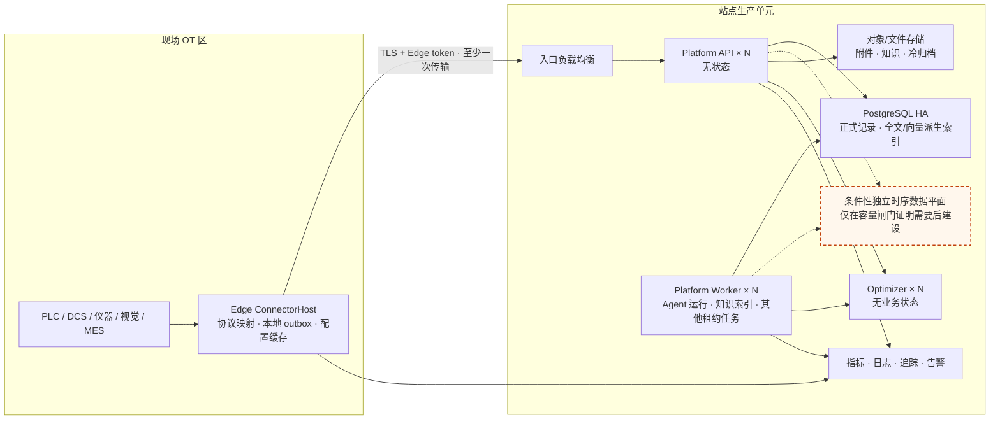

# 生产架构

> 文档状态：**部署可靠性基线与生产现场扩展目标**。本文区分当前实现、部署方责任和条件性扩展；仓库自带的单机 Compose 不代表高可用，也不包含设备行动能力。

本文定义部署拓扑、故障模型、数据语义和验收要求，不作为安装教程。Ingot 按单团队可自托管的工艺研发与优化系统设计，现场连接器属于可选扩展。单机部署须明确可接受停机、数据损失窗口和恢复流程；持续生产采集或高可用部署还须验证对应的现场故障、站点隔离、容量和恢复目标。

## 范围与目标

可靠性要求按使用范围叠加，不能把所有部署都视为设备控制系统：

1. **研发系统基础部署**：运行 Web、API、Worker、PostgreSQL/TimescaleDB 和 Optimizer，保护配置、运行与质量记录、工程师决定和知识；不要求外部业务系统在线。当前配方推荐仍需要符合准入规则的真实运行与质量证据，这不表示已经另有一套脱离运行证据的手工记录路径。
2. **生产现场接入**：按需部署 Edge，额外验收持久采集、断网补传、站点授权、数据完整性和现场安全边界；平台不直接改变设备状态。
3. **高可用部署**：在业务不能接受单节点停机或要求更小 RPO/RTO 时，部署并演练多副本、数据库 HA、持续 WAL/PITR 和独立监控。

设备行动不属于这三个范围的默认交付内容，也不是研发系统必须进入的下一阶段；若未来需要，须另立安全工程项目。产品优先级以[发展规划](project-plan.md)为准。

生产架构必须保证：

- 已确认的数据在声明的故障范围内不丢失；
- 网络中断、服务重启和任务重放不会静默改变业务结果；
- 每项正式结论仍能回到同一份运行、上下文、检验和版本化证据；
- 单个站点、设备或租户的过载不会扩散成全局故障；
- 模型、Agent、Platform 或网络异常不能绕过现场安全联锁；
- 备份可以恢复，升级可以停止，降级行为可以被监控和解释。

## 设计决策

### 1. 从故障假设出发设计生产架构

系统从一开始就假设单机、网络和单个进程可能失效：用明确的故障域隔离数据和负载，按 RPO/RTO 选择恢复或副本切换方案，先取得持久责任再驱动派生处理，并把正式记录、时序存储和无状态计算职责分开。

Ingot 采用以下生产原则：

| 生产原则 | Ingot 设计 |
|---|---|
| 故障域是分片与隔离单位 | 站点生产单元和按 `SiteId / EdgeId / EquipmentId + time` 定义的逻辑分片 |
| 关键状态可恢复 | 基础部署验证异机备份恢复；高可用部署增加数据库副本与故障切换 |
| 持久化先于确认和派生 | Edge 本地 outbox；Platform 在持久事务提交后才确认 |
| 控制、数据和计算职责分离 | 正式记录控制平面、时序数据平面、无状态计算平面分离 |
| 消费可断点续传 | 可重放的持久任务、消费游标和隔离队列 |
| 数据按价值分层 | 热原始数据、温聚合数据、冷归档和独立的证据固定 |
| 恢复能力必须验证 | 带清单的应用备份、PITR、异机副本和定期恢复演练 |

### 2. PostgreSQL 是唯一正式业务记录源

PostgreSQL 保存：

- 身份、权限、站点和设备目录；
- 工艺配置、分析方案和版本；
- 过程执行、上下文和检验关系；
- 配方优化任务、配方建议、工程师决策和真实运行结果；
- Agent 运行、输入快照、建议和证据哈希；
- 已复核知识片段、检索任务，以及可重建的全文/相似词和向量索引；
- 已实现的审核与审计记录。

设备动作账本尚未实现；完整的证据固定与分层删除保护仍是后续工程要求，不能将其列为当前已有表或能力。未来如建设这些能力，其正式状态也必须由 PostgreSQL 保存。

时序数据库可以保存原始测点、过程帧和聚合，但不能成为审批、运行状态或执行回执的唯一记录源。时序存储不可用时允许暂停曲线查询和新分析，不能转而在浏览器、Agent 或 Optimizer 内形成平行正式状态。

### 3. TimescaleDB 是当前唯一实现，存储演进由容量证据触发

当前继续使用 PostgreSQL + TimescaleDB。现有 `ITimeSeriesStore` 是存储边界，业务服务只能依赖规范化时序语义，不能依赖具体存储引擎的专有查询对象。

只有当同一份生产负载在目标保留期和两倍容量余量下证明当前数据平面无法满足写入、查询、恢复时间或总成本目标，才评估并实施独立时序数据平面。切换时：

- PostgreSQL 控制平面保持不变；
- `SiteId`、`EdgeId`、`EquipmentId`、`ExecutionId`、事件时间、单位和质量码语义保持不变；
- 独立数据平面只承载高频原始采样、时序聚合和查询；
- 不建立永久的应用层双写；由一个已持久化、可重放的摄入事实投影到数据平面；
- 迁移完成后删除旧实现路径，不长期保留无现场消费者的兼容分支。

新项目在首次生产发布前不维护历史兼容代码；首次生产发布之后，数据库和 Edge/Platform 协议必须支持受控滚动升级。这里要求的是版本迁移纪律，不是保留废弃产品路径。

## 目标拓扑

```mermaid
flowchart LR
    subgraph OT["现场 OT 区"]
        Sources["PLC / DCS / 仪器 / 视觉 / MES"]
        Edge["Edge ConnectorHost\n协议映射 · 本地 outbox · 配置缓存"]
        Sources --> Edge
    end

    subgraph Cell["站点生产单元"]
        LB["入口负载均衡"]
        Api["Platform API × N\n无状态"]
        Worker["Platform Worker × N\nAgent 运行 · 知识索引 · 其他租约任务"]
        Control["PostgreSQL HA\n正式记录 · 全文/向量派生索引"]
        Series["条件性独立时序数据平面\n仅在容量闸门证明需要后建设"]
        Files["对象/文件存储\n附件 · 知识 · 冷归档"]
        Optimizer["Optimizer × N\n无业务状态"]
        Observe["指标 · 日志 · 追踪 · 告警"]
        LB --> Api
        Api --> Control
        Api -.-> Series
        Api --> Files
        Worker --> Control
        Worker -.-> Series
        Worker --> Optimizer
        Api --> Optimizer
        Api --> Observe
        Worker --> Observe
    end

    Edge -->|"TLS + Edge token · 至少一次传输"| LB
    Edge --> Observe
    classDef future fill:#FFF7ED,stroke:#C2410C,stroke-width:1.5px,stroke-dasharray:5 4
    class Series future
```

此图是接入现场后的高可用目标，不是基础部署清单。默认 Compose 启动单 API、单 Worker、单数据库、Optimizer 和 Web，并由 Migrator 完成一次性迁移；Edge 由可选的 `connector-host` profile 启动。入口负载均衡、数据库 HA 和 TLS 终结由部署方提供。虚线橙色的独立时序数据平面只有在容量、恢复时间或成本闸门证明现有存储不足后才建设。当前附件和工艺知识仍使用持久文件卷；对象存储是条件性替换路径，不是基础部署前提或第二份正式业务状态。

知识来源、审核状态和引用元数据属于正式记录；全文、相似词和向量索引只是可重建派生状态。向量服务不可用时，分析助手必须保留相同授权与审核过滤并退回关键词检索，不能因此形成另一套知识记录源。

### 站点生产单元

需要跨工厂故障隔离时，以一个工厂或一个可以共同中断的厂区作为独立生产单元。以下是扩展设计，不表示当前已经存在跨站点控制面：

- 有自己的入口、Platform、数据库、文件存储、监控和备份；
- Edge 按 OT 安全区、电源、交换机、维护窗口和可接受停采范围继续拆分；
- 原始高频数据默认留在站点，不经由全局中心形成单点摄入瓶颈；
- 跨站点控制面只同步允许的配置包、版本、健康摘要和脱敏聚合；
- 任何跨站点操作都显式携带 `SiteId`，禁止依赖默认站点。

多站点不是先建设一个更大的数据库，而是复制已验收的生产单元并控制每个单元的故障半径。

## 数据平面

### Edge 持久化与上送

Edge 使用至少一次传输，Platform 使用幂等写入，两者共同获得确定性结果。流程固定为：

1. 设备数据先转换为带稳定身份、事件时间、配置版本和质量标记的事件；
2. Edge 先把事件提交到本地 outbox，再向采集调用方报告已记录；
3. Edge 从最小未确认序号开始批量上送；超时或响应丢失时重发同一事件；
4. Platform 在一个持久事务内完成去重键、规范事件、时序投影和派生任务脏标记；
5. 事务提交后 Platform 返回当前批次最大序号 `AckSeq`，并用 `GapDetected` 独立报告序号缺口；
6. Edge 按该确认推进本地已上送标记，随后按保留策略清理；确定性拒绝的事件另行隔离并保留审计。

`EventId` 与 `(SiteId, EdgeId, Seq)` 都是幂等键。重放必须保留事件身份和来源载荷；相同键对应不同事件身份或载荷是数据完整性故障，必须拒绝，不能以后到值覆盖以前值。`AckSeq` 不证明此前所有整数序号均已被 Platform 接收；发送方必须遵守本地顺序上送与拒绝隔离规则，不能把它当作任意乱序上传的全局连续水位线。

### 规范摄入信封

当前契约由批次请求、`ProductionEvent` 和平台查询包装共同组成；下列字段并非全部位于同一个事件对象：

| 字段 | 语义 |
|---|---|
| `SiteId` | 批次请求与平台记录中的站点归属；当前摄入即必填，并与 Edge token 绑定 |
| `EdgeId` | 安装后稳定不变的现场节点身份 |
| `Seq` | 同一 Edge 内单调递增的持久序号 |
| `EventId` | 全局事件身份 |
| `OccurredAt` | 来源事件时间，不因补传改写 |
| `RecordedAt` | 来源侧记录时间，属于事件内容 |
| `IngestedAt` | Platform 持久接收时间，属于平台查询包装 |
| `SchemaVersion` | 信封主版本；未知主版本失败关闭 |
| `AppliedConfiguration` | Edge 生成事件时实际应用的 `Kind / Id / Version` 不可变配置引用；无配置驱动事件可以为空 |
| `ExecutionId` | 能确定时关联的真实运行身份 |
| `PayloadHash` | 规范化载荷哈希，用于冲突检测 |
| `QualityFlags` | 缺失、超范围、时钟、通信和来源质量标记 |

业务时间使用 `OccurredAt`，平台接收时间使用 `IngestedAt`；`RecordedAt` 不能替代平台接收时间。平台不按到达顺序假设事件时间顺序。

`PayloadHash` 是对规范化事件内容计算的 SHA-256，不包含传输位置 `Seq` 和哈希字段自身。Edge 在本地落盘前封印事件；Platform 在摄入边界验证哈希，并在 `(SiteId, EdgeId, Seq)` 或 `EventId` 已存在时同时核对来源哈希。平台补充正式上下文后重新封印规范事件，因此查询返回的哈希始终能由持久化内容复算。缺失哈希、未知 `SchemaVersion`、未排序或非法的质量标记一律按契约错误拒绝。

### 数据归属与隔离矩阵

数据库表的归属不是按目录猜测，而由以下键和访问规则固定。任何新表必须先归入一类；同时包含多类数据时，以隔离更严格的一类为准。

| 归属类 | 权威归属键 | 当前表族 | 访问与演进规则 |
|---|---|---|---|
| 部署全局 | 无 `SiteId`；部署管理员权限 | `users`、`user_sessions`、全局类型目录、通用模板 | 只能保存跨站点身份或可复用定义，不得写入某次生产运行、现场值或审批结果 |
| 站点生产数据 | `SiteId`，并由 Edge token 绑定 | `platform_edges`；`event_ingest_keys`、`production_events`、`process_sample_frames`、`collection_points`、`data_object_summaries`、`data_object_operation_keys` | 摄入、查询、保留、容量和导出都必须显式指定站点；禁止推断默认站点 |
| 版本化配置 | 配置身份与版本；发布绑定指向站点/Edge | `ingestion_tasks`、`ingestion_task_bindings`、`process_data_models`、`process_analysis_plans`、`process_specification_versions`、`signal_definitions` | 定义可以复用；生效范围只能通过显式绑定表达，生产事件必须保存实际应用的配置引用 |
| 运行派生数据 | `ExecutionId`，可追溯到站点摄入事实 | `execution_features`、`execution_phases`、分析物化与重算任务、`operation_context_snapshots` | 不作为独立租户边界；所有外部读取必须从已授权站点范围解析运行集合，禁止仅凭任意 ExecutionId 越站点读取 |
| 配方建议与知识 | `SiteId` + 配方；知识来源仅 `SiteId` | `research_recipe_recommendation*`、`recipe_recommendation*`、`mechanism_*`、`knowledge_*` | 建议、决定、运行关联与机理证据只在同一站点和配方内引用；知识来源与片段只在所属站点检索 |
| 质量与检验 | `SiteId` + 运行/检验计划关系 | `inspection_*` | 检验记录、范围和附件固化站点归属；授权仍从关联运行继承，附件和审核日志不能脱离父记录单独访问 |
| 部署级研发资产与评测 | 数据集/模型/案例身份与版本；按岗位授权 | `training_dataset_versions`、`model_evaluations`、`model_drift_readings`、`case_level_evaluations` | 当前没有独立的 `SiteId` 隔离契约，不得作为跨团队或跨租户隔离能力使用；引用生产事实时仍须遵守其来源权限 |
| Agent 审计 | 发起用户 + 输入证据范围 | `agent_runs`、`agent_stream_events`、`problem_cases` | Agent 记录不授予新数据权限；回放时重新验证用户和站点范围 |

当前数据库门禁已经强制规范摄入/投影表以及 Edge 注册、检验记录、质量范围和检验附件的 `site_id NOT NULL`。Edge 注册不能跨站迁移；检验附件按站点和内容哈希去重，读取时重新校验岗位与站点。其余运行派生表保留 `ExecutionId` 归属，是为了避免重复存储可漂移的站点字段；对应 API 必须先用站点范围解析 ExecutionId。未来若测得该联接成为隔离审计或性能瓶颈，可以增加受外键/触发器约束的冗余 `SiteId`，但不能在应用层自行复制而缺少一致性约束。

### 乱序、缺口和迟到数据

- 序号缺口立即记录，但不把其后的有效事件永久阻塞；
- 当前摄入按批次返回最大确认序号并记录缺口；缺口检测不等于运行完整性证明；
- 当前摄入事务会标记受影响运行并排队派生处理；完整的允许迟到窗口和水位线仍待建设；
- 后续水位线设计必须保留迟到事实，并确定受影响运行的重算范围；
- 后续完整重放契约须将输入范围、配置版本和算法版本纳入可追溯的重算身份；
- 无法解析、越界或契约错误的数据进入隔离区，不能伪装成成功摄入，也不能阻塞后续有效数据。

### 跨存储一致性

当前 TimescaleDB 与正式记录共用 PostgreSQL，因此去重键、规范事件、时序值和派生任务标记可以在同一数据库事务提交。若未来采用独立时序数据平面，禁止用两个客户端调用冒充原子双写，必须先增加持久摄入日志：

1. Platform 把规范信封和载荷提交到 PostgreSQL 摄入日志，提交后才向 Edge 确认；
2. 独立投影器以日志序号幂等写入时序数据平面，并更新数据平面检查点；
3. 业务事件和运行状态由另一幂等投影在 PostgreSQL 内完成；
4. 只有所有必需投影越过该序号，数据才标记为“可分析”；
5. 摄入日志在投影完成、备份满足和重放窗口到期前不得删除；
6. 查询结果返回或内部记录所用数据平面检查点，避免把仍在投影的数据误报为完整。

如果短期 PostgreSQL 摄入日志无法承受已经实测的外部时序负载，才以持久消息日志替换这一实现；确认语义、检查点和重放不变量保持不变。Edge 的确认表示 Platform 已取得持久责任，不表示所有派生视图已经同步可见。

### 分片、配额与背压

以下是持续生产接入的容量目标，当前完整公平配额尚未实现。逻辑隔离维度为 `SiteId / EdgeId / EquipmentId + time`；具体物理分片由存储实现决定，容量工程需要暴露：

- 每个站点、Edge 和设备的写入率、存储量、查询成本和积压年龄；
- 单站点连接数、并发查询、后台重算和 Optimizer 预算；
- 热点分片、磁盘水位和副本延迟；
- 可配置的公平调度和硬上限。

达到软水位时先限制交互式大查询和后台重算；达到硬水位时停止接受新的非关键分析任务。生产采集不得通过无日志丢弃来“保护”平台。Edge 本地容量不足时执行预先配置的现场策略，并产生不可抹除的丢弃审计与告警。

## 控制平面与异步计算

Platform API 不以进程内状态保存正式业务记录。当前 Chat/Agent、知识处理与分析投影等后台工作使用 PostgreSQL 持久任务；这不表示每个同步 API 请求都有后台恢复能力。需要跨重启继续的任务应满足以下要求，各任务类型的重试、死信与重放能力须分别验证：

- 一个任务可以被多次领取，但业务效果必须幂等；
- 领取者只有持有当前租约才能提交完成；
- 进程退出后租约过期，其他 Worker 可以接管；
- 达到重试预算后进入死信，不无限重试；
- 人工重放生成新的审计事件，但保留原失败记录；
- 任务载荷引用不可变输入或内容哈希，不能依赖进程内对象。

Kafka、NATS 或类似消息系统不是生产化的前置条件。只有在 PostgreSQL 租约任务经过压测后无法满足吞吐、隔离或跨系统订阅需求时才引入；引入后仍不能取代正式业务事务和审计记录。

Optimizer 与模型服务无业务状态。失败只影响新的数值建议或解释，不影响采集、检验、审批和既有记录读取。调用必须有超时、熔断、总预算和输入哈希；自动重试只能用于已证明幂等的调用。

## 设备行动的条件性边界

当前产品只提供记录、分析、建议与工程师决定，没有动作账本、签名调度、Safety Executor 或设备写入闭环。采用建议不等于设备动作审批，也不向设备下发参数。

若未来单独立项设备行动，必须重新设计动作身份、独立批准、参数冻结、时限、签名、幂等回执、实际值回读、停止和恢复契约。Agent 不直连设备、不持有设备凭据；Optimizer 不批准或执行；现场硬联锁始终独立有效。每类设备和动作都需要单独的安全验证，不能把分析能力或本文的部署验收当成设备行动准入。

该方向不列入当前部署完成条件，实施优先级见[发展规划](project-plan.md)。

## 存储生命周期

以下是分层存储目标，并非当前已完成能力。默认 Compose 的事件保留和压缩配置为关闭；启用前须验证引用保护、恢复与容量。完整冷热分层、证据固定和删除保护仍待完成。

| 层级 | 内容 | 默认设计 |
|---|---|---|
| 热 | 近期原始事件、过程帧和值 | 在线时序存储，支持运行详情和近期分析 |
| 温 | 降采样、特征、运行级聚合 | 压缩或连续聚合，支持常用比较 |
| 冷 | 到期原始数据、附件大对象 | 带校验和的不可变对象归档 |
| 固定证据 | 被报告、审批或正式结论引用的输入 | 独立保留策略和法律保留，不随普通时序策略删除 |

保留任务必须先计算引用关系，再删除数据。任何删除都生成范围、策略版本、执行者、数量和校验结果。正式证据如果依赖即将过期的原始数据，应先生成可验证证据包，至少包含查询范围、规范数据、单位、质量码、来源版本和内容哈希。

TimescaleDB 的分块、压缩和保留策略只负责物理生命周期；不能代替业务证据固定。

## 高可用与灾难恢复

### 按可用性目标选择拓扑

基础部署可以使用单 API、单 Worker 和单 PostgreSQL，但必须记录可接受停机与 RPO/RTO，保护持久卷、身份与密钥，并实测恢复。启用现场接入后，额外保护 Edge outbox、身份、配置缓存和离线容量。单机恢复能力不等于高可用。

只有声明单节点故障期间仍持续提供服务时，才采用以下高可用目标：

| 组件 | 高可用目标形态 | 允许的降级 |
|---|---|---|
| Edge（启用时） | 每个现场故障域独立进程和持久卷 | Platform 不可用时继续本地采集，受已验收离线容量限制 |
| Platform API | 至少两个无状态副本和健康摘除 | 单副本故障不影响接入 |
| Platform Worker | 至少两个可竞争租约的副本 | 任务延迟，不丢已持久化任务 |
| PostgreSQL/TimescaleDB | 经演练的 HA 主备或托管等价能力 | 故障切换期间短时停止写入 |
| 文件存储与密钥 | 实例共享可访问的证据文件和配套密钥，并保留异机备份 | 新附件暂停，不丢既有证据 |
| Optimizer | 一个或多个无业务状态实例 | 暂停新数值建议，核心记录继续 |
| 监控告警 | 独立于被监控进程 | 主业务故障仍可发出告警 |

副本数量、同步策略和自动故障切换方式由 RPO/RTO 与故障域决定；对象存储不是唯一选择。现有 `verify-production-acceptance.sh` 面向持续生产现场，仍强制要求数据库 HA、PITR 等证据，不是基础研发部署的通用验收器。

### 备份与恢复

- 应用一致逻辑备份用于迁移、审计和全量恢复验证；
- 要求时间点恢复时，配置 PostgreSQL 基础备份和持续 WAL 归档；现有生产现场验收脚本要求 PITR 证据；
- 备份、附件和密钥恢复说明保存在异机并按生产级权限保护；
- 至少一份备份不可被生产管理员的普通凭据覆盖；
- 每次演练记录目标时间点、实际 RPO、实际 RTO、缺失对象和哈希核对结果；
- 未执行恢复演练的备份不计入生产准入证据。

恢复顺序是控制平面、文件证据、时序数据平面、派生任务，最后开放写入口。派生结果允许从规范事实重建，不应成为阻塞恢复的唯一副本。

## 故障行为

以下行为按启用的组件和声明的可用性目标验收；基础单机部署允许在记录的 RTO 内恢复，高可用部署须额外演练摘流和切换。

| 故障 | 必须发生 | 禁止发生 |
|---|---|---|
| Edge 与 Platform 断网 | Edge 继续落盘，恢复后从断点补传 | 静默丢弃或生成新的事件身份重传 |
| Platform API 实例退出 | 基础部署重启恢复；高可用部署摘除实例；客户端按接口幂等契约重试 | 已提交事务返回永久失败或重复产生业务效果 |
| Worker 执行中退出 | 租约过期后由恢复或其他 Worker 实例接管 | 任务永久卡在运行中 |
| Optimizer/模型不可用 | Optimizer 故障暂停新数值建议；模型故障影响助手回答，展示明确状态 | 阻止采集、检验或历史事实读取 |
| 数据库主节点故障 | 按已演练策略恢复或切换，并暴露写入不可用时间 | 在无法持久化时仍向 Edge 确认成功 |
| 磁盘逼近上限 | 告警、限制作业和大查询、执行容量预案 | 无审计删除正式证据 |
| 时钟漂移 | 标记质量、暂停依赖精确时间的分析 | 自动改写来源事件时间掩盖问题 |
| 存储副本延迟 | 限制读一致性或路由到主节点 | 把过期的记录或审核状态当作最新状态 |

## 安全与可观测性

当前 Edge 使用与站点和节点绑定的 Bearer token；跨主机传输必须由部署方提供 TLS 终结，mTLS 可作为额外防护，仓库未提供证书签发与撤销管理。模型 API key 当前经 Data Protection 加密存入数据库，恢复时需要配套密钥；其他设备凭据应按部署说明受控注入，不能声称所有配置都只保存密钥引用。设备网络、数据库、Optimizer、指标和管理入口分别限制网络访问。

部署按启用组件建立以下 SLI；副本和 WAL 指标只适用于对应拓扑，以下清单不表示参考监控已经覆盖全部项目：

- 摄入成功率、持久确认延迟和每个 Edge 的积压年龄；
- 重复、序号缺口、乱序、迟到和隔离事件数；
- 从 `OccurredAt` 到可查询、可分析的端到端新鲜度；
- 运行完整率、上下文和检验关联覆盖率；
- 数据库副本延迟、WAL 归档延迟、磁盘水位和连接池等待；
- Worker 队列年龄、租约超时、重试和死信；
- Optimizer 超时、熔断状态和计算预算。

日志、指标和追踪统一携带 `SiteId`、`EdgeId`、`ExecutionId`、配置版本和请求 `traceId` 中适用的字段。报警必须指向可处理的对象和运行手册。

## 容量与生产准入

### 负载模型

每个现场在上线前填写并版本化：

- Edge、设备、并发运行和测点数量；
- 正常、峰值和故障补传时的事件率与字节率；
- 原始采样保留期、聚合粒度和压缩预期；
- 最大交互查询范围、并发用户和后台任务数；
- 最大断网时间和 Edge 可用磁盘；
- RPO、RTO、可接受的新鲜度和维护窗口。

容量验收用生产峰值的至少两倍进行，且同时包含摄入、常用查询、聚合、备份和一个节点故障。平均吞吐不能替代尾延迟、积压年龄和恢复时间。

### 硬性准入门槛

基础研发部署先验证身份权限、持久卷与配套密钥恢复、容量、告警和已接收任务的重启恢复，明确可接受的停机窗口。

持续接入生产现场并使用现有生产验收脚本时，还必须证明：

1. 在声明的单节点故障下，已确认数据满足 RPO；
2. 目标断网时长内 Edge 不静默丢数据，补传后无重复业务效果；
3. 重复、乱序、迟到和重放得到确定性结果；
4. PITR 与完整应用恢复演练满足 RTO，且证据哈希一致；
5. 单站点热点不会耗尽其他站点或关键摄入预算；
6. 备份、监控、证书轮换和升级回滚均有运行手册；
7. 至少连续运行一个约定观察周期，未出现未解释的数据缺口。

设备动作不在此验收范围内；未来若立项，必须单独定义安全准入，不能凭生产观测验收放行设备写入。

## 当前实现与后续工程

### 当前实现校准

| 范围 | 当前仓库事实 | 仍需部署方或后续阶段完成 |
|---|---|---|
| 摄入与证据契约 | 已实现站点绑定、规范事件校验、配置版本、质量标记、内容哈希与幂等约束 | 完整分层证据固定与删除保护；真实现场的数据完整性验收 |
| 基础恢复 | 已提供一致性逻辑备份/恢复、校验和、可选监控与有限的 API/Worker/Optimizer 故障演练 | 单独保护并恢复 Data Protection 密钥、Edge 数据与现场配置；验证真实恢复目标 |
| 高可用 | API/Worker 正式任务状态持久化，为扩展提供基础 | 默认 Compose 没有入口负载均衡、数据库 HA、持续 WAL/PITR、异机不可变备份或对象存储 |
| 数据平面 | 已有 Edge outbox、幂等摄入、确定性拒绝隔离、派生处理、后台租约和部分死信机制 | 迟到水位线、完整重算/重放运维面、热温冷生命周期和公平配额 |
| 设备行动 | 当前分析工具只读，Optimizer 不批准或执行，工程师决定不下发设备 | 动作账本、签名调度、安全执行器和设备执行闭环均未实现，也不属于默认路线图 |

“已实现”只表示仓库存在代码、测试或部署资产，不表示现场已经通过容量、恢复、HA、安全或持续观察验收。此处不另设一套 P0–P3 产品优先级；建设顺序以[发展规划](project-plan.md)为准。

### 后续工程的触发条件

- **基础部署**：先完成权限、密钥、备份恢复、容量与告警配置；无需等待设备行动或独立时序存储。
- **持续现场采集**：完成离线容量、补传、确定性重放、数据缺口和现场隔离演练，按现有生产验收脚本固化证据。
- **更高可用性或更小恢复窗口**：提供共享文件与密钥、多副本、入口摘流、数据库 HA 和所需 PITR，逐项实测 RPO/RTO。
- **保留与容量压力**：先补齐引用保护、生命周期、重算与公平配额，再用真实负载判断是否需要独立时序数据平面。

每项工程变更都应具备迁移、测试、运行手册和回滚点；没有现场证据时，不因代码或脚本存在就声称已经完成生产准入。

## 明确不做

- 不把 Ingot 建成通用 SCADA、MES、设备联锁或安全 PLC；
- 不用消息中间件掩盖不明确的事务边界；
- 不为了“分布式”把单站点数据无条件拆进多个存储；
- 不让时序数据平面、Optimizer、Agent 或浏览器成为第二业务记录源；
- 不承诺端到端“恰好一次”传输，而使用至少一次传输和幂等业务效果；
- 不在没有容量证据时维护两套长期生产数据路径；
- 不因新项目没有历史用户而省略首次生产发布之后的迁移、恢复和回滚纪律。

部署操作见[部署运维](deployment.md)，稳定业务边界见[系统设计](design.md)，真实场景的科学评估见[场景评估](rollout.md)。

## 使用本基线进行部署评审

评审先明确本次声明的是基础研发、现场接入还是高可用范围，再逐项检查对应故障与恢复责任。把目标值、实测值、证据引用、复核人和剩余限制记录在部署方的受控验收材料中；不能只引用本页作为部署已达标的证明。

[部署运维](deployment.md)负责配置与操作步骤，[故障排查](troubleshooting.md)负责按症状定位，[当前状态](status.md)负责当前软件交付范围。本页新增目标必须注明依赖与验收条件，并同步英文内容，不把条件性扩展写入默认安装能力。
