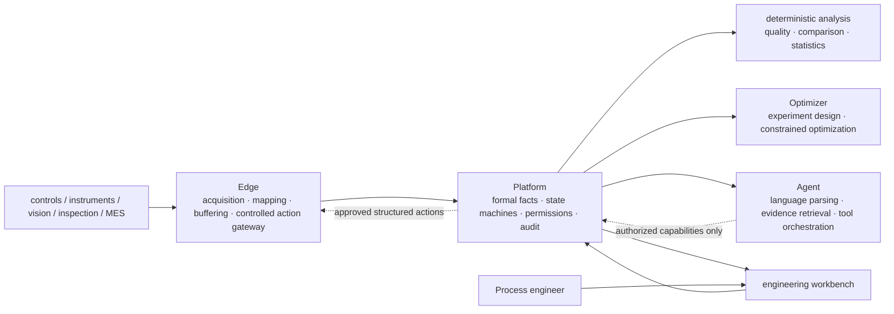

# Roadmap

> Status: **v2 strategy baseline plus rolling roadmap**. Sections 1–5 fix the long-term direction, strategic thesis, and stable boundaries. Sections 6–9 evolve with real data, engineer feedback, external adoption, and acceptance results. Progress follows evidence gates, never feature count or calendar time alone.

This document distinguishes current capabilities from long-term objectives. Near-term work validates the trustworthiness of the data chain, recommendations, and review process. Automation and open protocols advance only after the preceding evidence stage passes.

## 1. Long-term position

Ingot's core value remains unchanged:

> **Turn every real run into comparable, testable engineering evidence so process engineers can avoid unproductive experiments and reach target process conditions faster.**

Ingot keeps its current public category. *Optimization* means selecting the next experiment around explicit objectives and safety boundaries; it does not mean automatic control or demonstrated real-factory benefit:

> **Open-source Process Diagnosis & Optimization.**

Its long-term direction is to become:

> **A trustworthy decision and validation operating system for manufacturing processes.**

Foundation models and agents provide replaceable language parsing, evidence retrieval, and tool orchestration. Ingot keeps engineers and agents on the same trusted facts, scientific validation, and controlled-action discipline. Its durable advantage is not one model, but:

- reliable identity across real runs, actual conditions, trajectories, quality outcomes, and field context;
- evidence, methods, versions, uncertainty, and applicability for every judgment;
- formal state from candidate cause through falsifiable experiment, approval, execution, and result materialization;
- controlled actions that can be replayed, audited, denied, stopped, and rolled back;
- validated process knowledge reusable across products, equipment, and scenarios.

The governing principle is:

> **Every conclusion has provenance. Every recommendation has boundaries. Every action has approval, fallback, and an outcome.**

This is a strategic north star, not a claim that these product benefits have already been demonstrated. [Brand guide](brand.en.md) remains authoritative for public claims.

## 2. One product spine

Ingot centers on a complete process-decision case, not a chat session, algorithm, or device point:

```text
engineering problem
→ trustworthy evidence bundle
→ candidate causes and counterevidence
→ falsifiable hypothesis
→ experiment or adjustment proposal
→ risk review and independent approval
→ actual execution
→ quality outcome and side effects
→ conclusion boundary
→ reusable process knowledge
```

The long-term capability chain is:

```text
trusted acquisition → run and quality evidence → evidence-backed diagnosis
→ falsifiable experiment → constrained optimization → knowledge reuse
```

This is a dependency chain, not menu order. Do not perform strong analysis with untrusted data, claim causes from observational evidence, enter shadow mode before replay, or enter controlled action before shadow and safety evidence pass.

The first sustained validation scenario has data onboarding and diagnosis running; historical replay, shadow, and controlled-online validation are still in progress. Its industry and equipment details stay out of the public repository, and the scenario itself is not the product boundary. Generality is supported only when a second, materially different manufacturing process works without changing the core evidence, experiment, and action contracts.

## 3. Three-horizon strategy

### Near term: prove the trustworthy apparatus

The immediate priority is leakage-free replay of a real historical project. It does not answer whether model recommendations have improved the process. It tests whether:

- one frozen evidence snapshot reproduces the same analysis and recommendation;
- run identity, actual values, quality outcomes, and context are unique, complete, and traceable;
- round `t` uses only information available at round `t`;
- methods compare fairly with engineer history, applicable DOE, and simple baselines;
- missingness, mismatches, unauthorized access, and insufficient evidence are rejected explicitly;
- inputs, policies, models, seeds, outputs, reviews, and content hashes form a complete report.

Real production data and derived results remain inside the controlled environment. The complete report above is an access-controlled, auditable internal evidence artifact; completion never requires publishing raw data, project identities, parameter distributions, or project results. The public repository provides general protocols, schemas, synthetic examples, explicitly licensed and checksum-verified public-data benchmarks, and conformance tests. A public benchmark validates reproducible software and method behavior; it does not replace the real-project report.

The near-term conclusion can only be that the apparatus is trustworthy, reproducible, and leakage-free. Prospective value requires shadow validation; causal and benefit claims require controlled online experiments. The evidence ladder is:

```text
historical replay: trustworthy, reproducible, leakage-free
→ prospective shadow: applicable, executable, calibrated
→ controlled intervention: safe prospective value inside declared boundaries
→ second scenario: transferable core contracts
```

See [Scenario validation](rollout.en.md) for the protocol and report requirements.

### Medium term: become a model-independent process capability substrate

Expose R&D capabilities through agent-callable protocols without exposing internal CRUD APIs directly to models. Use two layers:

```text
any conforming model / agent
↓
interoperability adapters such as MCP, OpenAPI, and SDKs
↓
Ingot process capability protocol and control plane
↓
evidence, experiment, approval, execution, and rollback state machines
```

MCP and similar protocols standardize discovery, description, and invocation. Ingot's domain protocol and Platform state machines enforce evidence discipline, permissions, approval, idempotency, replay, and safety. Expose capabilities by risk:

| Level | Agent capability | System guarantee |
|---|---|---|
| Read | query runs, evidence, quality, context, and applicability | project isolation, citations, versions, least privilege |
| Propose | create investigation drafts, candidate hypotheses, and experiment proposals | draft only, with input snapshot and rationale |
| Commit | submit approval, freeze a plan, and sign an execution version | no self-approval; no rewriting after outcomes appear |
| Execute | invoke allow-listed, time-bounded, scoped, reversible actions | policy checks, human authorization, device confirmation, stop, and rollback |

An agent may not approve its own proposal or bypass Platform to reach a database or device. The medium-term value is established through engineering guarantees rather than model-capability claims:

> **Every model that investigates or acts through Ingot must cite evidence, pass state and permission gates, and leave a verifiable execution receipt.**

### Long term: establish an open evidence and experiment specification for manufacturing intelligence

Open the cross-product semantics and validation contracts, not customer process content or current database tables. Candidate specification objects include:

- run-event envelopes and provenance;
- evidence bundles and content-addressing rules;
- experiment contracts, preregistration, and version freezes;
- agent recommendations, human decisions, and rejection reasons;
- execution receipts, actual-value confirmation, stop, and rollback;
- validation reports and machine-readable conclusion boundaries;
- validated operating regions with applicability, failure, and drift conditions.

The specification must include schemas, compatibility rules, reference implementations, adapters, conformance validators, standard fixtures, signature and provenance rules, extension namespaces, and an open change process.

Before a `1.0` release, require:

1. two materially different real process scenarios using the core semantics unchanged;
2. at least two external teams implementing or validating without private Ingot code;
3. public review of compatibility, conformance, and security boundaries;
4. governance independent of one customer's data, one model, or one vendor interface.

Until external adoption and independent implementations exist, a specification candidate must not be described as an industry standard. The accurate near-term name is:

> **An evidence and experiment protocol for manufacturing intelligence.**

Network effects come from equipment, agents, validators, scenario packages, and enterprise systems using one verifiable contract, not from centralizing customers' raw process data.

## 4. Product and commercial boundary

Ingot serves expensive, small-data manufacturing process R&D with measurable quality objectives and safety boundaries. Process, quality, equipment, and R&D teams collaborate inside one company, with factory-local or hybrid deployment by default.

The core platform carries stable concepts:

- equipment, connections, process executions, and stages;
- products, process specifications, materials, components, tooling, and lot context;
- actual settings, trajectories, versioned features, and data quality;
- quality objectives, safety constraints, inspections, and human review;
- engineering problems, candidate causes, counterevidence, hypotheses, experiments, and evidence;
- analysis strategies, numerical recommendations, stopping, operating regions, and knowledge applicability;
- human and agent identities, roles, approvals, audit, and provenance.

Scenario differences belong in versioned configuration: variables, units, mappings, run boundaries, stages, quality plans, constraints, context, experiment policies, and optional mechanism knowledge.

Ingot does not expand into a general MES, SCADA, interlock, scheduler, data lake, or unattended controller. It sits above those systems to manage process evidence, experiment decisions, controlled actions, and knowledge closure.

Recommended open and commercial boundaries:

- **Open**: Edge, core schemas, evidence protocol, basic connectors, replay, and conformance tools.
- **Enterprise**: organization governance, multi-site operation, SSO, durable audit, agent evaluation operations, controlled execution, certified scenario packages, and engineering support.

Commercial value should be measured by site, line, R&D workspace, or durable decision workflow, not conversations or token use.

## 5. Long-term architecture and safety invariants



Stable decisions:

- **Platform** is the sole formal record for runs, context, inspections, experiments, evidence, approvals, agent proposals, and knowledge.
- **Edge** provides trusted acquisition, offline buffering, and replay. It may later host a controlled action gateway but never replaces PLC, DCS, or safety interlocks.
- **Optimizer** is stateless business-wise and performs reproducible statistics, constraints, DOE, and numerical optimization. It cannot approve experiments or control equipment.
- **Agent** is a replaceable language-parsing, evidence-retrieval, and tool-orchestration layer. Conversation context and model memory are not formal business state.
- **Web** does not maintain parallel business state that conflicts with Platform.
- Data, features, policies, models, tools, and schemas are versioned and replayable; critical evidence uses content hashes or signatures.
- Acquisition, inspection, and formal records do not depend on Optimizer, Agent, or an external model being available.
- Agents never receive arbitrary device-write permission; they submit structured intent or invoke allow-listed actions.

Every agent behavior affecting business or equipment records identity, model and policy version, tools and permissions, evidence snapshot, proposal and uncertainty, constraint checks, approval scope, device confirmation, outcomes, side effects, stop, and rollback.

Protocol adapters, database topology, algorithms, model providers, and page layouts may evolve. Stable-boundary changes require an ADR.

## 6. Product maturity and promotion gates

| Level | What an engineer or agent can do | What the system must prove |
|---|---|---|
| L0 connected | see equipment, instrument, and inspection data | raw values, units, time, and provenance are explicit |
| L1 trusted run | find actual conditions, trajectory, context, and outcome | no silent loss; missingness and versions are visible |
| L2 comparable | find a qualified baseline and first deviation | matching, coverage, and confounding are explicit |
| L3 diagnosable | receive candidates, evidence, counterevidence, and validation advice | correlation is not sold as cause; correct refusal works |
| L4 experimentable | turn a candidate into a reviewable, falsifiable experiment | controls, repetition, blocks, safety, and stopping are explicit |
| L5 optimizable | receive a next-experiment recommendation | leakage-free replay, calibrated uncertainty, zero known safety violations |
| L6 actionable | execute one reversible action inside approved scope | shadow evidence, permission, actual confirmation, and rollback drills pass |
| L7 reusable | reuse conclusions on a new product, machine, or scenario | applicability, failure, drift, and negative transfer are visible |
| L8 interoperable | external systems independently implement and validate the protocol | multi-scenario use, compatibility, conformance, and governance pass |

No level may use a higher-level demonstration to bypass lower-level evidence. Autonomy grows only inside validated operating regions and automatically degrades on drift, missing evidence, model anomalies, communication failure, or human intervention.

## 7. Delivery and validation model

Maintain four mutually constraining work lines:

- **Product**: trusted data → comparison and diagnosis → experiment → optimization → controlled action → reuse.
- **Scientific validation**: historical replay, shadow validation, controlled online validation, and cross-scenario transfer advance independently.
- **Engineering assurance**: real-database tests, recovery exercises, performance baselines, security, and observability.
- **Protocol ecosystem**: schema stability, reference implementations, conformance tests, external implementations, and governance.

Do not collapse the work lines into one global maturity state:

| Work line | Independent evidence artifact | Permitted conclusion only |
|---|---|---|
| Historical replay | frozen dataset, sequential traces, baselines, gates, review hash | leakage-free, reproducible performance against preregistered baselines on existing history |
| Shadow validation | recommendation snapshot, independent engineer choice, actual outcome, rejection reasons, calibration report | applicability, executability, and calibration on a new project |
| Controlled online | per-run approval, rollback drill, actual settings, outcomes, stop records | safe prospective value inside declared boundaries |
| Protocol interoperability | independent implementation, compatibility matrix, conformance report, security review | correct exchange and validation without private Ingot code |

Each work line preregisters data, baselines, measures, threshold versions, acceptance, and falsification separately. An API existing means infrastructure exists; it does not mean the work line passed.

## 8. Current priorities and rolling batches

The current code checkpoint is not a validation pass. Trusted identity, event integrity, quality admission, Application use cases, replay/shadow/online report services, mechanism-knowledge gates, and production-acceptance tooling are in the repository. A formal leakage-free report on real history, new-project shadow results, controlled-online results, a second scenario, and an external protocol implementation remain incomplete. The first two batches therefore shift from filling code paths to proving them under real load and failure exercises; the next scientific hard gate remains Batch 3, preregistered historical replay.

| Priority | Work | Definition of done |
|---|---|---|
| P0 | run identity, actual values, context, inspection linkage, and quality validity | every analysis record uniquely reaches a real run and valid outcome |
| P0 | evidence freezing, replay, transactions, and recovery | inputs cannot be rewritten after the fact; recovery preserves provenance |
| P0 scientific | historical-question and production-equivalent sequential replay | access-controlled internal preregistration and reviewed leakage-free report with baselines, failures, and limits |
| P0 scientific | protocol-frozen public external-data evaluation | data not used during development, strong baselines, and mechanism ablation run under the frozen protocol with unfavorable results retained |
| P1 | process-decision case and deterministic diagnosis contract | evidence, candidates, counterevidence, hypotheses, experiments, and conclusions share one formal spine |
| P1 | agent replay and adversarial evaluation | unsupported inference, identity mismatch, overreach, and incorrect tool use are detectable |
| P1 | shadow recommendations, calibration, and stopping | recommendations freeze in advance and preserve independent engineer choice and rejection reasons |
| P2 | read and propose agent protocols | multiple models use the same schemas and cannot bypass state machines |
| P2 | single-step controlled action protocol | allow lists, approval, actual confirmation, stop, and rollback drills pass |
| P3 | second scenario and specification candidate | core contracts remain unchanged and at least one external implementation exists |

Current rolling batches:

1. **Trusted identity and quality chain**: core code paths and database constraints exist; continue adversarial acceptance with real site isolation, clock faults, missing actual values, and incorrect inspection linkage.
2. **Historical evidence apparatus**: freezing, content hashes, transactions, replay services, and recovery tooling exist; complete site retention rules, recomputation consistency, and recovery-drill evidence.
3. **Protocol-frozen public external-data evaluation**: commit the algorithm and protocol before running physical-experiment data not used during development, strong baselines, and mechanism-feature ablation; do not revise frozen conditions in response to the first result.
4. **Preregistered historical replay**: complete engineering-question and production-equivalent sequential replay, preserve every failure and limit in the controlled internal report, and expose only that real project's protocol and conclusion boundaries publicly; a separately published public-data benchmark must not be presented as the real-project result.
5. **Process-decision case**: fix data quality, baseline, first deviation, candidates, counterevidence, confounding, missingness, and experiment-proposal structure.
6. **Agent evaluation corpus**: golden-question, run-snapshot, and evaluation storage exist; expand adversarial examples for engineer questions, correct refusal, citation coverage, permissions, and tool calls.
7. **Prospective shadow validation**: freeze variables, mappings, context, constraints, policies, and engineer rejection reasons.
8. **Protocolized read and propose capabilities**: derive stable domain tools from internal APIs and provide MCP, OpenAPI, or SDK adapters.
9. **Controlled-action preparation**: action ledger, authorization tokens, policy checks, device confirmation, stop, and rollback.
10. **Second scenario and specification candidate**: validate cross-scenario semantics and publish candidate schemas, validators, and reference implementations.

These batches are the current sequence, not an immutable product definition. Reorder them after each completed batch according to evidence.

## 9. Measures, governance, and falsification

Every roadmap review answers five groups of questions.

### Is data more trustworthy?

- complete-run and actual-setting, feature, context, and inspection coverage;
- linkage failures and unit, clock, configuration-version, and provenance anomalies;
- Edge backlog, recovery, duplicates, and disorder;
- successful historical recomputation, replay, and interpretation.

### Is diagnosis more useful?

- time from anomaly to first executable hypothesis;
- engineer usefulness rating;
- evidence citation, correct refusal, and unsupported causal claims;
- candidates supported, rejected, or left inconclusive by experiments.

### Are experiments and actions more effective?

- valid experiments to attain and repeatedly confirm specification;
- recommendation acceptance, modification, rejection reasons, and actual-setting deviation;
- calibration, reproduction, post-stop outcomes, and rollback success;
- material, equipment, inspection, and calendar time;
- unauthorized actions and known safety-boundary violations always equal zero.

### Is an agent worthy of trust?

- tool choice, parameters, citations, and final judgment evaluated separately;
- regression after model, prompt, tool, or schema version changes;
- correct refusal under missing evidence, identity conflicts, and inadequate permission;
- reasons and later outcomes for human acceptance, modification, and rejection.

### Is the protocol being adopted?

- external implementations, connectors, validators, and compatible versions;
- conformance pass rate and interoperability failure causes;
- time from connecting a new system to the first conforming evidence bundle;
- proportion validated without private Ingot code.

Governance discipline:

- manage core value, evidence principles, and stable component boundaries as normative baselines;
- record stable architecture and breaking protocol changes with ADRs;
- preregister data, baselines, measures, acceptance, and falsification for every phase;
- every feature must improve data trust, diagnosis, experiment value, action safety, or interoperability;
- downgrade, repair, or stop methods that do not beat applicable simple baselines;
- produce separate controlled internal reports for replay, shadow, and controlled online validation, and a public conformance report for protocol interoperability; never substitute one for another;
- never measure success by pages, conversations, agent count, model size, or token consumption;
- stronger foundation models never relax provenance, permission, approval, safety, or causal-validation requirements.
