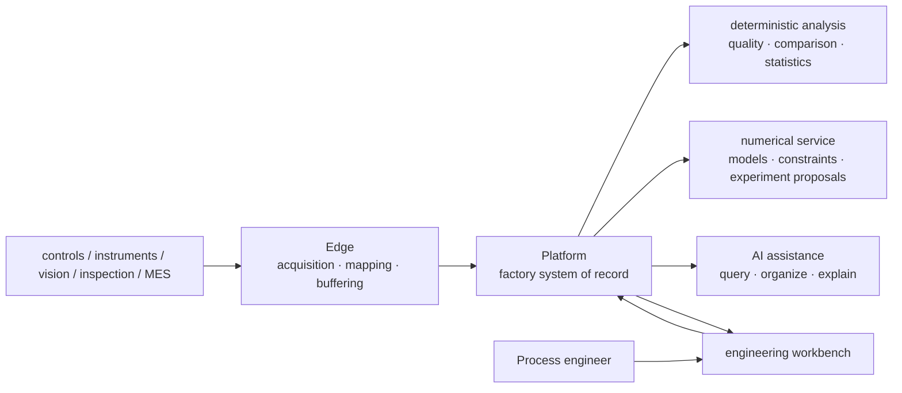

# Ingot project plan

> Status: **v1 product baseline plus rolling roadmap**. Sections 1–4 fix the long-term direction. Sections 5–9 evolve with real data, engineer feedback, and acceptance results. Every phase advances through acceptance gates.

## 1. Stable long-term direction

Ingot's core value remains unchanged:

> **Move process R&D from decisions without data support to decisions supported by real data, so computers can genuinely help process engineers choose what to do next using the most effective computational methods for the problem.**

The long-term product chain is:

```text
trusted acquisition → run and quality evidence → diagnosis → falsifiable experiment → safe optimization → knowledge reuse
```

This is a capability dependency: do not perform strong analysis without trustworthy data, claim causes without testable candidates, or enter online optimization without safety and calibration evidence.

Optical-lens molding is the first long-running validation scenario, not the product boundary. Generality is supported only when a second, materially different manufacturing scenario works without changing the core evidence, experiment, and optimization contracts.

## 2. Product boundary

Ingot serves expensive, small-data manufacturing process R&D with safety boundaries. It is shared by process, quality, equipment, and R&D teams in one company, deployed locally on the factory network by default.

The core platform carries stable cross-scenario concepts:

- equipment, connections, runs, cycles, and stages;
- product, recipe, material, component, tooling, and lot context;
- actual settings, trajectories, versioned features, and data quality;
- quality objectives, safety constraints, inspection results, and human review;
- engineering problems, candidate causes, counterevidence, hypotheses, experiments, and evidence;
- analysis strategies, numerical recommendations, stopping, process windows, and knowledge applicability;
- users, role permissions, audit, and provenance.

Scenario differences belong in versioned configuration:

- variables, units, allowed ranges, and data mappings;
- equipment points, run boundaries, stages, and process features;
- inspections, objectives, constraints, and default experiment policy;
- required and optional context;
- optional mechanism knowledge, language, and report defaults.

Ingot is not production scheduling, a general MES, equipment interlocking, or unattended control. It may exchange data with those systems without replacing them.

## 3. Long-term architecture decisions



Stable decisions:

- Edge is deployed by OT network and shared failure domain and initiates connections to Platform.
- Platform is the sole formal record for runs, context, inspections, experiments, evidence, and knowledge.
- Optimizer is stateless business-wise and cannot control equipment or approve experiments.
- Agent reads structured facts through authorized tools and does not generate numerical recipes.
- Web does not maintain parallel business state that conflicts with Platform.
- Configuration, data, features, analysis, and models are versioned and replayable.
- Field acquisition, inspection, and business records do not depend on Optimizer or Agent availability.

Protocols, database topology, algorithms, and page layouts may evolve. Changes to stable boundaries require an ADR.

## 4. Product maturity ladder

| Level | What an engineer can do | What the system must prove |
|---|---|---|
| L0 connected | see equipment, instrument, and inspection data | raw values, units, time, and provenance are explicit |
| L1 trusted run | find actual conditions, trajectory, context, and outcomes for one run | no silent loss; missingness and versions are visible |
| L2 comparable | find a qualified baseline and locate first deviation | matching, coverage, and confounding are explicit |
| L3 diagnosable | receive candidates, evidence, counterevidence, and validation advice | correlation is not sold as cause; correct refusal works |
| L4 experimentable | turn a candidate into a reviewable, falsifiable experiment | controls, repetition, blocks, safety, and stopping are explicit |
| L5 optimizable | receive a next-experiment recommendation | leakage-free replay, calibrated uncertainty, zero safety violations |
| L6 reusable | reuse conclusions on a new product, machine, or scenario | applicability, failure conditions, and drift are visible |

No level may use a higher-level demonstration to bypass lower-level evidence.

## 5. Delivery model

Maintain three controlled work lines:

- **Product line**: trustworthy data → comparison and diagnosis → experiment → optimization → reuse.
- **Scientific-validation line**: historical replay, shadow validation, and controlled online validation advance as separate falsifiable work lines.
- **Engineering-assurance line**: real-database tests, recovery exercises, performance baselines, security, and observability.

In principle, keep one product milestone, one scientific-validation task, and one engineering-assurance task active at a time.

The three scientific-validation work lines must not be collapsed into one global status:

| Work line | Independent evidence artifact | Scope of conclusion |
|---|---|---|
| Historical replay | frozen dataset, sequential traces, baseline comparisons, gates, and review hash | only whether the method is leakage-free and beats preregistered baselines on existing history |
| Shadow validation | recommendation snapshot, independent engineer choice, actual outcome, rejection reasons, and calibration report | only whether recommendations are applicable, executable, and calibrated on a new project |
| Controlled online validation | per-run approval, rollback exercise, actual settings, outcomes, and stop records | only whether prospective value is produced safely inside declared boundaries |

Each work line separately preregisters data scope, baselines, measures, versioned thresholds, acceptance, and falsification. Its own reviewable report expresses whether it passed; implementation of an API is not validation evidence and does not raise a global "maturity" state.

### Phase 0: establish a reproducible baseline

Objective: prove that the system records one real or representative run–context–trajectory–inspection evidence chain reliably.

Work:

- fix ownership for equipment, Edge, runs, cycles, projects, and configuration;
- complete acquisition probing, publishing, safe application, old-version retention on failure, and state reporting;
- establish stable run identity, actual settings, process data, context snapshots, and inspection linkage;
- fix analysis admission and exclusion reasons;
- baseline completeness, linkage, recovery, and replay;
- add real-instance tests for critical PostgreSQL transactions.

Gate: at least one run traces from conclusion to raw provenance; Edge continues during a Platform outage and replays without duplication; failed configuration does not break old acquisition; silent loss, planned-for-actual substitution, and cross-project evidence leakage are detected.

### Phase 1: form a trusted data loop

Objective: let process engineers find, filter, and compare real runs in daily work.

Work:

- organize multiple equipment, products, and contexts;
- report tooling, material, lot, calibration, and maintenance coverage;
- provide cycle detail, data quality, and like-for-like comparison;
- preserve lineage from raw data through features and analysis to conclusions;
- close the engineer-reviewed data-issue repair loop.

Gate: consecutive samples meet scenario-approved completeness and linkage targets; exclusions are explainable and repairable; engineers can independently find runs and select comparison baselines.

### Phase 2: evidence-backed process diagnosis

Objective: when an engineer asks why a run missed its objective, return reviewable candidates and a next validation plan.

Work:

- fix the answer structure: data quality, baseline, first deviation, candidates, counterevidence, confounding, missingness, and experiment proposal;
- implement robust differences, stage trajectories, planned-versus-actual gaps, and context stratification;
- build engineer-authored golden questions and reviewed answers;
- evaluate correct refusal, citation coverage, and unsupported causal claims;
- connect candidate, hypothesis, and experiment-draft workflows.

Gate: important claims trace to source records; engineers can act on the output; observational results are never written as definitive root causes.

### Phase 3: replay and shadow optimization

Objective: measure whether computational methods improve on current sequencing without influencing field decisions.

Work:

- sequential historical replay with no future-data leakage;
- comparison with engineer history, traditional DOE, and simple baselines;
- calibration of intervals, feasibility, and stopping;
- shadow recommendations alongside independent engineer choices;
- analysis of rejection reasons, unmodeled constraints, and unexecutable settings.

Gate: preregistered measures show reproducible value; recommendations stay inside declared boundaries; uncertainty meets scenario-approved calibration targets.

### Phase 4: controlled online loop

Objective: allow recommendations into real experiments under engineer review, explicit fallback, and independent hard boundaries.

Work:

- begin with one recommendation at a time;
- recapture actual settings, complete inspections, and materialize results automatically;
- use repetition, blocking, randomized order, and independent confirmation;
- handle failure, drift, unavailable models, and safety anomalies;
- distinguish candidate-setting and process-window validation.

Gate: zero known safety violations; recommendations execute accurately and reproduce; online and shadow outcomes have no unexplained systematic gap.

### Phase 5: knowledge reuse and generality validation

Objective: reuse validated conclusions on new products, equipment, and a second scenario while preserving applicability.

Work:

- conclusion scope, failure conditions, and drift detection;
- hierarchical effects across products, equipment, materials, and tooling;
- transfer or mechanism priors benchmarked against cold start;
- core-contract validation on a materially different second scenario.

Gate: transfer beats cold start without hidden negative transfer; the second scenario does not change run identity, evidence relationships, experiment state machines, or optimization protocol.

## 6. Current priorities

| Priority | Work | Trigger |
|---|---|---|
| P0 | acquisition correctness, run identity, context, inspection linkage, and data quality | foundation for every engineering judgment |
| P0 | PostgreSQL transactions, historical replay, and recovery validation | protect long-lived evidence |
| P0 scientific | historical-question and production-equivalent replay | falsify ineffective methods early |
| P1 | deterministic diagnosis contract and golden questions | first daily-value entry point |
| P1 | scenario configuration, context assessment, and experiment design | turn candidates into trustworthy experiments |
| P1 | shadow recommendations, calibration, and stopping | prerequisites for online experiments |
| P1 | local-model explanation and project reports | reduce engineer effort |
| P2 | high availability, storage split, and multi-instance leases | triggered by real scale and recovery objectives |
| P2 | complex transfer, fine-tuning, and grey-box priors | triggered by reviewed data and baseline value |

## 7. Long-term measures

Each roadmap review answers three groups of questions.

### Is data more trustworthy?

- complete runs and actual-setting, feature, context, and inspection coverage;
- linkage failures and unit, clock, configuration-version, and provenance anomalies;
- Edge backlog, recovery, duplicates, and disorder;
- successful historical recomputation, replay, and interpretation.

### Is diagnosis more useful?

- time from anomaly to first executable hypothesis;
- engineer usefulness rating;
- evidence citation, correct refusal, and unsupported causal claims;
- candidates supported, rejected, or left inconclusive by experiments.

### Are experiments more efficient?

- valid experiments to attain and repeatedly confirm specification;
- recommendation acceptance, rejection reasons, and actual-setting deviation;
- calibration, reproduction, and post-stop results;
- material, equipment, inspection, and calendar time;
- safety-boundary violations always equal zero.

Phase 0 records baselines before approving scenario-specific targets; it does not invent unmeasured benefit numbers.

## 8. Governance and falsification

- Manage core value, evidence principles, and stable component boundaries as the v1 baseline.
- Record stable architecture changes with ADRs.
- Upgrade algorithms, default experiment parameters, pages, and sequence according to evidence.
- Preregister data, baselines, measures, acceptance, and falsification for every phase.
- Every new feature must improve data trust, diagnostic usefulness, or experiment efficiency.
- Field evidence may change the roadmap but cannot bypass safety, provenance, or validation gates.
- If a method does not beat applicable simple baselines, downgrade, repair, or stop it instead of adding features around it.

## 9. Next eight rolling batches

1. **Run identity and configuration control plane**: safe cycle-boundary application, fallback, and applied-state closure.
2. **Minimum trusted data loop**: actual settings, trajectories, context, quality outcomes, and admission measures.
3. **Long-lived evidence and replay**: batch observation assembly, protected transactions, retention, migration, and recomputation.
4. **Deterministic diagnosis contract**: baseline, differences, counterevidence, confounding, missingness, and experiment proposal.
5. **Engineer golden questions**: real questions and reviewed answers for facts, citations, and refusal.
6. **Local-model explanation layer**: consume authorized tool results and explain without creating numerical conclusions.
7. **Parallel production-equivalent validation**: reuse production policy and compare with history, DOE, and simple baselines.
8. **First-scenario shadow preparation**: freeze versioned variables, mappings, context, constraints, and experiment policy.

These batches are the current sequence, not an immutable product definition. Reorder them after each batch according to real results.

Engineering discipline: historical replay, shadow validation, and controlled online validation each maintain an independent preregistration and result. Passing one may not substitute for another, and a global API status may not flatten their different evidence levels into one conclusion.
