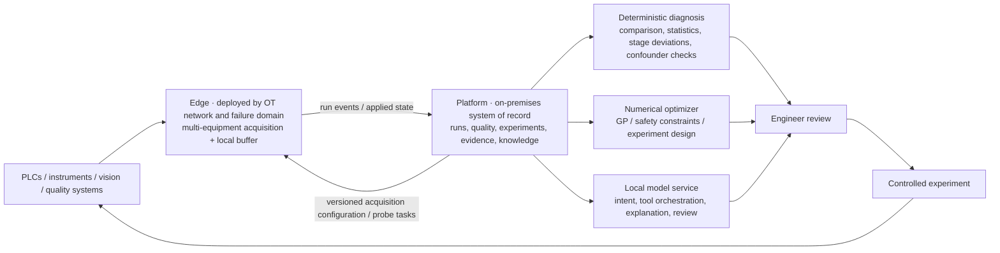

# Ingot Long-Term Project Plan

> Status: living plan. Baseline date: 2026-08-03. Time ranges guide capacity planning; phase gates, not dates, authorize progression.

## 1. Planning premise

Ingot is being developed as a useful long-term product that can be exercised and improved over years in real manufacturing. Precision optical molding is the first long-running validation scenario, while the product position, core contracts, and algorithms remain applicable across manufacturing processes.

Ingot is deployed on premises for one company on its factory network and is shared by that company's process, quality, equipment, and R&D teams. System boundaries, data models, deployment topology, and operations use this long-term environment as their baseline.

The product loop remains:

```text
trusted acquisition → run and quality evidence → diagnosis → falsifiable experiment → safe optimization → knowledge reuse
```

The north-star outcome is:

> Use trustworthy evidence from real runs to explain process deviations sooner, reach the objective with as few effective experiments as safety permits, and preserve validated conclusions as reusable knowledge.

## 2. Product position and boundary

Ingot is an on-premises process diagnosis and optimization system for expensive, small-data, safety-bounded manufacturing. It focuses on turning real run evidence into testable causes, controlled experiments, and process-optimization conclusions.

The core platform owns only stable cross-process concepts:

- equipment, connections, runs, cycles, and stages;
- actual settings, process trajectories, and versioned features;
- a minimum snapshot for every run with stable equipment identity and optional traceability fields for material, tooling, equipment state, and lot;
- quality objectives, safety constraints, and inspection results;
- candidate causes, counterevidence, hypotheses, experiments, and evidence;
- numerical optimization, stopping rules, and result reuse;
- local-model orchestration, evidence traceability, and data quality.

Industry differences belong in versioned scenario packages:

- data models, variables, units, and allowed ranges;
- equipment-point and quality-data mappings;
- stage recognition, derived features, and optional physical priors;
- safety constraints, experiment templates, and domain knowledge;
- scenario terminology, reports, and UI defaults.

Optical molding supplies the first real validation scenario. A second materially different manufacturing scenario will validate the generality of the core experiment state machine, evidence model, and optimizer protocol.

## 3. Long-term architecture decisions



### 3.1 Edge boundary

- The physical Edge deployment unit is an independent `ConnectorHost` instance with its own `EdgeId`, process, configuration cache, SQLite outbox, and lifecycle.
- A small installation may place ConnectorHost and Platform on the same physical server while retaining separate containers, storage, and start/stop procedures.
- Deploy Edge by workshop, line OT subnet, or security zone so it has direct and stable reachability to its assigned data sources.
- One Edge concurrently executes multiple immutable Platform-published acquisition configurations for multiple devices, with an independent task and status for each configuration.
- Projects select evidence by equipment, run, lot, time, and context and may span Edge nodes.
- High-rate, critical, or unstable equipment may use an isolated ConnectorHost and, when needed, a separate Edge.
- Edge is responsible for deterministic acquisition, buffering, quality marking, and reliable shipping.
- Failure domains follow shared power, hosts, switches, network zones, and maintenance windows; acceptable simultaneous interruption, CPU, disk backlog, event rate, and recovery time determine Edge separation.

### 3.2 Acquisition-configuration control plane

- Platform is the sole manager and publisher of process data models, device-connection mappings, and acquisition-configuration versions.
- Edge-local bootstrap configuration contains only `EdgeId`, the Platform address, communication tokens, certificates, and references to device credentials.
- Edge initiates pulls for desired configurations and probe tasks, retains the last successful version, and reports desired version, applied version, configuration hash, applied time, task state, and errors.
- Acquisition configuration progresses through draft → target-Edge probe → publication → Edge-local validation → cycle-boundary application → state confirmation.
- A new version completes local validation and starts healthy before it replaces the previous version; a failed application keeps the previous version running and reports the failure.
- Every device configuration runs, reconnects, and degrades independently so one data-source failure preserves the continuity of other acquisition tasks.

### 3.3 Platform and service boundaries

- Keep Platform a modular monolith and the sole business system of record.
- Keep Optimizer a stateless numerical service with no private business state.
- Deploy local models as a separate inference service, with acquisition, inspection, and experiment recording isolated from inference-service failures.
- Keep the near-term deployment as a modular monolith with one database; use measured capacity, failure domains, and recovery objectives to drive later separation.
- LLMs obtain evidence through read-only Platform tools; deterministic services and engineer-confirmation workflows perform business writes and equipment actions.

### 3.4 AI and numerical-compute boundary

Local LLMs may:

- interpret an engineer's question and page context;
- select read-only tools and organize an investigation;
- summarize evidence, counterevidence, confounders, and missing data;
- explain statistical results, recommendations, and uncertainty;
- translate natural language into structured drafts that require engineer confirmation.

Deterministic code owns:

- data-quality decisions, units, and time alignment;
- baseline matching, cycle comparison, statistical tests, and feature computation;
- numerical recipes, safety constraints, feasibility, and stopping rules;
- hypothesis state transitions, audit, and evidence integrity.

Deterministic constraints produce executable recipe proposals for engineer confirmation, and reviewable evidence plus validation experiments promote root-cause conclusions.

### 3.5 Run-context strategy

The system treats whether tooling, material, and equipment affect an outcome as a question to answer with field evidence. Every `OperationRun` stores an immutable minimum context snapshot:

- **Run identity**: `OperationRunId`, `EquipmentId`, product or process object, recipe version, start time, and end time.
- **Available traceability fields**: tooling identifier and revision, tooling cycle count, material lot and specification, and calibration or maintenance state.
- **Independent facts**: actual settings, stage trajectories, derived features, and quality outcomes each retain their source and version.
- **Field status**: scenario configuration marks a context field as required for analysis, record when available, or evidence-validated for modeling.

Context begins as provenance, a comparison stratum, and an experimental block. The system exposes missingness, sample coverage, and factor overlap, then evaluates effects through matched comparisons, variance components, mixed-effects models, and blocked experiments. A context factor enters diagnosis models, optimization features, or an applicability scope after stable evidence appears across multiple levels, repeated runs, or controlled experiments; other fields remain run-provenance records.

## 4. Product maturity ladder

| Level | User outcome | Required proof |
|---|---|---|
| L1 Trusted run | Find one real run with actual settings, trajectory, context, and quality | No silent loss; source, version, and missingness are visible |
| L2 Comparable | Find a condition-matched passing baseline and the first deviating stage | Match criteria are explicit; units, clocks, and lots are consistent |
| L3 Diagnosable | Ask why a run missed its objective and receive causes, evidence, counterevidence, and a validation proposal | Important claims cite records; association is not presented as causality |
| L4 Experimentable | Turn a candidate cause into a falsifiable, reviewable experiment | Safety, replication, blocking, and stopping are explicit |
| L5 Optimizable | Recommend the next run in shadow and controlled modes | Leak-free replay, calibrated uncertainty, and zero safety violations |
| L6 Reusable | Reuse validated findings across products, equipment, or adjacent scenarios | Scope and failure conditions are explicit; drift is detectable |

Progression at every level requires the lower-level evidence chain to meet its acceptance criteria.

## 5. Phased roadmap

### Operating model: one product line and two parallel assurance lines

The plan does not serialize all work into a single technical pipeline in which every capability waits for the previous one:

- **Product line**: trusted acquisition → run-quality linkage → deterministic diagnosis → local-model explanation → falsifiable experiment → shadow optimization → controlled optimization → knowledge reuse.
- **Scientific-validation line**: from Phase 0 onward, whenever qualified history exists, continuously run production-equivalent replay, baseline comparison, uncertainty calibration, and safety checks, with field acceptance as the final authority.
- **Engineering-assurance line**: real-database tests, batched assembly, recovery drills, performance baselines, and observability continuously protect the product line.

As a default work-in-progress limit, run at most one product milestone, one scientific-validation task, and one engineering-assurance task at the same time. A long-term plan is not authorization to build every capability concurrently.

### Phase 0: converge the baseline (0–3 months)

Objective: assemble equipment, runs, actual settings, process trajectories, minimum context, and quality outcomes into an evidence chain that can be verified repeatedly.

Primary deliverables:

- System tests for acquisition configuration, Edge-initiated probing, publication, safe application, rollback, cache recovery, and multi-topic semantics.
- Clear lifecycle and configuration-ownership boundaries among Platform, Edge, equipment, connection profiles, and research projects.
- A desired-versus-applied configuration state loop exposing each configuration's hash, applied time, runtime state, and error.
- Stable `EquipmentId`, `OperationRunId`, an immutable minimum context snapshot, and a run-quality link.
- Formal analysis-admission rules requiring actual settings, quality outcomes, unit consistency, and complete provenance.
- Batched observation assembly and real-database integration tests for critical PostgreSQL transactions.
- Initial baselines for data, diagnosis, optimization, and operational reliability metrics.

Prepare in parallel:

- Gradually make historical replay reuse production optimizer selection, feature transforms, and constraint semantics.
- Validate an OpenAI-compatible local-model endpoint and structured-output capability.
- Isolate scenario differences through code boundaries and configuration conventions, forming a minimum scenario-configuration mechanism.

Gate:

- Full Windows and WSL/Docker verification is repeatable.
- PostgreSQL publication exclusion, result transactions, uniqueness, and migrations are tested against a real instance.
- At least one real or representative run traces from raw acquisition to actual settings, trajectory, context snapshot, configuration version, and quality result.
- Data completeness, actual-setting coverage, context coverage, run-quality linkage, and Edge recovery have reproducibly computed baselines.
- Co-located ConnectorHost and Platform deployments retain independent startup, storage, and failure recovery.
- Edge continues acquisition from the last successful configuration through Platform outages and restarts, then forwards the backlog without duplicate business events.
- One device connection failure leaves the other acquisition tasks on the same Edge running.
- New configurations switch at a safe cycle boundary; failed applications keep the prior version running and report the failed state.
- Detection and acceptance coverage exists for silent loss, planned-as-actual substitution, and cross-project evidence leakage.

### Phase 1: trusted multi-equipment data loop (3–6 months)

Objective: continuously produce complete, analysis-ready run observations in one real environment.

Primary deliverables:

- One Edge reliably executes independent acquisition tasks for multiple devices; projects select runs across equipment and Edge nodes.
- Stable `EquipmentId`, `OperationRunId`, and cross-equipment lot/workpiece correlation.
- An immutable context snapshot for every run, with stable equipment identity and scenario-configured fields for available tooling revision, tooling cycle count, material lot, and maintenance or calibration state.
- Missingness, sample coverage, and factor-overlap views, plus basic stratified statistics by equipment, tooling, and material lot.
- Metrics for clock skew, gaps, duplicates, disorder, stale values, and shipping backlog.
- Explicit exclusion of runs with unlinked quality, missing actual settings, or unit conflicts.
- Defined policies for raw-trajectory retention, configuration and unit versions, sensor calibration, historical backfill, and feature recomputation.
- Traceable lineage among raw data, derived features, analysis snapshots, and conclusions so historical conclusions remain replayable after algorithm upgrades.
- A first scenario package whose versioned configuration carries scenario-specific types and rules.

Gate:

- Continuous operation has no unexplained data interruption.
- Every analysis observation traces to its source run, context snapshot, configuration version, and inspection record.
- Projects select evidence across equipment through stable run references; Platform manages and publishes acquisition configurations, and Edge pulls and executes those assigned to its `EdgeId`.
- A device-task failure, reconnect, or upgrade leaves other devices on the same Edge continuously collecting.
- Context fields entering effect assessment meet the first scenario's approved coverage and factor-overlap thresholds.
- Completeness, actual-setting coverage, and run-to-quality linkage meet targets approved from the Phase 0 baseline.

### Phase 2: evidence-backed diagnosis (6–12 months)

Objective: deliver the first genuinely useful product milestone: after selecting a run that missed its objective, an engineer can routinely ask why and receive an auditable answer.

Primary deliverables:

- A fixed diagnosis response structure: data quality, baseline, first deviation, candidate causes, counterevidence, confounders, missing data, and next experiment.
- Condition-matched baselines, stage-level trajectory comparison, planned/actual deviation, contextual stratification, and confounding checks.
- Effect and variance-contribution estimates for equipment, tooling, and material lots with sufficient sample coverage, clearly distinguishing stable association, confounded association, and insufficient evidence.
- Deterministic tools produce comparisons, statistics, and record references first; local models may only organize an investigation and explanation on top of those results.
- Fast/reasoning routing for local models with audited model and prompt versions.
- Validation of read-only tool outputs so important numbers and record identifiers come from system tools.
- A golden evaluation set built from real questions and reviewed by process engineers.
- Strict separation between validated knowledge and ordinary association candidates.

Gate:

- Critical facts and record references in the golden set are automatically verifiable.
- Unvalidated associations are not phrased as confirmed root causes.
- The model reliably refuses certainty when data is insufficient.
- Engineers can navigate from an answer to source runs and propose an executable validation experiment.
- Engineer review shows a real reduction in investigation time or repeated analysis.

### Phase 3: production-equivalent replay and shadow optimization (12–18 months)

Objective: consolidate the parallel scientific validation that began in Phase 0 and formally measure numerical-optimization value on real history and new projects without influencing field decisions.

Primary deliverables:

- Run-by-run replay on real histories against actual engineer order, random order, and applicable traditional methods.
- Evaluation of interval coverage, feasibility calibration, candidate distance, and trials to specification.
- Shadow recommendations that retain model choice, engineer choice, outcome, and rejection reason.
- `validate-hypothesis` experiments with replication, blocks, and independent baselines.
- Drift detection, applicability warnings, and initial stopping rules.
- Reviewable reports that retain failures and safety events.

Gate:

- Replay has no future leakage and uses the production-equivalent model path.
- Shadow recommendations never violate declared safety limits.
- Predictive uncertainty meets preregistered calibration criteria.
- Engineer rejection reasons become constraints, data repairs, or model boundaries.
- Claims about experiment reduction come from consecutively included real projects, not simulation.

### Phase 4: controlled online loop (18–24 months)

Objective: let recommendations enter real experiments under engineer confirmation and rehearsed rollback.

Primary deliverables:

- One recommendation per run with approve, edit, and reject actions.
- A complete evidence chain across recommendation, engineer confirmation, actual setting, actual trajectory, inspection, and model update.
- Stopping, rollback, model-degradation, and optimizer-outage procedures.
- Conservative feasibility plus independent hard limits for safety-critical constraints.
- Failure drills across Edge, Platform, Optimizer, and local model service.
- Validated process windows with an applicability scope, not bounding boxes assembled from unrelated passing points.

Gate:

- Zero known safety-boundary violations.
- Every executed recommendation has engineer confirmation and a replayable input snapshot.
- Deviations between recommended and actual settings affect observation quality.
- Stop and rollback procedures have been exercised.
- Online outcomes have no unexplained systematic discrepancy from shadow results.

### Phase 5: knowledge reuse and generality validation (24–36 months)

Objective: move from project-local optimization to reuse across projects, equipment, and scenarios while preserving interpretable boundaries.

Primary deliverables:

- Hierarchical effects and transfer evaluation across products, equipment, materials, and tooling.
- Versioned physical priors, derived features, and applicability domains.
- Evidence, counterevidence, review, and invalidation conditions for knowledge claims.
- Scenario package installation, upgrade, compatibility, and regression validation.
- A second materially different manufacturing scenario to test the generic core.
- Scale tests that determine whether Edge HA, storage separation, or further service extraction is justified.

Gate:

- Transfer gives repeatable benefit over cold starts and negative transfer is detectable.
- Scenario package upgrades preserve historical interpretation.
- The second scenario does not require changes to core experiment state, evidence models, or optimizer protocol.
- Knowledge states its applicability, provenance, and invalidation conditions.

## 6. Workstream priorities

| Priority | Work | Why |
|---|---|---|
| P0 | Acquisition correctness, minimum context snapshots, run-quality linkage, and data quality | Shared foundation for diagnosis and optimization |
| P0 | PostgreSQL integration tests, batched observation assembly, and historical replayability | Protects evidence transactions, removes known bottlenecks, and keeps long-lived data interpretable |
| P0 (parallel scientific line) | Production-equivalent historical replay | Validates the actual numerical method early without blocking trusted-data and diagnosis work |
| P1 | Deterministic diagnosis contract, workbench, and golden evaluation | Creates the first product entry point engineers can use daily |
| P1 | Local OpenAI-compatible model provider | Adds on-premises explanation after factual diagnosis tools and avoids model-vendor coupling |
| P1 | Minimal scenario configuration | Versions variables, mappings, context fields, constraints, and knowledge |
| P1 | Context-effect assessment | Uses stratification, confounding checks, and blocked experiments to identify equipment, tooling, and material effects |
| P1 | Shadow recommendation, calibration, and stopping | Prerequisites for safe online optimization |
| P1 | Project reports and actual/planned deviation metrics | Makes results reviewable and reusable |
| P2 | HA, distributed leases, and storage separation | Triggered by real scale and recovery objectives |
| P2 | Fine-tuning, cross-scenario transfer, and complex physical models | Triggered by reviewed data volume and baseline results |

## 7. Long-term metrics

Phase 0 records the current baseline before later phases approve numerical targets. These measures must remain visible.

### Data trust

- completeness, duplicate rate, disorder rate, and maximum gap;
- actual-setting coverage, with no silent planned-value substitution;
- run-to-inspection linkage and reasons for failure;
- context-field coverage, missingness, factor overlap, and count of non-identifiable confounding cases;
- unit, clock, configuration-version, and source-sequence anomalies;
- Edge backlog, recovery time, and shipping latency.

### Diagnosis value

- evidence-reference coverage for important claims;
- unsupported causal-claim rate;
- correct refusal rate under insufficient evidence;
- engineer ratings of useful, partially useful, or not useful;
- time from anomaly discovery to a first testable hypothesis;
- candidate causes later supported, rejected, or left inconclusive.

### Optimization value

- effective experiments to reach and replicate specification;
- safety-boundary violations, always targeted at zero;
- interval coverage and feasibility calibration;
- recommendation adoption, rejection reasons, and actual-setting deviation;
- material, equipment, inspection, and calendar cost;
- replication after a stopping rule fires.

### Engineering reliability

- full-verification pass rate and recovery-drill outcomes;
- real-instance coverage for critical database paths;
- desired/applied configuration convergence, application latency, failure rate, rollback rate, and offline-cache recovery;
- traceability of model, prompt, toolset, and optimizer versions.

### Data-asset sustainability

- retention-policy coverage for raw trajectories, quality results, and critical context;
- the share of historical runs successfully recomputed, replayed, and explained under new algorithm versions;
- completeness of sensor-calibration, unit, acquisition-configuration, and data-model versions;
- successful traceability from an analytical conclusion to raw data, feature code, and input snapshot;
- historical records made uninterpretable by schema evolution, migration, or retention policy.

## 8. Plan governance

- Record baseline, target, data scope, and validation method before each phase.
- Use ADRs for boundary changes, especially Edge partitioning, scenario packages, model providers, and database topology.
- Keep at most one product-line milestone, one scientific-validation task, and one engineering-assurance task in progress concurrently.
- Each quarterly review asks only: Is the data more trustworthy? Is diagnosis more useful? Are experiments more efficient?
- Every new feature must serve at least one of those questions.
- Field evidence may change the plan, but never bypass safety, provenance, or validation gates.
- The README roadmap retains public high-level commitments; this document owns execution order and maturity gates.

## 9. Next eight execution batches

1. **Edge topology, configuration control plane, and run identity** — define relationships among equipment, Edge, connection profiles, `OperationRun`, cross-equipment lot/workpiece identity, and research projects; implement Platform publication, Edge-initiated probe and configuration pulls, desired/applied state reporting, cycle-boundary switching, and failed-application rollback.
2. **Minimum trusted-data loop** — connect actual settings, stage trajectories, immutable context snapshots, and quality results; fix analysis-admission rules and baselines for completeness, linkage, context coverage, clocks, and backlog.
3. **Evidence storage and long-term replay** — batch observation assembly, add PostgreSQL Testcontainers coverage for publication exclusion and result transactions, and define retention, backfill, migration, and feature-recomputation policies.
4. **Deterministic diagnosis contract** — fix data quality, comparison baseline, first deviation, candidate cause, counterevidence, context stratification, confounding, missing-data, and validation-experiment structures; deterministic tools produce every fact first.
5. **Engineer golden-question set** — collect real questions and reviewed answers and automate evaluation of facts, record references, correct refusal, and unsupported causal claims.
6. **Local-model explanation layer** — implement an OpenAI-compatible provider, base URL, capability probing, and fast/reasoning routing; models consume only validated tool results.
7. **Parallel production-equivalent validation** — as soon as history qualifies, make replay reuse the production optimizer path, fix seeds, features, constraints, and reports, and compare against historical order, random order, and applicable traditional methods.
8. **Scenario configuration and shadow preparation** — carry the first real scenario's variables, mappings, context fields, features, constraints, and knowledge through versioned configuration; prepare shadow recommendations and falsifiable experiments after diagnosis and replay gates pass.

Batch 7 is a parallel scientific line beginning in Phase 0. Its conclusions progress through trusted data, engineer review, and the shadow stage. After these batches, use evidence from real use to plan detailed iterations.
