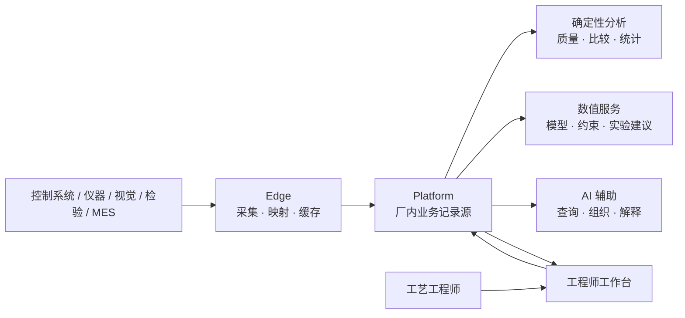

# Ingot 项目规划

> 文档状态：**v1 产品基线 + 滚动路线图**。第 1–4 节固定长期方向；第 5–9 节根据真实数据、工程师反馈和验收结果更新。各阶段按验收闸门推进。

## 1. 长期不变的方向

Ingot 的核心价值保持不变：

> **让工艺研发从没有数据支撑走向有数据支撑，让计算机基于真实数据帮助工艺工程师抉择，并采用适合问题的有效计算方法分析数据。**

长期产品主链为：

```text
可信采集 → 运行与质量证据 → 工艺追因 → 可证伪实验 → 安全优化 → 知识复用
```

它表达的是一条能力递进关系：没有可信数据就不做强分析；没有可验证候选就不声称原因；没有安全与校准证据就不进入在线优化。

光学镜片模压是第一个长期验证场景，不是产品边界。只有第二个明显不同的真实制造场景无需修改核心证据、实验和优化契约，通用性才得到支持。

## 2. 产品边界

Ingot 服务于高成本、小样本、有安全边界的制造工艺研发，由同一企业内的工艺、质量、设备和研发团队共同使用，默认单公司、厂内网络、本地部署。

核心平台承载跨场景稳定概念：

- 设备、连接、过程执行和阶段；
- 产品、工艺规范、材料、组件、工装和批次上下文；
- 实际参数、过程轨迹、版本化特征和数据质量；
- 质量目标、安全约束、检验结果和人工复核；
- 工程问题、候选原因、反证、假设、实验和证据；
- 分析策略、数值建议、停止规则、工艺操作域和知识适用范围；
- 用户、岗位权限、审计和来源留痕。

场景差异进入版本化配置：

- 变量、单位、允许范围和数据映射；
- 设备点位、执行边界、阶段和过程特征；
- 检验特性、目标、约束和默认实验策略；
- 分析必需与可选上下文；
- 可选机理知识、术语和报告默认值。

Ingot 不承担生产排程、通用 MES、设备联锁或无人审批自动控制。它可以与这些系统交换数据，但不会替代它们。

## 3. 长期架构决策



稳定决策包括：

- Edge 按 OT 网络和共同故障域部署，主动向 Platform 建立连接；
- Platform 是运行、上下文、检验、实验、证据和知识的唯一正式记录源；
- Optimizer 是无业务状态的数值服务，不能直接控制设备或批准实验；
- Agent 通过授权工具读取结构化事实，不生成数值工艺设定；
- Web 不维护与 Platform 冲突的平行业务状态；
- 配置、数据、特征、分析和模型全部版本化并可重放；
- 现场采集、检验和业务记录不依赖 Optimizer 或 Agent 可用。

具体协议、数据库拓扑、算法和页面布局可以演进；改变上述稳定边界需要 ADR。

## 4. 产品成熟度阶梯

| 等级 | 工程师能够完成的事 | 系统必须证明 |
|---|---|---|
| L0 可接入 | 看到设备、仪器和检验数据 | 原始值、单位、时间和来源明确 |
| L1 可信运行 | 找到一次运行的实际条件、轨迹、上下文和结果 | 无静默丢数；缺失与版本可见 |
| L2 可比较 | 找到合适基线并看清首次偏离 | 匹配条件、覆盖和混杂明确 |
| L3 可追因 | 获得候选原因、证据、反证和验证建议 | 相关性不冒充因果；能正确拒绝 |
| L4 可实验 | 把候选转成可审核、可证伪实验 | 对照、重复、区组、安全和停止清楚 |
| L5 可优化 | 获得下一步实验建议 | 无泄漏回放、校准不确定性、零安全违规 |
| L6 可复用 | 在新产品、设备或场景复用结论 | 适用范围、失效条件和漂移可发现 |

任何层级不能用更高层的演示绕过更低层的证据。

## 5. 推进方式

同时维护三条受控工作线：

- **产品主线**：可信数据 → 比较与追因 → 实验 → 优化 → 复用；
- **科学验证线**：历史回放、影子验证和受控在线验证分别作为独立、可否证的工作线推进；
- **工程保障线**：真实数据库测试、恢复演练、性能基线、安全和可观测性。

同期原则上只保留一个产品主线里程碑、一个科学验证任务和一个工程保障任务为进行中。

三条科学验证工作线不能用单一全局状态合并：

| 工作线 | 独立证据工件 | 结论边界 |
|---|---|---|
| 历史回放 | 冻结数据集、逐次轨迹、基线对照、门槛与审核哈希 | 只回答方法在既有历史数据上是否无泄漏且优于预注册基线 |
| 影子验证 | 建议快照、工程师独立选择、实际结果、拒绝原因与校准报告 | 只回答建议在新项目中是否适用、可执行并达到校准要求 |
| 受控在线验证 | 逐次批准、回退演练、实际设置、结果与停止记录 | 只回答在声明边界内是否安全地产生前瞻价值 |

每条工作线分别预注册数据范围、基线、指标、版本化阈值、验收和否证条件。工作线是否通过由它自己的可审核报告表达；API 是否已实现不构成验证证据，也不增加全局“成熟度”。

### 阶段 0：建立可重复基线

目标：证明系统能够稳定记录一条真实或代表性的运行—上下文—轨迹—检验证据链。

主要工作：

- 固定设备、Edge、过程执行、项目和配置所有权；
- 完成采集配置探查、发布、安全应用、失败保留旧版本和状态回报；
- 建立稳定运行身份、实际参数、过程数据、上下文快照和检验关联；
- 固定分析准入与排除原因；
- 建立数据完整、关联、恢复和重放基线；
- 为关键 PostgreSQL 事务加入真实实例测试。

晋级闸门：至少一份运行可以从结论回到原始来源；平台中断后 Edge 能持续采集并无重复补传；新配置失败不破坏旧采集；静默丢数、计划值替代实际值和跨项目串线都有检测。

### 阶段 1：形成可信数据闭环

目标：让工艺工程师在日常工作中找到、筛选和比较真实运行。

主要工作：

- 多设备、多产品和多上下文运行组织；
- 工装、材料、批次、校准和维护覆盖报告；
- 过程执行详情、数据质量和同条件比较工作流；
- 原始数据、特征、分析快照和结论血缘；
- 工程师审核的数据问题与修复闭环。

晋级闸门：连续样本达到场景批准的数据完整和关联目标；排除原因可解释并可修复；工程师能独立完成运行查找和基线比较。

### 阶段 2：证据式工艺追因

目标：工程师询问“为什么这次没有达到目标”时，系统给出可核查候选和下一步验证方案。

主要工作：

- 固定回答结构：数据质量、比较基线、首次偏离、候选、反证、混杂、缺失和实验建议；
- 稳健差异、阶段轨迹、实际/计划偏差和上下文分层；
- 工程师黄金问题集和审核答案；
- 正确拒绝、引用覆盖和无依据因果断言评测；
- 候选到假设和实验草案的业务闭环。

晋级闸门：重要结论可以回到原始记录；工程师认为输出可用于下一步行动；观察性结果不会被写成确定根因。

### 阶段 3：回放与影子优化

目标：在不影响现场决策的前提下，测量计算方法是否比现有顺序更有效。

主要工作：

- 无未来数据泄漏的逐次历史回放；
- 与工程师历史顺序、传统 DOE 和简单基线比较；
- 预测区间、可行概率和停止规则校准；
- 新项目影子建议与工程师独立选择；
- 拒绝原因、未建模约束和不可执行设置分析。

晋级闸门：策略在预注册指标上具有可复现价值，建议没有违反声明边界，不确定性达到场景批准的校准要求。

### 阶段 4：受控在线闭环

目标：在工程师审核、明确回退和独立硬边界下，让建议进入真实实验。

主要工作：

- 一次一项建议起步；
- 实际设置回采、完整检验和自动结果固化；
- 重复、区组、随机顺序和独立确认；
- 失败、漂移、模型不可用和安全异常处置；
- 候选设置与工艺操作域的不同验证标准。

晋级闸门：零已知安全违规；推荐能够被准确执行和复现；在线结果与影子结论不存在无法解释的系统偏差。

### 阶段 5：知识复用与通用性验证

目标：将经过验证的结论复用于新产品、设备和第二场景，同时保留适用边界。

主要工作：

- 结论适用范围、失效条件和漂移监测；
- 跨产品、设备、材料和工装的分层效应；
- 经过基线比较的迁移或机理先验；
- 第二个明显不同场景的核心契约验证。

晋级闸门：迁移优于冷启动基线且没有隐藏负迁移；第二场景不需要修改运行身份、证据关系、实验状态机和优化协议。

## 6. 当前优先级

| 优先级 | 工作 | 触发理由 |
|---|---|---|
| P0 | 采集正确性、运行身份、上下文、检验关联和数据质量 | 所有工程判断的地基 |
| P0 | PostgreSQL 事务、历史重放和恢复验证 | 保护长期证据 |
| P0 科学线 | 历史问题与生产等价回放 | 尽早否证无效方法 |
| P1 | 确定性追因契约和黄金问题集 | 形成首个日常价值入口 |
| P1 | 场景配置、上下文评估和实验设计 | 把候选转成可信实验 |
| P1 | 影子建议、校准和停止规则 | 在线实验前置条件 |
| P1 | 本地模型解释和项目报告 | 降低工程师使用成本 |
| P2 | 高可用、存储拆分和多实例租约 | 由真实规模与恢复目标触发 |
| P2 | 复杂迁移、微调和灰盒先验 | 由审核数据和基线价值触发 |

## 7. 长期指标

每次路线图评审只回答三组问题：

### 数据是否更可信

- 完整运行、实际参数、过程特征、上下文和检验覆盖率；
- 关联失败、单位、时钟、配置版本和来源异常；
- Edge 积压、恢复、重复和乱序；
- 历史数据重算、重放和解释成功率。

### 追因是否更有用

- 从异常到首个可执行假设的时间；
- 工程师有用性评分；
- 证据引用、正确拒绝和无依据因果断言；
- 候选经实验支持、否决或不确定的分布。

### 实验是否更高效

- 达到并重复确认规格的有效实验数；
- 建议采用、拒绝原因和实际设置偏差；
- 预测校准、复现率和停止后结果；
- 材料、设备、检验和日历时间；
- 安全边界违规始终为零。

阶段 0 记录基线，再批准具体场景目标，不预设未经测量的收益数字。

## 8. 治理与否证

- 核心价值、证据原则和稳定组件边界使用 v1 基线管理；
- 稳定架构变化使用 ADR；
- 算法、默认实验参数、页面和实施顺序可以按证据升级；
- 每个阶段预注册数据范围、基线、指标、验收和否证条件；
- 新功能必须明确改善数据可信、追因有用或实验高效中的至少一项；
- 现场证据可以调整路线，但不能绕过安全、来源和验证闸门；
- 如果方法不优于适用简单基线，则降级、修正或停止该方法，而不是继续堆功能。

## 9. 接下来八个滚动批次

1. **运行身份与配置控制面**：完成执行边界安全应用、失败回退和应用状态闭环。
2. **最小可信数据闭环**：打通实际参数、轨迹、上下文和质量结果，固定准入指标。
3. **长期证据与重放**：批量装配观察，保护关键事务，定义保留、迁移和重算。
4. **确定性追因契约**：固定基线、差异、反证、混杂、缺失和实验建议结构。
5. **工程师黄金问题集**：使用真实问题和审核答案持续评估事实、引用和正确拒绝。
6. **本地模型解释层**：模型只消费授权工具结果，负责组织和解释，不负责数值结论。
7. **并行生产等价验证**：复用生产策略并与历史、DOE 和简单基线比较。
8. **首个场景影子准备**：冻结版本化变量、映射、上下文、约束和实验策略。

这些批次是当前顺序，不属于不可变产品定义。每个批次完成后根据真实结果重新排序。

工程纪律：历史回放、影子验证和受控在线验证各自维护独立的预注册方案与结果；一条工作线的通过不得替代另一条，也不得通过 API 全局状态把不同证据层级折叠成单一结论。
