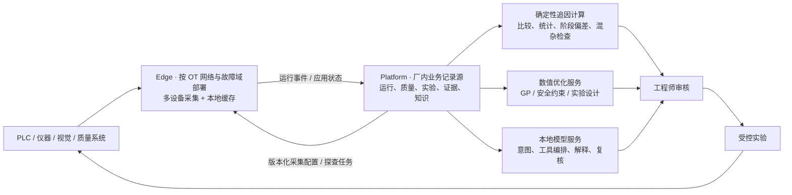

# Ingot 后续项目规划

> 文档状态：长期滚动规划。基线日期：2026-08-03。阶段时间是资源规划参考，能否进入下一阶段由验收闸门决定。

## 1. 规划前提

Ingot 以长期打造一款真正有用、能够在真实制造现场持续验证的产品为目标。光学镜片模压作为首个长期验证场景，产品定位、核心契约和算法保持跨行业制造过程的通用性。

Ingot 采用单公司、厂内网络、本地部署，由同一企业内的工艺、质量、设备和研发团队共同使用。系统边界、数据模型、部署拓扑和运维方式均以这一长期运行环境为基线。

产品主链保持不变：

```text
可信采集 → 运行与质量证据 → 工艺追因 → 可证伪实验 → 安全优化 → 知识复用
```

北极星结果是：

> 在安全边界内，用可信的真实运行证据更快解释工艺偏差，用尽可能少的有效实验达到目标，并把经过验证的结论沉淀为可复用知识。

## 2. 产品定位与边界

Ingot 是面向高成本、小样本、有安全边界制造过程的本地部署工艺追因与优化系统，聚焦从真实运行证据形成可验证原因、受控实验和工艺优化结论。

核心平台只承载跨场景稳定概念：

- 设备、连接、运行、周期和阶段；
- 实际参数、过程轨迹和版本化过程特征；
- 每次运行的最小上下文快照，包含稳定设备身份，以及材料、工装和批次等可选追溯字段；
- 质量目标、安全约束和检验结果；
- 候选原因、反证、假设、实验和证据；
- 数值优化、停止规则和结果复用；
- 本地模型编排、证据留痕和数据质量。

行业差异进入版本化场景包：

- 数据模型、变量、单位和允许范围；
- 设备点位和质量数据映射；
- 阶段识别、派生特征和可选机理先验；
- 安全约束、默认实验模板和领域知识；
- 面向该场景的术语、报告和页面默认值。

光学镜片模压承担首个真实验证场景。第二个明显不同的制造场景用于验证核心状态机、证据模型和优化协议的通用性。

## 3. 长期架构决策



### 3.1 Edge 边界

- Edge 的实际部署单元是独立 `ConnectorHost` 实例，拥有独立 `EdgeId`、进程、配置缓存、SQLite outbox 和生命周期；
- 小型现场可以把 ConnectorHost 与 Platform 部署在同一台物理服务器，二者继续使用独立容器、存储和启停流程；
- 默认按车间、产线 OT 网段或安全区部署 Edge，确保它能够直接、稳定地访问所负责的数据源；
- 一个 Edge 为多台设备同时执行多份由 Platform 发布的不可变采集配置，每份配置使用独立采集任务和状态；
- 项目通过设备、运行、批次、时间和上下文选择证据，可以跨 Edge；
- 高频、关键或不稳定设备可使用独立 ConnectorHost，必要时拆成独立 Edge；
- Edge 的职责限定为确定性采集、缓存、质量标记和可靠上送；
- 故障域由共同电源、主机、交换机、网段和维护窗口确定；Edge 拆分由可接受的同时中断范围、CPU、磁盘积压、事件速率和恢复时间共同决定。

### 3.2 采集配置控制面

- Platform 是工艺数据模型、设备连接映射和采集配置版本的唯一管理与发布端；
- Edge 本地启动配置只包含 `EdgeId`、Platform 地址、通信令牌、证书和设备凭据引用；
- Edge 主动拉取目标配置和探查任务，保存最后成功版本，并回报期望版本、实际应用版本、配置哈希、应用时间、任务状态和错误；
- 采集配置按“草稿 → 目标 Edge 探查 → 发布 → Edge 本地验证 → 周期边界应用 → 状态确认”推进；
- 新版本先完成本地验证并启动健康，再替换旧版本；应用失败时继续运行旧版本并回报失败原因；
- 每份设备配置独立运行、重连和降级，单个数据源故障保持其他采集任务连续。

### 3.3 Platform 与服务边界

- Platform 继续保持模块化单体和唯一业务记录源；
- Optimizer 保持无状态独立数值服务，不保存业务状态；
- 本地模型作为独立推理服务部署，采集、检验和实验记录链路与推理服务故障隔离；
- 近期部署保持模块化单体和统一数据库，以真实容量、故障域和恢复目标驱动后续拆分；
- 大模型通过 Platform 提供的只读工具获取证据，设备操作和业务写入由确定性服务与工程师确认流程完成。

### 3.4 AI 与数值计算边界

本地大模型负责：

- 理解工程师问题和当前页面上下文；
- 选择只读数据工具并组织调查步骤；
- 汇总证据、反证、混杂因素和数据缺口；
- 解释统计结果、优化建议和不确定性；
- 把自然语言意图转换为需要工程师确认的结构化草案。

确定性代码负责：

- 数据质量判定、单位换算和时间对齐；
- 基线匹配、周期比较、统计检验和特征计算；
- 数值工艺建议、安全约束、可行概率和停止规则；
- 假设状态升级、审计和证据完整性。

可执行配方由确定性约束生成并经工程师确认，根因结论由可复核证据和验证实验升级。

### 3.5 运行上下文策略

系统把“工装、材料、设备是否影响结果”作为需要现场证据回答的问题。每次 `OperationRun` 保存一份不可变的最小上下文快照：

- **运行身份**：`OperationRunId`、`EquipmentId`、产品或工艺对象、配方版本、开始和结束时间；
- **可用追溯字段**：工装标识与版本、工装累计次数、材料批次与规格、校准或维护状态；
- **独立事实**：实际设置、阶段轨迹、派生特征和质量结果分别保留来源与版本；
- **字段状态**：场景配置将上下文字段标记为分析必需、有则记录或已经验证进入建模。

上下文首先用于追溯、分层比较和实验区组。系统展示字段缺失率、样本覆盖和因素重叠，通过同条件比较、方差分量、混合效应模型及区组实验评估影响。只有在多个水平、重复运行或受控实验中出现稳定证据的上下文，才进入诊断模型、优化特征或工艺适用范围；其余字段继续作为运行来源记录。

## 4. 产品成熟度阶梯

| 等级 | 用户能够完成的事情 | 系统必须证明的能力 |
|---|---|---|
| L1 可信运行 | 找到一次真实运行及其实际参数、轨迹、上下文和质量结果 | 无静默丢数；来源、版本和缺失可见 |
| L2 可比较 | 找到同条件合格基线并看清首次偏离发生在哪个阶段 | 匹配条件明确；单位、时间和批次一致 |
| L3 可追因 | 询问为什么未达标，获得候选原因、证据、反证和验证建议 | 重要结论引用记录；相关性不冒充因果 |
| L4 可实验 | 将候选原因转成可证伪、可审核的实验设计 | 安全边界、重复、区组和停止条件明确 |
| L5 可优化 | 在影子和受控模式下建议下一次运行参数 | 回放无泄漏；不确定性校准；零安全违规 |
| L6 可复用 | 将验证结果复用到新产品、设备或相邻场景 | 适用范围和失效条件明确；漂移可发现 |

各阶段晋级以更低层证据链达到验收标准为前提。

## 5. 分阶段路线

### 推进方式：一条产品主线、两条并行保障线

规划不把所有工作串成一条只能顺序等待的技术流水线：

- **产品主线**：可信采集 → 运行—质量关联 → 确定性追因 → 本地模型解释 → 可证伪实验 → 影子优化 → 受控优化 → 知识复用；
- **科学验证线**：从阶段 0 起，只要存在合格历史数据，就持续进行生产等价回放、基线比较、不确定性校准和安全检查；现场验收作为最终依据；
- **工程保障线**：真实数据库测试、批量装配、恢复演练、性能基线和可观测性持续保护产品主线。

同一时间原则上只推进一个产品主线里程碑、一个科学验证任务和一个工程保障任务，避免把“长期规划”误解为同时建设全部能力。

### 阶段 0：收敛基线（0–3 个月）

目标：把设备、运行、实际参数、过程轨迹、最小上下文和质量结果组成一条可重复验证的证据链。

主要交付：

- 完成采集配置、Edge 主动探查、发布、安全应用、回滚、缓存恢复和多主题语义的系统测试；
- 明确 Platform、Edge、设备、连接配置和研发项目的生命周期与配置所有权边界；
- 建立采集配置期望版本与实际应用版本的状态闭环，按配置展示哈希、应用时间、运行状态和错误；
- 建立稳定的 `EquipmentId`、`OperationRunId`、最小上下文快照和运行—质量关联；
- 固定正式分析准入规则，要求实际参数、质量结果、单位一致性和来源完整；
- 消除观察装配 N+1 查询，给关键 PostgreSQL 事务增加真实数据库集成测试；
- 建立数据、追因、优化和运行可靠性的初始指标基线。

并行准备：

- 让历史回放逐步复用生产优化器选择、特征变换和约束语义；
- 验证 OpenAI-compatible 本地模型接口与结构化输出能力；
- 以代码边界和配置约定隔离场景差异，形成最小场景配置机制。

验收闸门：

- Windows 与 WSL/Docker 的完整验证可重复执行；
- PostgreSQL 发布互斥、结果事务、唯一约束和迁移经过真实实例测试；
- 至少一份真实或代表性运行能够从原始采集追溯到实际参数、过程轨迹、上下文快照、配置版本和质量结果；
- 数据完整率、实际参数覆盖率、上下文覆盖率、运行—质量关联率和 Edge 恢复能力已有可重复计算的基线；
- ConnectorHost 与 Platform 同机部署时保持独立启停、独立存储和独立故障恢复；
- Platform 中断和重启期间 Edge 使用最后成功配置持续采集，恢复后补传数据且无重复业务事件；
- 单个设备连接失败不会停止同一 Edge 上的其他采集任务；
- 新配置在安全周期边界切换，应用失败时旧版本持续运行并回报失败状态；
- 静默丢数、计划值替代实际值和跨项目证据串线均有检测与验收覆盖。

### 阶段 1：多设备可信数据闭环（3–6 个月）

目标：在一个真实现场持续形成可用于分析的完整运行样本。

主要交付：

- 一个 Edge 稳定执行多台设备的独立采集任务，项目可以选择多设备和多 Edge 的运行；
- 建立稳定的 `EquipmentId`、`OperationRunId` 以及跨设备批次/工件关联；
- 为每次运行保存不可变上下文快照，稳定关联设备，并按场景记录可获得的工装版本、工装次数、材料批次和维护校准状态；
- 展示上下文字段缺失率、样本覆盖和因素重叠，按设备、工装和材料批次生成基础分层统计；
- 建立时钟偏差、采集间隙、重复、乱序、陈旧值和上送积压指标；
- 对无法关联质量结果、缺少实际参数或单位冲突的运行明确排除；
- 明确原始轨迹保留、配置与单位版本、传感器校准、历史回填和特征重算策略；
- 保存原始数据、派生特征、分析快照和结论之间的可追溯血缘，使算法升级后仍能重放旧结论；
- 完成第一个场景包，场景专有类型和规则由版本化场景配置承载。

验收闸门：

- 连续现场运行期间不存在未解释的数据中断；
- 每条进入分析的观察都能追溯到原始运行、上下文快照、配置版本和检验记录；
- 项目通过稳定运行引用跨多台设备取数，采集配置由 Platform 统一管理和发布，Edge 按 `EdgeId` 拉取执行；
- 任一设备任务故障、重连或升级期间，同一 Edge 上的其他设备保持连续采集；
- 进入影响评估的上下文字段，其覆盖率和因素重叠达到首个场景批准的分析阈值；
- 数据完整率、实际参数覆盖率和运行—质量关联率达到经阶段 0 基线批准的目标。

### 阶段 2：证据式工艺追因（6–12 个月）

目标：形成第一个真正有用的产品里程碑——工程师选择一次未达标运行后，能够日常询问“为什么这次没有达到目标”，并得到可核查的回答。

主要交付：

- 统一的追因回答结构：数据质量、比较基线、首次偏离、候选原因、反证、混杂因素、缺失数据和下一步实验；
- 同条件基线匹配、阶段级轨迹比较、计划/实际偏差、上下文分层和混杂检查；
- 对有足够样本覆盖的设备、工装和材料批次估计效应及方差贡献，并明确区分稳定关联、混杂关联和证据不足；
- 确定性工具先生成比较、统计和记录引用；本地模型只能在这些结果之上组织调查与解释；
- 本地模型快速/推理角色路由，模型版本与提示词版本可审计；
- 只读工具结果校验，所有重要数字和记录标识来自系统工具；
- 建立由真实问题组成的黄金评测集，并由工艺工程师审核；
- 将已验证知识与普通相关性候选严格区分。

验收闸门：

- 黄金集中的关键事实和记录引用可自动核对；
- 未经验证的相关性不会被回答为确定根因；
- 数据不足时模型稳定拒绝确定性判断；
- 工程师能够根据回答定位原始运行并提出可执行的验证实验；
- 工程师评审结果显示该能力确实缩短调查时间或减少重复分析。

### 阶段 3：生产等价回放与影子优化（12–18 个月）

目标：汇总从阶段 0 已开始的并行科学验证，正式证明数值优化在真实历史和新项目中具备可测价值，同时不影响现场决策。

主要交付：

- 使用真实历史项目进行逐次运行回放，与历史工程师顺序、随机和适用的传统方法比较；
- 校验预测区间覆盖率、可行概率、候选距离和达到规格的实验次数；
- 建立影子推荐：记录模型建议、工程师选择、最终结果和拒绝原因；
- 将候选原因转换为 `validate-hypothesis` 实验，支持重复、区组和独立基线；
- 增加漂移检测、模型适用范围提示和初始停止规则；
- 生成可复核的项目报告，不选择性隐藏失败和安全事件。

验收闸门：

- 回放过程没有未来信息泄漏，且使用生产等价模型路径；
- 影子建议没有违反已声明安全边界；
- 预测不确定性达到预注册的校准标准；
- 工程师拒绝原因能够转化为新约束、数据修复或模型边界；
- 是否减少实验由连续纳入的真实项目决定，不由模拟结果决定。

### 阶段 4：受控在线闭环（18–24 个月）

目标：在工程师人工确认和明确回退规则下，让优化建议进入真实实验。

主要交付：

- 一次运行一条建议，工程师能够批准、修改或拒绝；
- 建议、人工确认、实际设置、实际轨迹、检验和模型更新形成完整证据链；
- 建立停止、回退、模型降级和优化器不可用时的操作流程；
- 对安全关键约束使用保守可行概率和独立硬边界；
- 对 Edge、Platform、Optimizer 和模型服务完成故障演练；
- 形成经过验证的工艺窗口和适用范围，而不是简单拼接成功点。

验收闸门：

- 零已知安全边界违规；
- 每条执行建议都经过工程师确认且能够回放输入快照；
- 实际设置与建议偏差被检测并进入观察质量；
- 停止和回退流程经过演练；
- 在线结果与影子阶段结论不存在无法解释的系统性偏差。

### 阶段 5：知识复用与通用性验证（24–36 个月）

目标：从单项目优化提升为跨项目、设备和场景的知识复用，同时保持边界可解释。

主要交付：

- 跨产品、设备、材料和工装的分层效应与迁移评估；
- 版本化机理先验、派生特征和适用范围；
- 知识主张的证据、反证、审核和失效条件；
- 场景包安装、升级、兼容性和回归验证；
- 使用第二个明显不同的制造场景验证通用核心；
- 基于真实规模测试决定 Edge 高可用、存储拆分和进一步服务化。

验收闸门：

- 迁移模型相对从零训练有可重复收益，负迁移能够被识别；
- 场景包升级不会改变历史结果解释；
- 第二场景不需要修改核心实验状态机、证据模型和优化服务协议；
- 知识结论能够说明适用条件、来源和何时失效。

## 6. 工作流优先级

| 优先级 | 工作 | 原因 |
|---|---|---|
| P0 | 采集正确性、最小上下文快照、运行—质量关联、数据质量 | 后续所有追因和优化的共同地基 |
| P0 | PostgreSQL 集成测试、观察批量装配与历史可重放 | 保护证据事务、消除已知瓶颈并保证长期数据可解释 |
| P0（并行科学线） | 生产等价历史回放 | 尽早验证核心数值方法，但不阻塞可信数据和追因主线 |
| P1 | 确定性追因契约、工作台与黄金评测集 | 形成工程师能够日常使用的第一个产品入口 |
| P1 | 本地 OpenAI-compatible 模型 Provider | 在追因事实工具之后提供厂内解释能力，避免绑定模型品牌 |
| P1 | 最小场景配置 | 版本化变量、映射、上下文字段、约束和知识 |
| P1 | 上下文影响评估 | 用分层比较、混杂检查和区组实验识别设备、工装与材料影响 |
| P1 | 影子推荐、校准与停止规则 | 安全进入真实优化的前置条件 |
| P1 | 项目报告和实际值/计划值偏差指标 | 让结果可审核、可复盘、可传播 |
| P2 | 高可用、多实例租约和存储拆分 | 由真实规模与恢复目标触发 |
| P2 | 微调、跨场景迁移和复杂机理模型 | 由审核数据量和基线效果触发 |

## 7. 长期指标体系

阶段 0 先建立当前基线，再为后续阶段批准具体目标。以下指标必须持续可见：

### 数据可信度

- 采集完整率、重复率、乱序率和最大间隙；
- 实际参数覆盖率，禁止用计划值静默填充；
- 运行—检验关联率和无法关联原因；
- 上下文字段覆盖率、缺失率、因素重叠和不可辨识混杂数量；
- 单位、时钟、配置版本和来源序列异常；
- Edge 本地积压、恢复时间和上送延迟。

### 追因价值

- 重要结论的证据引用覆盖率；
- 无依据因果断言率；
- 数据不足时正确拒绝率；
- 工程师认为有用、部分有用或无用的比例；
- 从发现异常到形成首个可验证假设的时间；
- 候选原因经实验支持、拒绝或仍不确定的分布。

### 优化价值

- 达到并重复确认规格所需的有效实验次数；
- 安全边界违规数，目标始终为零；
- 预测区间覆盖率和可行概率校准；
- 建议采用率、拒绝原因和实际设置偏差；
- 材料、设备时间、检验和日历时间消耗；
- 停止规则触发后的复现实验结果。

### 工程可靠性

- 完整验证通过率和恢复演练结果；
- 关键数据库路径的真实实例覆盖；
- 配置期望/应用版本收敛率、应用延迟、失败率、回滚率和离线缓存恢复成功率；
- 模型、提示词、工具集和优化器版本可追溯率。

### 数据资产可持续性

- 原始轨迹、质量结果和关键上下文的保留策略覆盖率；
- 历史运行在新算法版本下成功重算、重放和解释的比例；
- 传感器校准、单位、采集配置和数据模型版本完整率；
- 从分析结论回溯到原始数据、特征代码和输入快照的成功率；
- 因结构升级、迁移或保留策略造成的不可解释历史数据数量。

## 8. 规划治理

- 每个阶段开始前记录当前基线、目标、数据范围和验收方法；
- 架构边界变化使用 ADR，特别是 Edge 拆分、场景包、模型 Provider 和数据库拓扑；
- 同期最多保留一个产品主线里程碑、一个科学验证任务和一个工程保障任务为进行中；
- 每季度只回答三个问题：数据是否更可信、追因是否更有用、实验是否更高效；
- 新功能必须明确服务于上述三个问题中的至少一个；
- 规划允许根据现场证据调整，但不得绕过安全、来源和验证闸门；
- README 路线图展示公开高层承诺，本文件维护执行顺序和成熟度闸门。

## 9. 接下来八个执行批次

1. **Edge 拓扑、配置控制面与运行身份**：定义设备、Edge、连接配置、`OperationRun`、跨设备批次/工件和研发项目之间的关系；实现 Platform 统一发布、Edge 主动拉取探查与配置、期望/应用状态回报、周期边界切换和失败回滚。
2. **最小可信数据闭环**：打通实际参数、阶段轨迹、不可变上下文快照和质量结果；固定分析准入规则及完整率、关联率、上下文覆盖、时钟和积压基线。
3. **证据存储与长期重放**：批量化观察装配，加入 PostgreSQL Testcontainers，覆盖发布互斥和结果事务，并定义原始保留、回填、迁移和特征重算策略。
4. **确定性追因契约**：固定数据质量、比较基线、首次偏离、候选原因、反证、上下文分层、混杂、缺失和验证实验结构，所有事实先由确定性工具产生。
5. **工程师黄金问题集**：收集真实问题及审核答案，建立事实、记录引用、正确拒绝和无依据因果断言的自动评测。
6. **本地模型解释层**：实现 OpenAI-compatible Provider、BaseUrl、能力探测和快速/推理角色路由；模型只能消费已验证工具结果。
7. **并行生产等价验证**：只要历史数据满足条件，就让回放复用生产优化器路径，固定随机种子、特征、约束和报告，并与历史顺序、随机及适用传统方法比较。
8. **场景配置与影子准备**：用版本化配置承载首个真实场景的变量、映射、上下文字段、特征、约束和知识；在追因和回放闸门通过后准备影子建议与可证伪实验。

批次 7 从阶段 0 开始并行推进，其结论依次经过可信数据、工程师评审和影子阶段验证。完成这些批次后，根据真实使用证据安排后续详细迭代。
