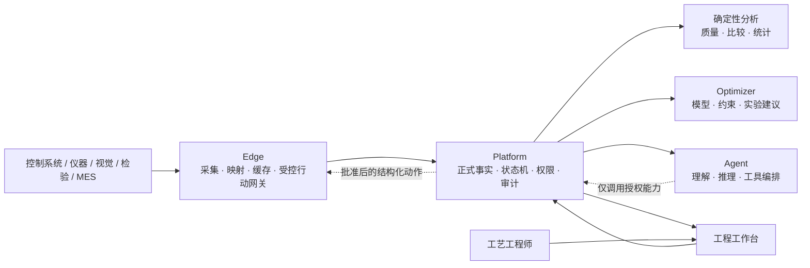

# 发展规划

> 文档状态：**v2 战略基线 + 滚动路线图**。第 1–5 节固定长期方向、战略判断和稳定边界；第 6–9 节根据真实数据、工程师反馈、外部采用和验收结果更新。所有阶段按证据闸门推进，不按功能数量或日历自动晋级。

## 1. 长期定位

Ingot 的核心价值保持不变：

> **让工艺研发从没有数据支撑走向有数据支撑，让计算机基于真实数据帮助工艺工程师抉择，并采用适合问题的有效计算方法分析数据。**

Ingot 当前对外产品类别保持不变：

> **开源工艺追因与优化系统。**

长期发展目标是成为：

> **面向制造工艺的可信决策与验证操作系统。**

基础模型与 Agent 提供可替换的理解、推理和工具编排能力；Ingot 负责让任何人或 Agent 在工厂里使用同一套可信事实、科学验证和安全行动纪律。长期竞争力不建立在某一个模型上，而建立在：

- 真实运行、实际条件、过程轨迹、质量结果和现场上下文之间可靠的身份关系；
- 每个判断对应的证据、算法、版本、不确定性和适用边界；
- 从候选原因到可证伪实验、工程审批、实际执行和结果固化的正式状态；
- 能够回放、审计、拒绝、停止和回滚的受控行动协议；
- 经验证后可以跨产品、设备和场景复用的工艺知识。

一句话原则：

> **每个结论有来源，每个建议有边界，每次行动有审批、回退和结果。**

这不是现在对外宣称已经实现的产品收益，而是约束长期建设顺序的战略北极星。正式公开承诺仍以[品牌规范](brand.md)为准。

## 2. 唯一产品主线

Ingot 不以聊天会话、算法或设备点位为中心，而以一个完整的工艺决策案例为中心：

```text
工程问题
→ 可信证据包
→ 候选原因与反证
→ 可证伪假设
→ 实验或调整提案
→ 风险检查与独立审批
→ 实际执行
→ 质量结果与副作用
→ 结论边界
→ 可复用工艺知识
```

长期能力链是：

```text
可信采集 → 运行与质量证据 → 证据式追因 → 可证伪实验 → 安全优化 → 知识复用
```

这是依赖关系，不是菜单顺序。可信数据不足时不进行强分析；观察性证据不足时不声称原因；历史回放未通过时不进入影子建议；影子和安全证据未通过时不进入受控行动。

光学镜片模压是第一个长期验证场景，不是产品边界。只有第二个明显不同的真实制造场景无需修改核心证据、实验和行动契约，通用性才得到支持。

## 3. 三阶段战略

### 近期：证明可信装置成立

近期首要任务是完成真实历史项目的无泄漏回放验证线。它回答的不是“模型建议已经改善了工艺”，而是：

- 同一冻结证据快照能否复现同一分析和建议；
- 运行身份、实际值、质量结果和上下文是否唯一、完整并可追溯；
- 第 `t` 轮是否只使用第 `t` 轮当时可见的信息；
- 方法是否与工程师历史顺序、适用 DOE 和简单基线公平比较；
- 缺失、错配、越权和证据不足是否被明确拒绝；
- 输入、策略、模型、随机种子、输出、审核和内容哈希是否形成完整报告。

近期成立的结论只能是“装置可信、可复现、无未来数据泄漏”。实际工程价值仍需要前瞻影子验证，因果和收益仍需要受控在线实验。完整证据阶梯是：

```text
历史回放：证明可信、可复现、无泄漏
→ 前瞻影子：证明建议适用、可执行、校准合理
→ 受控干预：证明在声明边界内安全产生实际价值
→ 第二场景：证明核心契约具有迁移能力
```

具体验证方案和报告要求见[场景验证](rollout.md)。

### 中期：成为模型无关的工艺能力底座

中期将研发能力开放为 Agent 可调用的协议，但不把内部 CRUD API 直接暴露给模型。协议分为两层：

```text
任意合规模型 / Agent
↓
MCP、OpenAPI、SDK 等互操作适配层
↓
Ingot 工艺能力协议与控制平面
↓
证据、实验、审批、执行和回滚状态机
```

MCP 或类似工具协议只解决发现、描述和调用能力；证据纪律、权限、审批、幂等、回放和安全边界由 Ingot 的领域协议和 Platform 状态机强制实施。能力按风险分级开放：

| 能力级别 | Agent 可以做什么 | 系统必须保证什么 |
|---|---|---|
| 读取 | 查询运行、证据、质量、上下文和适用范围 | 项目隔离、来源引用、版本和最小权限 |
| 提议 | 创建调查草案、候选假设和实验提案 | 只生成草案，保留输入快照与依据 |
| 承诺 | 提交审批、冻结方案和签署执行版本 | 创建者不能自批，结果揭晓前不可改写 |
| 执行 | 调用白名单、限时、限范围且可回滚的动作 | 策略检查、人工授权、设备确认、停止与回滚 |

Agent 不得批准自己的提案，不得绕过 Platform 直连数据库或设备。中期核心卖点不是“Ingot 的 Agent 最聪明”，而是：

> **任何模型通过 Ingot 调查或行动，都必须引用证据、经过状态与权限闸门，并留下可验证的执行回执。**

### 长期：形成制造智能的证据与实验开放规范

长期开放跨产品稳定的语义和验证契约，不开放客户私有工艺内容，也不把当前数据库表直接当行业标准。开放对象包括：

- 运行事件封套与来源信息；
- 证据包及其内容寻址规则；
- 实验契约、预注册和版本冻结；
- Agent 建议、人工决定和拒绝原因；
- 执行回执、实际值确认、停止与回滚；
- 验证报告和机器可读结论边界；
- 已验证工艺操作域及其适用、失效和漂移条件。

规范必须同时提供 Schema、版本兼容规则、参考实现、转换适配器、合规验证器、标准测试样本、签名与来源规则、扩展命名空间和公开变更流程。

开放规范晋级为 `1.0` 前至少满足：

1. 两个明显不同的真实工艺场景不修改核心语义即可使用；
2. 至少两个外部团队能够不依赖 Ingot 私有代码独立实现或验证；
3. Schema 兼容性、合规测试和安全边界经过公开评审；
4. 规范治理不依赖单个客户数据、单个模型或单个厂商接口。

在外部采用和独立实现形成之前，不能把规范候选描述成行业标准。近期准确的名称是：

> **制造智能的证据与实验协议。**

网络效应来自设备、Agent、验证工具、场景包和企业系统采用同一可验证契约，而不是集中汇聚客户原始工艺数据。

## 4. 产品与商业边界

Ingot 服务于实验昂贵、样本较少、有明确质量目标和安全边界的制造工艺研发。它由同一企业内的工艺、质量、设备和研发团队协作使用，默认部署在工厂内部或混合环境。

核心平台承载稳定的跨场景概念：

- 设备、连接、过程执行与阶段；
- 产品、工艺规范、材料、组件、工装和批次上下文；
- 实际设置、过程轨迹、版本化特征和数据质量；
- 质量目标、安全约束、检验结果和人工复核；
- 工程问题、候选原因、反证、假设、实验和证据；
- 分析策略、数值建议、停止、工艺操作域和知识适用性；
- 人与 Agent 身份、角色权限、审批、审计和来源。

场景差异进入版本化配置：变量、单位、点位映射、运行边界、阶段、质量方案、约束、上下文、实验策略和可选机理知识。

Ingot 不扩张为通用 MES、SCADA、设备联锁、生产排程、通用数据湖或无人值守控制。它位于这些系统之上，负责工艺证据、实验决策、受控行动和知识闭环。

开放和商业能力的建议边界是：

- **开放**：Edge、核心 Schema、证据协议、基础连接器、回放与合规验证工具；
- **企业能力**：组织治理、多站点、SSO、长期审计、Agent 运行评测、受控执行、认证场景包和工程支持。

商业价值按站点、产线、研发工作区或持续决策工作流衡量，不按对话次数或 Token 消耗衡量。

## 5. 长期架构与安全不变量



稳定决策：

- **Platform** 是运行、上下文、检验、实验、证据、审批、Agent 提议和知识的唯一正式记录源。
- **Edge** 负责可信采集、断网缓存和补传；未来可承载受控行动网关，但不取代 PLC、DCS 或安全联锁。
- **Optimizer** 无业务状态，只执行可重复的统计、约束、DOE 和数值优化，不批准实验或控制设备。
- **Agent** 是可替换的理解、推理和工具编排层；对话上下文和模型记忆都不是正式业务状态。
- **Web** 不维护与 Platform 冲突的平行业务状态。
- 数据、特征、策略、模型、工具和 Schema 均版本化并可重放；关键证据使用内容哈希或签名保护。
- 采集、检验和正式业务记录不依赖 Optimizer、Agent 或外部模型可用性。
- Agent 永远不拥有任意设备写权限，只能提交结构化意图或调用白名单动作。

任何影响业务或设备的 Agent 行为至少记录：身份、模型与策略版本、工具和权限、输入证据快照、提议和不确定性、约束检查、批准范围、实际设备确认、结果、副作用、停止与回滚。

协议适配、数据库拓扑、算法、模型供应商和页面布局可以演进；稳定边界变化必须通过 ADR。

## 6. 产品成熟度与晋级闸门

| 等级 | 工程师或 Agent 可以做什么 | 系统必须证明什么 |
|---|---|---|
| L0 已连接 | 查看设备、仪器和检验数据 | 原始值、单位、时间与来源明确 |
| L1 可信运行 | 找到一次运行的实际条件、轨迹、上下文和结果 | 无静默丢失，缺失与版本可见 |
| L2 可比较 | 找到合格基线并定位首次偏离 | 匹配、覆盖和混杂明确 |
| L3 可追因 | 获得候选、证据、反证和验证建议 | 相关性不冒充原因，正确拒绝有效 |
| L4 可实验 | 将候选变成可审核、可证伪实验 | 对照、重复、区组、安全和停止明确 |
| L5 可优化 | 获得下一步实验建议 | 无泄漏回放、校准不确定性、零已知安全违规 |
| L6 可行动 | 在批准范围内执行单步、可撤销动作 | 影子证据、权限、实际确认和回滚演练成立 |
| L7 可复用 | 在新产品、设备或场景复用结论 | 适用、失效、漂移与负迁移可见 |
| L8 可互操作 | 外部系统独立实现和验证协议 | 多场景、兼容性、合规测试与治理成立 |

任何等级不得用高层演示绕过低层证据。自主性只允许在已验证工艺操作域内逐步增加；漂移、证据缺失、模型异常、通信异常或人工介入会自动降级。

## 7. 推进与验证方式

长期维持四条互相约束但不互相冒充的工作线：

- **产品线**：可信数据 → 比较与追因 → 实验 → 优化 → 受控行动 → 复用；
- **科学验证线**：历史回放、影子验证、受控在线验证和跨场景迁移分别推进；
- **工程保障线**：真实数据库测试、恢复演练、性能基线、安全与可观测性；
- **协议生态线**：Schema 稳定、参考实现、合规测试、外部实现和治理。

四类验证不得压缩成一个全局“成熟度”状态：

| 工作线 | 独立证据工件 | 只允许得出的结论 |
|---|---|---|
| 历史回放 | 冻结数据集、逐次轨迹、基线、门槛与审核哈希 | 方法在既有历史上是否无泄漏、可复现并优于预注册基线 |
| 影子验证 | 建议快照、工程师独立选择、实际结果、拒绝原因与校准报告 | 建议在新项目中是否适用、可执行并达到校准要求 |
| 受控在线 | 逐次批准、回退演练、实际设置、结果与停止记录 | 在声明边界内是否安全地产生前瞻价值 |
| 协议互操作 | 独立实现、兼容性矩阵、合规报告与安全评审 | 外部系统是否能不依赖私有代码正确交换和验证工艺证据 |

每条工作线分别预注册数据范围、基线、指标、阈值版本、验收和否证条件。API 存在只表示基础设施已实现，不表示该工作线通过。

## 8. 当前优先级与滚动批次

| 优先级 | 工作 | 完成定义 |
|---|---|---|
| P0 | 运行身份、实际值、上下文、检验关联和质量有效性 | 每条分析记录可以唯一回到真实运行和有效结果 |
| P0 | 历史证据冻结、重放、事务和恢复 | 输入不可被事后改写，失败恢复不破坏来源链 |
| P0 科学线 | 历史问题与生产等价逐次回放 | 发布预注册、无泄漏、带基线和失败项的审核报告 |
| P1 | 工艺决策案例与确定性追因契约 | 证据、候选、反证、假设、实验和结论形成一条正式主线 |
| P1 | Agent 历史回放与对抗评测 | 无证据推断、身份错配、越权和错误工具调用可检测 |
| P1 | 新项目影子建议、校准与停止 | 建议提前冻结，记录工程师独立选择和拒绝原因 |
| P2 | 只读与提议级 Agent 协议 | 多模型通过相同 Schema 调用，不能绕过状态机 |
| P2 | 单步受控行动协议 | 白名单、审批、实际确认、停止与回滚演练通过 |
| P3 | 第二真实场景和规范候选版 | 核心契约不改，出现至少一个外部独立实现 |

当前滚动批次：

1. **可信身份与质量链**：修复运行身份、实际值、上下文准入、检验有效性和阶段统计。
2. **历史证据装置**：冻结真实观察、保护事务、建立内容哈希、保留和重算规则。
3. **预注册历史回放**：同时完成工程问题回放和生产等价逐次回放，公开失败与限制。
4. **工艺决策案例**：固定数据质量、基线、首次偏离、候选、反证、混杂、缺失和实验提案结构。
5. **Agent 评测飞轮**：建立工程师黄金问题、正确拒绝、引用覆盖、权限和工具调用评测。
6. **前瞻影子验证**：冻结版本化变量、映射、上下文、约束、策略和工程师拒绝原因。
7. **协议化只读与提议能力**：从内部 API 提炼稳定领域工具，并提供 MCP、OpenAPI 或 SDK 适配。
8. **受控行动准备**：动作账本、授权令牌、策略检查、设备确认、停止与回滚。
9. **第二场景与规范候选**：验证跨场景核心语义，发布 Schema、验证器和参考实现候选版。

批次是当前顺序，不属于不可变产品定义。每个批次完成后根据真实结果重新排序。

## 9. 指标、治理与否证

每次路线图评审只回答五组问题：

### 数据是否更可信

- 完整运行、实际参数、过程特征、上下文和检验覆盖率；
- 关联失败、单位、时钟、配置版本和来源异常；
- Edge 积压、恢复、重复和乱序；
- 历史数据重算、重放和解释成功率。

### 追因是否更有用

- 从异常到首个可执行假设的时间；
- 工程师有用性评分；
- 证据引用、正确拒绝和无依据因果断言；
- 候选经实验支持、否决或保持不确定的分布。

### 实验和行动是否更有效

- 达到并重复确认规格的有效实验数；
- 建议采用、修改、拒绝原因和实际设置偏差；
- 预测校准、复现率、停止后结果和回滚成功率；
- 材料、设备、检验和日历时间；
- 未授权动作和已知安全边界违规始终为零。

### Agent 是否值得托付

- 工具选择、参数、证据引用和最终判断分别评测；
- 模型、Prompt、工具和 Schema 版本变更后的回归结果；
- 在证据不足、身份冲突和权限不足时的正确拒绝率；
- 人类接受、修改和拒绝建议的理由及后续结果。

### 协议是否形成采用

- 外部实现、连接器、验证工具和兼容版本数量；
- 合规测试通过率和互操作失败原因；
- 从新系统接入到形成首个合格证据包的时间；
- 不依赖 Ingot 私有代码完成验证的比例。

治理纪律：

- 核心价值、证据原则和稳定组件边界按规范基线管理；
- 稳定架构和协议破坏性变化使用 ADR；
- 每个阶段预注册数据、基线、指标、验收和否证条件；
- 新功能必须明确改善数据可信、追因有用、实验有效、行动安全或协议互操作中的至少一项；
- 如果方法不优于适用简单基线，则降级、修正或停止，而不是继续堆功能；
- 历史回放、影子、受控在线和协议互操作各自发布报告，不能互相替代；
- 不用页面数量、对话次数、Agent 数量、模型参数或 Token 消耗衡量成功；
- 不因基础模型能力增强而放松来源、权限、审批、安全和因果验证要求。
